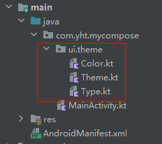
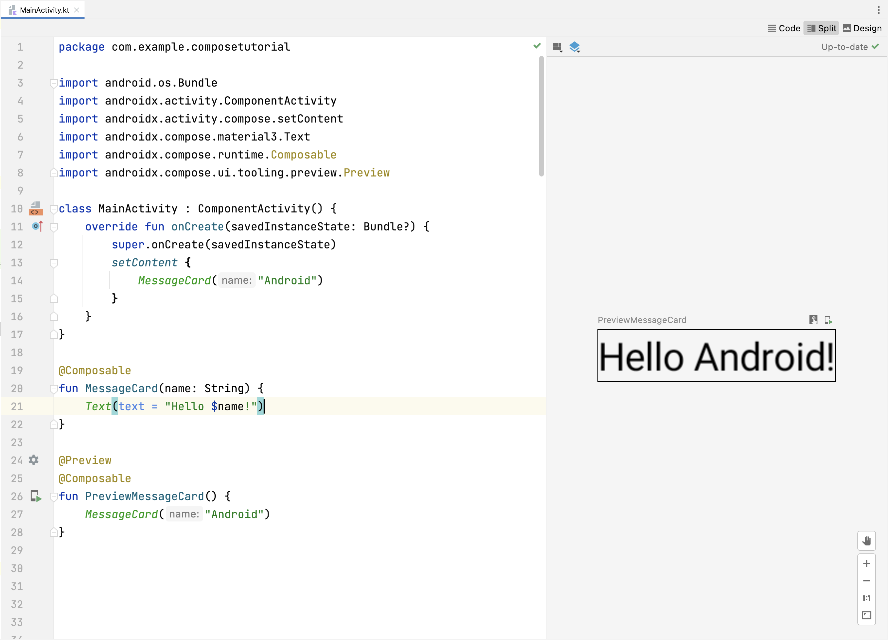
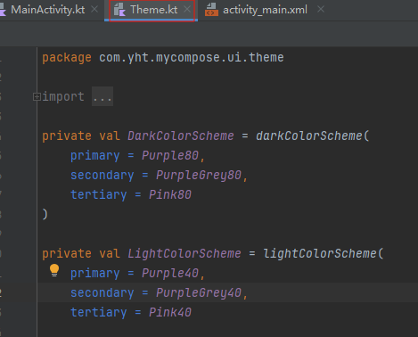

> https://developer.android.com/compose

## 1.快速教程

通过看官方的tutorial，发现`jetpeck compose`和flutter差不多呀，都是声明性函数的方式无限嵌套构建UI布局

### 创建项目

**自动创建**

创建项目时候选择`empty activity`，会创建默认包含compose结构的模块，**其中最大的特点是res目录下面没有.layout文件和values目录**，全部移出来了



```kotlin
import android.os.Bundle
import androidx.activity.ComponentActivity
import androidx.activity.compose.setContent
import androidx.compose.material3.Text

class MainActivity : ComponentActivity() {
    override fun onCreate(savedInstanceState: Bundle?) {
        super.onCreate(savedInstanceState)
        //UI入口
        setContent {
            Text("Hello world!")
        }
    }
}
```

**手动创建**


### Composable functions

#### @Composable

jetpack围绕可组合函数，通过添加注解`@Composable`可以让函数以编程式形式绘制UI

```kotlin
// ...
import androidx.compose.runtime.Composable

class MainActivity : ComponentActivity() {
    override fun onCreate(savedInstanceState: Bundle?) {
        super.onCreate(savedInstanceState)
        setContent {
            MessageCard("Android")
        }
    }
}

@Composable
fun MessageCard(name: String) {
    Text(text = "Hello $name!")
}
```


#### @Preview

这个注解允许在**不构建程序情况下预览可组合函数**，被该注解注释的函数不允许有参数

```kotlin
// ...
import androidx.compose.ui.tooling.preview.Preview

@Composable
fun MessageCard(name: String) {
    Text(text = "Hello $name!")
}

@Preview
@Composable
fun PreviewMessageCard() {
    MessageCard("Android")
}
```

  


**还可以通过@Preview注解启动夜间模式**

```kotlin
// ...
import android.content.res.Configuration

@Preview(name = "Light Mode")
@Preview(
    uiMode = Configuration.UI_MODE_NIGHT_YES,
    showBackground = true,
    name = "Dark Mode"
)
@Composable
fun PreviewMessageCard() {
    ComposeTutorialTheme {
        Surface {
            MessageCard(
                msg = Message("Lexi", "Hey, take a look at Jetpack Compose, it's great!")
            )
        }
    }
}
```


### Layout

可以通过在可组合函数里调用其他可组合函数进行布局的叠加

#### column

```kotlin
// ...
import androidx.compose.foundation.layout.Column

@Composable
fun MessageCard(msg: Message) {
    Column {
        Text(text = msg.author)
        Text(text = msg.body)
    }
}
```


#### row

```kotlin
// ...
import androidx.compose.foundation.Image
import androidx.compose.foundation.layout.Row
import androidx.compose.ui.res.painterResource

@Composable
fun MessageCard(msg: Message) {
    Row {
        //Image：用于导入照片
        Image(
            painter = painterResource(R.drawable.profile_picture),
            contentDescription = "Contact profile picture",
        )

        Column {
            Text(text = msg.author)
            Text(text = msg.body)
        }
    }
}
```


**modifier**

使用修饰符来调整组合项的大小、布局、外观、点击事件等等

```kotlin
// ...
import androidx.compose.foundation.layout.Spacer
import androidx.compose.foundation.layout.height
import androidx.compose.foundation.layout.padding
import androidx.compose.foundation.layout.size
import androidx.compose.foundation.layout.width
import androidx.compose.foundation.shape.CircleShape
import androidx.compose.ui.Modifier
import androidx.compose.ui.draw.clip
import androidx.compose.ui.unit.dp

@Composable
fun MessageCard(msg: Message) {
    // Add padding around our message
    Row(modifier = Modifier.padding(all = 8.dp)) {
        Image(
            painter = painterResource(R.drawable.profile_picture),
            contentDescription = "Contact profile picture",
            modifier = Modifier
                // Set image size to 40 dp
                .size(40.dp)
                // Clip image to be shaped as a circle
                .clip(CircleShape)
        )

        // Add a horizontal space between the image and the column
        Spacer(modifier = Modifier.width(8.dp))

        Column {
            Text(text = msg.author)
            // Add a vertical space between the author and message texts
            Spacer(modifier = Modifier.height(4.dp))
            Text(text = msg.body)
        }
    }
}
```

> 处理点击事件
>
> ```kotlin
> // ...
> import androidx.compose.foundation.clickable
> import androidx.compose.runtime.getValue
> import androidx.compose.runtime.mutableStateOf
> import androidx.compose.runtime.remember
> import androidx.compose.runtime.setValue
> 
> class MainActivity : ComponentActivity() {
>    override fun onCreate(savedInstanceState: Bundle?) {
>        super.onCreate(savedInstanceState)
>        setContent {
>            ComposeTutorialTheme {
>                Conversation(SampleData.conversationSample)
>            }
>        }
>    }
> }
> 
> @Composable
> fun MessageCard(msg: Message) {
>     Row(modifier = Modifier.padding(all = 8.dp)) {
>         Image(
>             painter = painterResource(R.drawable.profile_picture),
>             contentDescription = null,
>             modifier = Modifier
>                 .size(40.dp)
>                 .clip(CircleShape)
>                 .border(1.5.dp, MaterialTheme.colorScheme.primary, CircleShape)
>         )
>         Spacer(modifier = Modifier.width(8.dp))
> 
>         // We keep track if the message is expanded or not in this
>         // variable
>         var isExpanded by remember { mutableStateOf(false) }
> 
>         // We toggle the isExpanded variable when we click on this Column
>         Column(modifier = Modifier.clickable { isExpanded = !isExpanded }) {
>             Text(
>                 text = msg.author,
>                 color = MaterialTheme.colorScheme.secondary,
>                 style = MaterialTheme.typography.titleSmall
>             )
> 
>             Spacer(modifier = Modifier.height(4.dp))
> 
>             Surface(
>                 shape = MaterialTheme.shapes.medium,
>                 shadowElevation = 1.dp,
>             ) {
>                 Text(
>                     text = msg.body,
>                     modifier = Modifier.padding(all = 4.dp),
>                     // If the message is expanded, we display all its content
>                     // otherwise we only display the first line
>                     maxLines = if (isExpanded) Int.MAX_VALUE else 1,
>                     style = MaterialTheme.typography.bodyMedium
>                 )
>             }
>         }
>     }
> }
> ```
>
> **remember**
>
> 将本地状态存储在内存中，并且跟踪传递给`mutableStateOf`值的变化，该值更新时候，系统会自动重绘使用该状态的的compose

### Material design

#### 切换主题

```kotlin
// ...

class MainActivity : ComponentActivity() {
    override fun onCreate(savedInstanceState: Bundle?) {
        super.onCreate(savedInstanceState)
        setContent {
            //这个是根据项目名称在theme.kt里面找到
            ComposeTutorialTheme {
                //这个surface不清楚什么意思，可能是容器之类的
                Surface(modifier = Modifier.fillMaxSize()) {
                    MessageCard(Message("Android", "Jetpack Compose"))
                }
            }
        }
    }
}

@Preview
@Composable
fun PreviewMessageCard() {
    ComposeTutorialTheme {
        Surface {
            MessageCard(
                msg = Message("Lexi", "Take a look at Jetpack Compose, it's great!")
            )
        }
    }
}
```

#### Color

更改颜色，在Theme.kt中有定义白天和黑夜模式的各自颜色



```kotlin
// ...
import androidx.compose.foundation.border
import androidx.compose.material3.MaterialTheme

@Composable
fun MessageCard(msg: Message) {
   Row(modifier = Modifier.padding(all = 8.dp)) {
       Image(
           painter = painterResource(R.drawable.profile_picture),
           contentDescription = null,
           modifier = Modifier
               .size(40.dp)
               .clip(CircleShape)
               .border(1.5.dp, MaterialTheme.colorScheme.primary, CircleShape)//更改颜色
       )

       Spacer(modifier = Modifier.width(8.dp))

       Column {
           Text(
               text = msg.author,
               color = MaterialTheme.colorScheme.secondary//更改文本颜色
           )

           Spacer(modifier = Modifier.height(4.dp))
           Text(text = msg.body)
       }
   }
}
```

> 上面代码根据系统主题选择是黑色主题还是白色主题的颜色，**这种根据系统模式自动选择颜色的功能可以通过更改`Theme.kt`中`dynamicColor`为true来开启**


#### Typography

排版

```kotlin
// ...

@Composable
fun MessageCard(msg: Message) {
    Row(modifier = Modifier.padding(all = 8.dp)) {
        Image(
            painter = painterResource(R.drawable.profile_picture),
            contentDescription = null,
            modifier = Modifier
            .size(40.dp)
            .clip(CircleShape)
            .border(1.5.dp, MaterialTheme.colorScheme.primary, CircleShape)
        )
        Spacer(modifier = Modifier.width(8.dp))

        Column {
            Text(
                text = msg.author,
                color = MaterialTheme.colorScheme.secondary,
                style = MaterialTheme.typography.titleSmall//排版
            )

            Spacer(modifier = Modifier.height(4.dp))

            Text(
                text = msg.body,
                style = MaterialTheme.typography.bodyMedium//排版
            )
        }
    }
}
```


#### shape

通过将text封装在surface内部，就可以定义text的形状和高度

```kotlin
// ...
import androidx.compose.material3.Surface

@Composable
fun MessageCard(msg: Message) {
    Row(modifier = Modifier.padding(all = 8.dp)) {
        Image(
            painter = painterResource(R.drawable.profile_picture),
            contentDescription = null,
            modifier = Modifier
            .size(40.dp)
            .clip(CircleShape)
            .border(1.5.dp, MaterialTheme.colorScheme.primary, CircleShape)
        )
        Spacer(modifier = Modifier.width(8.dp))

        Column {
            Text(
                text = msg.author,
                color = MaterialTheme.colorScheme.secondary,
                style = MaterialTheme.typography.titleSmall
            )

            Spacer(modifier = Modifier.height(4.dp))

            Surface(shape = MaterialTheme.shapes.medium, shadowElevation = 1.dp) {//shape
                Text(
                    text = msg.body,
                    modifier = Modifier.padding(all = 4.dp),
                    style = MaterialTheme.typography.bodyMedium
                )
            }
        }
    }
}
```


## compose组件

### surface

`Surface`是一个非常常用的布局容器，在Compose中用于包装其他UI组件，给它们提供背景色、形状、阴影等视觉效果。它本质上是一个容器，用来控制其子组件的外观和样式。 


### 列表

列表实现可以包括row、column及其衍生

#### LazyColumn

接收一个lambda，将list集合传入items子项中然后遍历

```kotlin
// ...
import androidx.compose.foundation.lazy.LazyColumn
import androidx.compose.foundation.lazy.items

@Composable
fun Conversation(messages: List<Message>) {
    LazyColumn {
        items(messages) { message ->
                         MessageCard(message)
                        }
    }
}

@Preview
@Composable
fun PreviewConversation() {
    ComposeTutorialTheme {
        Conversation(SampleData.conversationSample)
    }
}

```


