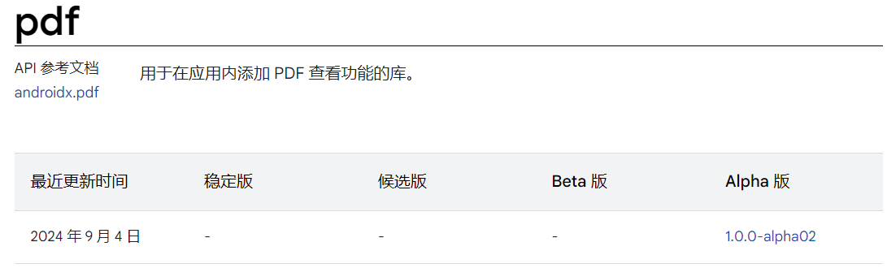

> https://juejin.cn/post/7414305106823610378#heading-0

## 1.概述

 当前在 `Android` 应用浏览 PDF 的几种方式： 

| 名称                                                         | 优点                                                 | 缺点                                         |
| ------------------------------------------------------------ | ---------------------------------------------------- | -------------------------------------------- |
| 直接 `Intent` 调用三方浏览器或软件                           | 实现调用简单                                         | 用户无法在应用内直接看到pdf，效果不好        |
| [AndroidPdfViewer](https://link.juejin.cn?target=https%3A%2F%2Fgithub.com%2FDImuthuUpe%2FAndroidPdfViewer) | 应用中可以直接看到，通过一系列封装可能实现大部分要求 | 将pdf转成图片加载，文本性质的pdf无法选择复制 |
| 腾讯X5内核腾讯浏览服务                                       | 预览文件类型较多，调用较为简单                       | 首次安装启动的时候，不一定会加载成功         |
| mupdf                                                        | 调用简单                                             | 依赖库八年没更新。。。各种问题               |
| pdf.js                                                       | 多端可用                                             | 通过 `WebView` 加载，速度较慢，性能较差      |


查看官网更新的文档




> **注意，使用该库需要的min SDK 为 35（Android 15）**

## 2.使用

```groovy
dependencies {
    implementation "androidx.pdf:pdf-viewer-fragment:1.0.0-alpha02"
}
```

 这个库其实又分为了两个：`pdf-viewer-fragment` 和 `pdf-viewer` ，其中 `pdf-viewer-fragment` 中只有一个 `fragment` ，剩下的逻辑处理全部在 `pdf-viewer` 中。 


### 添加fragment

```kotlin
private fun setPdfView() {
    val fragmentManager: FragmentManager = supportFragmentManager
    
    pdfViewerFragment = PdfViewerFragment()
    val transaction: FragmentTransaction = fragmentManager.beginTransaction()
    
    transaction.replace(
        R.id.fragment_container_view,
        pdfViewerFragment!!,
        PDF_VIEWER_FRAGMENT_TAG
    )
    transaction.commitAllowingStateLoss()
    fragmentManager.executePendingTransactions()
}
```


### 设置pdf uri

```kotlin
pdfViewerFragment?.documentUri = uri
```


### 设置搜索功能

```kotlin
pdfViewerFragment?.isTextSearchActive = true
```

