# View绘制流程

> [探索view绘制流程](https://juejin.cn/post/6904192359253147661)
>
> [setContentView讲解](https://juejin.cn/post/6844903511390420999)
>
> https://zhuanlan.zhihu.com/p/539384119
>
> [理解DecorView](https://www.jianshu.com/p/ee7e3b08c23c)
>
> [view树形结构，如何获取没有ID的根视图](https://juejin.cn/post/6844904180138639373)

## View结构

### View的树形结构

 View 的测量、绘制和事件分发都是**从树的根部**逐级遍历分发下去的，下面就是树形结构图：

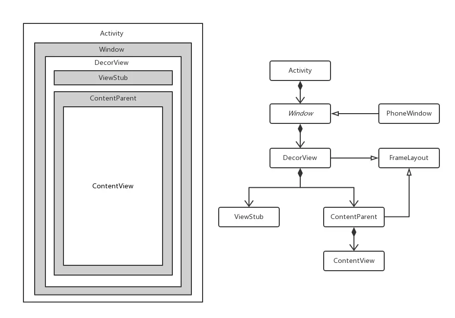 

- Activity就是最顶层，负责管理window
- **Window**：window是Activity里的一个实例，是接口，其**唯一的实现类就是`PhoneWindow`**，**一个Activity中至少存在一个Window与之绑定（如果弹出Dialog，也会持有一个phonewindow）**，Window负责处理一些用户事件和系统事件。Window本身无法显示View，因此**可以理解为显示界面的显示屏**。
- **DecorView**：Activity中真正显示内容的是View，而Window中的根视图就是`DecorView`。**DecorView是一个FrameLayout**，**Activity布局文件就是添加到了这个DecorView中** 


 

### DecorView

```java
public class DecorView extends FrameLayout implements RootViewSurfaceTaker, WindowCallbacks
```


DecorView的结构

 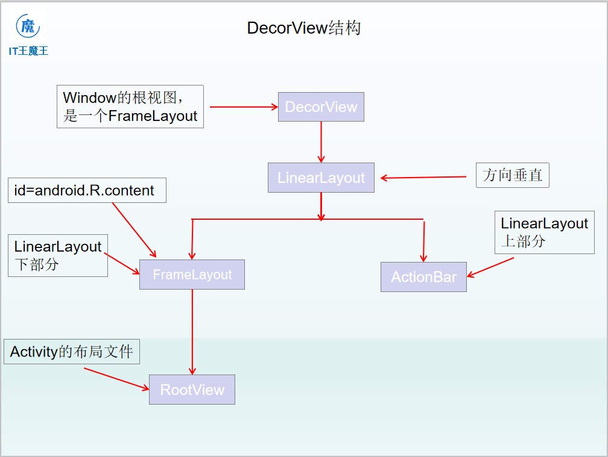 

- DecorView自身是一个FrameLayout

- FrameLayout里又是一个LinearLayout，分上下部分，上部分是ActionBar，**下部分是FrameLayout，这个FrameLayout带有ID：android.R.content**

  > ```java
  > //获取根布局方式
  > View view = getWindow().getDecorView().findViewById(android.R.id.content);
  > ```

- **Activity的布局文件就加载进`content`里面（这也是为什么加载视图的方法叫`setContentView`）**


### ViewRootImpl

`ViewRootImpl` 是连接 `WindowManager` 和 `DecorView` 的纽带，**测量、放置和绘制**三大流程都是通过`ViewRootImpl`实现的。 


## View加载

### 继承自Activity的视图层级

下面从`onCreate`的`setContentView`开始，理一遍绘制流程（继承自Activity）

(1)调用`setContentView`，进入到`Activity.java`中

```java
//Activity.java
/**
     * Set the activity content from a layout resource.  The resource will be
     * inflated, adding all top-level views to the activity.
     * 调用这个方法会将资源文件中的xml布局文件，加载到Activity的顶级View中去。
     */
public void setContentView(@LayoutRes int layoutResID) {
    getWindow().setContentView(layoutResID);
    initWindowDecorActionBar();
}
```

> 可以看到首先`getWindow()`方法获取了一个window对象，前面已经说过，window的实现类只有`PhoneWindow`，因此这里调用的是`PhoneWindow`的`setContentView`方法

(2) 跳转到`PhoneWindow`的`setContentView`方法： 

```java
//PhoneWindow.java

public void setContentView(int layoutResID) {
    // Note: FEATURE_CONTENT_TRANSITIONS may be set in the process of installing the window
    // decor, when theme attributes and the like are crystalized. Do not check the feature
    // before this happens.
    if (mContentParent == null) {
        installDecor();
    } else if (!hasFeature(FEATURE_CONTENT_TRANSITIONS)) {//没有过渡动画
        mContentParent.removeAllViews();
    }

    if (hasFeature(FEATURE_CONTENT_TRANSITIONS)) {//有过渡动画
        final Scene newScene = Scene.getSceneForLayout(mContentParent, layoutResID,
                                                       getContext());
        transitionTo(newScene);
    } else {
        mLayoutInflater.inflate(layoutResID, mContentParent);//将xml文件加载到mContentParent
    }
    mContentParent.requestApplyInsets();
    final Callback cb = getCallback();
    if (cb != null && !isDestroyed()) {
        cb.onContentChanged();
    }
    mContentParentExplicitlySet = true;
}
```

> 这个方法里面出现了`mContentParent`，如果存在调用`transitionTo`方法，如果不存在则加载布局文件到`mContentParent`中。（其实`transitionTo`方法最终也会调用`LayoutInflater.inflate`）
>
> 查看`mContentParent`定义：**这是放置窗口内容的视图。它要么是 mDecor 本身，要么是 mDecor 的子项，内容所在的位置。**

<a name=installdecor>(3)</a>可以看到如果`mContentParent`为空， 那么调用`installDecor()`方法初始化`mContentParent`

```java
//PhoneWindow.java
private void installDecor() {
    mForceDecorInstall = false;
    //初始化decor
    if (mDecor == null) {
        mDecor = generateDecor(-1);//初始化decorview
        mDecor.setDescendantFocusability(ViewGroup.FOCUS_AFTER_DESCENDANTS);
        mDecor.setIsRootNamespace(true);
        if (!mInvalidatePanelMenuPosted && mInvalidatePanelMenuFeatures != 0) {
            mDecor.postOnAnimation(mInvalidatePanelMenuRunnable);
        }
    } else {
        mDecor.setWindow(this);
    }
    //初始化mContentParent
    if (mContentParent == null) {
        mContentParent = generateLayout(mDecor);

        ...
    }
}
```

跳转到`generateDecor`

```java
//PhoneWindow.java
protected DecorView generateDecor(int featureId) {
    // System process doesn't have application context and in that case we need to directly use
    // the context we have. Otherwise we want the application context, so we don't cling to the
    // activity.
    Context context;
    if (mUseDecorContext) {
        Context applicationContext = getContext().getApplicationContext();
        if (applicationContext == null) {
            context = getContext();
        } else {
            context = new DecorContext(applicationContext, this);
            if (mTheme != -1) {
                context.setTheme(mTheme);
            }
        }
    } else {
        context = getContext();
    }
    return new DecorView(context, featureId, this, getAttributes());
}
```

> 这段代码主要是创建初始化DecorView，并且选择合适的上下文，最后返回一个`DecorView`对象，第三个参数则是`PhoneWindow`本身

> 由此可以得出Window和DecorView之间的关系：
>
> **从`Window`里面获取属性来初始化`DecorView`的属性，或者根据`Window`的属性来设置`DecorView`的属性。**  顶级窗口Window（PhoneWindow）包含的状态属性，会在顶级View（DecorView）体现出来，比如窗口大小，背景等属性。（当然下面的代码也会体现出这点） 

初始化`Decor`之后，开始初始化`mContentParent`

```java
//PhoneWindow.java

protected ViewGroup generateLayout(DecorView decor) {
    // Apply data from current theme.

    TypedArray a = getWindowStyle();//获取window的属性然后返回。

    if (false) {
        System.out.println("From style:");
        String s = "Attrs:";
        for (int i = 0; i < R.styleable.Window.length; i++) {
            s = s + " " + Integer.toHexString(R.styleable.Window[i]) + "="
                + a.getString(i);
        }
        System.out.println(s);
    }
    //是不是浮动的Window ，例如Dialog等
    mIsFloating = a.getBoolean(R.styleable.Window_windowIsFloating, false);
    ...

    //是否设置notitle的style
    if (a.getBoolean(R.styleable.Window_windowNoTitle, false)) {
        requestFeature(FEATURE_NO_TITLE);
    } else if (a.getBoolean(R.styleable.Window_windowActionBar, false)) {//是否设置了ActionBar
        // Don't allow an action bar if there is no title.
        requestFeature(FEATURE_ACTION_BAR);
    }
}
```

> 上述代码可以看出，通过`getWindowStyle`获取到window属性，返回给`TypeArray`，然后从`TypeArray`判断，通过不同的feature加载不同的内容

获取feature，会根据不同的 feature 来生成不同的 DecorView，比如没有设定任何 feature 时，对应的 DecorView 的布局就是 `screen_simple` ，之后将该布局加载到`DecorView`中去。 

```java
//PhoneWindow.java
//generateLayout()

int layoutResource;
// 拿到设置属性，然后去加载不同的XML。
int features = getLocalFeatures();
// System.out.println("Features: 0x" + Integer.toHexString(features));
if ((features & (1 << FEATURE_SWIPE_TO_DISMISS)) != 0) {
    layoutResource = R.layout.screen_swipe_dismiss;
    setCloseOnSwipeEnabled(true);
} else if (){
    // 省略若干代码... ...
} else {
    // Embedded, so no decoration is needed.
    layoutResource = R.layout.screen_simple;
    // System.out.println("Simple!");
}
// 将加载的布局文件加载到DecorView中去 
mDecor.onResourcesLoaded(mLayoutInflater, layoutResource);

```


进入到`onResourcesLoaded`方法

```java
//DecorView.java
void onResourcesLoaded(LayoutInflater inflater, int layoutResource) {
    if (mBackdropFrameRenderer != null) {
        loadBackgroundDrawablesIfNeeded();
        mBackdropFrameRenderer.onResourcesLoaded(
            this, mResizingBackgroundDrawable, mCaptionBackgroundDrawable,
            mUserCaptionBackgroundDrawable, getCurrentColor(mStatusColorViewState),
            getCurrentColor(mNavigationColorViewState));
    }

    mDecorCaptionView = createDecorCaptionView(inflater);
    final View root = inflater.inflate(layoutResource, null);//加载视图
    if (mDecorCaptionView != null) {
        if (mDecorCaptionView.getParent() == null) {
            addView(mDecorCaptionView,
                    new ViewGroup.LayoutParams(MATCH_PARENT, MATCH_PARENT));
        }
        mDecorCaptionView.addView(root,
                                  new ViewGroup.MarginLayoutParams(MATCH_PARENT, MATCH_PARENT));
    } else {

        // Put it below the color views.
        addView(root, 0, new ViewGroup.LayoutParams(MATCH_PARENT, MATCH_PARENT));
    }
    mContentRoot = (ViewGroup) root;
    initializeElevation();
}
```

这个加载的`layoutResource`为`screen_simple.xml`，是decorView默认加载的布局

```xml
<LinearLayout xmlns:android="http://schemas.android.com/apk/res/android"
    android:layout_width="match_parent"
    android:layout_height="match_parent"
    android:fitsSystemWindows="true"
    android:orientation="vertical">
    <ViewStub android:id="@+id/action_mode_bar_stub"
              android:inflatedId="@+id/action_mode_bar"
              android:layout="@layout/action_mode_bar"
              android:layout_width="match_parent"
              android:layout_height="wrap_content"
              android:theme="?attr/actionBarTheme" />
    <FrameLayout
         android:id="@android:id/content"
         android:layout_width="match_parent"
         android:layout_height="match_parent"
         android:foregroundInsidePadding="false"
         android:foregroundGravity="fill_horizontal|top"
         android:foreground="?android:attr/windowContentOverlay" />
</LinearLayout>
```

> 该文件在：
>
> 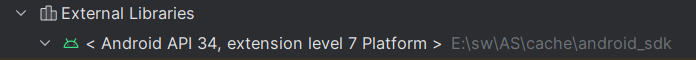
>
> 下的layout目录下

decorview内加载的是一个LinearLayout，可以看到里面出现了`android.id.content`，这就是前面提到的rootView，也就是根布局，


之后在`generateLayout`中，将这个`content`赋值给`mContentParent`

```java
//PhoneWindow.java
//generateLayout()

// 找到刚刚的Content
ViewGroup contentParent = (ViewGroup)findViewById(ID_ANDROID_CONTENT);
if (contentParent == null) {
    throw new RuntimeException("Window couldn't find content container view");
}
// ... ... 省略若干代码
// 最后返回这个contentParent
return contentParent;
```

> 从这也可以看出，`mContentParent`其实就等于`DecorView`中的`FrameLayout`，也就是子项


**`installDecor()`里面包含了大量的逻辑。**

- 开始初始化了`DecorView`。
- 然后初始化`mContentParent`。
- 在初始化`mContentParent`时：

  - 获取window的属性并赋值给`PhoneWindow`的逻辑。

  - 根据window的属性加载了不同的布局，并加载到`DecorView`的逻辑。

  - 最后通过findViewById的方法获取到了`mContentParent`并且返回。


(4)初始化好`mContentParent`之后，将自定义的布局文件加载到里面

```java
//PhoneWindow.java
//setContentView()
mLayoutInflater.inflate(layoutResID, mContentParent);//将xml文件加载到mContentParent
```


### 继承自AppCompatActivity的视图层级

(1)可以看到`setContentView`有变化

```java
public void setContentView(@LayoutRes int layoutResID) {
    initViewTreeOwners();
    getDelegate().setContentView(layoutResID);
}
```

(2)跳到`getDelegate`方法里

```java
public AppCompatDelegate getDelegate() {
    if (mDelegate == null) {
        mDelegate = AppCompatDelegate.create(this, this);
    }
    return mDelegate;
}
```

> 用来初始化`AppCompatDelegate`
>
> `AppCompatDelegate`解释是： **这个类表示一个代理，您可以使用它来扩展AppCompat的支持** 
>
> `AppCompatDelegate.create`方法创建一个继承了`AppCompatDelegate`的实现类`AppCompatDelegateImpl`
>
> ```java
> public static AppCompatDelegate create(@NonNull Activity activity,
>                                     @Nullable AppCompatCallback callback) {
>  return new AppCompatDelegateImpl(activity, callback);
> }
> ```


可以看到其实是调用了`AppCompatDelegateImpl`的`setContenView`

```java
@Override
public void setContentView(int resId) {
    ensureSubDecor();
    ViewGroup contentParent = (ViewGroup) mSubDecor.findViewById(android.R.id.content);
    contentParent.removeAllViews();
    LayoutInflater.from(mContext).inflate(resId, contentParent);
    mOriginalWindowCallback.onContentChanged();
}
```

这里面首先调用`ensureSubDecor`初始化`subDecorView`

```java
private void ensureSubDecor() {
    if (!mSubDecorInstalled) {
        mSubDecor = createSubDecor();//初始化subDecor

        // If a title was set before we installed the decor, propagate it now
        CharSequence title = getTitle();
        if (!TextUtils.isEmpty(title)) {
            onTitleChanged(title);
        }
        applyFixedSizeWindow();
        onSubDecorInstalled(mSubDecor);
        mSubDecorInstalled = true;

        // Invalidate if the panel menu hasn't been created before this.
        // Panel menu invalidation is deferred avoiding application onCreateOptionsMenu
        // being called in the middle of onCreate or similar.
        // A pending invalidation will typically be resolved before the posted message
        // would run normally in order to satisfy instance state restoration.
        PanelFeatureState st = getPanelState(FEATURE_OPTIONS_PANEL, false);
        if (!isDestroyed() && (st == null || st.menu == null)) {
            invalidatePanelMenu(FEATURE_SUPPORT_ACTION_BAR);
        }
    }
}
```

进入`createSubDecor`

```java
//AppCompatDelegateImpl.java

private ViewGroup createSubDecor() {
    TypedArray a = mContext.obtainStyledAttributes(R.styleable.AppCompatTheme);
    ...
    if (a.getBoolean(R.styleable.AppCompatTheme_windowActionModeOverlay, false)) {
        requestWindowFeature(FEATURE_ACTION_MODE_OVERLAY);
    }
    mIsFloating = a.getBoolean(R.styleable.AppCompatTheme_android_windowIsFloating, false);
    ...
    
    mWindow.getDecorView();//
}
```

> 这里引申出一个问题：**？**
>
> 如果Activity继承自AppCompatActivity，如果没有给这个Activity设置一个AppCompat的Theme。就会崩溃。原因就在这里了。 
>
> ```java
> if (!a.hasValue(R.styleable.AppCompatTheme_windowActionBar)) {
>  a.recycle();
>  throw new IllegalStateException(
>      "You need to use a Theme.AppCompat theme (or descendant) with this activity.");
> }
> ```

在初始化`subDecor`之前，初始化`DecorView`和`mContentView`

```java
// Now let's make sure that the Window has installed its decor by retrieving it
mWindow.getDecorView();
```

```java
@Override
public final View getDecorView() {
    if (mDecor == null || mForceDecorInstall) {
        installDecor();
    }
    return mDecor;
}  
```

可以看到，熟悉的[`installDecor`](#installdecor)

继续看`createSubDecor`代码

```java
//AppCompatDelegateImpl.java

final LayoutInflater inflater = LayoutInflater.from(mContext);
ViewGroup subDecor = null;


if (!mWindowNoTitle) {
    if (mIsFloating) {
        // If we're floating, inflate the dialog title decor
        subDecor = (ViewGroup) inflater.inflate(
            R.layout.abc_dialog_title_material, null);

        // Floating windows can never have an action bar, reset the flags
        mHasActionBar = mOverlayActionBar = false;
    } else if (mHasActionBar) {
        /**
                 * This needs some explanation. As we can not use the android:theme attribute
                 * pre-L, we emulate it by manually creating a LayoutInflater using a
                 * ContextThemeWrapper pointing to actionBarTheme.
                 */
        TypedValue outValue = new TypedValue();
        mContext.getTheme().resolveAttribute(R.attr.actionBarTheme, outValue, true);

        Context themedContext;
        if (outValue.resourceId != 0) {
            themedContext = new ContextThemeWrapper(mContext, outValue.resourceId);
        } else {
            themedContext = mContext;
        }

        // Now inflate the view using the themed context and set it as the content view
        subDecor = (ViewGroup) LayoutInflater.from(themedContext)
            .inflate(R.layout.abc_screen_toolbar, null);

        mDecorContentParent = (DecorContentParent) subDecor
            .findViewById(R.id.decor_content_parent);
        mDecorContentParent.setWindowCallback(getWindowCallback());

        /**
                 * Propagate features to DecorContentParent
                 */
        if (mOverlayActionBar) {
            mDecorContentParent.initFeature(FEATURE_SUPPORT_ACTION_BAR_OVERLAY);
        }
        if (mFeatureProgress) {
            mDecorContentParent.initFeature(Window.FEATURE_PROGRESS);
        }
        if (mFeatureIndeterminateProgress) {
            mDecorContentParent.initFeature(Window.FEATURE_INDETERMINATE_PROGRESS);
        }
    }
} else {
    if (mOverlayActionMode) {
        subDecor = (ViewGroup) inflater.inflate(
            R.layout.abc_screen_simple_overlay_action_mode, null);
    } else {
        subDecor = (ViewGroup) inflater.inflate(R.layout.abc_screen_simple, null);
    }
}
```

> 上面代码就是将一个合适的xml文件加载给`subDecor`。
>
> 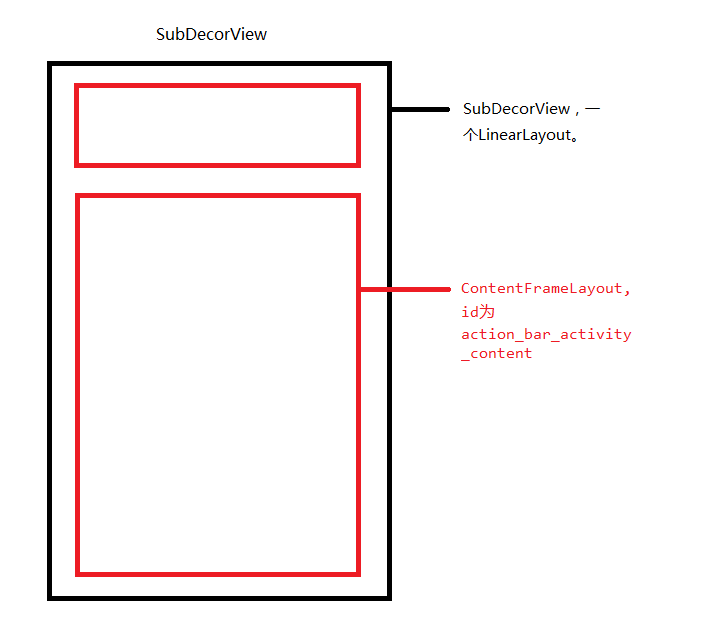 

继续看

```java
//AppCompatDelegateImpl.java
//createSubDecor()

final ContentFrameLayout contentView = (ContentFrameLayout) subDecor.findViewById(
    R.id.action_bar_activity_content);//获取subdecor中的contentFrameLayout

final ViewGroup windowContentView = (ViewGroup) mWindow.findViewById(android.R.id.content);
if (windowContentView != null) {
    // There might be Views already added to the Window's content view so we need to
    // migrate them to our content view
    while (windowContentView.getChildCount() > 0) {
        final View child = windowContentView.getChildAt(0);
        windowContentView.removeViewAt(0);
        contentView.addView(child);
    }

    //DecorView的frameLayout的id设为NO_ID
    windowContentView.setId(View.NO_ID);
    //subDecor的frameLayout的id设为content
    contentView.setId(android.R.id.content);

    // The decorContent may have a foreground drawable set (windowContentOverlay).
    // Remove this as we handle it ourselves
    if (windowContentView instanceof FrameLayout) {
        ((FrameLayout) windowContentView).setForeground(null);
    }
}

// 将subView加载进decorView的framelayout
mWindow.setContentView(subDecor);
```

上面代码体现流程是：

- 首先从`subDecor`中通过`findViewById`的方法获取到`ContentFrameLayout`。 
- 然后通过`PhoneWindow`的`findViewById`方法获取到了`DecorView`中的`LinearLayout`中的`FrameLayout`。 
- 然后遍历`DecorView`中的`FrameLayout`将它的子View添加到`ContentFrameLayout`。 
- 然后`decorView`中的`FrameLayout`的id变为`NO_ID`；`subDecorView`中的id变为`content`，
- 最后将`subDecor`加载进`decorView`的`Framelayout`里面

> 上述操作总结就是：**将decorview中FrameLayout的子view放到subDecor里面，然后将`subDecor`中的`framelayout`设为`android.R.id.content`，将`DecorView中的FrameLayout`的id设置为`NO_ID`，然后将`subDecoreView`放到`NO_ID`里面**
>
> 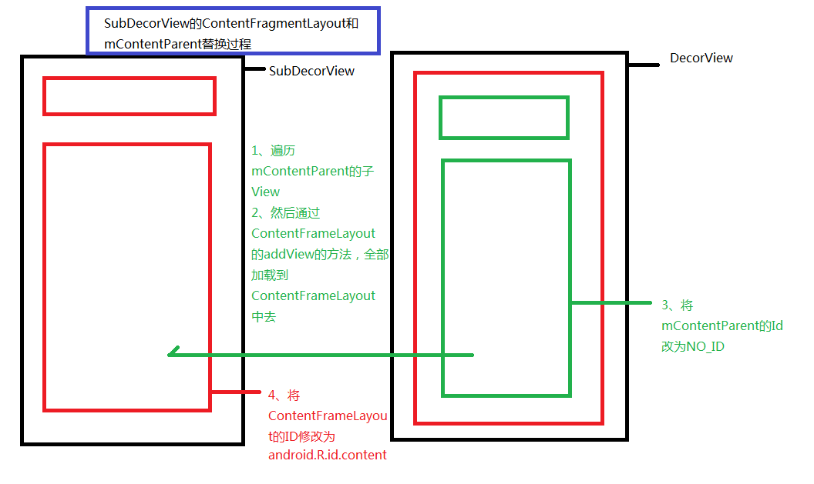 
>
> 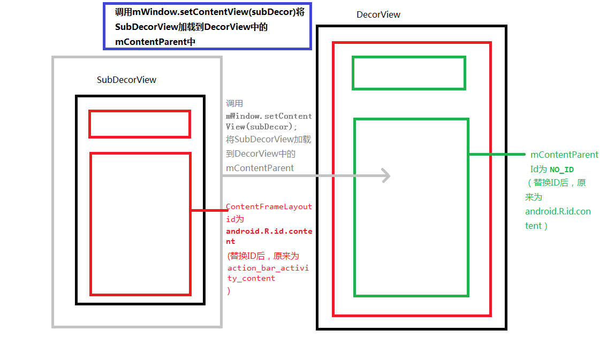 


也就是说，其实继承自`AppCompatActivity`的视图要多一个步骤，就是在`decorView`的`FrameLayout`里面多放一个`subDecor`，而自定义的视图其实是加载到`subDecor`里面的

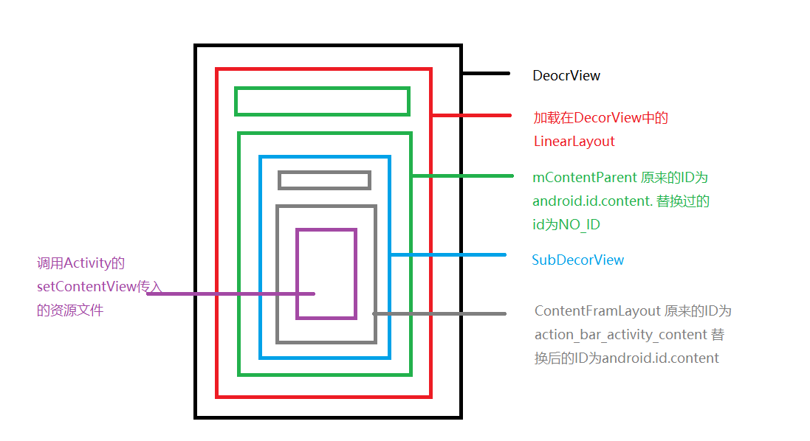 


## View绘制流程

> [View绘制流程](https://cloud.tencent.com/developer/article/1601353)
>
> [View绘制流程——很详细](https://blog.yorek.xyz/android/framework/View%E7%9A%84%E7%BB%98%E5%88%B6%E5%8E%9F%E7%90%86/#1-viewrootimpldecorview)

在整个 activity 的生命周期中，**setContentView 是在 onCreate 中调用的，它实现了对资源文件的解析，完成了 xml 文件到 View 的转化。** 

 

**View真正开始绘制是在onResume之后;**

- `ActivityThread`调用`handleResumeActivity`

- 会在里面获取Activity的`windowmanage`
- 然后调用 `windowmanager`的`addView `方法，传入`decorView`
- 将 `decorView `传入到 `ViewRootImpl `的 `setView `方法中，通过 `setView `来完成 `View `的绘制。 

```java
//ActivityThread.java
public void handleResumeActivity(ActivityClientRecord r, boolean finalStateRequest,
            boolean isForward, boolean shouldSendCompatFakeFocus, String reason) {
        
        unscheduleGcIdler();
        mSomeActivitiesChanged = true;

        
        if (!performResumeActivity(r, finalStateRequest, reason)) {
            return;
        }
        if (mActivitiesToBeDestroyed.containsKey(r.token)) {
            
            return;
        }

        final Activity a = r.activity;

        .....
            
        if (r.window == null && !a.mFinished && willBeVisible) {
            r.window = r.activity.getWindow();
            View decor = r.window.getDecorView();
            decor.setVisibility(View.INVISIBLE);
            ViewManager wm = a.getWindowManager();//获取windowmanager
            WindowManager.LayoutParams l = r.window.getAttributes();
            a.mDecor = decor;
            ....
            if (a.mVisibleFromClient) {
                if (!a.mWindowAdded) {
                    a.mWindowAdded = true;
                    wm.addView(decor, l);//调用windowmanager的add.View方法
                }
            }
        }
}
```

`WindowManager`的实现类是`WindowManagerImpl`，因此直接跳到`WindowManagerImpl`的addView

```java
public void addView(@NonNull View view, @NonNull ViewGroup.LayoutParams params) {
    applyTokens(params);
    mGlobal.addView(view, params, mContext.getDisplayNoVerify(), mParentWindow,
                    mContext.getUserId());
}
```

可以看到里面又调用了`mGloble.addView`这个`mGlobe`就是一个`WindowManagerGlobal`

```java
public void addView(View view, ViewGroup.LayoutParams params,
                    Display display, Window parentWindow, int userId) {
    ......

    final WindowManager.LayoutParams wparams = (WindowManager.LayoutParams) params;
    if (parentWindow != null) {
        parentWindow.adjustLayoutParamsForSubWindow(wparams);
    } else {
        final Context context = view.getContext();
        if (context != null
            && (context.getApplicationInfo().flags
                & ApplicationInfo.FLAG_HARDWARE_ACCELERATED) != 0) {
            wparams.flags |= WindowManager.LayoutParams.FLAG_HARDWARE_ACCELERATED;
        }
    }

    //初始化了`ViewRootImpl`
    ViewRootImpl root;
    View panelParentView = null;

    ...

    IWindowSession windowlessSession = null;
   
    if (wparams.token != null && panelParentView == null) {
        for (int i = 0; i < mWindowlessRoots.size(); i++) {
            ViewRootImpl maybeParent = mWindowlessRoots.get(i);
            if (maybeParent.getWindowToken() == wparams.token) {
                windowlessSession = maybeParent.getWindowSession();
                break;
            }
        }
    }

    if (windowlessSession == null) {
        root = new ViewRootImpl(view.getContext(), display);
    } else {
        root = new ViewRootImpl(view.getContext(), display,
                                windowlessSession, new WindowlessWindowLayout());
    }

    view.setLayoutParams(wparams);

    mViews.add(view);
    mRoots.add(root);
    mParams.add(wparams);

    
    try {
        //viewRootImpl的setView方法
        root.setView(view, wparams, panelParentView, userId);
    } catch (RuntimeException e) {
        final int viewIndex = (index >= 0) ? index : (mViews.size() - 1);
        // BadTokenException or InvalidDisplayException, clean up.
        if (viewIndex >= 0) {
            removeViewLocked(viewIndex, true);
        }
        throw e;
    }
}
}
```

观察`setView`

```java
public void setView(View view, WindowManager.LayoutParams attrs, View panelParentView,
            int userId) {
    
    ...
        
    requestLayout();
    
    ...
}
```

`setView`里面的内容非常多，但是主要有一个`requestLayout`方法

```java
public void requestLayout() {
    if (!mHandlingLayoutInLayoutRequest) {
        checkThread();
        mLayoutRequested = true;
        scheduleTraversals();
    }
}
```

> 这个方法做了两件事：
>
> - 检查绘制的线程是不是UI线程 
> - 调用scheduleTraversals 方法来调度一次完整的绘制流程

 该方法会向主线程发送一个“遍历”消息，最终会导致ViewRootImpl的performTraversals()方法被调用 

```java
void scheduleTraversals() {
    if (!mTraversalScheduled) {
        mTraversalScheduled = true;
        //获取内存屏障
        mTraversalBarrier = mHandler.getLooper().getQueue().postSyncBarrier();
        //发送绘制消息
        mChoreographer.postCallback(
            Choreographer.CALLBACK_TRAVERSAL, mTraversalRunnable, null);
        notifyRendererOfFramePending();
        pokeDrawLockIfNeeded();
    }
}
```

通过内存屏障保证绘制View的任务最优先，并且通过一个定时任务执行绘制回调

```java
final class TraversalRunnable implements Runnable {
    @Override
    public void run() {
        doTraversal();
    }
}
```

可以看到调用了`doTraversal`

```java
void doTraversal() {
    if (mTraversalScheduled) {
        mTraversalScheduled = false;
        mHandler.getLooper().getQueue().removeSyncBarrier(mTraversalBarrier);

        if (mProfile) {
            Debug.startMethodTracing("ViewAncestor");
        }

        performTraversals();

        if (mProfile) {
            Debug.stopMethodTracing();
            mProfile = false;
        }
    }
}
```

又接着调用`performTraversals`， 从DecorView自上而下遍历整个View树，**注意是所有View执行完一个步骤后，再进行下一步，而不是一个View执行完所有步骤再遍历下一个View。** 


>  `onMeasure()`、 `onLayout()`、`onDraw()`，这三个方法要解决的问题就是`画多大`、`在哪画`、`画什么`。
>
>  ViewRootImpl 的 performTraversal() 方法会依次调用 `performMeasure()`、`performLayout()` 和 `performDraw()` 三个方法，这三个方法分别完成 DecorView 的测量、放置和绘制三大流程。
>
>  Measure ：从顶层父View到子View递归调用measure方法，measure方法又回调OnMeasure。 
>
>  > View会在measure方法中调用onMeasure方法，而ViewGroup会在onMeasure中完成对子View的measure操作。如果子元素也是ViewGroup，也会沿着控件树继续传递下去，直到最后的节点是View为止。 
>
>  Layout：确定View位置，进行页面布局。从顶层父View向子View的递归调用view.layout方法的过程，即父View根据上一步measure子View所得到的布局大小和布局参数，将子View放在合适的位置上。
>
>  Draw：绘制视图。ViewRoot创建一个Canvas对象，然后调用OnDraw()。六个步骤：①、绘制视图的背景；②、保存画布的图层（Layer）；③、绘制View的内容；④、绘制View子视图，如果没有就不用；⑤、还原图层（Layer）；⑥、绘制滚动条。


**通过`performTraversals` 对viewTree逐步绘制，就如下图所示：**

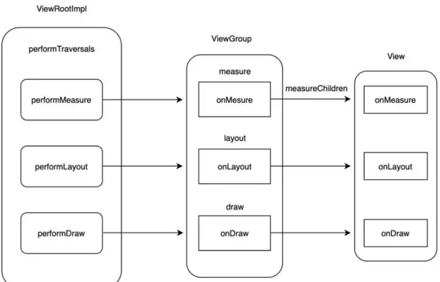


### **总结：**

**view的绘制流程可总结为以下两个图：**

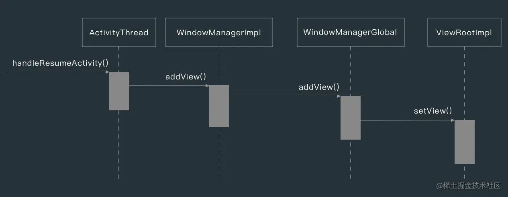

> ①在 `ActivityThread` 的 handleResumeActivity() 方法中，会调用 WindowManager 的 `addView()` 方法，而具体添加 DecorView 的操作是在 `WindowManagerGlobal` 中。
>
> ②在 WindowManagerGlobal 的 `addView()` 方法中，会把 DecorView 添加到 Window 中，同时会创建 ViewRootImpl ，并调用 ViewRootImpl 的 setView() 方法 把 ViewRootImpl 和 DecorView 关联起来。
>
> ③View 的绘制流程是从 ViewRootImpl 的 `performTraversals()` 方法开始的，它经过`测量（measure）、放置（layout）和绘制（draw）`三个过程才能把一个 View 绘制出来，measure() 方法用于测量 View 的宽高，layout() 用于确定 View 在父容器中的放置位置，draw() 负责做具体的绘制操作。

 接上图，setView方法中调用requestLayout，requestLayout负责判断：

- 发起绘制请求是否在UI线程
- 执行scheduleTraversals执行绘制

 

> `performTraversals`方法会由`doTraversal`调用，`doTraversal`又被封装在`TraversalRunnable`里面，`TraversalRunnable`会在`scheduleTraversals`方法注册到`Choreographer`中，在下一个VSync信号到达的时候进行触发。 `invalidate`、`requestLayout`等等方法都会调用`scheduleTraversals` 


`measure()`、`layout()`、`draw()`三个函数

| 函数      | 作用                         | 相关方法                                     |
| --------- | ---------------------------- | -------------------------------------------- |
| measure() | 测量View的宽高               | measure(),setMeasuredDimension(),onMeasure() |
| layout()  | 计算当前View以及子View的位置 | layout(),onLayout(),setFrame()               |
| draw()    | 视图的绘制工作               | draw(),onDraw()                              |

**坐标系：**

在Android坐标系中，以屏幕左上角作为原点，这个原点向右是X轴的正轴，向下是Y轴正轴。如下所示：


除了Android坐标系，还存在View坐标系，View坐标系内部关系如图所示。


**获取View自身高度**

由上图可算出View的高度：

- width = getRight() - getLeft();
- height = getBottom() - getTop();


### **Measure**

#### ①MeasureSpec

`MeasureSpec`是View的**内部类**，它封装了一个View的尺寸，在`onMeasure()`当中会根据这个`MeasureSpec`的值来确定View的宽高。

`MeasureSpec`的值保存在一个int值当中。一个int值有32位，前**两位表示`模式mode`**，**后30位表示`大小size`**。即`MeasureSpec` = `mode` + `size`。对于View来说，`MeasureSpec`的mode和size有如下含义：

- **UNSPECIFIED**
  **00** 000000 00000000 00000000 00000000
  父容器对View没有任何限制，要多大给多大。这种情况一般用于系统内部。
- **EXACTLY**
  **01** 000000 00000000 00000000 00000000
  父容器已经决定了View的精确尺寸，View的最终大小就是此时SpecSize所指定的大小。它对应于match_parent以及具体的数值。
- **AT_MOST**
  **10** 000000 00000000 00000000 00000000
  View想要多大就有多大，但是不能超过SpecSize。它对应于wrap_content。

```java
// 获取测量模式（Mode）
int specMode = MeasureSpec.getMode(measureSpec);

// 获取测量大小（Size）
int specSize = MeasureSpec.getSize(measureSpec);

// 通过Mode 和 Size 生成新的SpecMode
int measureSpec=MeasureSpec.makeMeasureSpec(size, mode);
```

> 在View测量时，系统会将View的LayoutParams在父容器的约束下转换成对应的MeasureSpec，然后在根据这个MeasureSpec来确定View的最后宽高。注意：MeasureSpec不仅仅由LayoutParams决定，它还有父容器一起决定。 


#### ②View的measure

 在View的`measure`方法中会去调用View的`onMeasure`方法，因此只需要看`onMeasure`的实现即可。 

```java
protected void onMeasure(int widthMeasureSpec, int heightMeasureSpec) {
	//setMeasuredDimension(int measuredWidth, int measuredHeight) ：该方法用来设置View的宽高，在我们自定义View时也会经常用到。
    setMeasuredDimension(getDefaultSize(getSuggestedMinimumWidth(), widthMeasureSpec),
                         getDefaultSize(getSuggestedMinimumHeight(), heightMeasureSpec));
}

//getDefaultSize(int size, int measureSpec)：该方法用来获取View默认的宽高。
public static int getDefaultSize(int size, int measureSpec) {
    int result = size;
    int specMode = MeasureSpec.getMode(measureSpec);
    int specSize = MeasureSpec.getSize(measureSpec);

    switch (specMode) {
        case MeasureSpec.UNSPECIFIED:
            result = size;
            break;
        case MeasureSpec.AT_MOST:
        case MeasureSpec.EXACTLY:
            result = specSize;
            break;
    }
    return result;
}

//getSuggestedMinimumWidth():当View没有设置背景时，默认大小就是mMinWidth，这个值对应Android:minWidth属性，如果没有设置时默认为0.如果有设置背景，则默认大小为mMinWidth和mBackground.getMinimumWidth()当中的较大值。
protected int getSuggestedMinimumWidth() {
    return (mBackground == null) ? mMinWidth : max(mMinWidth, mBackground.getMinimumWidth());
}
```

> 上面代码可以看到， getDefaultSize方法就是返回的size就是specSize， View的宽高从specSize决定，所以**直接继承View的自定义控件需要重写`onMeasure`方法并设置wrap_content时的自身大小，否则在布局中使用wrap_content相当于使用match_parent**。 
>
> ```java
> @Override
> protected void onMeasure(int widthMeasureSpec, int heightMeasureSpec) {
>     super.onMeasure(widthMeasureSpec, heightMeasureSpec);
>     int widthSpecMode = MeasureSpec.getMode(widthMeasureSpec);
>     int heightSpecMode = MeasureSpec.getMode(heightMeasureSpec);
> 
>     if (widthSpecMode == MeasureSpec.AT_MOST && heightSpecMode == MeasureSpec.AT_MOST) {
>         setMeasuredDimension(200, 200);
>     } else if (widthSpecMode == MeasureSpec.AT_MOST ) {
>         setMeasuredDimension(200, heightMeasureSpec);
>     } else if (heightSpecMode == MeasureSpec.AT_MOST) {
>         setMeasuredDimension(widthMeasureSpec, 200);
>     }
> }
> ```

#### ③viewgroup的measure

 对于ViewGroup来说，除了完成自己的measure外，还会遍历调用所有子元素的`measure`方法，各个子元素再递归执行这个过程。ViewGroup是一个抽象类，因此它并没有重写View的`onMeasure`方法，这个方法需要具体的ViewGroup类（比如LinearLayout、RelativeLayout等）来实现。 下面看看LinearLayout实现的onMeasure

```java
@Override
protected void onMeasure(int widthMeasureSpec, int heightMeasureSpec) {
    if (mOrientation == VERTICAL) {
        measureVertical(widthMeasureSpec, heightMeasureSpec);
    } else {
        measureHorizontal(widthMeasureSpec, heightMeasureSpec);
    }
}
```


#### ④Activity获取View宽高的方法

在measure完成之后可以通过`getMeasuredWidth/Height`获取view的宽高

 **1. Activity/View.onWindowFocusChanged**
注意，此方法伴随着Activity的生命周期会被多次回调，具体来说，当Activity得到焦点和失去焦点时会被回调。 

```java
@Override
public void onWindowFocusChanged(boolean hasWindowFocus) {
    super.onWindowFocusChanged(hasWindowFocus);
    if (hasWindowFocus) {
        int width = view.getMeasuredWidth();
        int height = view.getMeasuredHeight();
    }
}
```


 **2. View#post(Runnable)**
使用post可以将一个runnable投递到消息队列的尾部，然后等待Looper调用此runnable，View也初始化好了。 

```java
view.post(new Runnable() {
    @Override
    public void run() {
        int width = view.getMeasuredWidth();
        int height = view.getMeasuredHeight();
    }
});
```


### **Layout**

#### View的layout

 对于View来说，最终都会通过`setFrame`方法来设定View的四个位置参数，这些参数一旦确定，View在父容器中的位置也就确定了。然后会调用`onLayout`方法，此方法会让父容器用来确定子元素位置，在View和ViewGroup中都是一个空实现，在各个ViewGroup的子类中会实现。最后，如果View设置有`OnLayoutChangeListener`监听器，会回调这些监听器的方法。 

```java
/**
*  这里的四个参数l、t、r、b分别代表View的左、上、右、下四个边界相对于其父View的距离。
*
*/
public void layout(int l, int t, int r, int b) {
        if ((mPrivateFlags3 & PFLAG3_MEASURE_NEEDED_BEFORE_LAYOUT) != 0) {
            onMeasure(mOldWidthMeasureSpec, mOldHeightMeasureSpec);
            mPrivateFlags3 &= ~PFLAG3_MEASURE_NEEDED_BEFORE_LAYOUT;
        }

        int oldL = mLeft;
        int oldT = mTop;
        int oldB = mBottom;
        int oldR = mRight;

        //这里通过setFrame或setOpticalFrame方法确定View在父容器当中的位置。
        boolean changed = isLayoutModeOptical(mParent) ?
                setOpticalFrame(l, t, r, b) : setFrame(l, t, r, b);

        //调用onLayout方法。onLayout方法是一个空实现，不同的布局会有不同的实现。
        if (changed || (mPrivateFlags & PFLAG_LAYOUT_REQUIRED) == PFLAG_LAYOUT_REQUIRED) {
            onLayout(changed, l, t, r, b);

        }

    }
```

​	

#### ViewGroup的layout

ViewGroup本身的layout过程调用的是`super.layout`方法，不同的是ViewGroup还要对子元素进行layout操作。但是由于ViewGroup是一个抽象类，所以`onLayout`在ViewGroup中是一个空实现。我们这里看LinearLayout的方法：

```java
@Override
protected void onLayout(boolean changed, int l, int t, int r, int b) {
    if (mOrientation == VERTICAL) {
        layoutVertical(l, t, r, b);
    } else {
        layoutHorizontal(l, t, r, b);
    }
}

void layoutVertical(int left, int top, int right, int bottom) {
    final int paddingLeft = mPaddingLeft;

    int childTop;
    int childLeft;

    // Where right end of child should go
    final int width = right - left;
    int childRight = width - mPaddingRight;

    // Space available for child
    int childSpace = width - paddingLeft - mPaddingRight;

    final int count = getVirtualChildCount();

    final int majorGravity = mGravity & Gravity.VERTICAL_GRAVITY_MASK;
    final int minorGravity = mGravity & Gravity.RELATIVE_HORIZONTAL_GRAVITY_MASK;

    switch (majorGravity) {
       case Gravity.BOTTOM:
           // mTotalLength contains the padding already
           childTop = mPaddingTop + bottom - top - mTotalLength;
           break;

           // mTotalLength contains the padding already
       case Gravity.CENTER_VERTICAL:
           childTop = mPaddingTop + (bottom - top - mTotalLength) / 2;
           break;

       case Gravity.TOP:
       default:
           childTop = mPaddingTop;
           break;
    }

    for (int i = 0; i < count; i++) {
        final View child = getVirtualChildAt(i);
        if (child == null) {
            childTop += measureNullChild(i);
        } else if (child.getVisibility() != GONE) {
            final int childWidth = child.getMeasuredWidth();
            final int childHeight = child.getMeasuredHeight();

            final LinearLayout.LayoutParams lp =
                    (LinearLayout.LayoutParams) child.getLayoutParams();

            int gravity = lp.gravity;
            if (gravity < 0) {
                gravity = minorGravity;
            }
            final int layoutDirection = getLayoutDirection();
            final int absoluteGravity = Gravity.getAbsoluteGravity(gravity, layoutDirection);
            switch (absoluteGravity & Gravity.HORIZONTAL_GRAVITY_MASK) {
                case Gravity.CENTER_HORIZONTAL:
                    childLeft = paddingLeft + ((childSpace - childWidth) / 2)
                            + lp.leftMargin - lp.rightMargin;
                    break;

                case Gravity.RIGHT:
                    childLeft = childRight - childWidth - lp.rightMargin;
                    break;

                case Gravity.LEFT:
                default:
                    childLeft = paddingLeft + lp.leftMargin;
                    break;
            }

            if (hasDividerBeforeChildAt(i)) {
                childTop += mDividerHeight;
            }

            childTop += lp.topMargin;
            setChildFrame(child, childLeft, childTop + getLocationOffset(child),
                    childWidth, childHeight);
            childTop += childHeight + lp.bottomMargin + getNextLocationOffset(child);

            i += getChildrenSkipCount(child, i);
        }
    }
}	
```

 只看竖直方向的`layoutVertical`方法，这个方法逻辑还是很清楚的。它会对所有子元素调用`setChildFrame`方法，其中childTop会不断累加，这就意味着后面的元素被放置在靠下的位置。并且`setFrame`中传入的width、height两个参数就是这个子元素的测量宽高。 

 至于`setChildFrame`方法，它仅仅是调用子元素的`layout`方法。这样layout操作就会传递到子元素中，子元素会继续这么执行，一直到完成整个View树的layout过程。 

```java
private void setChildFrame(View child, int left, int top, int width, int height) {        
    child.layout(left, top, left + width, top + height);
}
```


### **Draw**

看看View.draw

```java
public void draw(Canvas canvas) {
    final int privateFlags = mPrivateFlags;
    final boolean dirtyOpaque = (privateFlags & PFLAG_DIRTY_MASK) == PFLAG_DIRTY_OPAQUE &&
            (mAttachInfo == null || !mAttachInfo.mIgnoreDirtyState);
    mPrivateFlags = (privateFlags & ~PFLAG_DIRTY_MASK) | PFLAG_DRAWN;

    /*
     * Draw traversal performs several drawing steps which must be executed
     * in the appropriate order:
     *
     *      1. Draw the background
     *      2. If necessary, save the canvas' layers to prepare for fading
     *      3. Draw view's content
     *      4. Draw children
     *      5. If necessary, draw the fading edges and restore layers
     *      6. Draw decorations (scrollbars for instance)
     */

    // Step 1, draw the background, if needed
    int saveCount;

    if (!dirtyOpaque) {
        drawBackground(canvas);
    }

    // skip step 2 & 5 if possible (common case)
    final int viewFlags = mViewFlags;
    boolean horizontalEdges = (viewFlags & FADING_EDGE_HORIZONTAL) != 0;
    boolean verticalEdges = (viewFlags & FADING_EDGE_VERTICAL) != 0;
    if (!verticalEdges && !horizontalEdges) {
        // Step 3, draw the content
        if (!dirtyOpaque) onDraw(canvas);

        // Step 4, draw the children
        dispatchDraw(canvas);

        // Overlay is part of the content and draws beneath Foreground
        if (mOverlay != null && !mOverlay.isEmpty()) {
            mOverlay.getOverlayView().dispatchDraw(canvas);
        }

        // Step 6, draw decorations (foreground, scrollbars)
        onDrawForeground(canvas);

        // we're done...
        return;
    }

    /*
     * Here we do the full fledged routine...
     * (this is an uncommon case where speed matters less,
     * this is why we repeat some of the tests that have been
     * done above)
     */

    boolean drawTop = false;
    boolean drawBottom = false;
    boolean drawLeft = false;
    boolean drawRight = false;

    float topFadeStrength = 0.0f;
    float bottomFadeStrength = 0.0f;
    float leftFadeStrength = 0.0f;
    float rightFadeStrength = 0.0f;

    // Step 2, save the canvas' layers
    int paddingLeft = mPaddingLeft;

    final boolean offsetRequired = isPaddingOffsetRequired();
    if (offsetRequired) {
        paddingLeft += getLeftPaddingOffset();
    }

    int left = mScrollX + paddingLeft;
    int right = left + mRight - mLeft - mPaddingRight - paddingLeft;
    int top = mScrollY + getFadeTop(offsetRequired);
    int bottom = top + getFadeHeight(offsetRequired);

    if (offsetRequired) {
        right += getRightPaddingOffset();
        bottom += getBottomPaddingOffset();
    }

    final ScrollabilityCache scrollabilityCache = mScrollCache;
    final float fadeHeight = scrollabilityCache.fadingEdgeLength;
    int length = (int) fadeHeight;

    // clip the fade length if top and bottom fades overlap
    // overlapping fades produce odd-looking artifacts
    if (verticalEdges && (top + length > bottom - length)) {
        length = (bottom - top) / 2;
    }

    // also clip horizontal fades if necessary
    if (horizontalEdges && (left + length > right - length)) {
        length = (right - left) / 2;
    }

    if (verticalEdges) {
        topFadeStrength = Math.max(0.0f, Math.min(1.0f, getTopFadingEdgeStrength()));
        drawTop = topFadeStrength * fadeHeight > 1.0f;
        bottomFadeStrength = Math.max(0.0f, Math.min(1.0f, getBottomFadingEdgeStrength()));
        drawBottom = bottomFadeStrength * fadeHeight > 1.0f;
    }

    if (horizontalEdges) {
        leftFadeStrength = Math.max(0.0f, Math.min(1.0f, getLeftFadingEdgeStrength()));
        drawLeft = leftFadeStrength * fadeHeight > 1.0f;
        rightFadeStrength = Math.max(0.0f, Math.min(1.0f, getRightFadingEdgeStrength()));
        drawRight = rightFadeStrength * fadeHeight > 1.0f;
    }

    saveCount = canvas.getSaveCount();

    int solidColor = getSolidColor();
    if (solidColor == 0) {
        final int flags = Canvas.HAS_ALPHA_LAYER_SAVE_FLAG;

        if (drawTop) {
            canvas.saveLayer(left, top, right, top + length, null, flags);
        }

        if (drawBottom) {
            canvas.saveLayer(left, bottom - length, right, bottom, null, flags);
        }

        if (drawLeft) {
            canvas.saveLayer(left, top, left + length, bottom, null, flags);
        }

        if (drawRight) {
            canvas.saveLayer(right - length, top, right, bottom, null, flags);
        }
    } else {
        scrollabilityCache.setFadeColor(solidColor);
    }

    // Step 3, draw the content
    if (!dirtyOpaque) onDraw(canvas);

    // Step 4, draw the children
    dispatchDraw(canvas);

    // Step 5, draw the fade effect and restore layers
    final Paint p = scrollabilityCache.paint;
    final Matrix matrix = scrollabilityCache.matrix;
    final Shader fade = scrollabilityCache.shader;

    if (drawTop) {
        matrix.setScale(1, fadeHeight * topFadeStrength);
        matrix.postTranslate(left, top);
        fade.setLocalMatrix(matrix);
        p.setShader(fade);
        canvas.drawRect(left, top, right, top + length, p);
    }

    if (drawBottom) {
        matrix.setScale(1, fadeHeight * bottomFadeStrength);
        matrix.postRotate(180);
        matrix.postTranslate(left, bottom);
        fade.setLocalMatrix(matrix);
        p.setShader(fade);
        canvas.drawRect(left, bottom - length, right, bottom, p);
    }

    if (drawLeft) {
        matrix.setScale(1, fadeHeight * leftFadeStrength);
        matrix.postRotate(-90);
        matrix.postTranslate(left, top);
        fade.setLocalMatrix(matrix);
        p.setShader(fade);
        canvas.drawRect(left, top, left + length, bottom, p);
    }

    if (drawRight) {
        matrix.setScale(1, fadeHeight * rightFadeStrength);
        matrix.postRotate(90);
        matrix.postTranslate(right, top);
        fade.setLocalMatrix(matrix);
        p.setShader(fade);
        canvas.drawRect(right - length, top, right, bottom, p);
    }

    canvas.restoreToCount(saveCount);

    // Overlay is part of the content and draws beneath Foreground
    if (mOverlay != null && !mOverlay.isEmpty()) {
        mOverlay.getOverlayView().dispatchDraw(canvas);
    }

    // Step 6, draw decorations (foreground, scrollbars)
    onDrawForeground(canvas);
}
```

View的绘制过程遵循以下6步：

1. 绘制背景 `drawBackground(canvas)` -> `background.draw(canvas);`
2. 如果必要，为 fading edge 效果保存图层
3. 绘制自己 `onDraw(canvas)`
4. 绘制children `dispatchDraw(canvas)`
5. 如果必要，绘制 fading edge 效果并恢复图层
6. 绘制装饰（比如foreground、scrollbars）`onDrawForeground(canvas)`

其中，如果View本身是透明的，则不需要绘制背景以及自身，所以跳过了1、3两步；其次，如果View本身不需要绘制 fading edge，则跳过2、5两步。


`onDraw`方法在View是一个空实现，供具体的View来实现draw效果；ViewGroup也更加不会实现该方法，但具体ViewGroup子类会根据自身需要进行重写该方法（比如LinearLayout）。 


 **注意：View有一个特殊的方法**`setWillNotDraw`。**如果View不需要绘制任何内容，那么可以设置这个标记为true，系统会进行相应的优化。默认情况下，View没有开启这个标记位，而ViewGroup会默认开启。** 所以，当我们的自定义控件继承至ViewGroup并且本身需要通过`onDraw`来绘制内容时，需要关闭WILL_NOT_DRAW标记位。 

```java
/**
 * If this view doesn't do any drawing on its own, set this flag to
 * allow further optimizations. By default, this flag is not set on
 * View, but could be set on some View subclasses such as ViewGroup.
 *
 * Typically, if you override {@link #onDraw(android.graphics.Canvas)}
 * you should clear this flag.
 *
 * @param willNotDraw whether or not this View draw on its own
 */
public void setWillNotDraw(boolean willNotDraw) {
    setFlags(willNotDraw ? WILL_NOT_DRAW : 0, DRAW_MASK);
}
```


# View刷新

View重绘和更新可以使用`invalidate()`和`requestLayout()`方法，其主要区别如下：

- `invalidate()`：**只会执行`onDraw`方法**

- `requestLayout()`：只会执行`onMeasure`方法和`onLayout`方法，并不会执行`onDraw`方法

  > 这里的requestLayout和viewrootImpl不是同一个


- 若仅View的显示内容发生改变且新显示内容不影响View的大小、位置，则只需调用`invalidate()`方法；

- 若View宽高、位置发生改变且显示内容不变，只需调用`requestLayout()`方法；
- 若两者均发生改变，则需调用两者，按照View的绘制流程，推荐先调用`requestLayout()`方法再调用`invalidate()`方法。 

# 创建自定义View

## 2D

**构建步骤**

- 创建类继承现有View或其子类
- 替换父类中的某些方法。要替换的父类方法以“`on`”开头，例如`onDraw()`、`onMeasure()` 和 `onKeyDown()`。这类似于您为生命周期和其他功能钩子替换的 `Activity` 或 `ListActivity` 中的 `on...` 事件。
- 使用您的新拓展类。


> **onDraw()**：`onDraw()` 方法为您提供了一个 `Canvas`，您可以在其上实现所需的任何东西：2D 图形、其他标准或自定义组件、样式文本或您可以想到的其他任何东西。
>
> (**注意**：这不适用于实现 3D 图形。如果想要使用 3D 图形，则必须扩展 `SurfaceView`（而不是 View），并从单独的线程绘制。如需了解详情，请参阅 GLSurfaceViewActivity 示例。)


下面汇总了框架针对视图调用的一些其他标准方法：

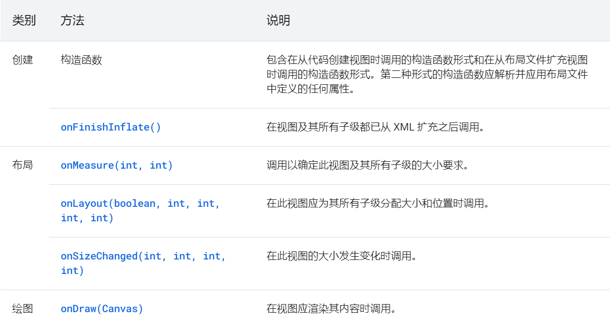

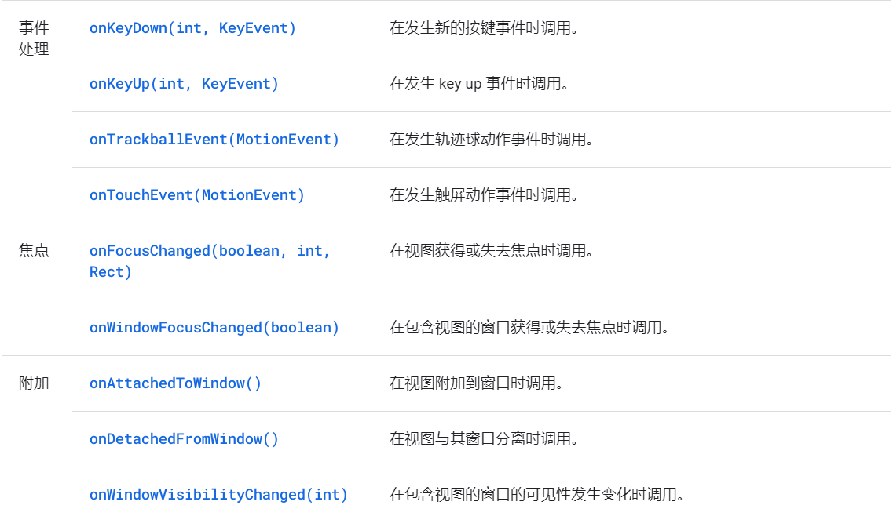


### 自定义组件基本步骤：

#### (1)子类化视图：

为了使 Android Studio 能够与您的视图交互，您必须*至少提供一个以 `Context` 和 `AttributeSet` 对象为参数的构造函数*。此构造函数允许布局编辑器创建和编辑视图的实例。

```java
 public class CustomTextView extends View {
     /**
     * 在java代码里new的时候会用到
     * @param context
     */
    public CustomTextView(Context context) {
        super(context);
    }

     /**
     * 在xml布局文件中使用时自动调用
     * @param context
     */
    public CustomTextView(Context context, @Nullable AttributeSet attrs) {
        super(context, attrs);
    }

     /**
     * 不会自动调用，如果有默认style时，在第二个构造函数中调用
     * @param context
     * @param attrs
     * @param defStyleAttr
     */
    public CustomTextView(Context context, @Nullable AttributeSet attrs, int defStyleAttr) {
        super(context, attrs, defStyleAttr);
    }

     /**
     * 只有在API版本>21时才会用到
     * 不会自动调用，如果有默认style时，在第二个构造函数中调用
     * @param context
     * @param attrs
     * @param defStyleAttr
     * @param defStyleRes
     */
    @RequiresApi(api = Build.VERSION_CODES.LOLLIPOP)
    public CustomTextView(Context context, @Nullable AttributeSet attrs, int defStyleAttr, int defStyleRes) {
        super(context, attrs, defStyleAttr, defStyleRes);
    }
}
```


#### (2)布局文件引入

```xml
<view xmlns:android="http://schemas.android.com/apk/res/android"
    class="com.example.android.notepad.NoteEditor$LinedEditText"//声明自定义组件的类
    android:id="@+id/note"
    android:layout_width="match_parent"
    android:layout_height="match_parent"
    android:background="@android:color/transparent"
    android:padding="5dp"
    android:scrollbars="vertical"
    android:fadingEdge="vertical"
    android:gravity="top"
    android:textSize="22sp"
    android:capitalize="sentences"
/>
```

> 请注意，我们定义的**内部类**是使用 `NoteEditor$LinedEditText` 标记引用的，这是以 Java 编程语言引用内部类的标准方式。
>
> 如果您的自定义 View 组件未定义为内部类，则您可以选择使用 XML 元素名称声明 View 组件，并排除 `class` 属性。例如：

```xml
<com.example.android.notepad.LinedEditText
  id="@+id/note"
  ... />
```


#### (3)自定义属性值

如需定义自定义属性，添加 `<declare-styleable> `资源。这些资源通常放在 `res/values/attrs.xml` 文件中。以下是 `attrs.xml` 文件的示例：

```xml
<resources>
    <declare-styleable name="PieChart">
        <attr name="showText" format="boolean" />
        <attr name="labelPosition" format="enum">
            <enum name="left" value="0"/>
            <enum name="right" value="1"/>
        </attr>
    </declare-styleable>
</resources>
<!--此代码声明了两个自定义属性（即 showText 和 labelPosition），它们属于一个名为 PieChart 的可设样式实体。按照惯例，这个可设样式实体的名称与定义自定义视图的类的名称相同。-->
```

> 定义了自定义属性后，便可像内置属性一样在布局 XML 文件中使用它们。唯一的区别是自定义属性属于另一个命名空间。它们不属于 `http://schemas.android.com/apk/res/android` 命名空间，而是属于 `http://schemas.android.com/apk/res/[your package name]`。例如，下面展示了如何为 `PieChart` 定义属性：

```xml
 <?xml version="1.0" encoding="utf-8"?>
    <LinearLayout xmlns:android="http://schemas.android.com/apk/res/android"
       xmlns:custom="http://schemas.android.com/apk/res/com.example.customviews">
     <com.example.customviews.charting.PieChart
         custom:showText="true"
         custom:labelPosition="left" />
    </LinearLayout>
```


**常用属性值format：**

- reference:某一资源ID

  ```xml
  <declare-styleable name = "名称">
       <attr name = "background" format = "reference" />
  </declare-styleable>
  ```

  ```xml
  <ImageView android:background = "@drawable/图片ID"/>
  ```

- color：颜色值

  ```xml
  <attr name = "textColor" format = "color" />
  ```

  ```xml
  <TextView android:textColor = "#00FF00" />
  ```

- boolean

  ```xml
  <attr name = "focusable" format = "boolean" />
  ```

  ```xml
  <Button android:focusable = "true"/>
  ```

- dimension

  ```xml
  <attr name = "layout_width" format = "dimension" />
  ```

  ```xml
  <Button android:layout_width = "42dip"/>
  ```

- fraction:百分数

  ```xml
  <attr name = "pivotX" format = "fraction" />
  ```

  ```xml
  <rotate android:pivotX = "200%"/>
  ```

- enum:枚举

  ```xml
  <attr name="orientation">
          <enum name="horizontal" value="0" />
          <enum name="vertical" value="1" />
  </attr>
  ```

  ```xml
  <LinearLayout  
      android:orientation = "vertical">
  </LinearLayout>
  ```

- flag：位运算

  ```xml
  <declare-styleable name="名称">
      <attr name="gravity">
              <flag name="top" value="0x01" />
              <flag name="bottom" value="0x02" />
              <flag name="left" value="0x04" />
              <flag name="right" value="0x08" />
              <flag name="center_vertical" value="0x16" />
              ...
      </attr>
  </declare-styleable>
  ```

  ```xml
  <TextView android:gravity="bottom|left"/>
  ```

  

- 混合类型：属性定义时可以指定多种类型值

  ```xml
  <declare-styleable name = "名称">
       <attr name = "background" format = "reference|color" />
  </declare-styleable>
  ```

  ```xml
  <ImageView
  android:background = "@drawable/图片ID" />
  或者：
  <ImageView
  android:background = "#00FF00" />
  ```


**构造函数中获取属性**：

通过 XML 布局创建视图时，XML 标记中的所有属性都会从资源包读取，并作为 `AttributeSet` 传递到视图的构造函数中。将 `AttributeSet` 传递给 `obtainStyledAttributes()`。此方法会传回一个 `TypedArray` 数组，其中包含已解除引用并设置了样式的值。

```java
//自定义一个PieChart
//构造函数中获取属性
public PieChart(Context context, AttributeSet attrs) {
    super(context, attrs);
    //获取属性返回一个TypeArray
    TypedArray a = context.getTheme().obtainStyledAttributes(
        attrs,
        R.styleable.PieChart,
        0, 0);

    try {
        mShowText = a.getBoolean(R.styleable.PieChart_showText, false);
        textPos = a.getInteger(R.styleable.PieChart_labelPosition, 0);
    } finally {
        a.recycle();//TypedArray 对象是共享资源，必须在使用后回收。
    }
}
```


**添加属性和事件**

属性只能在视图初始化时读取。

**如需提供动态行为，请为每个自定义属性公开一个 getter 与 setter 属性对**。以下代码段展示了 `PieChart` 公开名为 `showText` 的属性：

```java
public boolean isShowText() {
    return mShowText;
}

public void setShowText(boolean showText) {
    mShowText = showText;
    //调用两个函数通知系统进行视图重绘
    invalidate();
    requestLayout();
}

//onDraw处理不同属性的逻辑
@Override
protected void onDraw(Canvas canvas) {
    if (showText) {
        // 画字
    }

    switch (labelPosition) {
        case 0: // 左
        case 1: // 右
        ...
    }
}
```

例如，以下代码绘制了 `PieChart`。它组合使用了文本、线条和形状。

```java
protected void onDraw(Canvas canvas) {
    super.onDraw(canvas);

    // Draw the shadow
    canvas.drawOval(
        shadowBounds,
        shadowPaint
    );

    // Draw the label text
    canvas.drawText(data.get(currentItem).mLabel, textX, textY, textPaint);

    // Draw the pie slices
    for (int i = 0; i < data.size(); ++i) {
        Item it = data.get(i);
        piePaint.setShader(it.shader);
        canvas.drawArc(bounds,
                       360 - it.endAngle,
                       it.endAngle - it.startAngle,
                       true, piePaint);
    }

    // Draw the pointer
    canvas.drawLine(textX, pointerY, pointerX, pointerY, textPaint);
    canvas.drawCircle(pointerX, pointerY, pointerSize, mTextPaint);
}
```

> **动态添加到activity中，需要有一个父布局**
>
> ```java
> @Override
> protected void onCreate(Bundle savedInstanceState) {
>     super.onCreate(savedInstanceState);
>     setContentView(R.layout.activity_main);
> 
>     // 1. 获取父容器
>     LinearLayout container = findViewById(R.id.container);
> 
>     // 2. 创建自定义 View
>     MyCustomView myCustomView = new MyCustomView(this);
> 
>     // 3. 设置 LayoutParams（很关键，否则可能不显示）
>     LinearLayout.LayoutParams params = new LinearLayout.LayoutParams(
>         ViewGroup.LayoutParams.MATCH_PARENT,
>         400 // 高度写死或换成 WRAP_CONTENT
>     );
>     myCustomView.setLayoutParams(params);
> 
>     // 4. 添加到布局中
>     container.addView(myCustomView);
> }
> ```
>
> **或者xml文件添加**
>
> ```xml
> <com.yuandaima.firstsystemview
>         android:layout_width="200dp"
>         android:layout_height="200dp"
>     />
> ```
>
> 


### 自定义组合控件：

自定义组合控件就是将多个控件组合成为一个新的控件，主要解决多次重复使用同一类型的布局。通过一个自定义HeaderView实例来了解自定义组合控件的用法。

①编写布局文件：

```xml
<RelativeLayout xmlns:android="http://schemas.android.com/apk/res/android"
    android:layout_width="match_parent"
    android:id="@+id/header_root_layout"
    android:layout_height="45dp"
    android:background="#827192">

    <ImageView
        android:id="@+id/header_left_img"
        android:layout_width="45dp"
        android:layout_height="45dp"
        android:layout_alignParentLeft="true"
        android:paddingLeft="12dp"
        android:paddingRight="12dp"
        android:src="@drawable/back"
        android:scaleType="fitCenter"/>

    <TextView
        android:id="@+id/header_center_text"
        android:layout_width="wrap_content"
        android:layout_height="wrap_content"
        android:layout_centerInParent="true"
        android:lines="1"
        android:maxLines="11"
        android:ellipsize="end"
        android:text="title"
        android:textStyle="bold"
        android:textColor="#ffffff"/>
    
    <ImageView
        android:id="@+id/header_right_img"
        android:layout_width="45dp"
        android:layout_height="45dp"
        android:layout_alignParentRight="true"
        android:src="@drawable/add"
        android:scaleType="fitCenter"
        android:paddingRight="12dp"
        android:paddingLeft="12dp"/>

</RelativeLayout>
```

②实现构造方法

```java
//因为我们的布局采用RelativeLayout，所以这里继承RelativeLayout。
//关于各个构造方法的介绍可以参考前面的内容
public class YFHeaderView extends RelativeLayout {

    public YFHeaderView(Context context) {
        super(context);
    }

    public YFHeaderView(Context context, AttributeSet attrs) {
        super(context, attrs);
    }

    public YFHeaderView(Context context, AttributeSet attrs, int defStyleAttr) {
        super(context, attrs, defStyleAttr);
    }

}
```

③初始化UI

```java
//初始化UI，可根据业务需求设置默认值。
private void initView(Context context) {
    LayoutInflater.from(context).inflate(R.layout.view_header, this, true);
    img_left = (ImageView) findViewById(R.id.header_left_img);
    img_right = (ImageView) findViewById(R.id.header_right_img);
    text_center = (TextView) findViewById(R.id.header_center_text);
    layout_root = (RelativeLayout) findViewById(R.id.header_root_layout);
    layout_root.setBackgroundColor(Color.BLACK);
    text_center.setTextColor(Color.WHITE);

}
```

④提供对外方法

```java
//设置标题文字的方法
private void setTitle(String title) {
    if (!TextUtils.isEmpty(title)) {
        text_center.setText(title);
    }
}
//对左边按钮设置事件的方法
private void setLeftListener(OnClickListener onClickListener) {
    img_left.setOnClickListener(onClickListener);
}

//对右边按钮设置事件的方法
private void setRightListener(OnClickListener onClickListener) {
    img_right.setOnClickListener(onClickListener);
}
```

⑤布局中引用控件

```xml
<LinearLayout xmlns:android="http://schemas.android.com/apk/res/android"
    xmlns:app="http://schemas.android.com/apk/res-auto"
    android:orientation="vertical"
    android:layout_width="match_parent"
    android:layout_height="match_parent">

    <com.example.yf.view.YFHeaderView
        android:layout_width="match_parent"
        android:layout_height="45dp">

    </com.example.yf.view.YFHeaderView>

</LinearLayout>
```


### 继承ViewGroup

自定义ViewGroup的过程相对复杂一些，因为除了要对自身的大小和位置进行测量之外，还需要对子View的测量参数负责。

> 参考--
>
> https://www.jianshu.com/p/705a6cb6bfee


### 处理视图交互

**处理输入手势**

```java
 @Override
public boolean onTouchEvent(MotionEvent event) {
    return super.onTouchEvent(event);
}
```

轻触事件本身并不特别实用。现代触控界面根据手势定义互动，例如点按、拉、推、快滑和缩放。为了将原始轻触事件转换成手势，Android 提供了 `GestureDetector`。

- 如果只是处理几个手势，只需要继承GestureDetector.SimpleOnGestureListener

  ```java
  /*例如，此代码会创建一个扩展 GestureDetector.SimpleOnGestureListener 并替换 onDown(MotionEvent) 的类。*/
  class MyListener extends GestureDetector.SimpleOnGestureListener {
         @Override
         public boolean onDown(MotionEvent e) {
             return true;
         }
      }
      detector = new GestureDetector(PieChart.this.getContext(), new MyListener());//创建GestureDetector实例，传入继承的监听类
  ```

  **无论是否使用该监听，都应该实现onDown方法并且返回true，因为所有手势都以 `onDown()` 消息开头，如果返回false，证明禁用该手势。**

  实现 `GestureDetector.OnGestureListener` 并创建 `GestureDetector` 的实例后，您可以使用 `GestureDetector` 解读在 `onTouchEvent()` 中收到的轻触事件。

  ```java
  @Override
  public boolean onTouchEvent(MotionEvent event) {
      boolean result = detector.onTouchEvent(event);//通过手势处理触摸事件
      if (!result) {
          if (event.getAction() == MotionEvent.ACTION_UP) {
              stopScrolling();
              result = true;
          }
      }
      return result;
  }
  /*如果您向 onTouchEvent() 传递轻触事件，而该事件无法被识别为手势的一部分，它将返回 false。然后，您可以运行自定义手势检测代码。*/
  ```


**创建符合物理原理的运动**

列入ListView的滑动手势，成为快滑，可以通过Scroller类来处理，通过重写onFling()方法，然后调用scroller的fling()方法，传入初始速度以及快滑的最小和最大 x、y 值。对于速度值，您可以使用 `GestureDetector` 为您计算的值。

```java
@Override
    public boolean onFling(MotionEvent e1, MotionEvent e2, float velocityX, float velocityY) {
       scroller.fling(currentX, currentY, velocityX / SCALE, velocityY / SCALE, minX, minY, maxX, maxY);//滑动速度往往用x和y速度除以4到8之间的系数
       postInvalidate();
        return true;
    }
```


在调用了fling()设置滑动手势之后，需要定期调用`Scroller.computeScrollOffset()`已更新Scroller，Scroller.computeScrollOffset()可以计算当时的x和y位置，通过调用getCurrX()和getCurrY()可以检索这些值。

> **更新Scroller状态之后，系统不会自动将这些位置应用到视图中，所以要及时获取到新的位置的状态，然后进行更新。使滚动画面流畅。可以通过下面两种方式：**
>
> - 调用 `fling()` 后再调用 `postInvalidate()`，以强制重新绘制。此方法要求您在 `onDraw()` 中计算滚动偏移，并在每次滚动偏移更改时调用 `postInvalidate()`。
> - 设置 `ValueAnimator` 为快滑过程添加动画，并通过调用 `addUpdateListener()` 添加监听器以处理动画更新。
>
> 下面对第二种方式使用第二种方式：
>
> ```java
> scroller = new Scroller(getContext(), null, true);
>  scrollAnimator = ValueAnimator.ofFloat(0,1);
>  scrollAnimator.addUpdateListener(new ValueAnimator.AnimatorUpdateListener() {
>      @Override
>      public void onAnimationUpdate(ValueAnimator valueAnimator) {
>          if (!scroller.isFinished()) {
>              scroller.computeScrollOffset();
>              setPieRotation(scroller.getCurrY());
>          } else {
>              scrollAnimator.cancel();
>              onScrollFinished();
>          }
>      }
>  });
> ```
>
> 

**当自定义视图进行动画转换的时候，不要在原属性上直接修改，而是通过动画的方式--ValueAnimator**


> 详情参考--
>
> https://developer.android.google.cn/guide/topics/ui/custom-components
>
> https://www.jianshu.com/p/705a6cb6bfee


## 3D


# 问题

## 1.绘制相关方法

### invalidate

`invalidate()` 方法通常是用于请求视图（View）重新绘制。它的作用是标记视图的某个区域为“需要重绘”，并会触发绘制过程。

> 具体来说，`invalidate()` 默认情况下会触发**局部重绘**。 

如果是在viewgroup里面调用，会触发其子view的重绘

### requestLayout

`requestLayout()` 会请求视图的布局（layout）重新计算，但它不会直接触发绘制过程（即 `onDraw()` 不会立即调用）。它通常用在视图尺寸或位置改变时。

如果你在根视图上调用 `requestLayout()`，它会**导致整个视图树重新测量和布局**，然后可能触发后续的重绘。

> **requestLayout：**会调用`onLayout`，`onSizeChanged`方法进行重新布局