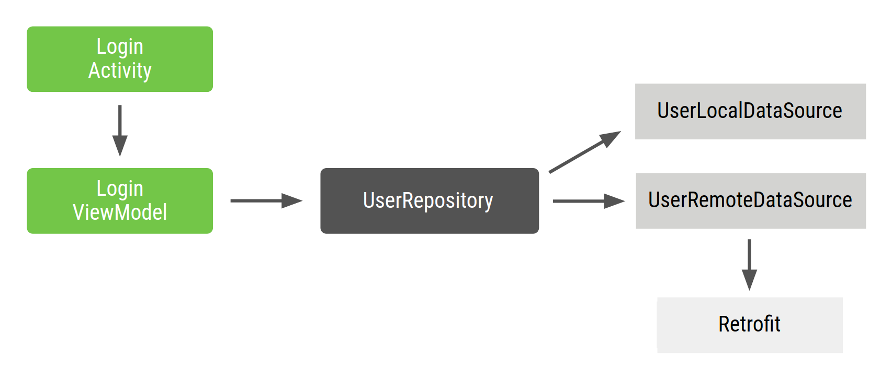

## 一、URI

### 1.概括

URI的全名是`Uniform Resource Identifier`，主要用于区分资源，它包含了URL与URN的概念，主要是用于取代URL和URN的概念。也就是说URI是URL和URN的超集


**tips：一个资源可以拥有多个URI，但是每一个URI只标识对应唯一一个资源，就比如人的银行卡可以有多个，但是每个银行卡对应一个人**


### 2.组成


举个例子:

`https://naonao.com?name=naonao&age=18#page-7`


**Scheme**
Scheme指的就是方案，比如HTTP，HTTPS，FTP等，都是可以使用的，思想不要被这些常用的协议给局限了，我们还可以自定义协议，只要服务器支持即可

Scheme可以是由字母，数字，+，-，.，都是允许的

注意：在Scheme之后，必须使用://把Scheme与后面的部分区分开来


**Query**
query就是查询参数，是一个可选的参数，如有有的话，那么必须要以?开头

我们最常用的形式就是使用key=value，比如上面的例子name=naonao

但Query并不仅仅是支持这种，它是可以支持pchar,/,?等形式

?的话大家都知道，要使用Query查询参数，那么就必须在前面加上?，而pchar是什么呢？这点我们想了解的话，需要去参考RFC中的详细描述


**fragment**

fragment也是可选的，如果有的话，必须以`#`开头

比如上面的示例，`page-7`指向的是一个段落

它所支持的格式跟`Query`所支持的格式一致


**authority**
authority包含了用户名与密码（user infomation），还有主机名（host），以及端口号（port）

像用户名密码这东西，我们现在基本已经不使用这种方式了，因为在URI中明文传输账号密码，实在不安全

现在还在用的，基本上也就是经常使用ftp下载资源时我们才使用

所以我们通常只使用host:port，即主机名+端口号的形式

主机名是不可省略的，因为一但省略，我们就找不到对应的服务器

而端口号我们却可以省略，比如HTTP的默认端口号就是80端口，HTTPS的默认端口号就是443端口


**path**
主机名后面紧跟的就是我们的path

在URI中，path部分必须要以/开头，所以不要把path之前的/误以为是前面authority的结尾

path也分了很多种，分别是path-abempty、path-absolute、path-noscheme、path-rootless、path-empty

- path-abempty
  以/开头的路径或空路径
- path-absolute
  以/开头，但不能以//开头
- path-noscheme
  以非:号开头的路径
- path-rootless
  相对path=noscheme，增加允许以:号开头的路径
- path-empty
  空路径


### 3.URI的编码

在URI里只能使用`ASCII码`

但如果我们的URI里出现了除`ASCII码`以外的内容，或者是出现了URI中的用于标识的字符比如`?` 、`#` 、`/`、 `&`等，那么就会引起URI解析错误，那这时候该怎么办呢？


为了避免这种情况出现，<font color="red">URI引入了编码机制</font>

规则非常的简单粗暴，在ASCII码表内的特殊字符，直接就转换成ASCII码了

<font color="red">对于ASCII码以外的内容，就转换成十六进制的字节，然后在前面加上一个%</font>，例如`空格就被转义成%20`，`?被转译成%3F`

像中文这种，十六进制字节值表示不全，需要UTF-8编码才能表述完整的，就是转成十六进制（UTF-8）的格式，例如闹闹就会被转义成%e9%97%b9%e9%97%b9

因为闹对应的十六进制UTF-8的编码就是E9 97 B9，然后每个字节码前面加上%，就可以得到上述结果了

平时我们在浏览器中的地址栏中输入的URI，就算是输入中文也能正常使用，其实是浏览器在背后帮我们做了转码解码的苦逼活


### 4.URL/URN

#### URL

URL (`Uniform Resource Locator`)（统一资源定位符），它实际上是一个资源标识符，但更具体的，它定位了资源的位置。


#### URN

URN (`Uniform Resource Name`)（统一资源命名），作为特定内容的唯一名称使用的，与当前资源的所在地无关。使用URN，就可以将资源四处迁移，而不用担心迁移后无法访问。(P2P下载中使用的磁力链接是URN的一种实现，它可以持久化的标识一个BT资源，资源分布式的存储在P2P网络中，无需中心服务器用户即可找到并下载它。)


### 5.三者区别

对于下面两个网络地址

> ① ftp://ftp.is.co.za/rfc/rfc1808.txt
>
> ② http://www.cnblogs.com/nods/p/8985322.html#position


- 它们都是URI
- <font color="red">`ftp://ftp.is.co.za/rfc/rfc1808.txt` </font>和 <font color="red">`http://www.cnblogs.com/nods/p/8985322.html `</font> 都是 URL。
- ` ftp.is.co.za/rfc/rfc1808.txt`  和`  www.cnblogs.com/nods/p/8985322.html#position `是URN。


>  对于 ② 来说：
>
>  http:// 是协议 。
>
>  `www.cnblogs.com/nods/p/8985322.html `是网络资源的具体位置。
>
>  \#position 则是资源。


**URI注重唯一标识符**

**URL注重资源的位置**

**URN注重某个位置的资源**

### 6.Android的URI

#### (1)概述

`Android`上可用的每种资源 - 图像、视频片段等都可以用Uri来表示。

#### (2)组成

`[Android]`的Uri由以下三部分组成： "content://"、数据的路径、标示ID(可选)*

*举些例子，如：* 

*所有联系人的Uri： content://contacts/people*

*某个联系人的Uri: content://contacts/people/5*

*所有图片Uri: content://media/external*

*某个图片的Uri：content://media/external/images/media/4*

我们很经常需要解析Uri，并从Uri中获取数据。

#### (3)工具

`[Android]`系统提供了两个用于操作Uri的工具类，分别为**UriMatcher** 和**ContentUris** 

##### 1)UriMatcher

UriMatcher 类主要用于匹配Uri.

使用方法如下。

首先第一步，初始化：

```java
UriMatcher matcher = new UriMatcher(UriMatcher.NO_MATCH); 
```

第二步：注册需要的Uri:

```java
matcher.addURI("com.yfz.Lesson", "people", PEOPLE); 
matcher.addURI("com.yfz.Lesson", "person/#", PEOPLE_ID); 
//第二个参数开始时不需要"/"， 否则是无法匹配成功的。
```


第三步：与已经注册的Uri进行匹配:

```java
Uri uri = Uri.parse("content://" + "com.yfz.Lesson" + "/people");  
int match = matcher.match(uri);  
       switch (match)  
       {  
           case PEOPLE:  
               return "vnd.Android.cursor.dir/people";  
           case PEOPLE_ID:  
               return "vnd.android.cursor.item/people";  
           default:  
               return null;  
       }  
```

```java
Uri uri = Uri.parse("content://" + "com.yfz.Lesson" + "/people");  
int match = matcher.match(uri);  
       switch (match)  
       {  
           case PEOPLE:  
               return "vnd.Android.cursor.dir/people";  
           case PEOPLE_ID:  
               return "vnd.Android.cursor.item/people";  
           default:  
               return null;  
       }  
```


match方法匹配后会返回一个匹配码Code，即在使用注册方法addURI时传入的第三个参数。 

上述方法会返回"vnd.[Android](http://www.linuxidc.com/topicnews.aspx?tid=11).cursor.dir/person". 

总结: 

--常量 UriMatcher.NO_MATCH 表示不匹配任何路径的返回码

--# 号为通配符

--* 号为任意字符 

##### 2)ContentUris

**ContentUris** 类用于获取Uri路径后面的ID部分

1)为路径加上ID: **withAppendedId(uri, id)**

比如有这样一个Uri

```java
Uri uri = Uri.parse("content://com.yfz.Lesson/people")  
```

通过withAppendedId方法，为该Uri加上ID

```java
Uri resultUri = ContentUris.withAppendedId(uri, 10);  
```

>  **最后resultUri为: content://com.yfz.Lesson/people/10**


2)从路径中获取ID: parseId(uri)

```java
Uri uri = Uri.parse("content://com.yfz.Lesson/people/10")  
long personid = ContentUris.parseId(uri);  
```


## 二、设备分辨率

### 1.几个常用概念

#### **屏幕尺寸**

就是我们平常讲的手机屏幕大小，是屏幕的对角线长度，一般讲的大小单位都是英寸。


#### **像素(pixel)**

想像把屏幕放大再放大，看到的那一个个小点或者小方块就是像素了。


#### **分辨率(Resolution)**

是指屏幕上垂直方向和水平方向上的像素个数。

比如iPhone5S的分辨率是`1136`×`640`；*Samsung Note3*的分辨率是`1920`×`1080`；


#### **dpi**

是dot per inch的缩写，就是每英寸的像素数，也叫做*屏幕密度*。这个值越大，屏幕就越清晰。


#### **dip(dp)**

是Density independent pixel的缩写，指的是抽象意义上的像素。跟设备的屏幕密度有关系。

它是Android里的一个单位，dip和dp是一样的。

**其实dp就是为了使得开发者设置的长度能够根据不同屏幕(分辨率/尺寸也就是dpi)获得不同的像素(px)数量**

> 将dp单元转换为屏幕像素很简单：`（dpi/160）px=dp`

就是说在160dpi的屏幕上，1dip=1px。

它跟屏幕密度有关，如果屏幕密度大，1dip代表的px就多，比如在320dpi的屏幕上，1dip=2px。

### 2.为什么安卓布局最后是dp，而不是px？

是因为这个世界上存在着很多不同屏幕密度的手机，屏幕密度是什么？就是dpi，就是单位长度里的像素数量。想象一下，如果这些手机的尺寸一样，屏幕密度相差很大，那么是不是说一个手机水平方向上像素很少，另一个手机水平方向上像素很多？那我们画同样pix数量的时候，它显示的长度不就会不一样了？

比如下面图中的两个手机，同时设置2px长度的Button，在屏幕密度较高的手机里就会显示的比较小。而同时设置的2dip长度的Button，在两个手机上显示的大小是一样的


### 3.获取屏幕分辨率信息

```java
//相当于1dp=多少px
getResources().getDisplayMetrics().density;
//获取屏幕密度dpi
getResources().getDisplayMetrics().densityDpi;
```

#### (1)获取屏幕px

Android自带api方法：TypedValue.applyDimension（）

> **该方法最主要的功能就是将我们所对应的单位的值转换成屏幕上实际显示的像素(px)值**

TypedValue.applyDimension(int unit, float value, DisplayMetrics metrics)

```java
// 获得转换后的px值
float pxDimension = TypedValue.applyDimension(TypedValue.COMPLEX_UNIT_PX,
16,context.getResources().getDisplayMetrics());
```

> applyDimension 源码
>
> ```java
> public static float applyDimension(int unit, float value, DisplayMetricsmetrics) {
>     switch (unit) {
>         case COMPLEX_UNIT_PX: // 转换为px(像素)值
>                 return value;
>         case COMPLEX_UNIT_DIP: // dp转换为px值
>             return value * metrics.density;
>         case COMPLEX_UNIT_SP: // sp转换为px(与刻度无关的像素)值
>             return value * metrics.scaledDensity;
>         case COMPLEX_UNIT_PT: // 转换为pt(磅)值
>             return value * metrics.xdpi * (1.0f / 72);
>         case COMPLEX_UNIT_IN: // 转换为in(英寸)值
>             return value * metrics.xdpi;
>         case COMPLEX_UNIT_MM: // 转换为mm(毫米)值
>             return value * metrics.xdpi * (1.0f / 25.4f);
>     }
>     return 0;
> }
> ```

#### (2)其他转换

```java
//转换dp为px
public static int convertDipToPx(Context context, int dip) {
    float scale = context.getResources().getDisplayMetrics().density;
    return (int) (dip * scale + 0.5f * (dip >= 0 ? 1 : -1));
}
//转换px为dp
public static int convertPxToDip(Context context, int px) {
    float scale = context.getResources().getDisplayMetrics().density;
    return (int) (px / scale + 0.5f * (px >= 0 ? 1 : -1));
}
//转换sp为px
public static int spTopx(Context context, float spValue) {
    float fontScale =
        context.getResources().getDisplayMetrics().scaledDensity;
    return (int) (spValue * fontScale + 0.5f);
}
//转换px为sp
public static int pxTosp(Context context, float pxValue) {
    float fontScale =
        context.getResources().getDisplayMetrics().scaledDensity;
    return (int) (pxValue / fontScale + 0.5f);
}
```


### 4.像素

#### **逻辑像素**

逻辑像素的单位是PT，它是按照内容的尺寸计算的单位。比如iPhone 4的逻辑像素是480x320pt。**逻辑像素又称为CSS像素**

**物理像素**

物理像素的单位就是我们常说的pixel，简写成PX。它是我们在Photoshop和切图中使用的单位，屏幕设计中最小的单位就是1px不可再分割。

**设备像素比**

屏幕像素比（Device Pixel Ratio ，DPR），实际上指的是window.devicePixelRatio ,被所有webkit浏览器以及opera所支持， 它是一个比值，既然是一个比值那他是怎么算出来的呢？其实就是用**物理设备的像素/css像素**。

> 例如：
>
> 假如一个手机的像素是640x960而css像素为320x480，那么它的屏幕像素比为2。


## 三、安卓支持CPU架构

Android系统支持以下七种不用的CPU架构，每一种对应着各自的应用程序二进制接口ABI：(Application Binary Interface)定义了二进制文件(尤其是.so文件)如何运行在相应的系统平台上，从使用的指令集，内存对齐到可用的系统函数库。对应关系如下：

> ARMv5——armeabi
>
> ARMv7 ——armeabi-v7a
>
> ARMv8——arm64- v8a
>
> x86——x86
>
> MIPS ——mips
>
> MIPS64——mips64
>
> x86_64——x86_64


## 四、依赖项注入

> https://developer.android.google.cn/training/dependency-injection?hl=zh-cn

### 1.什么是依赖项注入

`DI( Dependency Injection )`是一种**设计模式**， 其作用是去除Java类之间的依赖关系，实现松耦合，以便于开发测试。

 

**应用场景**

> 例如`Cat`类会用到`Engine`类，这个`Engine`类就称为依赖项，通常可以几种方式实现依赖项注入
>
> -  创建并初始化自己的 `Engine` 实例 
>
>   > ```java
>   > class Car {
>   >     private Engine engine = new Engine();
>   >     public void start() {
>   >         engine.start();
>   >     }
>   > }
>   > 
>   > class MyApp {
>   >     public static void main(String[] args) {
>   >         Car car = new Car();
>   >         car.start();
>   >     }
>   > }
>   > ```
>   >
>   > 
>
> - 从其他地方抓取。某些 Android API（如 `Context` getter 和 `getSystemService()`）的工作原理便是如此。
>
> - (**手动注入**)以参数形式提供。将这些依赖项传入需要各个依赖项的函数。(这种方式好处是可以传入Engine子类，实现解耦)
>
>   > ```java
>   > class Car {
>   > 
>   >     private Engine engine;
>   > 
>   >     Car(Engine engine){
>   >         this.engine = engine;
>   >     }
>   >     public void start() {
>   >         engine.start();
>   >     }
>   > }
>   > 
>   > class MyApp {
>   >     public static void main(String[] args) {
>   >         Car car = new Car(new Engine());
>   >         car.start();
>   >     }
>   > }
>   > ```

上面说的第三个例子就是手动注入依赖项，当依赖项越来越多的情况下，手动注入将变得更繁琐，推荐使用：

- Dagger
- **Hilt**


### 2.手动依赖项注入

下面以登录流程为例，进行手动依赖注入过程解析

>  在介绍典型 Android 应用的登录流程时，`LoginActivity` 依赖于 `LoginViewModel`，而后者又依赖于 `UserRepository`。然后，`UserRepository` 依赖于 `UserLocalDataSource` 和 `UserRemoteDataSource`，而后者又依赖于 `Retrofit`服务。 
>
>   

`LoginActivity`是登录流程的入口，需要创建 `LoginViewModel` 及其所有依赖项。 该流程的Repository和DataSource如下

```java
class UserLocalDataSource {
    public UserLocalDataSource() { }
    ...
}

class UserRemoteDataSource {

    private final Retrofit retrofit;//网络请求工具

    public UserRemoteDataSource(Retrofit retrofit) {
        this.retrofit = retrofit;
    }

    ...
}

class UserRepository {

    private final UserLocalDataSource userLocalDataSource;
    private final UserRemoteDataSource userRemoteDataSource;

    public UserRepository(UserLocalDataSource userLocalDataSource, UserRemoteDataSource userRemoteDataSource) {
        this.userLocalDataSource = userLocalDataSource;
        this.userRemoteDataSource = userRemoteDataSource;
    }

    ...
}
```

 创建自己的依赖项容器类，用于获取依赖项。此容器提供的所有实例可以是公共实例。 

```java
// Container of objects shared across the whole app
public class AppContainer {

    // Since you want to expose userRepository out of the container, you need to satisfy
    // its dependencies as you did before
    private Retrofit retrofit = new Retrofit.Builder()
            .baseUrl("https://example.com")
            .build()
            .create(LoginService.class);

    private UserRemoteDataSource remoteDataSource = new UserRemoteDataSource(retrofit);
    private UserLocalDataSource localDataSource = new UserLocalDataSource();

    // userRepository is not private; it'll be exposed
    public UserRepository userRepository = new UserRepository(localDataSource, remoteDataSource);
}
```

 **由于这些依赖项在整个应用中使用**，因此需要将它们放置在所有 activity 都可以使用的通用位置：`Application`类。

```java
// 自定义Application类必须在menifest文件进行注册声明
public class MyApplication extends Application {
    
    public AppContainer appContainer = new AppContainer();
}
```


### 3.自动依赖项注入


#### Hilt

 Hilt 通过为项目中的每个 Android 类提供容器并自动为您管理其生命周期，定义了一种在应用中执行 DI 的标准方法。 