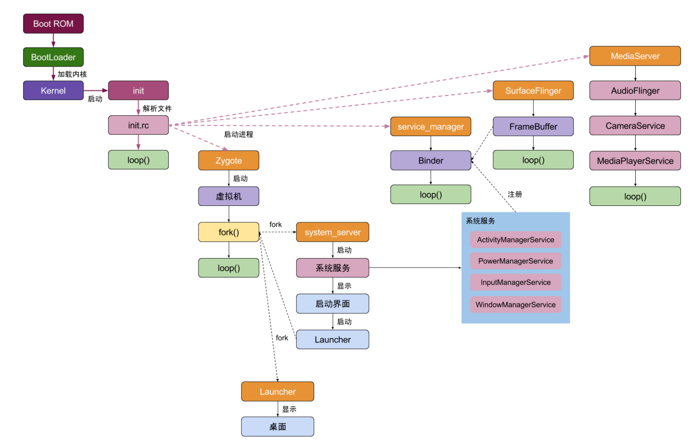
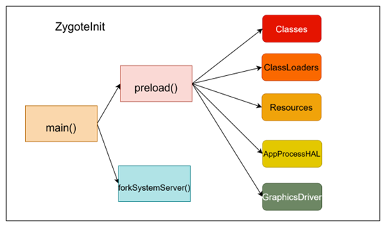

  

# 1.Zygote进程

（1）**Zygote进程是所有的android进程的父进程**，包括SystemServer和**各种应用进程**都是通过Zygote进程fork出来的。**目的是共享预加载的资源和类库，加快应用启动速度。**

（2）**zygote进程又是init进程孵化出来的**

> **进程启动先后顺序：**
>
>  init进程 --> Zygote进程 --> SystemServer进程 -->各种应用进程
>
> - init进程：**linux的根进程**，android系统是基于linux系统的，因此可以算作是整个android操作系统的第一个进程；
> - Zygote进程：**android系统的根进程**，主要作用：可以作用Zygote进程fork出SystemServer进程和各种应用进程；
> - SystemServer进程：主要是在这个进程中启动系统的各项服务，比如ActivityManagerService，PackageManagerService，WindowManagerService服务等等；
> - 各种应用进程：启动自己编写的客户端应用时，一般都是重新启动一个应用进程，有自己的虚拟机与运行环境；

## 1.1 zygote进程启动流程

> 源码位置—— `frameworks/base/core/java/com/android/internal/os/ZygoteInit.java `

> **基于Android API 29**

### ZygoteInit类的main方法

init进程在启动Zygote进程时一般都会调用ZygoteInit类的main方法，该方法的具体实现包括：

- 调用`enableDdms()`，设置DDMS可用。

  >  **DDMS**（Dalvik Debug Monitor Server）是 Android 开发工具包（SDK）中的一个调试工具，主要用于监控和调试运行在设备或模拟器上的 Android 应用程序。 

- 然后调用preload方法实现预加载各种资源

- 然后通过调用forkSystemServer使用fork系统调用，fork出SystemServer

- 注册并启动socket

```java
public static void main(String argv[]) {
    ZygoteServer zygoteServer = null;

    // 防止在Zygote初始化期间创建新线程（保证进程纯净性）
    ZygoteHooks.startZygoteNoThreadCreation();

    // 设置Zygote进程组ID（进程控制相关）
    try {
        Os.setpgid(0, 0); // 将当前进程设置为新的进程组leader
    } catch (ErrnoException ex) {
        throw new RuntimeException("Failed to setpgid(0,0)", ex);
    }

    Runnable caller;
    try {
        // 记录启动指标（仅首次启动时）
        if (!"1".equals(SystemProperties.get("sys.boot_completed"))) {
            MetricsLogger.histogram(null, "boot_zygote_init",
                                    (int) SystemClock.elapsedRealtime());
        }

        // 根据CPU架构选择性能追踪标签
        String bootTimeTag = Process.is64Bit() ? "Zygote64Timing" : "Zygote32Timing";
        TimingsTraceLog bootTimingsTraceLog = new TimingsTraceLog(bootTimeTag,
                                                                  Trace.TRACE_TAG_DALVIK);
        bootTimingsTraceLog.traceBegin("ZygoteInit"); // 开始记录Zygote初始化耗时

        RuntimeInit.enableDdms(); // 启用DDMS调试支持

        // 解析命令行参数
        boolean startSystemServer = false;    // 是否启动system_server（系统服务主进程）
        String zygoteSocketName = "zygote";   // 默认socket名称
        String abiList = null;                // CPU架构列表（如arm64-v8a,armeabi-v7a）
        boolean enableLazyPreload = false;    // 是否延迟预加载资源
        for (int i = 1; i < argv.length; i++) { // 遍历启动参数
            if ("start-system-server".equals(argv[i])) {
                startSystemServer = true;     // 标记需要启动系统服务
            } else if ("--enable-lazy-preload".equals(argv[i])) {
                enableLazyPreload = true;     // 启用延迟预加载模式
            } else if (argv[i].startsWith(ABI_LIST_ARG)) { // 解析ABI列表
                abiList = argv[i].substring(ABI_LIST_ARG.length());
            } else if (argv[i].startsWith(SOCKET_NAME_ARG)) { // 获取socket名称
                zygoteSocketName = argv[i].substring(SOCKET_NAME_ARG.length());
            } else {
                throw new RuntimeException("Unknown command line argument: " + argv[i]);
            }
        }

        // 判断是否是主Zygote进程（可能存在多个Zygote进程）
        final boolean isPrimaryZygote = zygoteSocketName.equals(Zygote.PRIMARY_SOCKET_NAME);

        // 预加载公共资源（类、资源、库等）
        if (!enableLazyPreload) { // 非延迟模式立即预加载
            bootTimingsTraceLog.traceBegin("ZygotePreload");
            EventLog.writeEvent(LOG_BOOT_PROGRESS_PRELOAD_START,
                                SystemClock.uptimeMillis());
            preload(bootTimingsTraceLog); // （1）核心预加载方法（耗时操作）
            EventLog.writeEvent(LOG_BOOT_PROGRESS_PRELOAD_END,
                                SystemClock.uptimeMillis());
            bootTimingsTraceLog.traceEnd(); 
        } else { // 延迟模式则调整优先级
            Zygote.resetNicePriority();
        }

        // 执行GC清理初始化阶段产生的临时对象
        bootTimingsTraceLog.traceBegin("PostZygoteInitGC");
        gcAndFinalize(); // 触发Full GC和Finalization
        bootTimingsTraceLog.traceEnd(); 

        bootTimingsTraceLog.traceEnd(); // 结束ZygoteInit追踪
        Trace.setTracingEnabled(false, 0); // 关闭追踪避免子进程继承

        Zygote.initNativeState(isPrimaryZygote); // 初始化Native层状态
        ZygoteHooks.stopZygoteNoThreadCreation(); // 允许创建线程

        zygoteServer = new ZygoteServer(isPrimaryZygote); // 创建Socket服务端

        // 孵化system_server进程（系统服务核心）
        if (startSystemServer) {
            Runnable r = forkSystemServer(abiList, zygoteSocketName, zygoteServer);
            if (r != null) { // 仅在子进程（system_server）返回Runnable对象
                r.run();    // 进入SystemServer的main()方法
                return;     // 子进程在此返回，不再继续执行Zygote逻辑
            }
        }

        Log.i(TAG, "Accepting command socket connections");
        // 进入主循环，监听Socket请求（接受应用启动请求）
        caller = zygoteServer.runSelectLoop(abiList);
    } catch (Throwable ex) {
        Log.e(TAG, "System zygote died with exception", ex);
        throw ex;
    } finally {
        if (zygoteServer != null) {
            zygoteServer.closeServerSocket(); // 确保关闭Socket
        }
    }

    // 处理来自客户端的命令（fork出的子进程执行流程）
    if (caller != null) {
        caller.run(); // 执行子进程目标代码（如启动新APP）
    }
}
```

#### **（1）preload**

```java
static void preload(TimingsTraceLog bootTimingsTraceLog) {
    Log.d(TAG, "begin preload");
    //1
    bootTimingsTraceLog.traceBegin("BeginPreload");
    beginPreload();
    bootTimingsTraceLog.traceEnd(); // BeginPreload
    //2
    bootTimingsTraceLog.traceBegin("PreloadClasses");
    preloadClasses();
    bootTimingsTraceLog.traceEnd(); // PreloadClasses
    //3
    bootTimingsTraceLog.traceBegin("CacheNonBootClasspathClassLoaders");
    cacheNonBootClasspathClassLoaders();
    bootTimingsTraceLog.traceEnd(); // CacheNonBootClasspathClassLoaders
    //4
    bootTimingsTraceLog.traceBegin("PreloadResources");
    preloadResources();
    bootTimingsTraceLog.traceEnd(); // PreloadResources
    //5
    Trace.traceBegin(Trace.TRACE_TAG_DALVIK, "PreloadAppProcessHALs");
    nativePreloadAppProcessHALs();
    Trace.traceEnd(Trace.TRACE_TAG_DALVIK);
    //6
    Trace.traceBegin(Trace.TRACE_TAG_DALVIK, "PreloadGraphicsDriver");
    maybePreloadGraphicsDriver();
    Trace.traceEnd(Trace.TRACE_TAG_DALVIK);
    //7
    preloadSharedLibraries();
    //8
    preloadTextResources();
    // Ask the WebViewFactory to do any initialization that must run in the zygote process,
    // for memory sharing purposes.
    WebViewFactory.prepareWebViewInZygote();
    
    endPreload();
    warmUpJcaProviders();
    Log.d(TAG, "end preload");

    sPreloadComplete = true;
}
```

> - preloadClasses()用于初始化Zygote中需要的class类；
> - preloadResources()用于初始化系统资源；
> - nativePreloadAppProcessHALs();
> - maybePreloadGraphicsDriver();
> - preloadSharedLibraries()用于初始化系统libraries；
> - preloadTextResources()用于初始化文字资源；
> - prepareWebViewInZygote()用于初始化webview;


#### （2）forkSystemServer

```java
private static Runnable forkSystemServer(String abiList, String socketName,
                                         ZygoteServer zygoteServer) {
    // 获取系统服务进程所需的权限
    long capabilities = posixCapabilitiesAsBits(
        OsConstants.CAP_IPC_LOCK,
        OsConstants.CAP_KILL,
        OsConstants.CAP_NET_ADMIN,
        OsConstants.CAP_NET_BIND_SERVICE,
        OsConstants.CAP_NET_BROADCAST,
        OsConstants.CAP_NET_RAW,
        OsConstants.CAP_SYS_MODULE,
        OsConstants.CAP_SYS_NICE,
        OsConstants.CAP_SYS_PTRACE,
        OsConstants.CAP_SYS_TIME,
        OsConstants.CAP_SYS_TTY_CONFIG,
        OsConstants.CAP_WAKE_ALARM,
        OsConstants.CAP_BLOCK_SUSPEND
    );
    /* Containers run without some capabilities, so drop any caps that are not available. */
    // 获取当前进程的权限
    StructCapUserHeader header = new StructCapUserHeader(
        OsConstants._LINUX_CAPABILITY_VERSION_3, 0);
    StructCapUserData[] data;
    try {
        data = Os.capget(header);
    } catch (ErrnoException ex) {
        throw new RuntimeException("Failed to capget()", ex);
    }
    // 将当前进程的权限与系统服务进程所需的权限进行与运算，得到系统服务进程的权限
    capabilities &= ((long) data[0].effective) | (((long) data[1].effective) << 32);

    /* 定义了一个字符串数组args，其中包含了启动系统服务器所需的命令行参数，如设置UID、GID、组ID、权限、进程名称等。 */
    String args[] = {
        "--setuid=1000",
        "--setgid=1000",
        "--setgroups=1001,1002,1003,1004,1005,1006,1007,1008,1009,1010,1018,1021,1023,"
            + "1024,1032,1065,3001,3002,3003,3006,3007,3009,3010",
        "--capabilities=" + capabilities + "," + capabilities,
        "--nice-name=system_server",
        "--runtime-args",
        "--target-sdk-version=" + VMRuntime.SDK_VERSION_CUR_DEVELOPMENT,
        "com.android.server.SystemServer",
    };
    ZygoteArguments parsedArgs = null;

    int pid;

    try {
        //解析命令行参数，并设置调试和系统调用属性
        parsedArgs = new ZygoteArguments(args);
        Zygote.applyDebuggerSystemProperty(parsedArgs);
        Zygote.applyInvokeWithSystemProperty(parsedArgs);

        boolean profileSystemServer = SystemProperties.getBoolean(
            "dalvik.vm.profilesystemserver", false);
        if (profileSystemServer) {
            parsedArgs.mRuntimeFlags |= Zygote.PROFILE_SYSTEM_SERVER;
        }

        /* Request to fork the system server process */
        pid = Zygote.forkSystemServer(
            parsedArgs.mUid, parsedArgs.mGid,
            parsedArgs.mGids,
            parsedArgs.mRuntimeFlags,
            null,
            parsedArgs.mPermittedCapabilities,
            parsedArgs.mEffectiveCapabilities);
    } catch (IllegalArgumentException ex) {
        throw new RuntimeException(ex);
    }

    /* 如果返回的PID为0，表示当前进程是子进程（即系统服务器进程） */
    if (pid == 0) {
        if (hasSecondZygote(abiList)) {
            waitForSecondaryZygote(socketName);
        }

        zygoteServer.closeServerSocket();
        return handleSystemServerProcess(parsedArgs);
    }

    return null;
}
```

1. **权限设置**：
   - 使用`posixCapabilitiesAsBits`方法将一组POSIX权限（如`CAP_IPC_LOCK`、`CAP_KILL`等）转换为位掩码。
   - 使用`Os.capget`方法获取当前进程的有效权限，并与之前计算的权限位掩码进行按位与操作，确保只保留当前进程实际拥有的权限。
2. **命令行参数**：
   - 定义了一个字符串数组`args`，其中包含了启动系统服务器所需的命令行参数，如设置UID、GID、组ID、权限、进程名称等。
3. **解析参数**：
   - 使用`ZygoteArguments`类解析命令行参数，并设置调试和系统调用属性。
4. **启动系统服务器进程**：
   - 调用`Zygote.forkSystemServer`方法创建系统服务器进程。如果返回的PID为0，表示当前进程是子进程（即系统服务器进程），则调用`handleSystemServerProcess`方法处理系统服务器进程的后续操作。

> **上述代码会fork一个SystemServer进程， handleSystemServerProcess目的是在Android系统中启动系统服务进程，并设置相应的环境，包括类路径、进程名称和文件权限等。 最终返回一个Runnable对象。**
>
> **这个Runnable对象的run方法会调用SystemServer的main方法**
>
> ```java
> static class MethodAndArgsCaller implements Runnable {
>     /** method to call */
>     private final Method mMethod;
> 
>     /** argument array */
>     private final String[] mArgs;
> 
>     public MethodAndArgsCaller(Method method, String[] args) {
>         mMethod = method;//main方法
>         mArgs = args;
>     }
> 
>     public void run() {
>         try {
>             mMethod.invoke(null, new Object[] { mArgs });//调用main
>         } ....
>     }
> }
> ```


### 总结



# 2.SystemServer进程

**SystemServer进程主要的作用是在这个进程中启动各种系统服务**，比如ActivityManagerService，PackageManagerService，WindowManagerService服务，以及各种系统性的服务其实都是在SystemServer进程中启动的，而当我们的应用需要使用各种系统服务的时候其实也是通过与SystemServer进程通讯获取各种服务对象的句柄的。

## 2.1SystemServer进程启动流程

> `frameworks/base/services/java/com/android/server/SystemServer.java`

```java
//main方法new一个实例，然后调用run
public static void main(String[] args) {
    new SystemServer().run();
}

private void run() {
    try {
        traceBeginAndSlog("InitBeforeStartServices");

        // Record the process start information in sys props.
        SystemProperties.set(SYSPROP_START_COUNT, String.valueOf(mStartCount));
        SystemProperties.set(SYSPROP_START_ELAPSED, String.valueOf(mRuntimeStartElapsedTime));
        SystemProperties.set(SYSPROP_START_UPTIME, String.valueOf(mRuntimeStartUptime));

        EventLog.writeEvent(EventLogTags.SYSTEM_SERVER_START,
                            mStartCount, mRuntimeStartUptime, mRuntimeStartElapsedTime);

        // If a device's clock is before 1970 (before 0), a lot of
        // APIs crash dealing with negative numbers, notably
        // java.io.File#setLastModified, so instead we fake it and
        // hope that time from cell towers or NTP fixes it shortly.
        if (System.currentTimeMillis() < EARLIEST_SUPPORTED_TIME) {
            Slog.w(TAG, "System clock is before 1970; setting to 1970.");
            SystemClock.setCurrentTimeMillis(EARLIEST_SUPPORTED_TIME);
        }

        //
        // Default the timezone property to GMT if not set.
        //
        String timezoneProperty = SystemProperties.get("persist.sys.timezone");
        if (timezoneProperty == null || timezoneProperty.isEmpty()) {
            Slog.w(TAG, "Timezone not set; setting to GMT.");
            SystemProperties.set("persist.sys.timezone", "GMT");
        }

        // If the system has "persist.sys.language" and friends set, replace them with
        // "persist.sys.locale". Note that the default locale at this point is calculated
        // using the "-Duser.locale" command line flag. That flag is usually populated by
        // AndroidRuntime using the same set of system properties, but only the system_server
        // and system apps are allowed to set them.
        //
        // NOTE: Most changes made here will need an equivalent change to
        // core/jni/AndroidRuntime.cpp
        if (!SystemProperties.get("persist.sys.language").isEmpty()) {
            final String languageTag = Locale.getDefault().toLanguageTag();

            SystemProperties.set("persist.sys.locale", languageTag);
            SystemProperties.set("persist.sys.language", "");
            SystemProperties.set("persist.sys.country", "");
            SystemProperties.set("persist.sys.localevar", "");
        }

        // The system server should never make non-oneway calls
        Binder.setWarnOnBlocking(true);
        // The system server should always load safe labels
        PackageItemInfo.forceSafeLabels();

        // Default to FULL within the system server.
        SQLiteGlobal.sDefaultSyncMode = SQLiteGlobal.SYNC_MODE_FULL;

        // Deactivate SQLiteCompatibilityWalFlags until settings provider is initialized
        SQLiteCompatibilityWalFlags.init(null);

        // Here we go!
        Slog.i(TAG, "Entered the Android system server!");
        int uptimeMillis = (int) SystemClock.elapsedRealtime();
        EventLog.writeEvent(EventLogTags.BOOT_PROGRESS_SYSTEM_RUN, uptimeMillis);
        if (!mRuntimeRestart) {
            MetricsLogger.histogram(null, "boot_system_server_init", uptimeMillis);
        }

        // In case the runtime switched since last boot (such as when
        // the old runtime was removed in an OTA), set the system
        // property so that it is in sync. We can | xq oqi't do this in
        // libnativehelper's JniInvocation::Init code where we already
        // had to fallback to a different runtime because it is
        // running as root and we need to be the system user to set
        // the property. http://b/11463182
        SystemProperties.set("persist.sys.dalvik.vm.lib.2", VMRuntime.getRuntime().vmLibrary());

        // Mmmmmm... more memory!
        VMRuntime.getRuntime().clearGrowthLimit();

        // The system server has to run all of the time, so it needs to be
        // as efficient as possible with its memory usage.
        VMRuntime.getRuntime().setTargetHeapUtilization(0.8f);

        // Some devices rely on runtime fingerprint generation, so make sure
        // we've defined it before booting further.
        Build.ensureFingerprintProperty();

        // Within the system server, it is an error to access Environment paths without
        // explicitly specifying a user.
        Environment.setUserRequired(true);

        // Within the system server, any incoming Bundles should be defused
        // to avoid throwing BadParcelableException.
        BaseBundle.setShouldDefuse(true);

        // Within the system server, when parceling exceptions, include the stack trace
        Parcel.setStackTraceParceling(true);

        // Ensure binder calls into the system always run at foreground priority.
        BinderInternal.disableBackgroundScheduling(true);

        // Increase the number of binder threads in system_server
        BinderInternal.setMaxThreads(sMaxBinderThreads);

        // Prepare the main looper thread (this thread).
        android.os.Process.setThreadPriority(
            android.os.Process.THREAD_PRIORITY_FOREGROUND);
        android.os.Process.setCanSelfBackground(false);
        Looper.prepareMainLooper();
        Looper.getMainLooper().setSlowLogThresholdMs(
            SLOW_DISPATCH_THRESHOLD_MS, SLOW_DELIVERY_THRESHOLD_MS);

        // Initialize native services.
        System.loadLibrary("android_servers");

        // Debug builds - allow heap profiling.
        if (Build.IS_DEBUGGABLE) {
            initZygoteChildHeapProfiling();
        }

        // Check whether we failed to shut down last time we tried.
        // This call may not return.
        performPendingShutdown();
   
        // 2.1.1.
        createSystemContext();

        //2.1.2
        mSystemServiceManager = new SystemServiceManager(mSystemContext);
        mSystemServiceManager.setStartInfo(mRuntimeRestart,
                                           mRuntimeStartElapsedTime, mRuntimeStartUptime);
        LocalServices.addService(SystemServiceManager.class, mSystemServiceManager);
        // Prepare the thread pool for init tasks that can be parallelized
        SystemServerInitThreadPool.get();
    } finally {
        traceEnd();  // InitBeforeStartServices
    }

    //2.1.3
    try {
        traceBeginAndSlog("StartServices");
        startBootstrapServices();
        startCoreServices();
        startOtherServices();
        SystemServerInitThreadPool.shutdown();
    } catch (Throwable ex) {
        Slog.e("System", "******************************************");
        Slog.e("System", "************ Failure starting system services", ex);
        throw ex;
    } finally {
        traceEnd();
    }

    StrictMode.initVmDefaults(null);

    if (!mRuntimeRestart && !isFirstBootOrUpgrade()) {
        int uptimeMillis = (int) SystemClock.elapsedRealtime();
        MetricsLogger.histogram(null, "boot_system_server_ready", uptimeMillis);
        final int MAX_UPTIME_MILLIS = 60 * 1000;
        if (uptimeMillis > MAX_UPTIME_MILLIS) {
            Slog.wtf(SYSTEM_SERVER_TIMING_TAG,
                     "SystemServer init took too long. uptimeMillis=" + uptimeMillis);
        }
    }

    // Diagnostic to ensure that the system is in a base healthy state. Done here as a common
    // non-zygote process.
    if (!VMRuntime.hasBootImageSpaces()) {
        Slog.wtf(TAG, "Runtime is not running with a boot image!");
    }

    // Loop forever.
    Looper.loop();
    throw new RuntimeException("Main thread loop unexpectedly exited");
}
```

> 里面主要初始化SystemServer并启动：
>
> - 这段代码是Android系统服务器启动过程中的一部分，涉及到系统服务的初始化和启动。
> - 在系统服务启动过程中，需要设置一些系统属性、检查系统时钟、处理语言和区域设置、设置Binder调用等。
> - 系统服务启动过程中，需要启动一系列的服务，如引导服务、核心服务和其他服务。
> - 在系统服务启动完成后，主线程会进入循环，等待事件。如果主线程循环意外退出，会抛出运行时异常。


### **2.1.1createSystemContext();**

 在SystemServer进程中也存在着Context对象，并且是通过ActivityThread.systemMain方法创建context的 

```java
private void createSystemContext() {
    // 获取ActivityThread实例
    ActivityThread activityThread = ActivityThread.systemMain();
    // 获取系统上下文
    mSystemContext = activityThread.getSystemContext();
    // 设置系统上下文的主题
    mSystemContext.setTheme(DEFAULT_SYSTEM_THEME);

    // 获取系统UI上下文
    final Context systemUiContext = activityThread.getSystemUiContext();
    // 设置系统UI上下文的主题
    systemUiContext.setTheme(DEFAULT_SYSTEM_THEME);
}
```


### 2.1.2SystemServiceManager的创建

SystemServer进程主要是用来构建系统各种service服务的，而SystemServiceManager就是这些服务的管理对象，这里创建一个SystemServiceManager，并放进一个数据结构

```java
mSystemServiceManager = new SystemServiceManager(mSystemContext);
mSystemServiceManager.setStartInfo(mRuntimeRestart,
                                   mRuntimeStartElapsedTime, mRuntimeStartUptime);
LocalServices.addService(SystemServiceManager.class, mSystemServiceManager);
```

### 2.1.3启动服务

```java
try {
    traceBeginAndSlog("StartServices");
    startBootstrapServices();// 主要用于启动系统Boot级服务
    startCoreServices();//主要用于启动系统核心的服务
    startOtherServices();//主要用于启动一些非紧要或者是非需要及时启动的服务
    SystemServerInitThreadPool.shutdown();
}
```


#### startBootstrapServices()

改方法负责启动一系列系统服务，包括ActivityManagerService、PackageManagerService。

```java
private void startBootstrapServices() {
    // Start the watchdog as early as possible so we can crash the system server
    // if we deadlock during early boot
    traceBeginAndSlog("StartWatchdog");
    final Watchdog watchdog = Watchdog.getInstance();
    watchdog.start();
    traceEnd();

    traceBeginAndSlog("StartInstaller"); //  开始跟踪并记录日志
    Installer installer = mSystemServiceManager.startService(Installer.class); //  启动Installer服务
    traceEnd(); //  结束跟踪

    traceBeginAndSlog("DeviceIdentifiersPolicyService");
    mSystemServiceManager.startService(DeviceIdentifiersPolicyService.class);
    traceEnd();

    traceBeginAndSlog("UriGrantsManagerService");
    mSystemServiceManager.startService(UriGrantsManagerService.Lifecycle.class);
    traceEnd();


    // Activity manager runs the show.
    traceBeginAndSlog("StartActivityManager");
    // TODO: Might need to move after migration to WM.
    ActivityTaskManagerService atm = mSystemServiceManager.startService(
        ActivityTaskManagerService.Lifecycle.class).getService();
    mActivityManagerService = ActivityManagerService.Lifecycle.startService(
        mSystemServiceManager, atm);
    mActivityManagerService.setSystemServiceManager(mSystemServiceManager);
    mActivityManagerService.setInstaller(installer);
    mWindowManagerGlobalLock = atm.getGlobalLock();
    traceEnd();

    ...
    
    traceBeginAndSlog("StartPowerManager");
    mPowerManagerService = mSystemServiceManager.startService(PowerManagerService.class);
    traceEnd();
    
    ...
        
    traceBeginAndSlog("StartPackageManagerService");
    try {
        Watchdog.getInstance().pauseWatchingCurrentThread("packagemanagermain");
        //调用main
        mPackageManagerService = PackageManagerService.main(mSystemContext, installer,
                                                            mFactoryTestMode != FactoryTest.FACTORY_TEST_OFF, mOnlyCore);
    } finally {
        Watchdog.getInstance().resumeWatchingCurrentThread("packagemanagermain");
    }
    mFirstBoot = mPackageManagerService.isFirstBoot();
    mPackageManager = mSystemContext.getPackageManager();
    traceEnd();
    
    ...
}
```

**首先执行：**

```java
Installer installer = mSystemServiceManager.startService(Installer.class); //  启动Installer服务
```

> Installer是系统安装apk时的一个服务类，继承SystemService（系统服务的一个抽象接口），需要在启动完成Installer服务之后才能启动其他的系统服务。
>
> <a name=Installer的onStart>**从Android8开始Installer将installd的通信方式从socket迁移到Binder**</a>
>
> > `frameworks/base/services/core/java/com/android/server/pm/Installer.java`
> >
> > ```java
> > //Installer.java
> > public void onStart() {
> >     if (mIsolated) {
> >         mInstalld = null;
> >     } else {
> >         connect();
> >     }
> > }
> > 
> > // 连接installd服务
> > private void connect() {
> >     // 获取installd服务的IBinder对象
> >     IBinder binder = ServiceManager.getService("installd");
> >     // 如果IBinder对象不为空
> >     if (binder != null) {
> >         try {
> >             // 绑定DeathRecipient对象，当installd服务死亡时，调用binderDied方法
> >             binder.linkToDeath(new DeathRecipient() {
> >                 @Override
> >                 public void binderDied() {
> >                     Slog.w(TAG, "installd died; reconnecting");
> >                     // 重新连接installd服务
> >                     connect();
> >                 }
> >             }, 0);
> >         } catch (RemoteException e) {
> >             // 如果发生RemoteException异常，将IBinder对象置为空
> >             binder = null;
> >         }
> >     }
> > 
> >     // 如果IBinder对象不为空
> >     if (binder != null) {
> >         // 将IBinder对象转换为IInstalld接口对象
> >         mInstalld = IInstalld.Stub.asInterface(binder);
> >         try {
> >             // 使挂载点失效
> >             invalidateMounts();
> >         } catch (InstallerException ignored) {
> >         }
> >     } else {
> >         // 如果IBinder对象为空，打印日志，并延迟1秒后重新连接installd服务
> >         Slog.w(TAG, "installd not found; trying again");
> >         BackgroundThread.getHandler().postDelayed(() -> {
> >             connect();
> >         }, DateUtils.SECOND_IN_MILLIS);
> >     }
> > }
> > ```

**查看startService方法**

> `frameworks/base/services/core/java/com/android/server/SystemServiceManager.java`

```java
public <T extends SystemService> T startService(Class<T> serviceClass) {
    try {
        final String name = serviceClass.getName();
        Slog.i(TAG, "Starting " + name);
        Trace.traceBegin(Trace.TRACE_TAG_SYSTEM_SERVER, "StartService " + name);

        // Create the service.
        if (!SystemService.class.isAssignableFrom(serviceClass)) {
            throw new RuntimeException("Failed to create " + name
                                       + ": service must extend " + SystemService.class.getName());
        }
        final T service;
        try {
            Constructor<T> constructor = serviceClass.getConstructor(Context.class);
            service = constructor.newInstance(mContext);
        } catch (InstantiationException ex) {
            ....
        }
        startService(service);
        return service;
    } finally {
        Trace.traceEnd(Trace.TRACE_TAG_SYSTEM_SERVER);
    }
}

public void startService(@NonNull final SystemService service) {
    // Register it.
    mServices.add(service);
    // Start it.
    long time = SystemClock.elapsedRealtime();
    try {
        service.onStart();//调用service的onStart方法
    } catch (RuntimeException ex) {
        throw new RuntimeException("Failed to start service " + service.getClass().getName()
                                   + ": onStart threw an exception", ex);
    }
    warnIfTooLong(SystemClock.elapsedRealtime() - time, service, "onStart");
}
```

通过反射构造器创建服务类，然后添加进SystemServiceManager的服务列表数据中，最后调用重载的startService，在其中会调用service的onStart方法。（[Installer的onStart如上](#Installer的onStart)）


**特别的看一下packageManagerService**

> `/framework/base/services/core/java/com/android/server/pm/PackageManagerService.java`

- 可以看到PackageManagerService服务的启动方式与其他服务的启动方式有一些区别，直接调用了PackageManagerService的静态main方法

```java
mPackageManagerService = PackageManagerService.main(mSystemContext, installer,
                                                    mFactoryTestMode != FactoryTest.FACTORY_TEST_OFF, mOnlyCore);
mFirstBoot = mPackageManagerService.isFirstBoot();
mPackageManager = mSystemContext.getPackageManager();
```

```java
public static PackageManagerService main(Context context, Installer installer,
                                         boolean factoryTest, boolean onlyCore) {
    // Self-check for initial settings.
    PackageManagerServiceCompilerMapping.checkProperties();

    PackageManagerService m = new PackageManagerService(context, installer,
                                                        factoryTest, onlyCore);
    m.enableSystemUserPackages();
    ServiceManager.addService("package", m);
    return m;
}
```

> 直接使用new的方式创建了一个PackageManagerService对象，并在其构造方法中初始化相关变量，最后调用了ServiceManager.addService方法，主要是通过Binder机制与JNI层交互 