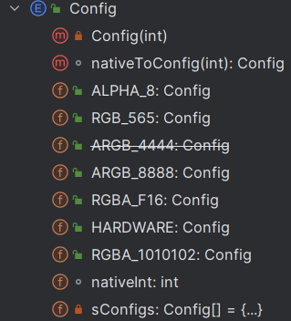
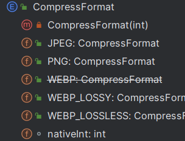
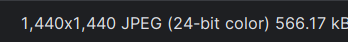
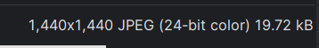

主要介绍Bitmap、Android中图片操作、以及bitmap使用优化

> 参考文档：
>
> [Bitmap介绍](https://www.jianshu.com/p/eef3daeeecbc)

## 一、Bitmap

在Android开发中，`Bitmap` 是一个表示位图图像的类。它是 `android.graphics` 包的一部分，用于处理和操作图像数据。`Bitmap` 类提供了一系列方法，用于创建、绘制、修改和保存图像。 

### 1.创建

Android提供了两种创建BitMap的方式：

-  Bitmap 的静态方法 createBitmap(XX) 
-  BitmapFactory 的 decodeXX 系列静态方法 


### 2.颜色配置信息和压缩信息

Bitmap 中有两个内部枚举类：Config 和 CompressFormat，

Config 是用来设置**颜色配置信息**的，CompressFormat 是用来设置**压缩方式**的 





#### (1)Bitmap.config

位图配置描述了像素的存储方式。它会影响质量（颜色深度）以及显示透明/半透明颜色的能力

| 颜色格式          | 描述                                                         | 每像素占用内存大小                          |
| ----------------- | ------------------------------------------------------------ | ------------------------------------------- |
| ALPHA_8           | 颜色信息只由透明度组成                                       | 8 位，即 1 字节                             |
| RGB_565           | 颜色信息由R（Red），G（Green），B（Blue）三部分组成，R占5位，G占6位，B占5位，总共占16位 | 16位，2Byte                                 |
| ARGB_8888（默认） | 颜色信息由透明度、R、G、B三部分。各占8bit                    | 32位，4字节                                 |
| RGBA_F16          | 颜色信息由透明度、R、G、B三部分，每个通道（RGB 和 alpha 表示半透明）都存储为半精度浮点值。 | 8 字节。此配置特别适用于广色域和 HDR 内容。 |

**注意：**

- 图片占用内存的大小与图片的颜色格式相关， `占用内存的大小 = 图片的宽度 × 图片的高度 × 每个像素占用的内存大小`

-  做性能优化或者防止 OOM 的时候，可以将 Bitamp 的颜色配置该为 RGB_565 ，它的占用内存大小是 ARGB_8888的一半 

  ```kotlin
    val options = BitmapFactory.Options()
    options.inPreferredConfig = Bitmap.Config.RGB_565  // 设置bitmap的颜色格式
    val bitmap = BitmapFactory.decodeResource(resources, R.drawable.pic, options)
  ```


#### (2)Bitmap.CompressFormat

可以指定Bitmap以什么方式压缩

| 压缩格式      | 描述                                                         |
| ------------- | ------------------------------------------------------------ |
| JPEG          | 表示以JPEG压缩算法进行图像压缩，压缩后的格式可以是".jpg"或者".jpeg"，是一种**有损压缩** |
| PNG           | 表示以PNG压缩算法进行图像压缩，压缩后的格式可以是".png"，是一种**无损压缩** |
| WEBP          | 表示以WebP压缩算法进行图像压缩，压缩后的格式可以是".webp"，是一种有损压缩，质量相同的情况下，WebP格式图像的体积要比JPEG格式图像小40%。美中不足的是，WebP格式图像的编码时间“比JPEG格式图像长8倍” |
| WEBP_LOSSY    | 压缩为 WEBP 有损格式。质量为 0 表示压缩最小尺寸。100 表示压缩以获得最大视觉质量。 |
| WEBP_LOSSLESS | 压缩为 WEBP 无损格式。质量为 0 表示快速压缩，从而产生相对较大的文件大小。100 表示花费更多时间压缩，从而产生更小的文件。 |

<a name=bitmaptobyte>示例：</a>

调用`bitmap.compress`方法进行压缩，包含三个参数：压缩格式、压缩质量(1-100)、压缩后输出

> 注意，该方法耗时操作，不能再主线程调用

```kotlin
fun bitmapToByteArray(bitmap: Bitmap): ByteArray {
    val baos = ByteArrayOutputStream()
    Thread {
        bitmap.compress(Bitmap.CompressFormat.PNG, 100, byteArray)
    }
    return baos.toByteArray()
}
```


### 3.保存与转换

#### [Bitmap转换为Byte数组](#bitmaptobyte)


#### Bitmap转换为文件

```kotlin
fun bitmapToFile(bitmap: Bitmap, file: File): Boolean {
    val baos = ByteArrayOutputStream()
    val fileOutputStream = FileOutputStream(file)

    return try {
        bitmap.compress(Bitmap.CompressFormat.JPEG, 100, baos)
        fileOutputStream.write(baos.toByteArray())
        true
    } catch (e: Exception) {
        e.printStackTrace()
        false
    } finally {
        baos.close()
        fileOutputStream.close()
    }
}
```


#### Bitmap与drawable互转

**drawable to bitmap**

**有三种方式：**

- drawable文件画在canvas上面，然后通过canvas渲染到bitmap上
- 将图片资源转换为DrawableBitmap然后通过drawableBitmap的getBitmap方法转换为bitmap

```java
//画在canvas上，然后渲染到bitmap上
public Bitmap drawable2bitmap(Drawable drawable) {
    //创建一个与Drawable大小相同的Bitmap
    Bitmap bitmap = Bitmap.createBitmap(drawable.getIntrinsicWidth(), drawable.getIntrinsicHeight(),
                                        drawable.getOpacity() != PixelFormat.OPAQUE ? Bitmap.Config.ARGB_8888 : Bitmap.Config.RGB_565);

    Canvas canvas = new Canvas(bitmap);

    //设置Drawable的绘制边界为Bitmap的全尺寸
    drawable.setBounds(0, 0, drawable.getIntrinsicWidth(), drawable.getIntrinsicHeight());
    //在Canvas上绘制Drawable，渲染到Bitmap中
    drawable.draw(canvas);

    Log.d(TAG, "drawable2bitmap: " + bitmap.getWidth());
	//返回转换的bitmap对象
    return bitmap;
```

```java
//通过bitmap对象创建的bitmapDrawable可以直接获取到其中的bitmap
val bitmapDrawable = BitmapDrawable(resources, bitmap)
val bitmap2 = bitmapDrawable.bitmap
Log.d(TAG, "onCreate: " + bitmap2.width)
```


### 4.Bitmap文件大小

Bitmap文件大小涉及到三个方面的值：

- 原始文件大小
- Bitmap加载到内存中的大小
- 把一个bitmap压缩保存到本地文件的大小

**通常三者不相等**

 以一张宽高为 1440 * 1440，图片原始大小为 566.17 kB 的图片为例(本文均以此图片为例)，逐个解释和验证这三个数据： 



> **注意这里是kB，而不是KB，**
>
> 1kB = 1000Byte
>
> 1KB = 1024Byte
>
> 所以实际KB要比kB小一些


将图标加载位Bitmap对象，然后保存到私有外部存储

```kotlin
val inputStream: InputStream = assets.open("hello.jpg")
val bitmap: Bitmap =
BitmapFactory.decodeStream(inputStream)
var byteArray = ByteArrayOutputStream()
Thread {
    bitmap.compress(Bitmap.CompressFormat.JPEG, 1, byteArray)
    val file = File(getExternalFilesDir(Environment.DIRECTORY_DOWNLOADS), "pic.jpg")
    if (!file.exists()) {
        file.createNewFile()
    }

    val fileOutputStream = FileOutputStream(file)
    fileOutputStream.write(byteArray.toByteArray())
}.start()
```

可以看到最终大小变小了，图片质量也变低了




大小变化的原因可能是：

- 加载对象进Bitmap时候的选择的加载格式
- 调用compress方法指定质量参数，**越大代表图片质量越好，最终图片大小也越好**


#### Bitmap占用内存大小

计算加载一张图片占用多少内存公式

>  **总内存 = 宽的像素数 × 高的像素数 × 每个像素点占用的大小** 

bitmap提供了计算图片大小的方法

- **getAllocationByteCount()** // API 19 以后使用
- **getByteCount()**


**影响内存因素**

由上面公式可以得到Bitmap占用内存的因素有：

- 宽高
- 色彩空间

因此对 Bitamp 加载进行优化的时候，就可以从这两个方面进行着手：

- **减少 Bitmap 的宽高**
- **使用占用更少内存的色彩模式**


#### Bitmap缩放

 还有一个因素也会影响到 Bitamp 占用的内存大小，它就是 **缩放** 

> **图片的缩放对内存的影响本质上还是宽高对占用内存的影响** 

**(1)手动设置缩放**

**①设置options参数缩放**

通过Bitmap的Options 对象，其中的 `inSampleSize`参数可以控制缩放的比例，`inSampleSize`的值代表图片的宽度、高度分别变为原来的 `1/inSampleSize `

```kotlin
val bytes = assets.open("pic.jpg").readBytes()

val options = BitmapFactory.Options()
options.inSampleSize = 2
val bitmap = BitmapFactory.decosdeByteArray(bytes, 0, bytes.size, options)
```

> **注意，inSampleSize 的值要求必须大于1，且只能是2的整数倍**

**②通过matrix比例缩放**

```java
public static Bitmap changeBitmapSize(Bitmap bitmap, int newW, int newH) {
    // 获取原始Bitmap的宽度和高度
    int oldW = bitmap.getWidth();
    int oldH = bitmap.getHeight();

    // 计算宽度和高度的缩放比例
    float scaleWidth = ((float) newW) / oldW;
    float scaleHeight = ((float) newH) / oldH;

    // 创建一个Matrix对象，用于定义缩放的转换
    Matrix matrix = new Matrix();
    // 设置Matrix的缩放比例
    matrix.postScale(scaleWidth, scaleHeight);

    // 使用Matrix对原始Bitmap进行缩放，生成新的Bitmap
    // 参数说明：
    // bitmap: 原始Bitmap
    // 0, 0: 从原始Bitmap的左上角开始裁剪
    // oldW, oldH: 裁剪区域的宽度和高度（即整个原始Bitmap）
    // matrix: 定义缩放转换的Matrix对象
    // true: 指定是否过滤Bitmap（开启抗锯齿效果，使缩放后的图像更平滑）
    bitmap = Bitmap.createBitmap(bitmap, 0, 0, oldW, oldH, matrix, true);
    return bitmap;
}
```

**(2)Drawable自动缩放**

 **如果我们从 Drawable 目录下加载图片的话，系统会根据图片所在的目录以及手机的DPI对图片进行缩放** 

| DPI     | 分辨率     | 系统dpi | 基准比例 | 对应Drawable目录               |
| ------- | ---------- | ------- | -------- | ------------------------------ |
| ldpi    | 240x320    | 120     | 0.75     | drawable-ldpi(低密度)          |
| mdpi    | 320x480    | 160     | 1        | drawable-mdpi(中等密度)        |
| hdpi    | 480x800    | 240     | 1.5      | drawable-hdpi(高密度)          |
| xhdpi   | 720x1280   | 320     | 2        | drawable-xhdpi(超高密度)       |
| xxhdpi  | 1080x1920  | 480     | 3        | drawable-xxhdpi(超超高密度)    |
| xxxhdpi | 2160 x3840 | 640     | 4        | drawable-xxxhdpi(超超超高密度) |


**从 Drawable 目录中加载一张图片的时候：**

1. 比如在一个中等分辨率的手机上，Android 就会选择drawable-mdpi 文件夹下的图片，文件夹下有这张图就会优先被使用，在这种情况下，图片是不会被缩放的

2. 但是如果没有在 drawable-mdpi 的文件夹下找到相应图片的话，Android 系统会首先从更高一级的 drawable-hdpi 文件夹中查找，**如果找到图片资源就进行缩放处理(缩小)，显示在屏幕上**

   > 图片所在目录高于匹配目录，证明图片本应该展示在高密度屏幕上，现在却要展示在低密度屏幕上，应该缩小

3. 如果 drawable-hdpi 文件夹下也没有的话，就依次往 drawable-xhdpi文件夹、drawable-xxhdpi 文件夹、
    drawable-xxxhdpi 文件夹、drawable-nodpi 文件夹中寻找

4. 如果更高密度的文件夹里都没有找到，就往更低密度的文件夹 drawable-ldpi 文件夹下查找。**如果找到图片资源就进行缩放处理(放大)，显示在屏幕上**

5. 如果都没找到，最终会在默认的drawable文件夹中寻找，如果默认的drawable文件夹中也没有那就会报错啦

### 5.其他操作

还有许多其他操作，包括镜像、旋转等等，可以参考

> https://www.jianshu.com/p/eef3daeeecbc


## 二、图片优化方案

> [高性能图片优化](https://juejin.cn/post/7154949546882105374)

