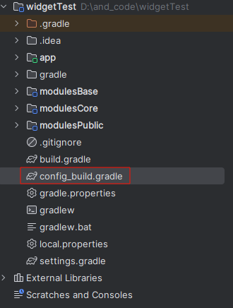
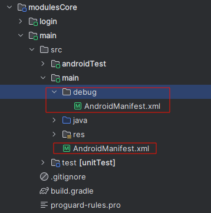
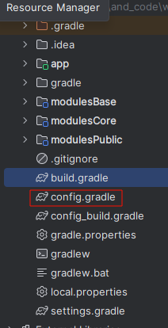

# 组件化开发

> [组件化开发](https://juejin.cn/post/6881116198889586701)
>
> [组件化开发2](https://blog.csdn.net/qq_58451437/article/details/134340624)

## 一、为什么组件化开发

组件化基于可重用的目的，将应用拆分成多个独立组件，以减少耦合：

- 通过关注点分离的形式，将App分离成多个模块，每个模块都是一个组件。解决了各种业务代码耦合在一起的导致的问题。
- 开发的过程中，让这些组件被其它组件依赖，但是在调试时也可以单独成为独立的工程并且运行，这样就**解决了因为编译耗时过多降低开发效率的问题。**
- 多人开发中，每个组件模块由单人负责，降低了开发之间沟通的成本，减少因代码风格不一而产生的相互影响。

## 二、组件化和模块化


## 三、组件化和插件化

①插件化也是基于模块化的思想，**将应用拆分成多个模块，而这些模块都是一个APK**，最终打包时将宿主APK和插件APK分开打包。在程序运行时，宿主APK可以动态的选择并加载想要的插件APK。

②插件化与组件化存在很多相似之处，但是它们根本的区别在于：

- 组件化的模块虽然在调试的时候可以切换到application独立运行，但是最终在打包时，每个模块始终都只是一个library，整个应用只有单独的一个APK。
- 插件化是拆分出了多个APK，并且在运行时通过动态加载的技术方案，来加载这些插件APK。


## 四、组件分层


**1.主工程组件：**

作用： 主工程组件是整个应用的入口和框架，负责组织和协调各个组件的运行。它通常包含应用的配置、初始化代码、全局路由、全局事件分发等。
分工： 主要负责应用的整体框架和控制，不涉及具体的业务逻辑。
示例： 在一个电商应用中，主工程组件可能包含全局用户登录状态管理、网络请求配置等。

**2.业务层组件：**

作用： 业务层组件是整个应用的核心，负责实现具体的业务功能。每个业务层组件可以看作是一个独立的业务模块，包含该业务领域的所有代码和资源。
分工： 负责实现具体的业务逻辑，与其他业务层组件相互独立。
示例： 在电商应用中，订单模块、商品模块、支付模块等可以作为独立的业务层组件。

**3.功能层组件：**

作用： **功能层组件提供通用的功能或服务**，可以被多个业务层组件共享。这包括一些**通用的 UI 组件、工具类、第三方库的封装**等。
分工： 负责提供通用的功能和服务，减少重复代码，提高代码的复用性。
示例： 可以有一个功能层组件专门负责图片加载、缓存和显示，被多个业务层组件共享。

**4.基础层组件：**

作用： 基础层组件**提供底层的基础设施支持，包括网络请求、数据库操作、权限管理等**。这些功能对整个应用是必须的，但又不涉及具体的业务逻辑。
分工： 提供底层的基础设施，为业务层组件和功能层组件提供支持。
示例： 可以有一个基础层组件专门负责处理网络请求，被业务层组件和功能层组件共享。


## 五、创建流程


### 1.主工程


### 2.业务组件层

业务组件层主要是负责library和Application之间的切换， 考虑到业务组件单独运行，所以选择`Phone&Tablet`

创建时候指定`module name`，`Application name`，还有`package name`，主要是为了不和系统包名重复


创建完之后的项目结构如下：


### 3.功能组件层

创建一个支付的功能组件，也是`library`


### 4.基础组件层

是`libarary`


项目结构如下


## 六、build.gradle抽离及统一管理

首先，可以看到各个`module`的`build.gradle`里的配置有很多是一样的，如果每新建一个`module`都要去配置build.gradle的话很烦琐，没必要。 

### 1.抽离通用build.gradle

可以将相同的配置抽离出来，创建一个单独的.gradle文件，在新建的module中只要引入这个文件就行，其他的特有的再自行配置就行。 



```groovy
/**
 * 整个项目(app/module)的通用gradle配置
 * 需要自行确定namespace。需要自行动态判定module是属于application(并配置applicationId)，还是library。
 * 默认依赖基础组件module，(:modulesBase:lib_base)
 */
def ref = rootProject.ext
android {

    compileSdk ref.android.compileSdkVersion

    defaultConfig {
        minSdk ref.android.minSdkVersion
        targetSdk ref.android.targetSdkVersion
        versionCode ref.android.versionCode
        versionName ref.android.versionName

        testInstrumentationRunner "androidx.test.runner.AndroidJUnitRunner"
    }

    buildTypes {
        release {
            minifyEnabled false
            proguardFiles getDefaultProguardFile('proguard-android-optimize.txt'), 'proguard-rules.pro'
        }
    }
    compileOptions {
        sourceCompatibility JavaVersion.VERSION_1_8
        targetCompatibility JavaVersion.VERSION_1_8
    }
}

dependencies {

    //使用implementation不传递依赖，可以防止重复依赖或依赖冲突
    //公共依赖包
    implementation project(':modulesBase:lib_base')

    annotationProcessor ref.arouter_compiler

    implementation libs.appcompat
    implementation libs.material
    implementation libs.activity
    implementation libs.constraintlayout
    testImplementation libs.junit
    androidTestImplementation libs.ext.junit
    androidTestImplementation libs.espresso.core
}
```

> [上面代码中的`rootProject.ext`](#ext)

然后在其他模块(业务层、功能层、基础组件层)引用抽离的`config.gradle`文件，例如在`register`模块下

```groovy
//1.动态切换集成\组件模式
if (rootProject.ext.isDebug) {
    apply plugin: 'com.android.application'
} else {
    apply plugin: 'com.android.library'
}

apply from: "${rootProject.rootDir}/config_build.gradle"

def ref = rootProject.ext

android {
    namespace 'com.example.register'

    defaultConfig {
        //2.组件模式需要applicationId
        if (rootProject.ext.isDebug) {
            applicationId rootProject.ext.applicationId.main
        }
    }

    //3.动态切换集成/组件模式的AndroidManifest
    sourceSets {
        main {
            if (rootProject.ext.isDebug) {
                manifest.srcFile 'src/main/debug/AndroidManifest.xml'
            } else {
                manifest.srcFile 'src/main/AndroidManifest.xml'
            }
        }
    }
}

dependencies {

}
```

> - 注释1代表，该模块是以组件模式还是library模式，需要动态更改变化
> - 注释2代表，如果使以组件模式的话，代表该模块以application运行，需要加上applicationId
> - [注释3代表， 充当一个application，那他的AndroidManifest也需要配置](#manifest.srcFile) 


### 2.<a name=ext>rootProject.ext</a>

在 `Gradle` 中，`rootProject` 是指项目的根项目，即顶层项目。 `ext` 是 `ExtraPropertiesExtension`的缩写，是一个扩展属性的机制。通过将属性添加到 `rootProject.ext`，可以在整个 `Gradle` 构建中共享这些属性。相当于一个全局变量。

```groovy
ext{
    android=[
            compileSdkVersion: 34,
            minSdkVersion: 28,
            targetSdkVersion: 30,
            buildToolsVersion: "30.0.2",
            versionCode:1,
            versionName:"1.0"
    ]

    //每一个业务组件的应用ID
    applicationId = [
            "app":"com.example.widgettest",
            "main":"com.example.modules.main",
            "login":"com.example.login",
            "register":"com.example.register"
    ]
	//SDk中核心的库
    library = [
            corektx         : "androidx.core:core-ktx:1.8.0",
            appcompat       : "androidx.appcompat:appcompat:1.4.1",
            material        : "com.google.android.material:material:1.5.0",
            constraintlayout: "androidx.constraintlayout:constraintlayout:2.1.3"
    ]

    //第三方的库
    arouter_api = "com.alibaba:arouter-api:1.5.2"
    //ARouter 的注解处理器
    arouter_compiler = "com.alibaba:arouter-compiler:1.5.2"
    gson = "com.google.code.gson:gson:2.8.6"
}
```


### 3.<a name=manifest.srcFile>加载Manifest</a>

根据不同的角色选择不同的 AndroidManifest文件。



- debug中的`Manefest`就是原本的文件，当模块作为组件模式debug的时候运行

- 另一个作为library模式运行，内容如下：

  ```xml
  <?xml version="1.0" encoding="utf-8"?>
  <manifest xmlns:android="http://schemas.android.com/apk/res/android">
  
      <application>
  
          <activity android:name=".MainActivity"
                    />
      </application>
  
  </manifest>
  ```

  


### 4.进一步抽离ext

可以更进一步将通用gradle中的各种配置分离一下，像sdk版本、第三方库等等。

在项目根部新建一个config.gradle文件



添加ext的内容

```groovy
ext{
    isDebug = true

    android=[
            compileSdkVersion: 34,
            minSdkVersion: 28,
            targetSdkVersion: 30,
            buildToolsVersion: "30.0.2",
            versionCode:1,
            versionName:"1.0"
    ]

    applicationId = [
            "app":"com.example.widgettest",
            "main":"com.example.modules.main",
            "login":"com.example.login",
            "register":"com.example.register"
    ]

    library = [
            corektx         : "androidx.core:core-ktx:1.8.0",
            appcompat       : "androidx.appcompat:appcompat:1.4.1",
            material        : "com.google.android.material:material:1.5.0",
            constraintlayout: "androidx.constraintlayout:constraintlayout:2.1.3"
    ]

    //第三方的库
    arouter_api = "com.alibaba:arouter-api:1.5.2"
    //ARouter 的注解处理器
    arouter_compiler = "com.alibaba:arouter-compiler:1.5.2"
    gson = "com.google.code.gson:gson:2.8.6"
}
```

然后在项目的`build.gradle`中引入全局配置

```groovy
//项目级build.gradle
// Top-level build file where you can add configuration options common to all sub-projects/modules.
plugins {
alias(libs.plugins.android.application) apply false
    alias(libs.plugins.android.library) apply false
}

//引入全局配置文件
apply from: "config.gradle"
```


> **这么做有什么好处?**
>
> 如果我们后续需要更新一个sdk版本，或者更新第三方库的版本，我们只需要去修改这个全局的配置文件就行，当然前提是其他的module的build.gradle都是像这样调用这个全局来配置的，如上图。
>
> 还有一点就是，如果我新开了一个项目，我需要去用到一些第三方的库，像什么gson、glide等等，我还要一个一个去找这些第三方的库。很麻烦，现在我把这些配置都放在一个全局的配置文件里，我新开一个项目，我直接把这个配置文件复制到新项目里，引入到项目的build.gradle里，我就可以在任何module里通过rootProject.ext.XXX来拿到我想要的各种东西，包括但不限于第三方库，而且这些属性于某个项目的关联性很低，可重用性很高，此乃开发偷懒利器，嘿嘿嘿。


**如果想引入ext中的三方库依赖，那么用到`api`命令**

```groovy
dependencies {
    api rootProject.ext.library.glide
}
```

> **api和implementation的区别**:
>
> 两者都是引入库的操作，区别在于**api会传递依赖，implementation不会**。什么意思呢？
>
> （下面说的都是module）业务层main依赖了基础层的lib_base，如果lib_base使用了api来添加库，比如上图gson，main依赖了lib_base，lib_base使用api引入gson，那么lib_base会将gson也传递给main，相当于main也引入了gson。而使用implementation就不会传递，相当于java的private，只有自己有。
>
> **这里需要注意的就是，要避免重复依赖和依赖冲突，比如：**
>
> - main依赖了lib_base,lib_base传递了gson给他
>
> - main又依赖另外一个module B，B也用api引入了gson，也传递给了main
>
>这时候就出现了依赖冲突，如果两个版本一样，就是重复依赖。如果使用全统一配置，就会大幅减少出现依赖冲突（组件化开发是多人开发，有些人不一定遵循规范）。

> **建议：在全局的公共依赖包module里使用api，其他的module中使用implementation，这样能减少依赖传递造成的种种依赖和版本问题。**

```groovy
dependencies {

    //使用implementation不传递依赖，可以防止重复依赖或依赖冲突
    //公共依赖包
    implementation project(':modulesBase:libBase')

    ......
}
```

> 上面公告依赖的包名可以在`setting.gradle`里查看
>
> 