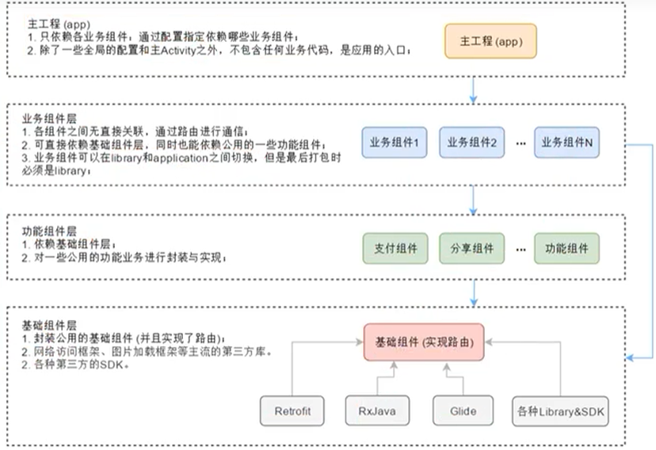
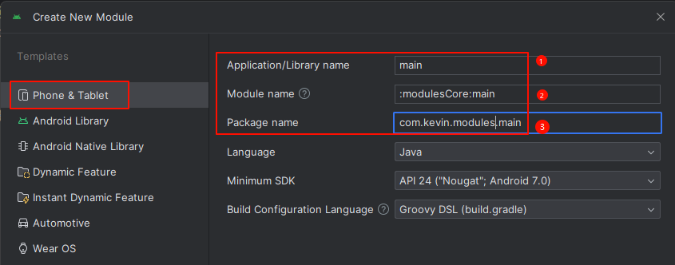
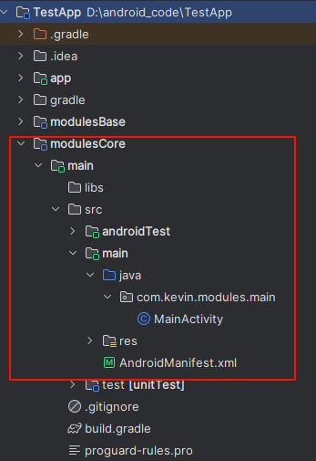
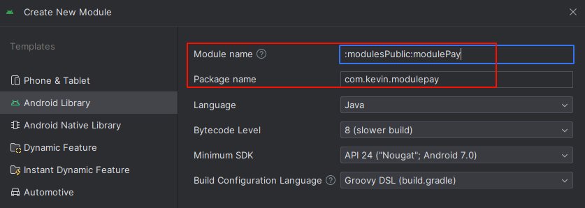
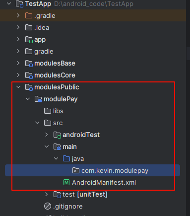
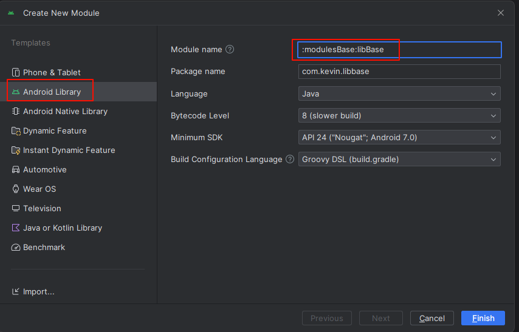
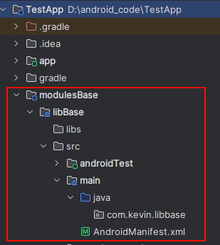

# 组件化开发

## 一、为什么组件化开发

组件化基于可重用的目的，将应用拆分成多个独立组件，以减少耦合：

- 通过关注点分离的形式，将App分离成多个模块，每个模块都是一个组件。解决了各种业务代码耦合在一起的导致的问题。
- 开发的过程中，让这些组件被其它组件依赖，但是在调试时也可以单独成为独立的工程并且运行，这样就解决了因为编译耗时过多降低开发效率的问题。
- 多人开发中，每个组件模块由单人负责，降低了开发之间沟通的成本，减少因代码风格不一而产生的相互影响。

## 二、组件化和模块化

## 三、组件化和插件化

①插件化也是基于模块化的思想，**将应用拆分成多个模块，而这些模块都是一个APK**，最终打包时将宿主APK和插件APK分开打包。在程序运行时，宿主APK可以动态的选择并加载想要的插件APK。

②插件化与组件化存在很多相似之处，但是它们根本的区别在于：

- 组件化的模块虽然在调试的时候可以切换到application独立运行，但是最终在打包时，每个模块始终都只是一个library，整个应用只有单独的一个APK。
- 插件化是拆分出了多个APK，并且在运行时通过动态加载的技术方案，来加载这些插件APK。

## 四、组件分层

## 五、创建流程

### 1.主工程

### 2.业务组件层

业务组件层主要是负责library和Application之间的切换，创建时候指定`module name`，`Application name`，还有`package name`，主要是为了不和系统包名重复

创建完之后的项目结构如下：

### 3.功能组件层

创建一个支付的功能组件，也是`library`

### 4.基础组件层

是`libarary`

项目结构如下

