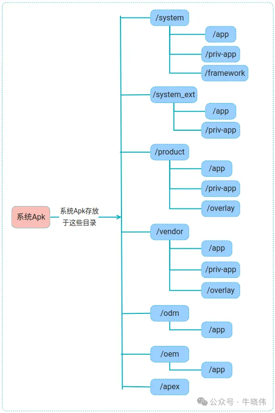

> https://mp.weixin.qq.com/s/4MsTnUTWb89ya5nQGwuSvQ

## 1.APK分类

apk也可以细分为：

- 系统APK
- 普通APK

## 2.系统APK

 Android中像launcher、systemui、setting、camera、gallery等Apk都是系统Apk。 这些模块在 Android 系统中是不同的系统应用或核心服务，负责实现特定的功能 

> **为啥要独这些系统功能为apk**
>
> GPT给出的答案是：
>
> **模块化设计**：
>
> - Android 系统遵循模块化设计原则，将不同功能分成独立的部分。
> - 使用 APK 格式，可以方便地管理、升级和替换特定模块，而不需要重新编译整个系统。
>
> **易于维护与更新**：
>
> - 系统应用作为独立的 APK 文件，可以在无需完整刷机的情况下通过 OTA（Over-the-Air）更新。
> - 从 Android 10 开始，部分系统应用甚至可以通过 Google Play 商店直接更新。
>
> **符合 Android 应用架构**：
>
> - APK 是 Android 系统标准的应用格式，无论是普通应用还是系统级应用，都以相同的形式运行在 Android 框架上。
> - 这些系统应用通过使用 Android 的 API 与底层服务交互，这与普通应用一致。
>
> **灵活性与替换性**：
>
> - 系统模块以 APK 形式存在，允许设备制造商或用户定制和替换（如替换默认的 Launcher 或 Gallery）。
> - 厂商可以基于这些 APK 进行个性化开发，而不会破坏系统的核心架构。

> **为什么不打包为aar**
>
> aar是库文件，无法直接执行，必须内嵌在apk中。
>
> 而apk是可执行文件，可以直接在Android系统运行，方便ota和三方开发

### （1）如何成为系统apk

 **PackageManagerService服务是根据Apk所处的目录来判断Apk到底是系统Apk还是普通Apk的**，因此将对于apk放入这些目录下

  

> 普通apk放入这些目录必须要root权限

### （2）如何判断是系统apk

PMS在启动时候会扫描所有apk，而扫描所有系统Apk需要做如下几个关键事情：

- 首先要依次扫描system、odm、oem、product、system_ext、vendor、apex这几个目录 (这几个目录定义在Partition类)。

- 而在扫描这些目录的时候会增加一些scan flags值，其中对所有目录都要增加的一个值是SCAN_AS_SYSTEM，而不同的目录也会增加自己对应的scan flags值。比如扫描odm目录会增加SCAN_AS_ODM 和 SCAN_AS_SYSTEM 值，扫描product目录会增加SCAN_AS_PRODUCT 和 SCAN_AS_SYSTEM 值 (这些scan值定义在PackageManagerService类)。

- 扫描Apk的其中一个环节是解析Apk信息，而解析完的Apk信息会存储在ParsedPackage对象中，进而再根据上面的 scan flags 值，对ParsedPackage对象的相应属性进行设置，比如是否是系统Apk，是否是product apk等。

### （3）系统apk安装阶段

系统apk是在pms扫描阶段安装

### （4）分类

  

按根目录分可以分为 vendor Apk、product Apk、systemExt Apk、system Apk、odm Apk、oem Apk 

#### 所在子目录分类

一般系统apk放在上图中的子目录里面，`/app`、`/priv-app`、`/overlay`、`/framework`

**①privileged Apk**

privileged Apk也就是**该类型的Apk是可以使用特殊权限的，其他类型Apk是不可以使用特殊权限的**。也就是特殊权限只归privileged Apk使用。

**要变为该类型的Apk**，只需要把Apk放入上面提到的几个目录下面的 /priv-app 目录中即可，如/product/priv-app、/system/priv-app等。 **同时要静态声明权限，否则会导致应用起不起来**

**②overlay Apk**

该种类型的Apk主要存放于overlay子目录下，该种类型的Apk不包含任何的代码，只包含资源，该资源是res目录下的资源。该Apk的作用就是起到换肤的作用。当然这种类型的Apk只是对相应系统Apk进行换肤操作，而不会影响普通Apk。

#### 能力特性分类

系统Apk按Apk所具备的能力或特性可以分为core Apk 和 persistent Apk 

**①core Apk**

core Apk翻译为中文是核心Apk，用一句话总结该Apk就是说**当Android设备配置特别特别低端的时候，其他的Apk都可以不要，但是core Apk是必须的**。该类型的Apk会在PackageManagerService服务启动的时候前置于其他Apk创建data目录。像systemui都属于该类型的Apk。

**要变更为此类apk**， 只需要在AndroidManifest.xml文件中，增加 coreApp="true" 即可： 

```xml
<manifest xmlns:android="http://schemas.android.com/apk/res/android"
          package="com.android.systemui"
          android:sharedUserId="android.uid.systemui"
          coreApp="true">
```

**②persistent Apk**

persistent Apk翻译为中文是持久的Apk，就是说该类别的Apk在**App运行过程中，如果意外退出了，系统还会把它给拉起，让它继续保持运行状态**。并且在Android设备启动后，是会把所有符合情况的persistent Apk提前启动

```java
//ActivityManagerService类

//该方法会在系统准备好后开始调用
void startPersistentApps(int matchFlags) {
    if (mFactoryTest == FactoryTest.FACTORY_TEST_LOW_LEVEL) return;
    synchronized (this) {
        try {

            //从PackageManagerService获取符合条件的persistent App
            final List<ApplicationInfo> apps = AppGlobals.getPackageManager()
                .getPersistentApplications(STOCK_PM_FLAGS | matchFlags).getList();
            for (ApplicationInfo app : apps) {
                if (!"android".equals(app.packageName)) {
                    //启动它们
                    final ProcessRecord proc = addAppLocked(
                        app, null, false, null /* ABI override */,
                        ZYGOTE_POLICY_FLAG_BATCH_LAUNCH);
                    省略代码······
                }
            }
        } catch (RemoteException ex) {
        }
    }
}
```

**变更为此类型apk**，只需要在清单声明：

```xml
<manifest xmlns:android="http://schemas.android.com/apk/res/android"
          xmlns:tools="http://schemas.android.com/tools">
    <application
                 android:persistent="true">
```

> **只对系统apk生效**

## 3.普通apk

普通Apk被安装后Apk文件是被存放于/data/app目录下的 

```java
//InitAppsHelper 类

//扫描所有普通Apk
public void initNonSystemApps(PackageParser2 packageParser, @NonNull int[] userIds,
                              long startTime) {
    if (!mIsOnlyCoreApps) {
        省略代码······
            //其中 mPm.getAppInstallDir() 获取的值是 data/app，而 mScanFlags值是没有增加扫描系统Apk的那些 scan flag值的
            scanDirTracedLI(mPm.getAppInstallDir(), /* frameworkSplits= */ null, 0,
                            mScanFlags | SCAN_REQUIRE_KNOWN,
                            packageParser, mExecutorService); 
    }

    省略代码······
}
```


## 4.区别

- 系统Apk的安装主要是在PackageManagerService启动时候扫描所有Apk的阶段；而普通Apk的安装是需要通过用户来安装，在安装过程是有安装界面的。
- 系统Apk使用Android.bp来配置编译信息；而普通Apk使用gradle进行编译。
- 系统Apk是不可以被用户卸载的；而普通Apk是可以被用户卸载的。
- 系统Apk的Apk文件是存放在/system、/system_ext、/product、/vendor、/odm、/oem、/apex目录下的子目录中；而普通Apk被安装后Apk文件是存放在/data/app目录下的。
- 系统Apk拥有很多的特权；而普通Apk啥也没有。
- 若在内存紧张的情况下，普通App被杀掉的概率要远大于系统App。