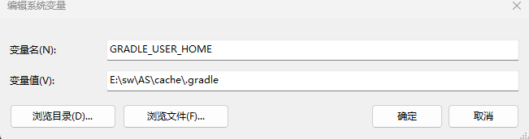
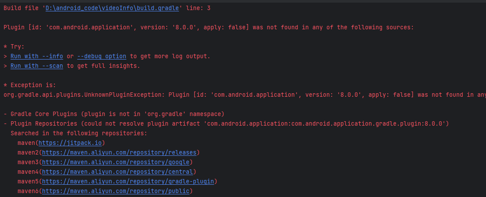
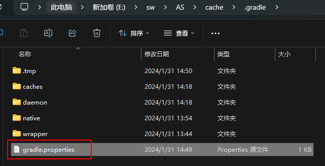

# 一、项目配置问题


## 1.配置和修改AS缓存路径

1.修改.android和.AndroidStudio相关的缓存路径可以参考 

https://blog.csdn.net/xx326664162/article/details/52004676 


### **配置gradle路径**




## 2.Manifest出现屎黄色

在module的build.gradle的android{}里面添加 

```groovy
android{ 
    lintOptions { 
        disable 'GoogleAppIndexingWarning' 
    } 
}	
```


## 3.安装Apk出现问题 

新版本Android Studio运行APK时，出现DELETE_FAILED_INTERNAL_ERROR， Error while Installing 

APKs如何解决。 

有一种方法：打开settings，找到Build>Instant Run,把右边的勾去掉，再次尝试安装。 

## 4.解决build running速度慢的问题

在 .gradle目录下新建一个文件名为gradle.properties的文件 

添加以下内容 

```properties
org.gradle.daemon=true
```

**性能优化参考：** 

https://www.jianshu.com/p/d4790161c6e3 

切记，如果需要更新依赖或者下载虚拟机，最好不要勾选offline work 

## 5.AS扫描不到外部设备，无法在真机上运行 

1.在SDK manager里面下载google usb driver 

2.在资源管理器更新ADB INTERFACE驱动，并且选择在本地计算机上扫描，然后找到下载的USB Driver 文件夹，进行安装更新 

3.在安卓手机上：设置-》关于手机-》连续点击版本号会开启开发者模式 

然后在开发者模式选项里面开启USB调试即可 

（https://jingyan.baidu.com/article/c275f6ba71db93e33d75672b.html）


## 6.编译失败

### 1.添加国内镜像

```groovy
// Top-level build file where you can add configuration options common to all sub-projects/modules.
buildscript {
    repositories {
        maven { url 'https://maven.aliyun.com/repository/public' }
        maven { url 'https://maven.aliyun.com/repository/public' }
        maven { url 'https://maven.aliyun.com/repository/google' }
        maven { url 'https://maven.aliyun.com/repository/gradle-plugin' }
 
        google()
        mavenCentral()
        jcenter()
    }
    dependencies {
        classpath "com.android.tools.build:gradle:7.0.2"
        classpath "org.jetbrains.kotlin:kotlin-gradle-plugin:1.5.20"
 
    }
}
 
 
 
task clean(type: Delete) {
    delete rootProject.buildDir
}

```

> 其他可能原因——https://blog.csdn.net/Asgard_Hu/article/details/130060484

### 2.Installed Build Tools revision 34.0.0 is corrupted. Remove and install again using the SDK Manager.

> **参考：**
>
>  [2022年最优解决方案Installed Build Tools revision 31.0.0 is corrupted_unity build-tool 31.0.0 is missing dx](https://blog.csdn.net/wq6ylg08/article/details/121882199) 

根据构建报错信息"34.0.0版本的构建工具缺少了`DX文件`"，以及StackOverflow的解决方案发现，34.0.0版本的构建工具缺少了"dx"和"dx.jar"这两文件，正确的做法就是复制对应路径的"d8"和"d8.jar"这两文件创建副本，并分别改名为"dx"和"dx.jar"，"d8"和"d8.jar"这两文件的大致路径为：

```
{path}\Android\Sdk\build-tools\34.0.0\d8
{path}\Android\Sdk\build-tools\34.0.0\lib\d8.jar
```


## 7.Adroid Gradle Plugin下载不下来

Android 的gradle要下载两个东西：

- **gradle**：`gradle->wrapper`中下载的内容
- **android gradle plugin**：项目下的`build.gradle`中指定的内容

> 两者的版本需要对应
>
> https://blog.csdn.net/djzhao627/article/details/100215805

这里我下载了8.0版本的gradle，然后下载gradle-plugin失败



很奇怪，不知道为什么报这个错，镜像也添加了

**经过测试发现，在我.gradle缓存目录下的gradle.properties文件中设置了代理，删掉内容中的代理即可**




## 8.报错`java.lang.IllegalStateException: Module entity with name: `

解决办法，将`setting.gradle`中的`rootProject.name`修改为和项目一样的名字（大小写），然后注释，再取消注释

```groovy
rootProject.name = "videoInfo" //名称一定要和项目的一致
include ':app'
```


## 9.gradle下不下来

>  [保姆级——成功解决Android studio中下载gradle慢的方法_gradle下载-CSDN博客](https://blog.csdn.net/qq_65732918/article/details/134903527) 

# 二、开发问题

## 1.去掉action bar

修改`Manifest.xml`中`theme`为`NoActionBar`

```xml
<application
...
             android:theme="@style/Theme.AppCompat.NoActionBar"
             >
   .....
</application>
```


## 2.Button修改background为自定义drawable不生效？

> [background为自定义drawable](https://blog.csdn.net/Better_C/article/details/122850043)

```xml
<Button
        .....
        android:background="@drawable/shape_login"
        />
```

修改` res/values/themes.xml `中的

```xml
<!--修改为如下-->
<style name="Theme.VideoInfo" parent="Theme.MaterialComponents.DayNight.Bridge">
```


## 3.http请求拦截报错

**Android P(sdk版本27以上) 限制了明文流量的网络请求，非加密的流量请求都会被系统禁止掉。所以如果当前应用的请求是 htttp 请求，而非 https ,这样就会导系统禁止当前应用进行该请求。**

解决办法，在`res`目录下，创建`network_security_config.xml`文件

```xml
<?xml version="1.0" encoding="utf-8"?>
<network-security-config>
    <base-config cleartextTrafficPermitted="true" />
</network-security-config>
```

 在manifest清单文件配置application： 

```xml
<application
             ...
             android:networkSecurityConfig="@xml/network_security_config"
             ...
             />
```


## 4.suppressLint注解

`@SuppressLint` 是一个 Android 开发中常用的注解，用于告诉静态分析工具（如Lint）忽略特定的警告或错误，这样就可以避免在代码中出现不必要的警告。通常情况下，Lint会根据一些编码规范和最佳实践来检查你的代码，并提出建议或警告，以帮助你改进代码质量和性能。

使用 `@SuppressLint` 注解可以指示Lint忽略特定的警告或错误，以便你在某些情况下可以有选择地关闭或禁用Lint的某些检查。


## 5.阻止屏幕旋转时候重新启动

当手机屏幕旋转或尺寸变化时候，活动的生命周期会销毁并重新构建，此时系统容易崩溃，数据容易丢失，因此可以声明一个配置

```xml
<activity
          android:name=".activity.HomeActivity"
          android:configChanges="orientation|screenSize" />
<activity
```

> android:configChanges 属性用于指定 Activity 在配置更改时是否应该重新启动。


**设置为纵向**

将设备的屏幕方向设置为纵向模式。在纵向模式下，设备的高度大于宽度 

```xml
<activity 
    android:name=".MyActivity"
    android:screenOrientation ="portrait" >
</activity>

```


**`android:configChanges="orientation|screenSize" />` 表示 Activity 在以下情况下** **不会** 重新启动：

- **设备旋转**：当用户旋转设备时，Activity 将不会重新启动。

- **屏幕尺寸变化**：当设备的屏幕尺寸发生变化时，例如从手机切换到平板电脑，Activity 将不会重新启动。


# 


