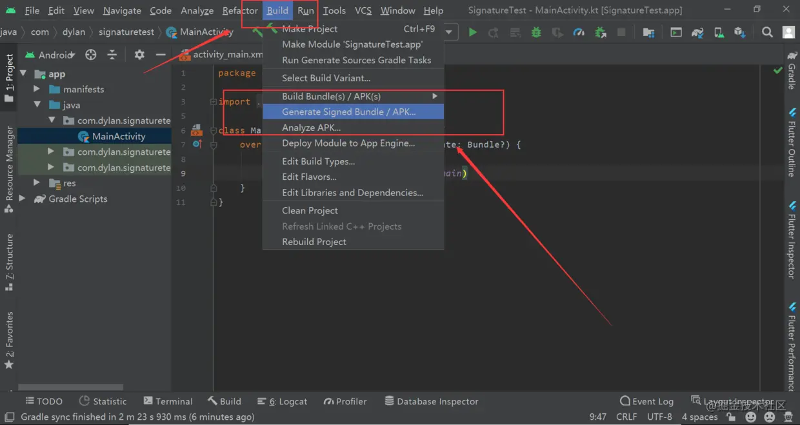
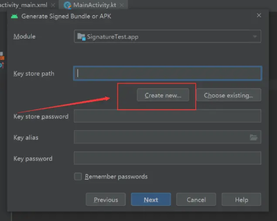

# 打包

## 一.混淆

### 1.作用

- 防止反编译；
- 精简编译后的apk文件大小；

> **Android平台的混淆原理是把代码中原来有具体含义的包名，类名，变量名，方法名等名称全部替换成按顺序排列的无意义的英文字母a、b、c….**这样代码结构没有变化，还可以运行得到一样的结果，并且就算代码被反编译出来，别人想弄懂代码的架构和具体意思也比较难。
>
> 所以当你混淆后运行app时，这个时候APK文件已经是被混淆过的，**使用的类也是已经被混淆过的，编译时可能正确但是运行时会报错，所以一些必要的类需要手动去在混淆文件中标明不混淆。**
>
> 不难理解，混淆之后，类名会变成a,b,c这种，通过包名+类名自然就会找不到该类了，自然就会出现ClassNotFoundException异常。当混淆时候报一些引用未找到的时候，有一些可以选择忽略不计，但有一部分必须使用到的类无法找到就是2中提到的原因，即使在混淆文件中选择了不去提示警告后，编译时程序不会报错，但是运行时程序还是会出问题。
> 所以一些类在混淆代码中需要特别标注出来，不可以混淆掉。

### 2.开启混淆

在项目的build.gradle中开启混淆：

将minifyEnabled的值改为true即开启：其中debug为测试版本，release为发布版本


开启混淆后，在打出 release 版包时，会在 build/outputs/mapping/ 目录下生成 mapping.txt 文件，该文件是原始代码和混淆后的代码的一种对应转换关系，我们推导出原始代码名称。


### 3.混淆文件位置

开启混淆后Android会用自带的混淆进行代码混淆，如在安装Android SDK的目录下的proguard-android.txt或proguard-android-optimize.txt文件为默认混淆文件。对于自己定义的混淆需要在proguard-rules.pro文件中进行配置：


Proguard 作用

**压缩 Shrinking : 默认是开启的，移除未被使用的类和成员，并且在 优化Optimization **工作执行后还会再次执行。**
**优化 Optimization : 默认是开启的，在字节码级别执行优化，让应用运行的更快。**
**混淆 Obfuscation : 默认是开启的，增大反编译的难度，除了被 keep 保持的类和类成员都会被随机命名。**

它们都是可以在配置文件 proguard-rules.pro 中进行关闭的，比如：

```properties
-dontshrink       # 关闭压缩
-dontoptimize     # 关闭优化
-dontobfuscate    # 关闭混淆
```

### 4.混淆规则

(1)为什么要添加混淆规则

> **Android平台的混淆原理是把代码中原来有具体含义的包名，类名，变量名，方法名等名称全部替换成按顺序排列的无意义的英文字母a、b、c….**这样代码结构没有变化，还可以运行得到一样的结果，并且就算代码被反编译出来，别人想弄懂代码的架构和具体意思也比较难。
>
> 所以当你混淆后运行app时，这个时候APK文件已经是被混淆过的，**使用的类也是已经被混淆过的，编译时可能正确但是运行时会报错，所以一些必要的类需要手动去在混淆文件中标明不混淆。**
>
> 不难理解，混淆之后，类名会变成a,b,c这种，通过包名+类名自然就会找不到该类了，自然就会出现ClassNotFoundException异常。当混淆时候报一些引用未找到的时候，有一些可以选择忽略不计，但有一部分必须使用到的类无法找到就是2中提到的原因，即使在混淆文件中选择了不去提示警告后，编译时程序不会报错，但是运行时程序还是会出问题。
> 所以一些类在混淆代码中需要特别标注出来，不可以混淆掉。

(2)常用命令
命令	作用
-keep	防止该类所有内容被移除或重命名
-keepnames	防止类和成员被重命名
-keepclassmembers	防止成员被移除或者被重命名
-keepclasseswithmembers	防止拥有该成员的类和成员被移除或者被重命名
-keepclasseswithmembernames	防止拥有该成员的类和成员被重命名


(3)常用规则
类：需要使用完全限定名；

*：通配符，任意字符串，不包含包名分隔符（.）；

**：通配符，任意字符串，包含包名分隔符（.）；

extends：继承某类的类；

implement：实现某接口的类；

$：内部类；

`<init>`：所有构造方法；

`<fields>`：所有成员变量；

`<methods>`：所有方法；

…：任意参数；


例如：

```properties
-keep class com.xing.weijian.*
-keep class com.xing.weijian.**
```

- 一个 * 号表示只保持该包下的类名不被混淆，而子包下的类名还是会被混淆的。
- 两个 * 号表示该包和所含子包，子包包含的多级子包下的类名都保持不被混淆。

**注意：上面这配置只保持了类名没有被混淆，但是其中的方法和成员变量的名称还是被混淆改变了，如果既想保持类名，又想保持方法和成员变量不被混淆，需要使用以下方式：**

```properties
-keep class com.xing.weijian.* {*;}
```


同时也能够使用类似 java 的 extends ,implements 等规则进行配置：

```properties
# 保持继承了BaseActivity的public修饰的类名不被混淆
-keep public class * extends com.xing.weijian.base.BaseActivity 

# 内部类使用 $ 号，保持 TabFragment 中 内部类 OnFragmentData的所有 public 修饰的都不被混淆掉
-keepclassmembers class com.xing.weijian.TabFragment$OnFragmentData{
    public *;
}
```

**特定匹配**

```properties
<init>   # 匹配所有构造函数
<fields>  # 匹配所有成员变量
<methods> # 匹配所有的方法
```

可以在它们前面添加 private ,public 进行进一步更精细的限制范围,比如保持 User 类中 所有 public 方法不被混淆：

```properties
-keep class com.xing.weijian.bean.User {
    public <methods>;
}
```

也可以在方法中加入参数进行限定：比如 保持 User 类的 public 修饰，参数是 String 类型的方法不被混淆：

```properties
-keep class com.xing.weijian.bean.User {
    public <methods>(String);
}
```

### 5.不能被混淆的情况

#### (1)不能设置混淆的方法或成员

- jni 方法不能混淆，因为这个方法需要和 native 方法保持一致
- 反射用到的类不能混淆
- Androidmanifest.xml 中的类不能混淆，所以四大组件和 Application子类，Framework 层下所有的类默认是不会进行混淆的。
- 自定义的 View 默认不会被混淆
- 与服务端交互解析成的实体对象不能设置混淆，否则不能解析出正确的对象。
- 引用第三方 SDK 时，需要根据它的文档加入对应的混淆规则。
- Parceable 子类和 Creator 静态成员变量不能混淆，否则产生异常。

#### (2)混淆模板

将报错的或者自己不需要的删除即可，然后在最后添加自己不需要混淆的代码：

```properties
#--------基本不用动区域--------------------------------------------
#---------------------------------基本指令区----------------------------------
-optimizationpasses 5
-dontskipnonpubliclibraryclassmembers
-printmapping proguardMapping.txt
-optimizations !code/simplification/cast,!field/*,!class/merging/*
-keepattributes *Annotation*,InnerClasses
-keepattributes Signature
-keepattributes SourceFile,LineNumberTable
#----------------------------------------------------------------------------

#---------------------------------默认保留区---------------------------------
#继承activity,application,service,broadcastReceiver,contentprovider....不进行混淆
-keep public class * extends android.app.Activity
-keep public class * extends android.app.Application
-keep public class * extends android.support.multidex.MultiDexApplication
-keep public class * extends android.app.Service
-keep public class * extends android.content.BroadcastReceiver
-keep public class * extends android.content.ContentProvider
-keep public class * extends android.app.backup.BackupAgentHelper
-keep public class * extends android.preference.Preference
-keep public class * extends android.view.View
-keep public class com.android.vending.licensing.ILicensingService
-keep class android.support.** {*;}

-keep public class * extends android.view.View{
    *** get*();
    void set*(***);
    public <init>(android.content.Context);
    public <init>(android.content.Context, android.util.AttributeSet);
    public <init>(android.content.Context, android.util.AttributeSet, int);
}
-keepclasseswithmembers class * {
    public <init>(android.content.Context, android.util.AttributeSet);
    public <init>(android.content.Context, android.util.AttributeSet, int);
}
#这个主要是在layout 中写的onclick方法android:onclick="onClick"，不进行混淆
-keepclassmembers class * extends android.app.Activity {
   public void *(android.view.View);
}

-keepclassmembers class * implements java.io.Serializable {
    static final long serialVersionUID;
    private static final java.io.ObjectStreamField[] serialPersistentFields;
    private void writeObject(java.io.ObjectOutputStream);
    private void readObject(java.io.ObjectInputStream);
    java.lang.Object writeReplace();
    java.lang.Object readResolve();
}
-keep class **.R$* {
 *;
}

-keepclassmembers class * {
    void *(*Event);
}

-keepclassmembers enum * {
    public static **[] values();
    public static ** valueOf(java.lang.String);
}
-keep class * implements android.os.Parcelable {
  public static final android.os.Parcelable$Creator *;
}
#// natvie 方法不混淆
-keepclasseswithmembernames class * {
    native <methods>;
}

#保持 Parcelable 不被混淆
-keep class * implements android.os.Parcelable {
  public static final android.os.Parcelable$Creator *;
}
#----------------------------------------------------------------------------

#---------------------------------webview------------------------------------
-keepclassmembers class fqcn.of.javascript.interface.for.Webview {
   public *;
}
-keepclassmembers class * extends android.webkit.WebViewClient {
    public void *(android.webkit.WebView, java.lang.String, android.graphics.Bitmap);
    public boolean *(android.webkit.WebView, java.lang.String);
}
-keepclassmembers class * extends android.webkit.WebViewClient {
    public void *(android.webkit.WebView, jav.lang.String);
}
#----------------------------------------------------------------------------
#---------------------------------------------------------------------------------------------------
#---------------------------------实体类---------------------------------
# 修改成你对应的包名
-keep class [your_pkg].** { *; }

```


## 二.签名

> **参考：**
>
> [Android打包流程-签名](https://juejin.cn/post/7094092625954734110) 
>
> [android项目配置签名文件的完整流程](https://blog.csdn.net/xiaopangcame/article/details/120981335#:~:text=详解android项目配置签名文件的完整流程 1 1.背景 接手的项目近期需要上线，于是复习了一下项目签名文件配置流程，这里做个系统性总结。 2 2.最终目标 根据需求为debug包与release包配置签名文件，快速满足中小型项目的需要。 3,喝着茶咱也别闲着，来看一看app目录下build.gradle里面的buildType的信息： ... 6 6.将签名文件信息移动到项目本地配置文件 ... 7 7.总结 ) 

-------------

### 1.数据摘要

表示对一个数据源进行一个算法之后得到一个摘要，消息摘要算法的主要特征是加密过程不需要秘钥的参与，并且被加密过的数据无法被解密。只有输入相同的明文数据经过相同的数据摘要算法才能得到相同的密文。

消息摘要特点：

> - 无论输入的数据多长，计算出来的消息摘要的大小总是固定的。比如MD5算法摘要的的消息有128位，用SHA-1算法摘要的消息有160位. SHA-1变体可以产生192位以及256位的消息摘要。
> - 消息摘要的结果是伪随机的。
> - 消息摘要是不可逆的

-------------

### 2.数字签名

 用私钥对数据摘要进行加密 

-------------------

### 3.证书

公开秘钥认证，又称数字证书，本质上是一种电子文档，是由CA中心颁布的较为权威与公正的证书。

数字证书的基本架构是公开秘钥PKI，即利用一对秘钥实施加密和解密。其中秘钥包括公钥和私钥，私钥用来签名和解密，由用户定义，只有用户知道。公钥用于签名验证和加密，可被多人共享。

此文件需要包含下面几个内容：

- 公钥信息
- 拥有者信息
- 发行者对这个文件的数字签名

认证机构用自己的私钥对需要认证的人（或组织机构）的公钥施加数字签名并生成证书，

>  证书的本质就是对公钥施加数字签名。 

----

### 4.证书格式

- `.jks`： 二进制格式文件，同时包含证书和私钥，一般有密码保护，只能存储非对称密钥对（私钥 + x509公钥证书） 
- `PKCS#12`： JKS和PKCS12之间的最大区别是JKS是Java专用的格式，而PKCS12是存储加密的私钥和证书的标准化且与语言无关的方式。 
- `PKCS#7`

---


### 5.创建签名文件

 

**创建key store(密钥库)**




> 上面为创建密钥库，创建一次之后可以使用已经创建的密钥库，然后创建密钥

#### jks文件内容

通过keytool命令可以查看jks文件的内容。 

```shell
keytool -list -v -keystore /xx/xx/xx.jks

#输出-------------------------------------------
密钥库类型: PKCS12
密钥库提供方: SunJSSE
​
您的密钥库包含 1 个条目
​
别名: my-test
创建日期: 2022-5-2
条目类型: PrivateKeyEntry
证书链长度: 1
证书[1]:
所有者: CN=xie, OU=xie, O=xie, L=xie, ST=xie, C=xie
发布者: CN=xie, OU=xie, O=xie, L=xie, ST=xie, C=xie
序列号: 7e3d8370
生效时间: Mon May 02 12:10:42 CST 2022, 失效时间: Fri Apr 26 12:10:42 CST 2047
证书指纹:
   SHA1: 50:07:59:83:AB:45:13:36:9F:59:73:75:83:60:97:B9:54:3A:4E:90
   SHA256: 24:7E:31:43:EC:7E:38:AF:AD:23:42:30:FF:A2:FE:53:FD:D5:EB:6C:66:AB:92:F2:AF:33:F3:F7:F7:2C:C7:04
签名算法名称: SHA256withRSA
主体公共密钥算法: 2048 位 RSA 密钥
版本: 3
....

```


#### jks文件提取公钥

```shell
keytool -list -rfc -keystore /Users/xiejinlong/mytest
```


#### jks文件提取私钥

无法直接从jks文件中拿到私钥信息，但是可以把jks证书转化为pfx证书，pfx就是PKCS#12格式的证书，再获取私钥。 

> - jks转为pfx
>
>   ```shell
>   keytool -v -importkeystore -srckeystore /Users/xiejinlong/mytest1 -srcstoretype jks -srcstorepass 111111 -destkeystore  mytest.pfx -deststoretype pkcs12 -deststorepass 111111 -destkeypass 111111
>   ```
>
> - 提取并查看私钥
>
>   ```shell
>   openssl pkcs12 -in mytest.pfx -nocerts -nodes -out server.key
>   ```

#### 报错：

> 参考：
>
> https://blog.csdn.net/csdnzouqi/article/details/105882034

> 创建keystore时候报错
>
> 
>
> **因为JKS密钥库使用专用格式，它建议我们生成密钥的时候使用 keytool 命令来生成标准的密钥文件，迁移到行业标准格式 PKCS12** 

### 6.命令行打包

> 参考：
>
> https://www.jianshu.com/p/45fdcc6f00a4

#### 命令行签名

> https://www.cnblogs.com/xiaoweigege/p/15000347.html

### 6.签名工具

**jarsigner**

 jdk自带的签名工具，可以对jar进行签名 

- 不能做apk的V2签名
- 需要在 API 级别 17 或更低级别上运行的 APK，不能够使用SHA-256 摘要，而jarsigner仍然会使用，导致异常
- 使用 keystore 文件进行签名。生成的签名文件默认使用 keystore 的别名命名

> [jarSignerGuide](https://link.juejin.cn/?target=https%3A%2F%2Fdocs.oracle.com%2Fjavase%2F8%2Fdocs%2Ftechnotes%2Fguides%2Fjar%2Fjar.html%23Signature_File)

-----

**apkSigner**

Android sdk 提供的专门用于 Android 应用的签名工具。

- 使用 pk8、x509.pem 文件进行签名。其中 pk8 是私钥文件，x509.pem 是含有公钥的文件。
- 生成的签名文件统一使用“CERT”命名。

> [apkSignerGuide](https://link.juejin.cn/?target=https%3A%2F%2Fdeveloper.android.com%2Fstudio%2Fcommand-line%2Fapksigner)


