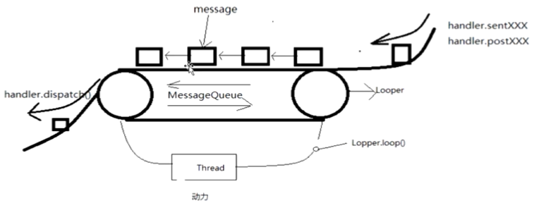
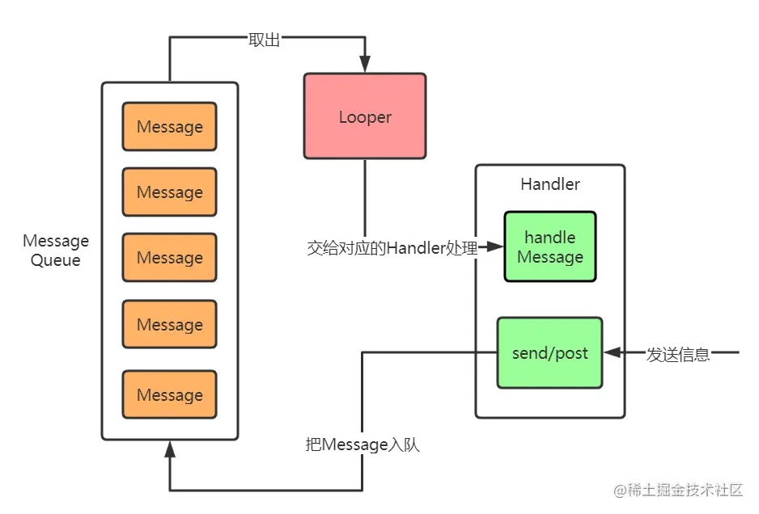
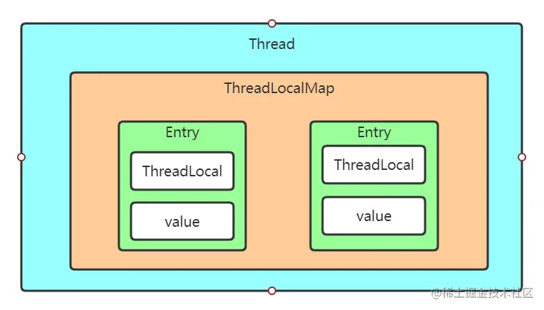
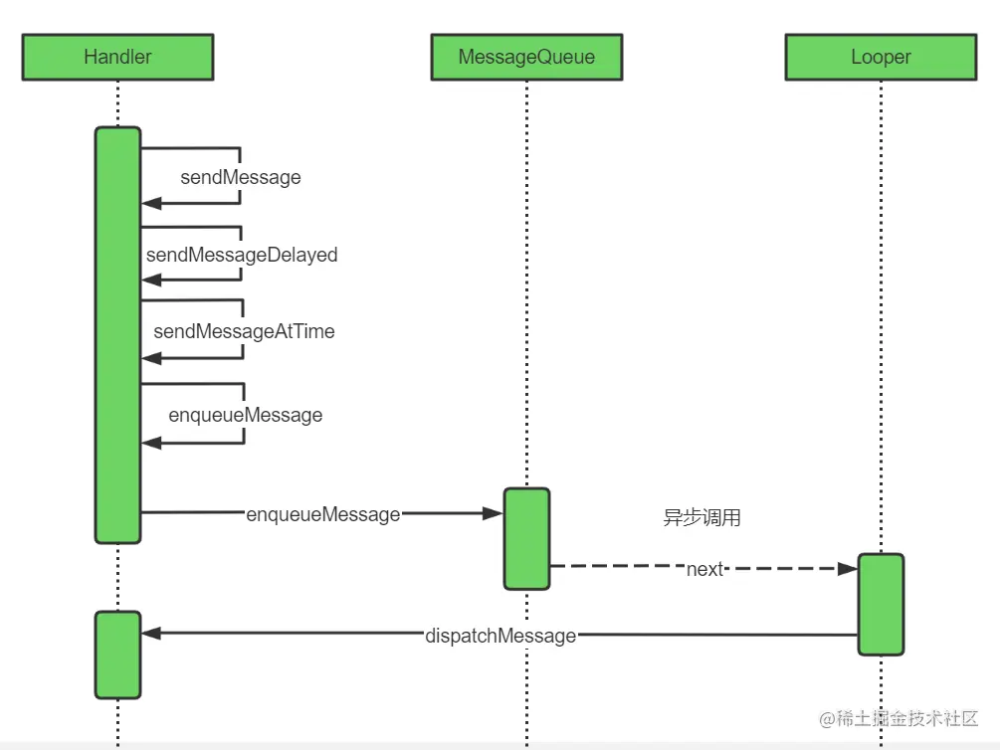
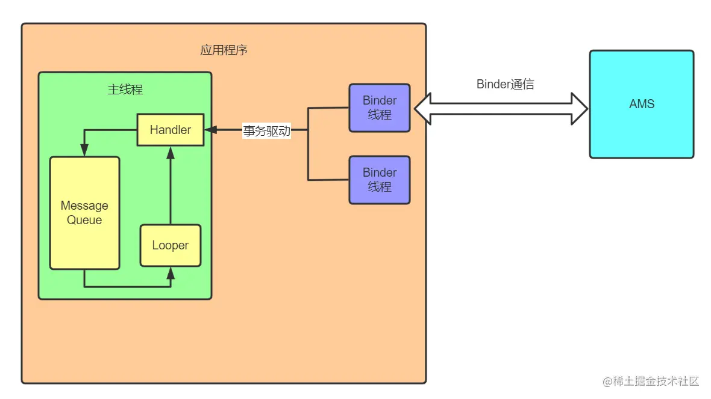
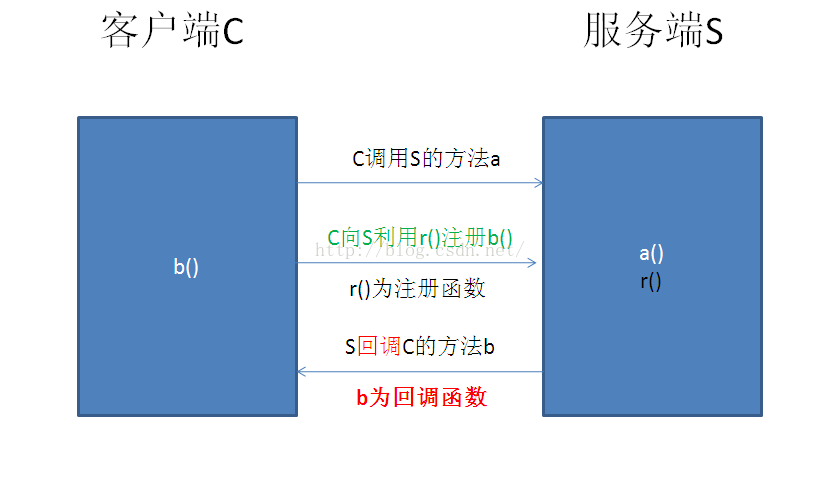

# 消息处理机制

> [Android Handler，Looper 与 MessageQueue 使用与分析](https://cloud.tencent.com/developer/article/1783157)

**Android是消息驱动的，实现消息驱动有几个要素：**

- 消息的表示：`Message`
- 消息队列：`MessageQueue`
- 消息循环，用于循环取出消息进行处理：`Looper`
- 消息处理，消息循环从消息队列中取出消息后要对消息进行处理：`Handler`

## 一、Handler

> [Android之Handler机制](https://www.jianshu.com/p/0a94355963da)

### 1.Handler机制

**Handler机制是Android中基于单线消息队列模式的一套线程消息机制。**

而Handler只是Handler机制中的一个角色。只是我们对Handler接触比较多，所以经常以Handler来代称。 

### 2.Handler

一个`Handler`允许发送和处理`Message`，通过关联线程的 `MessageQueue `执行 `Runnable `对象。 每个`Handler`实例都和一个单独的线程及其消息队列绑定。 可以将一个任务切换到`Handler`所在的线程中去执行。一个用法就是子线程通过`Handler`更新UI。 



**主要用法：**

- 做出计划，在未来某个时间点执行消息和Runnable

- 线程调度，在其他线程规划并执行任务

- 按顺序规则地处理消息，避免并发

- 阻塞线程，避免让线程结束

  > 执行一个Java程序的时候，从main方法入口，执行完成之后，马上就退出了，但是我们android应用程序肯定是不可以的，他需要一直等待用户的操作。而Handler机制就解决了这个问题，但消息队列中没有任务的时候，他就会把线程阻塞，等到有新的任务的时候，再重新启动处理消息。

### 3.使用Handler

创建Handler总体流程

> 1. 创建Looper
> 2. 使用Looper创建Handler
> 3. 启动Looper
> 4. 使用Handler发送信息

####  (1)创建Looper

**每个线程只有一个Looper**，通常主线程已经创建好了 , 而在子线程就必须使用如下方法来初始化Looper： 

```
Looper.prepare();
```

#### (2)创建Handler

有两种方法来创建Handler：`传入callBack对象`和`继承Handler `

```java
public class MainActivity extends AppComposeActivity{
    ...;
    // 第一种方法：使用callBack创建handler
    public void onCreate(Bundle savedInstanceState){
        super.onCreate(savedInstanceState);
        Handler handler = Handler(Looper.myLooper(),new CallBack(){
            public Boolean handleMessage(Message msg) {
                TODO("Not yet implemented")
            }
        });
    }

    // 第二种方法：继承Handler并重写handlerMessage方法
    static MyHandler extends Hanlder{
        public MyHandler(Looper looper){
            super(looper);
        }
        @Override
        public void handleMessage(Message msg){
            super.handleMessage(msg);
            // TODO(重写这个方法)
        }
    }
}
```

> **注意第二种方法，要使用静态内部类，不然可能会造成内存泄露**
>
> 原因是非静态内部类会持有外部类的引用，而Handler发出的Message会持有Handler的引用。如果这个Message是个延迟的消息，此时activity被退出了，但Message依然在“流水线”上，Message->handler->activity，那么activity就无法被回收，导致内存泄露。
>
> **使用Handler可能会出现提示`@SuppressLint(“HandlerLeak”) `**
>
> **解决办法：**
>
> - 将其定义成一个静态内部类
>
>   > ```java
>   > private MyHandler handler = new MyHandler(this);
>   > static class MyHandler extends Handler {
>   >      WeakReference weakReference;
>   >      public MyHandler(SecondActivity activity) {
>   >            weakReference = new WeakReference(activity);
>   >      }
>   > 
>   >      @Override
>   >      public void handleMessage(Message msg) {
>   > 
>   >      }
>   > }
>   > ```
>
> - 定义为变量
>
>   > ```java
>   > //正确的写法：
>   > private Handler mHandler = new Handler(new Handler.Callback() {
>   >      @Override
>   >      public boolean handleMessage(Message msg) {
>   >            return false;
>   >      }
>   > });
>   > ```
>   >

#### (3)启动Looper

 然后再调用Looper的loope方法来启动Looper： 

```
Looper.loop();
```


#### (4)发送消息

 使用Handler来发送信息 ，通过`sendMessage`相方法和`post`相关方法

```java
//使用sendXX方法
public final boolean sendMessage(@NonNull Message msg);
public final boolean sendMessageDelayed(@NonNull Message msg, long delayMillis);
public boolean sendMessageAtTime(@NonNull Message msg, long uptimeMillis);
public final boolean sendMessageAtFrontOfQueue(@NonNull Message msg)


//使用post方法
public final boolean post(@NonNull Runnable r);
public final boolean postDelayed(@NonNull Runnable r, long delayMillis);
public final boolean postAtTime(@NonNull Runnable r, long uptimeMillis);
public final boolean postAtFrontOfQueue(@NonNull Runnable r);
```

 

#### handler的主要方法

**发送和处理消息的几个方法**

- `void handleMessage( Message  msg)`:处理消息的方法，该方法通常被重写。
- `final boolean hasMessage(int  what)`:检查消息队列中是否包含有what属性为指定值的消息
- `final boolean hasMessage(int what ,Object object)` :检查消息队列中是否包含有`what`和`object`属性指定值的消息
- `sendEmptyMessage(int what)`:发送空消息
- `final Boolean sendEmptyMessageDelayed(int what ,long delayMillis)`:指定多少毫秒发送空消息
- `final  boolean sendMessage(Message msg)`:立即发送消息
- `final boolean sendMessageDelayed(Message msg,long delayMillis)`:多少秒之后发送消息

**取消任务**

要取消任务时，调用下面这个方法`removeCallbacksAndMessages(Object token)` 


#### 实例

通过handler实现延迟消息传递

```java
Handler handler = new Handler(Looper.myLooper());//一定要实例化
handler.postDelayed(new Runnable() {
    @Override
    public void run() {
        Intent intent = new Intent(HandlerActivity.this,WebViewActivity.class);
        startActivity(intent);
    }
}, 3000);//3秒之后跳转到WebViewActivity界面
}
```


通过handler和线程间进行消息传递，可以进行UI更新

```java
//线程间通信
handler = new Handler(Looper.myLooper(),new Handler.Callback(){
    @Override
    public boolean handleMessage(@NonNull Message msg) {
        super.handleMessage(msg);
        switch (msg.what){
            case 1:
                ToastUtil.showMsg(getApplicationContext(),"线程消息传递成功");
                return true;
        }
        return false;
    }
});

new Thread(){
    @Override
    public void run() {
        super.run();
        Message message = new Message();
        message.what = 1;//给message赋值
        handler.sendMessage(message);//传递信息给给handler
    }
}.start();
```


### 4.Handler内部模式

  

Handler机制内部有三大关键角色：`Handler`，`Looper`，`MessageQueue`。其中`MessageQueue`是`Looper`内部的一个对象，`MessageQueue`和`Looper`每个线程有且只有一个，而`Handler`是可以有很多个的。工作流程是：

> - 用户使用线程的Looper构建Handler之后，通过Handler的send和post方法发送消息
> - 消息会加入到MessageQueue中，等待Looper获取处理
> - Looper会不断地从MessageQueue中获取Message然后交付给对应的Handler处理


#### (1)Message

Message 属于被传递、被使用的角色。*Message 是包含描述和任意数据对象的“消息”*，能被发送给`Handler`。

> **其内部属性**
>
> ```java
> // 用户自定义，主要用于辨别Message的类型
> public int what;
> // 用于存储一些整型数据
> public int arg1;
> public int arg2;
> // 可放入一个可序列化对象
> public Object obj;
> // Bundle数据
> Bundle data;
> // Message处理的时间。相对于1970.1.1而言的时间
> // 对用户不可见
> public long when;
> // 处理这个Message的Handler
> // 对用户不可见
> Handler target;
> // 当我们使用Handler的post方法时候就是把runnable对象封装成Message
> // 对用户不可见
> Runnable callback;
> // MessageQueue是一个链表，next表示下一个
> // 对用户不可见
> Message next;
> ```

获取实例最好的办法是调用`Message.obtain()`或`Handler.obtainMessage()`。 当使用完之后使用`recycle()`方法来回收循环利用（一般Looper会自动回收）。而不是直接new一个新的对象： 

```java
public static Message obtain() {
    synchronized (sPoolSync) {
        if (sPool != null) {
            Message m = sPool;
            sPool = m.next;
            m.next = null;
            m.flags = 0; 
            sPoolSize--;
            return m;
        }
    }
    return new Message();
}

//Message维护了一个静态链表，链表头是sPool,Message有一个next属性，Message本身就是链表结构。sPoolSync是一个object对象，仅作为解决并发访问安全设计。当我们调用obtain来获取一个新的Message的时候，首先会检查链表中是否有空闲的Message，如果没有则新建一个返回。
```

> 带参数，将得到的实例与传入的Handler绑定 
>
> ```java
> public static Message obtain(Handler h) {
>     Message m = obtain();
>     m.target = h;
> 
>     return m;
> }
> ```

> **防止内存泄漏**
>
> 因为每个Message都持有Handler实例。如果Handler持有Activity的引用，Activity onDestroy后Message却仍然在队列中，因为Handler与Activity的强关联，会造成Activity无法被GC回收，导致内存泄露。
>
> 因此在Activity onDestroy 时，与Activity关联的Handler应清除它的队列与Activity产生的任务，避免内存泄露。
>
> ```java
> public void recycle()
> void recycleUnchecked()
> ```

 


 将消息发送给Handler , 调用这个方法后，Handler会将消息添加进它的消息队列`MessageQueue`中。 

```java
message.sendToTarget();
```


#### (2)MessageQueue

每个线程都有且只有一个MessageQueue，他是**一个用于承载消息的队列，内部使用链表作为数据结构**，所以待处理的消息都会在这里排队。 

MessageQueue就是一个“修改版的LinkQueue”。他也有两个关键的方法：入队（enqueueMessage）和出队（next）。 

> 获取当前线程的MessageQueue方法是`Looper.myQueue()`。通过`Looper.getMainLooper()`获取到主线程的looper。 

**出队——next()**

next方法目的是获取MessageQueue中的一个Message，如果队列中没有消息的话，就会把方法阻塞住，等待新的消息来唤醒。主要步骤如下：

> - 如果Looper已经退出了，直接返回null
> - 进入死循环，直到获取到Message或者退出
> - 循环中先判断是否需要进行阻塞，阻塞结束后，对MessageQueue进行加锁，获取Message
> - 如果MessageQueue中没有消息，则直接把线程无限阻塞等待唤醒；
> - 如果MessageQueue中有消息，则判断是否需要等待，否则则直接返回对应的message。

**入队—— enqueueMessage() **


#### (3)<a name=Looper>Looper</a>

**什么是Looper**

Looper可理解为循环器，就像“流水线”上的滚带。**每个线程只有一个Looper**，通常主线程已经创建好了，追溯应用程序启动流程可以知道启动过程中调用了Looper.prepareMainLooper，而在子线程就必须使用如下方法来初始化Looper：

```
Looper.prepare();
```

Looper相当于线程消息机制的引擎，驱动整个消息机制运行。Looper负责从队列中取出消息，然后交给对应的Handler去处理。如果队列中没有消息，则MessageQueue的next方法会阻塞线程，等待新的消息的到来。 

>  Handler与Looper在线程中交互的典型例子 
>
> ```java
> class LooperThread extends Thread {
>     public Handler mHandler;
>     public void run() {
>         Looper.prepare(); // 为当前线程准备一个Looper
>         // 创建Handler实例，Handler会获取当前线程的Looper
>         // 如果实例化Handler时当前线程没有Looper，会报异常 RuntimeException
>         mHandler = new Handler() {
>             public void handleMessage(Message msg) {
>                 // process incoming messages here
>             }
>         };
>         Looper.loop(); // Looper开始运行
>     }
> }
> ```
>
>  `looper`必须被明确地通过`looper.quit()`终止。 

##### **Looper使用**

**1）prepare():初始化Looper**

> ①子线程使用：
>
> 每个子线程使用Handler之前，都必须调用`Looper.prepare()`方法来初始化当前线程的Looper。参数`quitAllowed`表示该Looper是否可以退出。
>
> ②主线程使用
>
> 主线程的Looper是不能退出的，不然程序就直接终止了。**在主线程使用Handler的时候是不用初始化Looper的，因为Activiy在启动的时候就已经帮我们初始化主线程Looper了**，所以在主线程我们可以直接调用`Looper.myLooper()`获取当前线程的Looper。


**2）myLooper() ： 获取当前线程的Looper对象**

获取当前线程的Looper对象。这个方法就是直接调用ThreadLocal的get方法： 


**3）loop()： 循环获取消息 **

当Looper初始化完成之后，他是不会自己启动的，需要我们自己去启动Looper，调用Looper的`loop()`方法即可: 


**4） quit/quitSafely : 退出Looper **

 `quit`是直接将`Looper`退出，`quitSafely`是将`MessageQueue`中的**不需要等待的消息**处理完成之后再退出 


#### (4)ThreadLocal

**ThreadLocal是Java中一个用于线程内部存储数据的工具类。**

每个线程只能访问到各自线程的数据，一般用法如下

```java
ThreadLocal<String> stringLocal = new ThreadLocal<>();
stringLocal.set("java");
String s = stringLocal.get();
```

> **不同线程中的ThreadLocal不同**
>
> ```java
> ThreadLocal<String> threadLocal = new ThreadLocal<>();
> threadLocal.set("hello");
> 
> System.out.println(threadLocal.get());
> 
> new Thread(){
> 
>     @Override
>     public void run() {
>         // TODO Auto-generated method stub
>         super.run();
>         System.out.println(threadLocal.get());
>     }
> }.start();
> 
> //打印：
> hello
> null
> ```

**作用：**

适用于**同样的数据类型，不同的线程有不同的备份** 

每个线程都有一个对象，但是不同线程的Looper是不一样的，这个时候就特别适合使用ThreadLocal来存储数据 


**内部机制结构**

  

> - **ThreadLocalMap**：线程内部维护有一个` ThreadLocalMap `， ThreadLocalMap内部存储多个Entry 
>
> - **Entry**： Entry可以理解为键值对，对**ThreadLocal弱引用**，内部有一个object类型的内部变量 
>
>   ```java
>   //Entry的源代码
>   //弱引用ThreadLocal
>   //强引用value
>   static class Entry extends WeakReference<ThreadLocal<?>> {
>       /** The value associated with this ThreadLocal. */
>       Object value;
>   
>       Entry(ThreadLocal<?> k, Object v) {
>           super(k);
>           value = v;
>       }
>   }
>   ```
>
>   > **内存泄露的问题：**
>   >
>   > **因为Entry中，ThreadLocal是一个弱引用，而value则是强引用。**如果外部没有对ThreadLocal的任何引用，那么ThreadLocal就会被回收，此时其对应的value也就变得没有意义了，但是却无法被回收，这就造成了内存泄露。怎么解决？在ThreadLocal回收的时候记得调用其remove方法把entry移除，防止内存泄露。
>   >
>   > ```java
>   > threadLocal.remove();
>   > ```

由于不同的线程对应的Thread对象不同，所以对应的ThreadLocalMap肯定也不同，这样只有获取到Thread对象才能获取到其内部的数据，数据就被隔离在不同的线程内部了 


##### 存储Looper副本

在Looper的`prepare`方法中的`sThreadLocal.set(new Looper(quitAllowed));`。可以看出来这里使用了ThreadLocal来创建当前线程的Looper对象副本。如果当前线程已经有Looper了，则会抛出异常。


### 5.HanlderThread

#### (1)为什么使用HanlderThread

有时候我们需要开辟一个线程来执行一些耗时的任务。一般情况下可以通过新建一个Thread，然后再在他的run方法里初始化该线程的Looper，这样就可以用他的Looper来切线程处理消息了。 

```kotlin
val thread = object : Thread(){
    lateinit var mHandler: Handler
    override fun run() {
        super.run()
        Looper.prepare()
        mHandler = Handler(Looper.myLooper()!!)
        Looper.loop()
    }
}
thread.start()
thread.mHandler.sendMessage(Message.obtain())
```

> 会报错：
>
> **Handler还未初始化。线程的启动需要一定的时间，如果在Thread的run方法还没被调用之间获取Handler，就会出现Handler未初始化的问题。**

改进：

```kotlin
val thread = object : Thread(){
    lateinit var mHandler: Handler
    override fun run() {
        super.run()
        Looper.prepare()
        mHandler = Handler(Looper.myLooper()!!)
        Looper.loop()
    }
}
thread.start()
Thread(){
    Thread.sleep(10000)
    thread.mHandler.sendMessage(Message.obtain())
}.start()
```

> 虽然不报错，但是 ，这样的代码显得特别的难堪和臃肿，还要再开启一个线程来延迟处理。因此推荐使用`HandlerThread`。 

#### (2)HandlerThread使用

HandlerThread的使用范围很有限，开个子线程不断接受消息处理耗时任务。所以他的使用方法也是比较固定： 

```java
HandlerThread ht = new HandlerThread("handler");
ht.start();
Handler handler = new Hander(ht.getLooper());//获取到他的Looper，外部自定义Handler来使用即可。 
handler.sendMessage(msg);
```

 


### 6.总结

Handler机制可以总结为如下图

  

> - Handler设置一系列的api供给开发者可以使用Handler发送各种类型的信息，最终都调用到了enqueueMessage方法来入队
> - 调用MessageQueue的enqueueMessage方法把消息插入到MessageQueue的链表中，等待被Looper获取处理
> - Looper获取到Message之后，调用Message对应的Handler处理Message


#### (1)在Android消息机制中的作用

> [Handler机制与Android消息机制](https://juejin.cn/post/6887931460024696839?searchId=20240105130428B0241E33ED562A7A59AA)
>
> [常见问题](https://juejin.cn/post/6887933281686421518?searchId=20240105130428B0241E33ED562A7A59AA)

Handler机制使用的是多线程的思路，主线程不断等待消息，然后从别的线程发送消息让主线程执行逻辑，这也称为**事务驱动型设计**，主线程的逻辑都是通过message来驱动的。 

通过查看Android的main方法源码可以看到， 通过Handler调用Activity，并通过不断地分发事务来让整个程序运行起来。AMS通过binder机制和程序联系，然后binder线程再发送一个消息给到主线程，主线程再执行相对应的逻辑。他们的关系可以用下面的图来表示： 

  

**当应用进程被创建的时候，只是创建了主线程的Looper和handler，以及其他的binder线程等。之后AMS通过Binder与应用程序通信，给主线程发送message，让程序执行创建Activity等的操作**。这样的设计我们不用去写死循环和等待用户输入等逻辑，应用程序就能跑起来且不会结束。


## 二、EventBus

### 1.简介

当进行项目开发的时候，往往是需要应用程序的各组件与后台线程间进行通信，比如在子线程中进行请求数据，当数据请求完毕后通过Handler或者是广播通知UI，而两个Fragment之家可以通过Listener进行通信等等。当我们的项目越来越复杂，使用Intent、Handler、Broadcast进行模块间通信、模块与后台线程进行通信时，代码量大，而且高度耦合 。
大概的意思就是：EventBus能够简化各组件间的通信，让我们的代码书写变得简单，能有效的分离事件发送方和接收方(也就是解耦的意思)，能避免复杂和容易出错的依赖性和生命周期问题。

### 2.配置

添加依赖

```groovy
dependencies {
    implementation 'org.greenrobot:eventbus:3.1.1'
}
```


###  3.添加混淆

```properties
#在模块的 proguard-rules.pro 混淆规则文件中添加如下规则：
# EventBus
-keepattributes *Annotation*
-keepclassmembers class * {
    @org.greenrobot.eventbus.Subscribe <methods>;
}
-keep enum org.greenrobot.eventbus.ThreadMode { *; }

```


### 4基本使用

分为三个步骤：1.定义事件；2.订阅事件；3.发布事件


#### (1)定义事件

 事件可以是任意普通的Java对象，没有任何特殊的要求 

```java
public class MessageEvent {
    private String message;

    public MessageEvent(String message) {
        this.message = message;
    }

    public String getMessage() {
        return message;
    }

    public void setMessage(String message) {
        this.message = message;
    }
}
```

#### (2)订阅事件

 订阅者需要定义事件处理方法（也称为订阅者方法）。当发布对应类型的事件时，该方法将被调用。EventBus 3使用 **@Subscribe** 注解来定义订阅者方法。方法名可以是任意合法的方法名，参数类型为订阅事件的类型 

```java
@Subscribe(threadMode = ThreadMode.MAIN)
public void onMessageEvent(MessageEvent event) {
    ...
}
```

 订阅者还需要在总线上注册，并在不需要时在总线上注销。只有订阅者注册了，它们才会收到事件。在Android中，可以根据Activity或者Fragment的生命周期来注册和注销。例如： 

```java
@Override
protected void onCreate(Bundle savedInstanceState) {
    super.onCreate(savedInstanceState);
    setContentView(R.layout.activity_main);
    initContentView();
    // 注册订阅者
    EventBus.getDefault().register(this);
}

@Override
protected void onDestroy() {
    super.onDestroy();
    // 注销订阅者
    EventBus.getDefault().unregister(this);
}    
```

#### (3)发布事件

 在需要的地方发布事件，所有订阅了该类型事件并已注册的订阅者将收到该事件。

```java
// 发布事件
EventBus.getDefault().post(new MessageEvent("Hello EventBus!"));
```


测试

```java
public class FirstActivity extends AppCompatActivity {

    private Button button;
    @Override
    protected void onCreate(Bundle savedInstanceState) {
        super.onCreate(savedInstanceState);
        setContentView(R.layout.activity_first);

        button = findViewById(R.id.tosecond_btn);
        button.setOnClickListener(new View.OnClickListener() {
            @Override
            public void onClick(View view) {
                Intent intent = new Intent(getApplicationContext(),SecondActivity.class);
                startActivity(intent);
            }
        });

        //注册订阅者
        EventBus.getDefault().register(this);
    }

    @Subscribe(threadMode = ThreadMode.MAIN)
    public void onMessageEvent(MessageEvent event){
        Log.i("eventbus",event.getMessage());
        button.setText(event.getMessage());
    }

    @Override
    protected void onDestroy() {
        super.onDestroy();
        //注销订阅
        EventBus.getDefault().unregister(this);
    }
}
```

```java
public class SecondActivity extends AppCompatActivity {

    private Button button;
    @Override
    protected void onCreate(Bundle savedInstanceState) {
        super.onCreate(savedInstanceState);
        setContentView(R.layout.activity_second);
        button = findViewById(R.id.backtofirst_btn);
        button.setOnClickListener(new View.OnClickListener() {
            @Override
            public void onClick(View view) {
                EventBus.getDefault().post(new MessageEvent("Hello eventbus"));//发布事件，调用该类型(MessageEvent)的事件
            }
        });
    }
}
```


### 5.线程模式

 EventBus总共支持5种线程模式 :

```
·ThreadMode.POSTING 订阅者方法将在发布事件所在的线程中被调用。这是 默认的线程模式。事件的传递是同步的，一旦发布事件，所有该模式的订阅者方法都将被调用。这种线程模式意味着最少的性能开销，因为它避免了线程的切换。因此，对于不要求是主线程并且耗时很短的简单任务推荐使用该模式。使用该模式的订阅者方法应该快速返回，以避免阻塞发布事件的线程，这可能是主线程。

·ThreadMode.MAIN 订阅者方法将在主线程（UI线程）中被调用。因此，可以在该模式的订阅者方法中直接更新UI界面。如果发布事件的线程是主线程，那么该模式的订阅者方法将被直接调用。使用该模式的订阅者方法必须快速返回，以避免阻塞主线程。

·ThreadMode.MAIN_ORDERED 订阅者方法将在主线程（UI线程）中被调用。因此，可以在该模式的订阅者方法中直接更新UI界面。事件将先进入队列然后才发送给订阅者，所以发布事件的调用将立即返回。这使得事件的处理保持严格的串行顺序。使用该模式的订阅者方法必须快速返回，以避免阻塞主线程。

·ThreadMode.BACKGROUND 订阅者方法将在后台线程中被调用。如果发布事件的线程不是主线程，那么订阅者方法将直接在该线程中被调用。如果发布事件的线程是主线程，那么将使用一个单独的后台线程，该线程将按顺序发送所有的事件。使用该模式的订阅者方法应该快速返回，以避免阻塞后台线程。

·ThreadMode.ASYNC 订阅者方法将在一个单独的线程中被调用。因此，发布事件的调用将立即返回。如果订阅者方法的执行需要一些时间，例如网络访问，那么就应该使用该模式。避免触发大量的长时间运行的订阅者方法，以限制并发线程的数量。EventBus使用了一个线程池来有效地重用已经完成调用订阅者方法的线程。

```


### 6.粘性事件

如果先发布了事件，然后有订阅者订阅了该事件，那么除非再次发布该事件，否则订阅者将永远接收不到该事件。此时，可以使用粘性事件。发布一个粘性事件之后，EventBus将在内存中缓存该粘性事件。**当有订阅者订阅了该粘性事件，订阅者将接收到该事件。** 

```java
// 订阅粘性事件
@Subscribe(sticky = true)
public void onMessageEvent(MessageEvent event) {
    ...
}

// 发布粘性事件
EventBus.getDefault().postSticky(new MessageEvent("Hello EventBus!"));

```

发布一个粘性事件后，EventBus将一直缓存该粘性事件。如果想要移除粘性事件，那么可以使用如下方法：

```java
// 移除指定的粘性事件
removeStickyEvent(Object event);

// 移除指定类型的粘性事件
removeStickyEvent(Class<T> eventType);

// 移除所有的粘性事件
removeAllStickyEvents();
```

#### 测试

发布粘性事件代码如下：

```java
public class MainActivity extends AppCompatActivity implements View.OnClickListener {

    @Override
    protected void onCreate(Bundle savedInstanceState) {
        super.onCreate(savedInstanceState);
        setContentView(R.layout.activity_main);
        initContentView();
    }

    private void initContentView() {
        findViewById(R.id.btn_main_post_event).setOnClickListener(this);
        findViewById(R.id.btn_main_start_activity).setOnClickListener(this);
    }

    @Override
    public void onClick(View v) {
        switch (v.getId()) {
            case R.id.btn_main_post_event:
                // 发布粘性事件
                EventBus.getDefault().postSticky(new MessageEvent("Hello EventBus!"));
                break;

            case R.id.btn_main_start_activity:
                SecondActivity.start(this);
                break;

            default:
                break;
        }
    }
}

```

订阅粘性事件代码如下:

```java
public class SecondActivity extends AppCompatActivity {
    private static final String TAG = "SecondActivity";

    private TextView mTvMessage;

    public static void start(Context context) {
        Intent intent = new Intent(context, SecondActivity.class);
        context.startActivity(intent);
    }

    @Override
    protected void onCreate(Bundle savedInstanceState) {
        super.onCreate(savedInstanceState);
        setContentView(R.layout.activity_second);
        initContentView();
        // 注册订阅者
        EventBus.getDefault().register(this);
    }

    private void initContentView() {
        mTvMessage = findViewById(R.id.tv_second_message);
    }

    @Subscribe(threadMode = ThreadMode.MAIN, sticky = true)
    public void onMessageEvent(MessageEvent event) {
        Log.i(TAG, "message is " + event.getMessage());
        // 更新界面
        mTvMessage.setText(event.getMessage());
        // 移除粘性事件
        EventBus.getDefault().removeStickyEvent(event);
    }

    @Override
    protected void onDestroy() {
        super.onDestroy();
        // 注销订阅者
        EventBus.getDefault().unregister(this);
    }
}
```

### 7.事件优先级

EventBus支持在定义订阅者方法时指定事件传递的优先级。默认情况下，订阅者方法的事件传递优先级为0。**数值越大，优先级越高**。在相同的线程模式下，更高优先级的订阅者方法将优先接收到事件。**注意**：优先级只有在相同的线程模式下才有效。 

```java
@Subscribe(priority = 1)
public void onMessageEvent(MessageEvent event) {
    ...
}
```

 你可以在高优先级的订阅者方法接收到事件之后取消事件的传递。此时，低优先级的订阅者方法将不会接收到该事件。**注意：** 订阅者方法只有在线程模式为ThreadMode.POSTING时，才可以取消一个事件的传递。 

```java
@Subscribe(threadMode = ThreadMode.POSTING, priority = 1)
public void onMessageEvent(MessageEvent event) {
    ...
    // 取消事件传递
    EventBus.getDefault().cancelEventDelivery(event);
}
```


### 8.订阅者索引


## 三、回调

### 1.什么是回调：

**举个例子：**

某天，我打电话向你请教问题，当然是个难题，你一时想不出解决方法，我又不能拿着电话在那里傻等，于是我们约定：等你想出办法后打手机通知我，这样，我就挂掉电话办其它事情去了。过了XX分钟，我的手机响了，你兴高采烈的说问题已经搞定，应该如此这般处理。



### 2.步骤：

​	①注册回调接口

​	②运行回调函数

### 3.demo

```java
//你类

public class You implements Runnable{
 
     
    private String who;
     private ContactInterface callBack;  
     public You() {
            // TODO Auto-generated constructor stub
     }
      
    //调用此方法就表示有人联系你了，注册到你这来
     public void setCallBack(String who,String question,ContactInterface callBack) {
         this.who = who;    
         System.out.println("你说：当前联系到我的人是"+who+"，问题是"+question);
         this.callBack =callBack;
     }
        
     public void handleThings(){
         //假如你现在正在想问题的答案，需要一点时间
         for(int i=0;i<100000;i++){  
               if(i == 0){
                   System.out.println("你正在思考问题.....");
               }
         }
          
         String answer = "答案是A";
         //想到问题的办法了
         System.out.println("你说：想到答案了，准备打回去给"+who+"告诉他答案");
         callBack.callBackByTel(answer);
     }
 
    /* (non-Javadoc)
     * @see java.lang.Runnable#run()
     */
    @Override
    public void run() {
        try {
            Thread.sleep(1000);
            handleThings();
        } catch (Exception e) {
            e.printStackTrace();
        }
    } 
}


//我类

public class Me {
 
     public static void main(String[] args){  
          
         Me me = new Me();
         me.hasQuestion();
          
     }
      
     private void hasQuestion(){
         //现在有问题想不出来答案，想去问你
         You you = new You();
         //进行注册
         you.setCallBack("蜗牛", "某道题答案是什么？", new ContactInterface() {
             
            @Override
            public void callBackByTel(String answer) {
                System.out.println("我说：嗯，好的，我收到答案了:"+answer+"，谢谢");
                 
            }
        });
        //你接到电话，起床开始思考问题
        new Thread(you).start();
     }
}

//接口类
public interface ContactInterface {
     
    public void callBackByTel(String answer);
     
}
```

验证结果：
你说：当前联系到我的人是蜗牛，问题是某道题答案是什么？
你正在思考问题
你说：想到问题了，准备打回去给蜗牛告诉他答案
我说：嗯，好的，我收到答案了：答案是A，谢谢