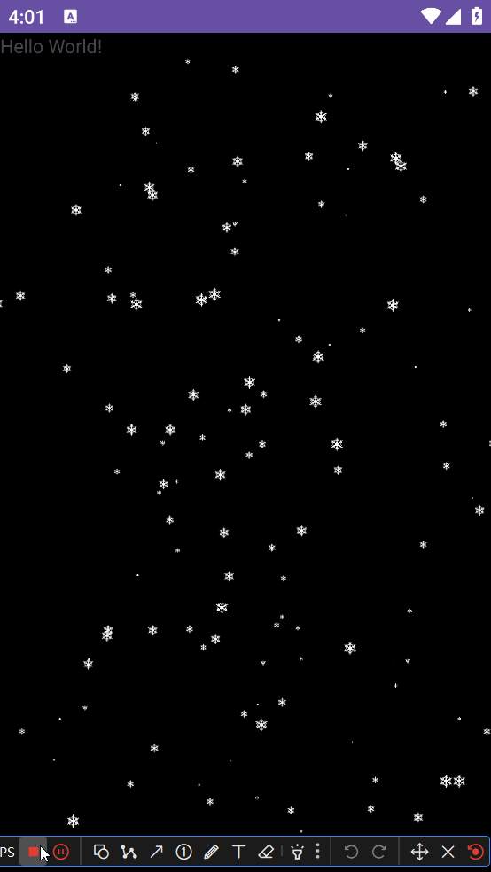

> 参考——https://juejin.cn/post/7441465142607364123#heading-4

# 实现

## 需求分析：

- 一个自定义view用来作为画板
- 不断往view里面添加雪花
- 绘制添加的雪花

## 实现代码

首先绘制view作为画板

```java
package com.yht.yhttest.snowView;

import android.content.Context;
import android.graphics.Canvas;
import android.util.AttributeSet;
import android.view.View;
import android.view.ViewTreeObserver;

import androidx.annotation.NonNull;
import androidx.annotation.Nullable;

import java.util.ArrayList;
import java.util.List;
import java.util.Map;


/**
 * 雪花飘落特效
 */
public class SnowView extends View {


    private List<Snow> snowList;//存放雪花
    private Context mContext;
    private AttributeSet mAttributeSet;

    private int viewWidth;
    private int viewHeight;


    private static final int defaultHeight = 1000;
    private static final int defaultWidth = 600;
    private static final int intervalTime = 5;//重绘时间

    public SnowView(Context context) {
        super(context);
        mContext = context;
        initSnowList();
    }

    public SnowView(Context context, @Nullable AttributeSet attrs) {
        super(context, attrs);
        mContext = context;
        mAttributeSet = attrs;
        initSnowList();
    }

    private void initSnowList() {
        snowList = new ArrayList<>();
    }

    /**
     * 添加雪花
     *
     * @param snow
     * @param num
     */
    public void addSnows(final Snow snow, final int num) {
        getViewTreeObserver().addOnPreDrawListener(new ViewTreeObserver.OnPreDrawListener() {
            @Override
            public boolean onPreDraw() {
                getViewTreeObserver().removeOnPreDrawListener(this);
                for (int i = 0; i < num; i++) {
                    Snow newSnow = new Snow(snow.builder, viewWidth, viewHeight);
                    snowList.add(newSnow);
                }
                invalidate();
                return true;
            }
        });
    }

    @Override
    protected void onMeasure(int widthMeasureSpec, int heightMeasureSpec) {
        super.onMeasure(widthMeasureSpec, heightMeasureSpec);
        //测量宽高
        int height = measureSize(defaultHeight, heightMeasureSpec);
        int width = measureSize(defaultWidth, widthMeasureSpec);
        //设置测量后的宽高
        setMeasuredDimension(width, height);

        viewWidth = width;
        viewHeight = height;

    }

    /**
     * 根据测量规格计算实际尺寸
     *
     * @param defaultSize 默认尺寸
     * @param measureSpec 测量规格
     * @return 计算后的尺寸
     */
    private int measureSize(int defaultSize, int measureSpec) {

        int result = defaultSize;
        int specMode = MeasureSpec.getMode(measureSpec);
        int specSize = MeasureSpec.getSize(measureSpec);
        if (specMode == MeasureSpec.EXACTLY) {
            result = specSize;
        } else if (specMode == MeasureSpec.AT_MOST) {
            result = Math.min(result, specSize);
        }

        return result;
    }

    private Runnable runnable = new Runnable() {
        @Override
        public void run() {
            invalidate();
        }
    };

    @Override
    protected void onDraw(@NonNull Canvas canvas) {
        super.onDraw(canvas);

        if (snowList.size()>0){
            for (int i = 0; i < snowList.size(); i++){
                Snow snow = snowList.get(i);
                snow.drawObject(canvas);
            }

            getHandler().postDelayed(runnable, intervalTime);
        }
    }
}
```

> 关于其中的**`addSnow方法`**
>
> `getViewTreeObserver`：获取与视图关联的`ViewTreeObserver`。**ViewTreeObserver用于监听试图的全局状态变化，如布局变化、绘制前和绘制后等事件**
>
> `addOnPreDrawListener`： 添加一个 `OnPreDrawListener`，在**视图树完成布局测量后、但在绘制到屏幕之前**调用监听器的 `onPreDraw()` 方法。 

雪花实体类

```java
package com.yht.yhttest.snowView;

import android.graphics.Bitmap;
import android.graphics.Canvas;
import android.graphics.Matrix;
import android.graphics.PixelFormat;
import android.graphics.drawable.Drawable;

import java.util.Random;

public class Snow {

    private Random random;
    private int initX;
    private int initY;

    //父容器宽高
    private int parentWidth;
    private int parentHeight;


    //雪花的宽高
    private float snowWidth;
    private float snowHeight;

    public int initSpeed;//初始下降速度
    public int initWindLevel;//初始风力等级

    public float presentX;//当前位置X
    public float presentY;//当前位置Y
    public float presentSpeed;//当前下降速度
    private float angle;//当前角度

    private Bitmap bitmap;
    public Builder builder;

    private boolean isSpeedRandom;//物体初始下降速度比例是否随机
    private boolean isSizeRandom;//物体初始大小比例是否随机
    private boolean isWindRandom;//物体初始风向和风力大小比例是否随机
    private boolean isWindChange;//物体下落过程中风向和风力是否产生随机变化

    private static final int defaultSpeed = 10;//默认下降速度
    private static final int defaultWindLevel = 0;//默认风力等级
    private static final int defaultWindSpeed = 10;//默认单位风速
    private static final float HALF_PI = (float) Math.PI / 2;//π/2


    public Snow(Builder builder, int parentWidth, int parentHeight) {
        random = new Random();
        this.builder = builder;
        this.parentWidth = parentWidth;
        this.parentHeight = parentHeight;
        initX = random.nextInt(parentWidth);
        initY = random.nextInt(parentHeight) - parentHeight;
        presentX = initX;
        presentY = initY;

        isSpeedRandom = builder.isSpeedRandom;
        isSizeRandom = builder.isSizeRandom;
        isWindRandom = builder.isWindRandom;
        isWindChange = builder.isWindChange;
        initSpeed = builder.initSpeed;

        randomSpeed();
        randomSize();
        randomWind();
    }

    private Snow(Builder builder) {
        this.builder = builder;
        initSpeed = builder.initSpeed;
        bitmap = builder.bitmap;

        isSpeedRandom = builder.isSpeedRandom;
        isSizeRandom = builder.isSizeRandom;
        isWindRandom = builder.isWindRandom;
        isWindChange = builder.isWindChange;
    }

    public static final class Builder {
        private int initSpeed;
        private int initWindLevel;
        private Bitmap bitmap;

        private boolean isSpeedRandom;
        private boolean isSizeRandom;
        private boolean isWindRandom;
        private boolean isWindChange;

        public Builder(Bitmap bitmap) {
            this.initSpeed = defaultSpeed;
            this.initWindLevel = defaultWindLevel;
            this.bitmap = bitmap;

            this.isSpeedRandom = false;
            this.isSizeRandom = false;
            this.isWindRandom = false;
            this.isWindChange = false;
        }

        public Builder(Drawable drawable) {
            this.initSpeed = defaultSpeed;
            this.initWindLevel = defaultWindLevel;
            this.bitmap = drawableToBitmap(drawable);

            this.isSpeedRandom = false;
            this.isSizeRandom = false;
            this.isWindRandom = false;
            this.isWindChange = false;
        }

        /**
         * 设置物体的初始下落速度
         *
         * @param speed
         * @return
         */
        public Builder setSpeed(int speed) {
            this.initSpeed = speed;
            return this;
        }

        /**
         * 设置物体的初始下落速度
         *
         * @param speed
         * @param isRandomSpeed 物体初始下降速度比例是否随机
         * @return
         */
        public Builder setSpeed(int speed, boolean isRandomSpeed) {
            this.initSpeed = speed;
            this.isSpeedRandom = isRandomSpeed;
            return this;
        }

        /**
         * 设置物体大小
         *
         * @param w
         * @param h
         * @return
         */
        public Builder setSize(int w, int h) {
            this.bitmap = changeBitmapSize(this.bitmap, w, h);
            return this;
        }

        /**
         * 设置物体大小
         *
         * @param w
         * @param h
         * @param isRandomSize 物体初始大小比例是否随机
         * @return
         */
        public Builder setSize(int w, int h, boolean isRandomSize) {
            this.bitmap = changeBitmapSize(this.bitmap, w, h);
            this.isSizeRandom = isRandomSize;
            return this;
        }

        /**
         * 设置风力等级、方向以及随机因素
         *
         * @param level        风力等级（绝对值为 5 时效果会比较好），为正时风从左向右吹（物体向X轴正方向偏移），为负时则相反
         * @param isWindRandom 物体初始风向和风力大小比例是否随机
         * @param isWindChange 在物体下落过程中风的风向和风力是否会产生随机变化
         * @return
         */
        public Builder setWind(int level, boolean isWindRandom, boolean isWindChange) {
            this.initWindLevel = level;
            this.isWindRandom = isWindRandom;
            this.isWindChange = isWindChange;
            return this;
        }

        public Snow build() {
            return new Snow(this);
        }
    }


    /**
     * 移动物体对象
     */
    private void moveObject() {
        moveX();
        moveY();
        if (presentY > parentHeight || presentX < -bitmap.getWidth() || presentX > parentWidth + bitmap.getWidth()) {
            reset();
        }
    }

    /**
     * X轴上的移动逻辑
     */
    private void moveX() {
        presentX += defaultWindSpeed * Math.sin(angle);
        if (isWindChange) {
            angle += (float) (random.nextBoolean() ? -1 : 1) * Math.random() * 0.0025;
        }
    }

    /**
     * Y轴上的移动逻辑
     */
    private void moveY() {
        presentY += presentSpeed;
    }

    /**
     * 重置object位置
     */
    private void reset() {
        presentY = -snowHeight;
        randomSpeed();//记得重置时速度也一起重置，这样效果会好很多
        randomWind();//记得重置一下初始角度，不然雪花会越下越少（因为角度累加会让雪花越下越偏）
    }

    /**
     * 随机物体初始下落速度
     */
    private void randomSpeed() {
        if (isSpeedRandom) {
            presentSpeed = (float) ((random.nextInt(3) + 1) * 0.1 + 1) * initSpeed;//这些随机数大家可以按自己的需要进行调整
        } else {
            presentSpeed = initSpeed;
        }
    }

    /**
     * 随机风的风向和风力大小比例，即随机物体初始下落角度
     */
    private void randomWind() {
        if (isWindRandom) {
            angle = (float) ((random.nextBoolean() ? -1 : 1) * Math.random() * initWindLevel / 50);
        } else {
            angle = (float) initWindLevel / 50;
        }

        //限制angle的最大最小值
        if (angle > HALF_PI) {
            angle = HALF_PI;
        } else if (angle < -HALF_PI) {
            angle = -HALF_PI;
        }
    }

    /**
     * 随机物体初始大小比例
     */
    private void randomSize() {
        if (isSizeRandom) {
            float r = (random.nextInt(10) + 1) * 0.1f;
            float rW = r * builder.bitmap.getWidth();
            float rH = r * builder.bitmap.getHeight();
            bitmap = changeBitmapSize(builder.bitmap, (int) rW, (int) rH);
        } else {
            bitmap = builder.bitmap;
        }
        snowWidth = bitmap.getWidth();
        snowHeight = bitmap.getHeight();
    }

    /**
     * 改变bitmap的大小
     *
     * @param bitmap 目标bitmap
     * @param newW   目标宽度
     * @param newH   目标高度
     * @return
     */
    public static Bitmap changeBitmapSize(Bitmap bitmap, int newW, int newH) {
        // 获取原始Bitmap的宽度和高度
        int oldW = bitmap.getWidth();
        int oldH = bitmap.getHeight();

        // 计算宽度和高度的缩放比例
        float scaleWidth = ((float) newW) / oldW;
        float scaleHeight = ((float) newH) / oldH;

        // 创建一个Matrix对象，用于定义缩放的转换
        Matrix matrix = new Matrix();
        // 设置Matrix的缩放比例
        matrix.postScale(scaleWidth, scaleHeight);

        // 使用Matrix对原始Bitmap进行缩放，生成新的Bitmap
        // 参数说明：
        // bitmap: 原始Bitmap
        // 0, 0: 从原始Bitmap的左上角开始裁剪
        // oldW, oldH: 裁剪区域的宽度和高度（即整个原始Bitmap）
        // matrix: 定义缩放转换的Matrix对象
        // true: 指定是否过滤Bitmap（开启抗锯齿效果，使缩放后的图像更平滑）
        bitmap = Bitmap.createBitmap(bitmap, 0, 0, oldW, oldH, matrix, true);
        return bitmap;
    }
    /**
     * drawable图片资源转bitmap
     *
     * @param drawable
     * @return
     */
    public static Bitmap drawableToBitmap(Drawable drawable) {
        // 创建一个与 Drawable 大小相同的 Bitmap
        Bitmap bitmap = Bitmap.createBitmap(
                drawable.getIntrinsicWidth(),  // 获取 Drawable 的原始宽度
                drawable.getIntrinsicHeight(), // 获取 Drawable 的原始高度
                drawable.getOpacity() != PixelFormat.OPAQUE
                        ? Bitmap.Config.ARGB_8888    // 如果 Drawable 不是完全不透明，使用 ARGB_8888 配置
                        : Bitmap.Config.RGB_565      // 否则，使用 RGB_565 配置以节省内存
        );

        // 创建一个 Canvas 对象，并将其绑定到刚刚创建的 Bitmap 上
        Canvas canvas = new Canvas(bitmap);

        // 设置 Drawable 的绘制边界为 Bitmap 的全尺寸
        drawable.setBounds(0, 0, drawable.getIntrinsicWidth(), drawable.getIntrinsicHeight());

        // 在 Canvas 上绘制 Drawable，这将渲染到 Bitmap 中
        drawable.draw(canvas);

        // 返回转换后的 Bitmap 对象
        return bitmap;
    }

    /**
     * 绘制物体对象
     *
     * @param canvas
     */
    public void drawObject(Canvas canvas) {
        moveObject();
        canvas.drawBitmap(bitmap, presentX, presentY, null);
    }

}
```


## 实现效果




# 问题：

## 1.drawable和bitmap互相转化问题

> 见Bitmap与图片

## 2.bitmap的缩放

> 见Bitmap与图片

## 3.canvas画bitmap

canvas一般需要绑定一个bitmap，然后画到该bitmap上，之后将绘制结果渲染到具体的ImageView上面

```kotlin
val imageView = ImageView(this)
val bitmapTest = BitmapTest()
val bitmap = bitmapTest.drawable2bitmap(getDrawable(R.drawable.ic_launcher_background))

val outputBitmap =
Bitmap.createBitmap(bitmap.width, bitmap.height, Bitmap.Config.ARGB_8888)

// 创建 Canvas，并与 outputBitmap 绑定
val canvas = Canvas(outputBitmap)

//绘制
canvas.drawBitmap(bitmap, 0f, 0f, null)

// 将绘制结果设置到 ImageView
imageView.setImageBitmap(outputBitmap)

// 将 ImageView 添加到布局
setContentView(imageView)
```

