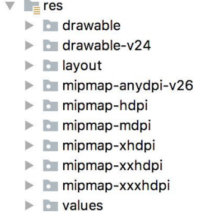

# 一、项目配置问题


## 1.配置和修改AS缓存路径

1.修改.android和.AndroidStudio相关的缓存路径可以参考 

https://blog.csdn.net/xx326664162/article/details/52004676 


### **配置gradle路径**


## 2.Manifest出现屎黄色

在module的build.gradle的android{}里面添加 

```groovy
android{ 
    lintOptions { 
        disable 'GoogleAppIndexingWarning' 
    } 
}	
```


## 3.安装Apk出现问题 

新版本Android Studio运行APK时，出现DELETE_FAILED_INTERNAL_ERROR， Error while Installing 

APKs如何解决。 

有一种方法：打开settings，找到Build>Instant Run,把右边的勾去掉，再次尝试安装。 

## 4.解决build running速度慢的问题

在 .gradle目录下新建一个文件名为gradle.properties的文件 

添加以下内容 

```properties
org.gradle.daemon=true
```

**性能优化参考：** 

https://www.jianshu.com/p/d4790161c6e3 

切记，如果需要更新依赖或者下载虚拟机，最好不要勾选offline work 

## 5.AS扫描不到外部设备，无法在真机上运行 

1.在SDK manager里面下载google usb driver 

2.在资源管理器更新ADB INTERFACE驱动，并且选择在本地计算机上扫描，然后找到下载的USB Driver 文件夹，进行安装更新 

3.在安卓手机上：设置-》关于手机-》连续点击版本号会开启开发者模式 

然后在开发者模式选项里面开启USB调试即可 

（https://jingyan.baidu.com/article/c275f6ba71db93e33d75672b.html）


## 6.编译失败

### 1.添加国内镜像

```groovy
// Top-level build file where you can add configuration options common to all sub-projects/modules.
buildscript {
    repositories {
        maven { url 'https://maven.aliyun.com/repository/public' }
        maven { url 'https://maven.aliyun.com/repository/public' }
        maven { url 'https://maven.aliyun.com/repository/google' }
        maven { url 'https://maven.aliyun.com/repository/gradle-plugin' }
 
        google()
        mavenCentral()
        jcenter()
    }
    dependencies {
        classpath "com.android.tools.build:gradle:7.0.2"
        classpath "org.jetbrains.kotlin:kotlin-gradle-plugin:1.5.20"
 
    }
}
 
 
 
task clean(type: Delete) {
    delete rootProject.buildDir
}

```

> 其他可能原因——https://blog.csdn.net/Asgard_Hu/article/details/130060484

### 2.Installed Build Tools revision 34.0.0 is corrupted. Remove and install again using the SDK Manager.

> **参考：**
>
>  [2022年最优解决方案Installed Build Tools revision 31.0.0 is corrupted_unity build-tool 31.0.0 is missing dx](https://blog.csdn.net/wq6ylg08/article/details/121882199) 

根据构建报错信息"34.0.0版本的构建工具缺少了`DX文件`"，以及StackOverflow的解决方案发现，34.0.0版本的构建工具缺少了"dx"和"dx.jar"这两文件，正确的做法就是复制对应路径的"d8"和"d8.jar"这两文件创建副本，并分别改名为"dx"和"dx.jar"，"d8"和"d8.jar"这两文件的大致路径为：

```
{path}\Android\Sdk\build-tools\34.0.0\d8
{path}\Android\Sdk\build-tools\34.0.0\lib\d8.jar
```


## 7.Adroid Gradle Plugin下载不下来

Android 的gradle要下载两个东西：

- **gradle**：`gradle->wrapper`中下载的内容
- **android gradle plugin**：项目下的`build.gradle`中指定的内容

> 两者的版本需要对应
>
> https://blog.csdn.net/djzhao627/article/details/100215805

这里我下载了8.0版本的gradle，然后下载gradle-plugin失败


很奇怪，不知道为什么报这个错，镜像也添加了

**经过测试发现，在我.gradle缓存目录下的gradle.properties文件中设置了代理，删掉内容中的代理即可**


## 8.报错`java.lang.IllegalStateException: Module entity with name: `

解决办法，将`setting.gradle`中的`rootProject.name`修改为和项目一样的名字（大小写），然后注释，再取消注释

```groovy
rootProject.name = "videoInfo" //名称一定要和项目的一致
include ':app'
```


# 二、开发问题

## 1.去掉action bar

修改`Manifest.xml`中`theme`为`NoActionBar`

```xml
<application
...
             android:theme="@style/Theme.AppCompat.NoActionBar"
             >
   .....
</application>
```


## 2.Button修改background为自定义drawable不生效？

> [background为自定义drawable](https://blog.csdn.net/Better_C/article/details/122850043)

```xml
<Button
 .....
        android:background="@drawable/shape_login"
        />
```

修改` res/values/themes.xml `中的

```xml
<!--修改为如下-->
<style name="Theme.VideoInfo" parent="Theme.MaterialComponents.DayNight.Bridge">
```


## 3.http请求拦截报错

**Android P(sdk版本27以上) 限制了明文流量的网络请求，非加密的流量请求都会被系统禁止掉。所以如果当前应用的请求是 htttp 请求，而非 https ,这样就会导系统禁止当前应用进行该请求。**

解决办法，在`res`目录下，创建xml( network_security_config.xml )文件

```xml
<?xml version="1.0" encoding="utf-8"?>
<network-security-config>
    <base-config cleartextTrafficPermitted="true" />
</network-security-config>
```

 在manifest清单文件配置application： 

```xml
<application
...
 android:networkSecurityConfig="@xml/network_security_config"
...
    />
```


## 4.suppressLint注解

`@SuppressLint` 是一个 Android 开发中常用的注解，用于告诉静态分析工具（如Lint）忽略特定的警告或错误，这样就可以避免在代码中出现不必要的警告。通常情况下，Lint会根据一些编码规范和最佳实践来检查你的代码，并提出建议或警告，以帮助你改进代码质量和性能。

使用 `@SuppressLint` 注解可以指示Lint忽略特定的警告或错误，以便你在某些情况下可以有选择地关闭或禁用Lint的某些检查。


## 5.屏幕旋转时候重新启动

当手机屏幕旋转或尺寸变化时候，活动的生命周期会销毁并重新构建，此时系统容易崩溃，数据容易丢失，因此可以生命一个配置

```xml
<activity
          android:name=".activity.HomeActivity"
          android:configChanges="orientation|screenSize" />
<activity
```

android:configChanges 属性用于指定 Activity 在配置更改时是否应该重新启动。


**`android:configChanges="orientation|screenSize" />` 表示 Activity 在以下情况下** **不会** 重新启动：

- **设备旋转**：当用户旋转设备时，Activity 将不会重新启动。

- **屏幕尺寸变化**：当设备的屏幕尺寸发生变化时，例如从手机切换到平板电脑，Activity 将不会重新启动。


# 三、项目结构

## 3.1 manifest.xml文件：

 AndroidManifest.xml 是 Android 应用程序中的一个重要文件，它包含了应用程序的元数据信息和配置。该文件在应用程序的根目录下，主要用途如下： 

 **应用声明：** 在 AndroidManifest.xml 文件中，您需要声明应用程序中的所有组件，例如活动（Activity）、服务（Service）、接收器（BroadcastReceiver）和内容提供者（ContentProvider）。这些声明告诉系统应用程序包含哪些组件以及如何与它们进行交互。 

```xml
<application>
    <activity android:name=".MainActivity">
        <!-- 活动的声明 -->
        <intent-filter>
            <action android:name="android.intent.action.MAIN" />
            <category android:name="android.intent.category.LAUNCHER" />
        </intent-filter>
    </activity>
    <!-- 其他组件的声明 -->
</application>
```

 **权限声明：** AndroidManifest.xml 文件用于声明应用程序需要的系统权限。这些权限声明告诉用户应用程序需要访问某些敏感数据或执行某些敏感操作。用户在安装应用程序时会看到这些权限，并决定是否同意授予。 

```xml
<uses-permission android:name="android.permission.INTERNET" />
```

 **应用程序信息：** 在 AndroidManifest.xml 中，您可以指定应用程序的名称、图标、版本号等信息。 

```xml
<application
    android:label="@string/app_name"
    android:icon="@mipmap/ic_launcher"
    android:theme="@style/AppTheme">
    <!-- 其他应用程序信息 -->
</application>
```

 **应用程序配置：** AndroidManifest.xml 还用于配置应用程序的行为，例如启动模式、清单合并规则等。 

```xml
<activity
    android:name=".MainActivity"
    android:launchMode="singleTop">
    <!-- 其他活动配置 -->
</activity>
```


## **3.2 res**目录下的结构 



### 3.2.1 drawable和mipmap

> [手机屏幕适配和mipmap详解](https://blog.csdn.net/lantiankongmo/article/details/50549128 )

- 所有以“drawable”开头的目录都是用来放图片的
- 所有以“mipmap”开头的目录都是用来放应用图标的
- 所有以“values”开头的目录都是用来放字符串、样式、颜色等配置的，
- 所有以“layout”开头的目录都是用来放布局文件的

> `mipmap`有很多目录的原因是为了适应不同的分辨率，在制作程序的时候， 最好能够给同一张图片提供几个不同分辨率的版本，分别放在这些目录下，然后程序运行的时候，会自动根据当前运行设备分辨率的高低选择加载哪个目录下的图片。
>
> **如果没有这么多分辨率图片，那么可以放到xxhdpi目录，这是目前主流的设备分辨率目录**

> **drawable目录也是相同的道理**，虽然Android Studio没有帮我们自动生成，但是我们应该自己创建`drawable-hdpi`、`drawable-xhdpi`、`drawable-xxhdpi`等目录


### 3.2.2 `values`目录

以`res/values/strings.xml`文件为例，内容如下所示：

```xml
<resources>
 <string name="app_name">HelloWorld</string>
</resources>
```

定义了一个应用程序名的字符串，我们有以下两种方式来引用它。 

- 在代码中通过`R.string.app_name`可以获得该字符串的引用。 

- 在XML中通过`@string/app_name`可以获得该字符串的引用。

> 举一反三，如果是图标就引用mipmap、如果是图片就引用drawable、如果是布局就引用layout
>
> 具体写法可以参考`manifest.xml`

## 3.3 build.gradle

### 3.3.1 app的build.gradle

```groovy
buildscript {
    ext.kotlin_version = '1.3.61'
    repositories {
        google()
        jcenter()
    }
    dependencies {
        classpath 'com.android.tools.build:gradle:3.5.2'
        classpath "org.jetbrains.kotlin:kotlin-gradle-plugin:$kotlin_version"
    }
}
allprojects {
    repositories {
        google()
        jcenter()
    }
}
```

**repositories**

google仓库中包含的主要是Google自家的扩展依赖库，而jcenter仓库中包含的大多是一些第三方的开源库。

> ***Gradle7.5的Maven仓库配置已经从build.gradle文件转移到setting.gradle文件里了，因此该配置要写在setting.gradle文件里***

**dependencies**

classpath声明了两个插件：一个Gradle插件和一个Kotlin插件。

- **因为Gradle并不是专门为构建Android项目而开发的**，Java、C++等很多种项目也可以使用Gradle来构建，因此如果要想使用它来构建Android项目，则需要声明`com.android.tools.build:gradle:版本号`这个插件。
- 另外一个Kotlin插件则表示当前项目是使用Kotlin进行开发的，如果是Java版的Android项目，则不需要声明这个插件

> ***Gradle7.5开始build.gradle文件已经有变化***
>
> ```groovy
> // Top-level build file where you can add configuration options common to all sub-projects/modules.
> plugins {
>     id 'com.android.application' version '8.2.0' apply false
> }
> ```


### 3.3.2 module模块下的build.gradle

```groovy
apply plugin: 'com.android.application'
apply plugin: 'kotlin-android'
apply plugin: 'kotlin-android-extensions'
android {
    compileSdkVersion 29
    buildToolsVersion "29.0.2"
    defaultConfig {
        applicationId "com.example.helloworld"
        minSdkVersion 21
        targetSdkVersion 29
        versionCode 1
        versionName "1.0"
        testInstrumentationRunner "androidx.test.runner.AndroidJUnitRunner"
    }
    buildTypes {
        release {
            minifyEnabled false
            proguardFiles getDefaultProguardFile('proguard-android-optimize.txt'),
                'proguard-rules.pro'
        }
    }
}
dependencies {
    implementation fileTree(dir: 'libs', include: ['*.jar'])
    implementation "org.jetbrains.kotlin:kotlin-stdlib-jdk7:$kotlin_version"
    implementation 'androidx.appcompat:appcompat:1.1.0'
    implementation 'androidx.core:core-ktx:1.1.0'
    implementation 'androidx.constraintlayout:constraintlayout:1.1.3'
    testImplementation 'junit:junit:4.12'
    androidTestImplementation 'androidx.test.ext:junit:1.1.1'
    androidTestImplementation 'androidx.test.espresso:espresso-core:3.2.0'
}
```

下面逐行开始解析

```groovy
apply plugin: 'com.android.application'
```

首先第一行应用了一个插件，一般有两种值可选：

`com.android.application`表示这是一个应用程序模块，`com.android.library`表示这是一个库模块。二者最大的区别在于，应用程序模块是可以直接运行的，库模块只能作为代码库依附于别的应用程序模块来运行

> 高版本的gradle文件有变化，变为如下
>
> ```groovy
> plugins {
>     id 'com.android.application'
> }
> ```

-----

```groovy
apply plugin: 'kotlin-android'
apply plugin: 'kotlin-android-extensions'
```

接下来的两行应用了kotlin-android和kotlin-android-extensions这两个插件。如果想要使用Kotlin来开发Android项目，那么第一个插件就是必须应用的。而第二个插件帮助=实现了一些非常好用的Kotlin扩展功能

-------

```groovy
compileSdkVersion 29
buildToolsVersion "29.0.2"
```

compileSdkVersion用于指定项目的编译版本，这里指定成29表示使用Android 10.0系统的SDK编译。buildToolsVersion用于指定项目构建工具的版本

-----

```groovy
 applicationId "com.example.helloworld"
```

applicationId是每一个应用的唯一标识符，绝对不能重复。

-----

```groovy
minSdkVersion 21
targetSdkVersion 29
```

`minSdkVersion`用于指定项目最低兼容的Android系统版本，这里指定成21表示最低兼容到Android 5.0系统。

`targetSdkVersion`指定的值表示你在该目标版本上已经做过了充分的测试，系统将会为应用程序启用支持的功能和特性。比如Android 6.0系统中引入了运行时权限这个功能，如果将`targetSdkVersion`指定成23或者更高，那么系统就会为程序启用**运行时权限功能**

-----

```groovy
versionCode 1
versionName "1.0"
testInstrumentationRunner "androidx.test.runner.AndroidJUnitRunner"
```

`versionCode`用于指定项目的版本号， 

`versionName`用于指定项目的版本名。

`testInstrumentationRunner`用于在当前项目中启用`JUnit`测试，可以为当前项目编写测试用例，以保证功能的正确性和稳定性。


#### buildTypes闭包

用于指定生成安装文件的相关配置，通常只会有两个子闭包：**一个是debug，一个是release。** 

debug闭包用于指定生成测试版安装文件的配置，release闭包用于指定生成正式版安装文件的配置。另外，debug闭包是可以忽略不写的。

```groovy
release {
    minifyEnabled false
    proguardFiles getDefaultProguardFile('proguard-android-optimize.txt'),'proguard-rules.pro'
}
```

`minifyEnabled`用于指定是否 对项目的代码进行混淆，true表示混淆，false表示不混淆。

`proguardFiles`用于指定混淆时使用的规则文件，这里指定了两个文件：第一个`proguard-android-optimize.txt`是在 

`<Android SDK>/tools/proguard`目录下的，里面是所有项目通用的混淆规则；第二个 `proguard-rules.pro`是在当前项目的根目录下的，里面可以编写当前项目特有的混淆规则。


#### dependeces

- **本地依赖**

  > `implementation fileTree`就是一个本地依赖声明，它表示将`libs`目录下所有`.jar`后缀的文件都添加到项目的构建路径中

- **库依赖**

  > 基本格式是`implementation project`后面加上要依赖的库的名称：
  >
  > ​	比如有一个库模块的名字叫helper，那么添加这个库的依赖关系只需要加入 `implementation project(':helper')`这句声明即可

- **远程依赖**

  > `implementation`则是远程依赖声明，`androidx.appcompat:appcompat:1.1.0`就是一个标准的远程依赖库格式：
  >
  > ​	其中`androidx.appcompat`是域名部分，用于和其他公司的库做区分；`appcompat`是工程名部分，用于和同一个公司中不同的库工程做区分；`1.1.0`是版本号，用于和同一个库不同的版本做区分。


# 四、内存泄漏

> https://blog.csdn.net/weixin_43899792/article/details/124304136