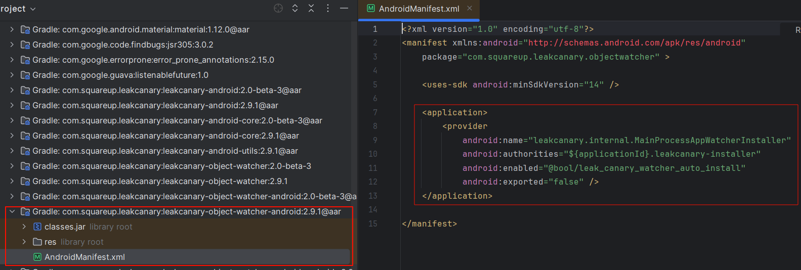
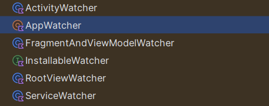

在基于Java的运行时中，内存泄漏是一种编程错误，它导致应用程序保留对不再需要的对象的引用。这会导致为该对象分配的内存无法回收，最终导致`OutOfMemoryError`崩溃。

例如，在Activity的`onDestroy()`方法被调用后，Android activity的实例就不再需要了，此时在静态字段中存储该Activity的引用将阻止其被回收。  


## LeakCanary

> [LeakCanary2](https://juejin.cn/post/7121320019878903816)

LeakCanary 是一个用于检测 Android 应用中内存泄漏的开源工具 

### 1.LeakCanary检测内存泄漏原理

LeakCanary v2 与 v1 的代码由略微的不同，下面是两者的检测内存泄漏的原理。 

LeakCanary Hook 到 **Android lifecycle** 以自动检测 Activitis 和 Fragments 何时被 Destroy 并且被 GC 回收。这些被 Destroy 的对象被传递给一个 `ObjectWatcher`，它持有对它们的弱引用。LeakCanary 能够自动检测以下对象的泄漏： 

- 被销毁的 `Activity`实例
- 被销毁的 `Fragment`实例
- 被销毁的 `fragment View`实例
- 被清除 `ViewModel`实例 可以查看任意一个不再使用的对象，例如 detached view 或 destroyed presenter：

>  **LeakCanary 1.5.1 检测内存泄漏原理**：
> 在`Activity destroy`后将`Activity`的弱引用关联到`ReferenceQueue`中，这样`Activity`将要被GC前，会出现在`ReferenceQueue`中。
> 随后，会向主线程的`MessageQueue`添加一个`IdleHandler`，用于在`idle`时触发一个发生在`HandlerThread`的等待5秒后开始检测内存泄漏的代码：
>
> - 这段代码首先会判断是否对象出现在引用队列`ReferenceQueue`中，如果有，则说明没有内存泄漏，结束。
> - 否则，调用`Runtime.getRuntime().gc()`进行GC，等待100ms后再次判断是否已经出现在引用队列中，若还没有被出现，那么说明有内存泄漏，开始`dump hprof`。 

>  **LeakCanary 2.0 beta 3 检测内存泄漏原理**：
> 在Activity destroy后将Activity的弱引用关联到`ReferenceQueue`中，这样Activity将要被GC前，会出现在`ReferenceQueue`中。
> 随后，会向主线程的抛出一个5秒后执行的`Runnable`，用于检测内存泄漏：
>
> - 首先会将`ReferenceQueue`中出现的对象从观察对象数组中移除，然后再判断要观察的此对象是否存在。若不存在，则说明没有内存泄漏，结束。
> - 否则，就说明可能出现了内存泄漏，会调用`Runtime.getRuntime().gc()`进行GC，等待100ms后再次根据引用队列判断，若仍然出现在引用队列中，那么说明有内存泄漏，此时根据内存泄漏的个数弹出通知或者开始`dump hprof`。 


### 2.使用

#### 依赖引入

```groovy
dependencies {
    // debugImplementation because LeakCanary should only run in debug builds.
    debugImplementation 'com.squareup.leakcanary:leakcanary-android:2.9.1'
}
```

可以打日志来确认`LeakCanary`启动时是否成功

```
D LeakCanary: LeakCanary is running and ready to detect leaks
```

#### 配置LeakCanary

**LeakCanary 2.0 版本后完全使用 Kotlin 重写，只需引入依赖，不需要初始化代码，就能执行内存泄漏检测。**

当然也可以在自定义 Application 的 `onCreate`方法对 LeakCanary 进行一些自定义配置：

```kotlin
class LeakApplication: Application() {
    override fun onCreate() {
        super.onCreate()
        leakCanaryConfig()
    }
    private fun leakCanaryConfig() {
        //App 处于前台时检测保留对象的阈值，默认是 5
        LeakCanary.config = LeakCanary.config.copy(retainedVisibleThreshold = 3)
        //自定义要检测的保留对象类型，默认监测 Activity，Fragment，FragmentViews 和 ViewModels
        AppWatcher.config= AppWatcher.config.copy(watchFragmentViews = false)
        //隐藏泄漏显示活动启动器图标，默认为 true
        LeakCanary.showLeakDisplayActivityLauncherIcon(false)
    }
}
```


#### 检测内存泄漏

举一例非静态内部类导致的内存泄漏，如何使用 LeakCanary 监控其异常，代码如下所示： 

```kotlin
class LeakTestActivity : AppCompatActivity() {
    override fun onCreate(savedInstanceState: Bundle?) {
        super.onCreate(savedInstanceState)
        setContentView(R.layout.activity_leak_test)
        val leakThread = LeakThread()
        leakThread.start()
    }

    // LeakThread 定义为 LeakTestActivity 的内部类
    inner class LeakThread : Thread() {
        override fun run() {
            super.run()
            try {
                //线程内耗时操作
                sleep(6 * 60 * 1000)
            } catch (e: InterruptedException) {
                e.printStackTrace()
            }
        }
    }
}
```

> LeakTestActivity 存在内存泄漏，原因就是非静态内部类 LeakThread 持有外部类 LeakTestActivity 的引用，LeakThread 中做了耗时操作，导致 LeakTestActivity 无法被释放。 

运行 App 程序，接下来跳转到 App 的 LeakTestActivity 页面并不断地切换横竖屏，4 次切换后屏幕会弹出提示：`“Dumping memory app will freeze.Brrrr.”`。再稍等片刻，内存泄漏信息就会通过 Notification 展示出来，如下图所示


notification中提示有1个对象没有回收，点击进入内存泄漏详情页


整个详情就是一个引用链：LeakTestActivity 的内部类 LeakThread 引用了 LeakThread 的 **this$0**，**this$0** 的含义就是内部类自动保留的一个指向所在外部类的引用，而这个外部类就是详情最后一行所给出的 LeakTestActivity 的实例，这将会导致 LeakTestActivity 无法被 GC，从而产生内存泄漏。


解决办法就是改为静态内部类

```kotlin
companion object {
    class LeakThread : Thread() {
        override fun run() {
            super.run()
            try {
                sleep(6 * 60 * 1000)
            } catch (e: InterruptedException) {
                e.printStackTrace()
            }
        }
    }
}
```

### 3.分析

> https://juejin.cn/post/7216227563013226553

LeakCanary 内存泄漏分析过程主要分为：

- 初始化
- 注册 5 种 Android 泄漏场景的监控
- 收到销毁回调后，根据要回收对象创建 `KeyedWeakReference` 并关联 `ReferenceQueue`
- 延迟 5 秒检查相关对象是否被回收
- 如果未被回收则开启服务，`dump heap` 获取内存快照[`.hprof`](#hprof)文件
- 通过 Shark 库解析`.hprof`  文件，获取泄漏对象，计算泄漏对象到`GC roots`的最短路径
- 合并多个泄漏路径并输出分析结果
- 将结果展示到可视化界面


**LeakCanary2**


#### 初始化

旧版本的 LeakCanary 需要在 Application 中调用相关初始化 API，而在 LeakCanary 2.0 利用了 ContentProvider 的启动机制来间接调用初始化 API， 实现了无侵入的 LeakCanary 初始化。 

项目工程 **leakcanary-object-watcher-android** 的 `AndroidManifext.xml`文件中，注册了一个继承自 ContentProvider 的 **MainProcessAppWatcherInstaller**。应用启动时，会先调用注册的 ContentProvider 的 **onCreate** 完成初始化

> **`ContentProvider` 的 `onCreate` 方法会在 `Application` 的 `onCreate` 方法之前被调用**，所以放在`ContentProvider`的`onCreate`里面初始化



在 MainProcessAppWatcherInstaller 类的 onCreate 方法中，实际是 **AppWatcher.manualInstall(application)** 完成了 LeakCanary 的初始化。

```kotlin
//MainProcessAppWatcherInstaller.kt
internal class MainProcessAppWatcherInstaller : ContentProvider() {
    override fun onCreate(): Boolean {
        // 初始化 LeakCanary
        val application = context!!.applicationContext as Application
        AppWatcher.manualInstall(application)
        return true
    }
    ...
}
```


上面代码中的`AppWatcher.manualInstall(application)`执行初始化具体流程

```kotlin
@JvmOverloads
fun manualInstall(
  application: Application,
  retainedDelayMillis: Long = TimeUnit.SECONDS.toMillis(5),
  watchersToInstall: List<InstallableWatcher> = appDefaultWatchers(application)//五种泄漏情况列表
) {
  // 确保在主线程，否则抛出 UnsupportedOperationException 异常
  checkMainThread()
  if (isInstalled) {
    throw IllegalStateException(
      "AppWatcher already installed, see exception cause for prior install call", installCause
    )
  }
  check(retainedDelayMillis >= 0) {
    "retainedDelayMillis $retainedDelayMillis must be at least 0 ms"
  }
  this.retainedDelayMillis = retainedDelayMillis
  if (application.isDebuggableBuild) {
    LogcatSharkLog.install()
  }
  // 初始化 InternalLeakCanary 内部引擎
  LeakCanaryDelegate.loadLeakCanary(application)
  // 注册 5 种 Android 泄漏场景的监控 Hook 点
  watchersToInstall.forEach {
    it.install()
  }
  // Only install after we're fully done with init.
  installCause = RuntimeException("manualInstall() first called here")
}
```

**LeakCanary 的初始化工程可以概括为 2 项内容：**

- 初始化 LeakCanary 内部分析引擎；
- 在 Android Framework 上注册 5 种 Android 泄漏场景的监控。


#### 注册5种泄漏情况



```kotlin
//AppWatcher
fun appDefaultWatchers(
  application: Application,
  reachabilityWatcher: ReachabilityWatcher = objectWatcher
): List<InstallableWatcher> {
  return listOf(
    ActivityWatcher(application, reachabilityWatcher),
    FragmentAndViewModelWatcher(application, reachabilityWatcher),
    RootViewWatcher(reachabilityWatcher),
    ServiceWatcher(reachabilityWatcher)
  )
}
```


**Activity回收监控**

在 **ActivityWatcher** 类中 通过 `Application#registerActivityLifecycleCallbacks(…)` 接口监听 `Activity#onDestroy` 事件； 


**Fragment 与 Fragment View 回收监控：**

在 **FragmentAndViewModelWatcher** 类中通过 `Application#registerActivityLifecycleCallbacks(…)` 接口监听 Fragment 的生命周期： 


**ViewModel 监控**

由于 Android Framework 未提供设置 `ViewModel#onClear()` 全局监听的方法，所以 LeakCanary 是通过 Hook 的方式实现。即：在 `Activity#onCreate` 和 `Fragment#onCreate` 事件中实例化一个自定义 ViewModel，在进入 `ViewModel#onClear()` 方法时，通过反射获取当前作用域中所有的 ViewModel 对象交给 ObjectWatcher 监控。

**RootView 监控**

由于 Android Framework 未提供设置全局监听 RootView 从 WindowManager 中移除的方法，所以 LeakCanary 是通过 Hook 的方式实现的，这一块是通过 `squareup` 另一个开源库 `curtains` 实现的。RootView 监控这部分源码也比较复杂了，需要通过 2 步 Hook 来实现：

- Hook WMS 服务内部的 `WindowManagerGlobal.mViews` RootView 列表，获取 RootView 新增和移除的时机；
- 检查 View 对应的 Window 类型，如果是 Dialog 或 DreamService 等类型，则在注册 `View#addOnAttachStateChangeListener()` 监听，在其中的 onViewDetachedFromWindow() 回调中将 View 对象交给 ObjectWatcher 监控。


**Service 回收监听**

由于 Android Framework 未提供设置 `Service#onDestroy()` 全局监听的方法，所以 LeakCanary 是通过 Hook 的方式实现的。

Service 监控这部分源码比较复杂，需要通过 2 步 Hook 来实现：

- 1、Hook 主线程消息循环的 `mH.mCallback` 回调，监听其中的 STOP_SERVICE 消息，将要 Destroy 的 Service 对象暂存起来（由于 ActivityThread.H 中没有 DESTROY_SERVICE 消息，所以不能直接监听到 onDestroy() 事件，需要第 2 步）；
- 2、使用动态代理 Hook AMS 与 App 通信的的 `IActivityManager` Binder 对象，代理其中的 `serviceDoneExecuting()` 方法，视为 Service#onDestroy() 的执行时机，拿到暂存的 Service 对象交给 ObjectWatcher 监控。 ServiceWatcher.kt


**至此，LeakCanary 初始化完成，并且成功在 Android Framework 的各个位置安插监控，实现对 Activity 和 Service 等对象进入无用状态的监听。** 


#### 监控内存泄漏

完成以上步骤后，会交给 `ObjectWatcher` 监控，它主要通过以下 3 步来判断对象是否泄漏：

- **1.** 为被监控对象 `watchedObject` 创建一个 `KeyedWeakReference` 弱引用，并存储到 <UUID, KeyedWeakReference> 的映射表中；
- **2.** `postDelay 5s`后检查引用对象是否出现在引用队列中，出现在队列则说明被监控对象未发生泄漏。随后，移除映射表中未泄露的记录，更新泄漏的引用对象的 `retainedUptimeMillis` 字段以标记为泄漏；
- **3.** 通过回调 `onObjectRetained` 告知 LeakCanary 内部发生新的内存泄漏。


#### Dump heap 获取内存快照文件

ObjectWatcher 判定被监控对象发生泄漏后，会通过接口方法 `OnObjectRetainedListener#onObjectRetained()` 回调到 LeakCanary 内部的管理器 `InternalLeakCanary` 处理（在前文 `AppWatcher` 初始化中提到过）。LeakCanary 不会每次发现内存泄漏对象都进行分析工作，而会进行两个拦截：

- **1. 泄漏对象计数未达到阈值，或者进入后台时间未达到阈值；**
- **2. 计算距离上一次 HeapDump 未超过 60s。**


#### 分析堆快照

在前面的工作中，LeakCanary 已经成功生成 `.hprof` 堆快照文件，并且发送了一个 LeakCanary 内部事件 `HeapDump`。LeakCanary 的配置项中设置了多个事件消费者 EventListener，其中与 HeapDump 事件有关的是 `when{}` 代码块中三个消费者。不过，这三个消费者并不是并存的，而是会根据 App 当前的依赖项而选择最优的执行策略：

- **1 - WorkerManager 多进程分析**
- **2 - WorkManager 异步分析**
- **3 - 异步线程分析（兜底策略）** LeakCanary 配置项中的事件消费者：

> 不管采用那种执行策略，最终执行的逻辑都是一样的：
>
> - 分析堆快照；
> - 发送分析进度事件；
> - 发送分析完成事件。


#### 输出分析报告

LeakCanary 会使用 ObjectInspector 对象检索器在引用链上的节点中标记必要的信息和状态，标记信息会显示在分析报告中，并且会影响报告中的提示。而引用链 `LEAKING` 节点以后到第一个 `NOT_LEAKING` 节点中间的节点，才会用 `~~~` 下划线标记为怀疑对象。


## 打印heap快照

```kotlin
fun generateHprof(filePath: String) {
    try {
        // 生成堆转储文件
        Debug.dumpHprofData(filePath)
        Log.d("HprofGenerator", "Heap dump generated at: $filePath")
    } catch (e: Exception) {
        e.printStackTrace()
        Log.e("HprofGenerator", "Failed to generate heap dump: " + e.message)
    }
}
```

然后用`Android Profier`分析


问了mistral，还可以使用其他工具分析

> **1.Eclipse MAT（Memory Analyzer Tool）**
>
> Eclipse MAT是一个功能强大的内存分析工具，专门用于分析堆转储文件。它提供了详细的内存分析功能，可以帮助你找出内存泄漏和其他内存相关问题。 
>
> **2.VisualVM**
>
> VisualVM是一个功能强大的图形化工具，可以用于分析堆转储文件、监控JVM性能等。 
>
> **3. jhat（Java Heap Analysis Tool）**
>
> jhat是一个命令行工具，可以用于分析堆转储文件。它提供了一个简单的HTTP服务器，可以通过浏览器查看内存使用情况。
>
> **4. Shark库**
>
> Shark库是一个用于解析和分析HPROF文件的Java库。它提供了一组工具和API，使开发者能够以编程方式访问和处理HPROF文件中的数据。


## 补充

### 1.<a name="hprof">hprof</a>

HPROF（Heap/CPU Profiling Format）文件是Java虚拟机（JVM）生成的一种二进制文件格式，用于存储堆内存快照和CPU分析数据。这些文件通常用于性能分析和内存泄漏检测。HPROF文件可以通过JVM参数生成，并且可以使用各种工具进行分析。 

**生成hprof文件**

要生成HPROF文件，可以在启动Java应用程序时添加特定的JVM参数。例如： 

```shell
java -Xmx1024m -Xms512m -XX:+HeapDumpOnOutOfMemoryError -XX:HeapDumpPath=/path/to/dump.hprof -cp your-app.jar YourMainClass
```

> - `-Xmx1024m` 和 `-Xms512m` 设置了最大和初始堆内存大小。
> - `-XX:+HeapDumpOnOutOfMemoryError` 指示JVM在发生内存溢出错误时生成堆转储文件。
> - `-XX:HeapDumpPath=/path/to/dump.hprof` 指定了生成的HPROF文件的路径。