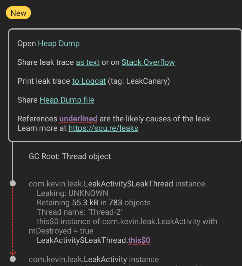

在基于Java的运行时中，内存泄漏是一种编程错误，它导致应用程序保留对不再需要的对象的引用。这会导致为该对象分配的内存无法回收，最终导致`OutOfMemoryError`崩溃。

例如，在Activity的`onDestroy()`方法被调用后，Android activity的实例就不再需要了，此时在静态字段中存储该Activity的引用将阻止其被回收。  


## LeakCanary

> [LeakCanary2](https://juejin.cn/post/7121320019878903816)

LeakCanary 是一个用于检测 Android 应用中内存泄漏的开源工具 

### 1.LeakCanary检测内存泄漏原理

LeakCanary v2 与 v1 的代码由略微的不同，下面是两者的检测内存泄漏的原理。 

LeakCanary Hook 到 **Android lifecycle** 以自动检测 Activitis 和 Fragments 何时被 Destroy 并且被 GC 回收。这些被 Destroy 的对象被传递给一个 `ObjectWatcher`，它持有对它们的弱引用。LeakCanary 能够自动检测以下对象的泄漏： 

- 被销毁的 `Activity`实例
- 被销毁的 `Fragment`实例
- 被销毁的 `fragment View`实例
- 被清除 `ViewModel`实例 可以查看任意一个不再使用的对象，例如 detached view 或 destroyed presenter：

>  **LeakCanary 1.5.1 检测内存泄漏原理**：
> 在`Activity destroy`后将`Activity`的弱引用关联到`ReferenceQueue`中，这样`Activity`将要被GC前，会出现在`ReferenceQueue`中。
> 随后，会向主线程的`MessageQueue`添加一个`IdleHandler`，用于在`idle`时触发一个发生在`HandlerThread`的等待5秒后开始检测内存泄漏的代码：
>
> - 这段代码首先会判断是否对象出现在引用队列`ReferenceQueue`中，如果有，则说明没有内存泄漏，结束。
> - 否则，调用`Runtime.getRuntime().gc()`进行GC，等待100ms后再次判断是否已经出现在引用队列中，若还没有被出现，那么说明有内存泄漏，开始`dump hprof`。 

>  **LeakCanary 2.0 beta 3 检测内存泄漏原理**：
> 在Activity destroy后将Activity的弱引用关联到`ReferenceQueue`中，这样Activity将要被GC前，会出现在`ReferenceQueue`中。
> 随后，会向主线程的抛出一个5秒后执行的`Runnable`，用于检测内存泄漏：
>
> - 首先会将`ReferenceQueue`中出现的对象从观察对象数组中移除，然后再判断要观察的此对象是否存在。若不存在，则说明没有内存泄漏，结束。
> - 否则，就说明可能出现了内存泄漏，会调用`Runtime.getRuntime().gc()`进行GC，等待100ms后再次根据引用队列判断，若仍然出现在引用队列中，那么说明有内存泄漏，此时根据内存泄漏的个数弹出通知或者开始`dump hprof`。 


### 2.使用

#### 依赖引入

```groovy
dependencies {
    // debugImplementation because LeakCanary should only run in debug builds.
    debugImplementation 'com.squareup.leakcanary:leakcanary-android:2.9.1'
}
```

可以打日志来确认`LeakCanary`启动时是否成功

```
D LeakCanary: LeakCanary is running and ready to detect leaks
```

#### 配置LeakCanary

**LeakCanary 2.0 版本后完全使用 Kotlin 重写，只需引入依赖，不需要初始化代码，就能执行内存泄漏检测。**

当然也可以在自定义 Application 的 `onCreate`方法对 LeakCanary 进行一些自定义配置：

```kotlin
class LeakApplication: Application() {
    override fun onCreate() {
        super.onCreate()
        leakCanaryConfig()
    }
    private fun leakCanaryConfig() {
        //App 处于前台时检测保留对象的阈值，默认是 5
        LeakCanary.config = LeakCanary.config.copy(retainedVisibleThreshold = 3)
        //自定义要检测的保留对象类型，默认监测 Activity，Fragment，FragmentViews 和 ViewModels
        AppWatcher.config= AppWatcher.config.copy(watchFragmentViews = false)
        //隐藏泄漏显示活动启动器图标，默认为 true
        LeakCanary.showLeakDisplayActivityLauncherIcon(false)
    }
}
```


#### 检测内存泄漏

举一例非静态内部类导致的内存泄漏，如何使用 LeakCanary 监控其异常，代码如下所示： 

```kotlin
class LeakTestActivity : AppCompatActivity() {
    override fun onCreate(savedInstanceState: Bundle?) {
        super.onCreate(savedInstanceState)
        setContentView(R.layout.activity_leak_test)
        val leakThread = LeakThread()
        leakThread.start()
    }

    // LeakThread 定义为 LeakTestActivity 的内部类
    inner class LeakThread : Thread() {
        override fun run() {
            super.run()
            try {
                //线程内耗时操作
                sleep(6 * 60 * 1000)
            } catch (e: InterruptedException) {
                e.printStackTrace()
            }
        }
    }
}
```

> LeakTestActivity 存在内存泄漏，原因就是非静态内部类 LeakThread 持有外部类 LeakTestActivity 的引用，LeakThread 中做了耗时操作，导致 LeakTestActivity 无法被释放。 

运行 App 程序，接下来跳转到 App 的 LeakTestActivity 页面并不断地切换横竖屏，4 次切换后屏幕会弹出提示：`“Dumping memory app will freeze.Brrrr.”`。再稍等片刻，内存泄漏信息就会通过 Notification 展示出来，如下图所示


notification中提示有1个对象没有回收，点击进入内存泄漏详情页


整个详情就是一个引用链：LeakTestActivity 的内部类 LeakThread 引用了 LeakThread 的 **this$0**，**this$0** 的含义就是内部类自动保留的一个指向所在外部类的引用，而这个外部类就是详情最后一行所给出的 LeakTestActivity 的实例，这将会导致 LeakTestActivity 无法被 GC，从而产生内存泄漏。



解决办法就是改为静态内部类

```kotlin
companion object {
    class LeakThread : Thread() {
        override fun run() {
            super.run()
            try {
                sleep(6 * 60 * 1000)
            } catch (e: InterruptedException) {
                e.printStackTrace()
            }
        }
    }
}
```

### 3.分析

> https://juejin.cn/post/7216227563013226553