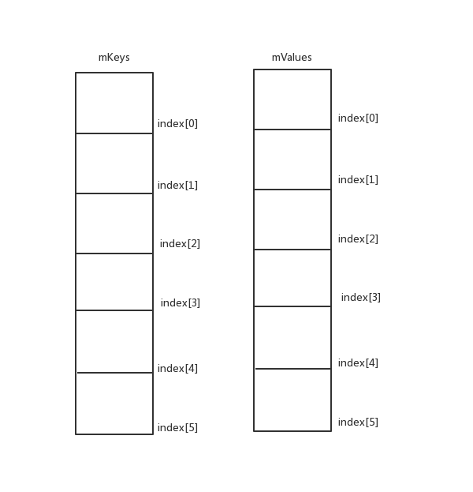

# 性能优化

## 一、数据结构优化

### 传统的集合缺点：

#### 1.Arraylist

- 元素的位移
- 元素的删除

都会设计原数组的移动，损耗性能

#### 2.HashMap

扩容的时候非常耗费性能。因此预估保存的元素，指定扩容因子，避免hash碰撞。

> hashmap默认阈值为`0.75`，当数值达到`length*0.75`时候就会扩容。扩容造成性能下降。

```java
HashMap hashMap = new HashMap(100/0.75 +1)//假设要存入100个元素
```


### 使用Android SDK提供的集合

#### 1.SparseArray

SparseArray 是 Android 在 Android SDK 为我们提供的一个基础的数据结构，其功能类似于 HashMap。与 HashMap 不同的是它的 Key 只能是 int 值，不能是其他的类型。 因此如果要存储的键时integer类型，推荐用SparseArray

SparseArray 使用两个数组来存储数据：

- 键数组：存储键值。（只能是int）` int[] mKeys `
- 值数组：存储值值。` Object[] mValues `


**用法**

用法和HashMap几乎一模一样

但是是按照`key`的大小升序排序，例如：

```java
SparseArray<String> sparseArray = new SparseArray<>();
sparseArray.put(200, "firstValue");
sparseArray.put(100, "secondValue");
```

上述代码当遍历的时候，先取出来的时`secondValue`，因为他的`key`要小一些

>  
>
> 通过index进行匹配 

**插入机制**

>  **基于二分查找确定** 
>
> - 原先的数据是mIndexs = {1, 4, 6, 8}，size为4，要插入的key是7
> - 第一次二分查找返回的index是-3，说明现在的数据中没有这个key，这个key应该被插入index为3的位置
> - 调用GrowingArrayUtils.insert将7插入index为3的位置，实际会引发mKeys扩容到8，原先的key8往右移
>
> 最后的数据是mIndexs = {1, 4, 6 ,7, 8}，保持了有序
>
> ```java
> //源码
> public void put(int key, E value) {
>     // 二分查找找到这次插入的key应该插入哪个位置可以保持整个结构的有序
>     int i = ContainerHelpers.binarySearch(mKeys, mSize, key);
> 
>     if (i >= 0) {
>         // >=0表示在mKeys的前size个元素中找到了key
>         mValues[i] = value;
>     } else {
>         // <0在mKeys的前size个元素中没找到key（前面没有放过这个key的话就会找不到）
>         // 不过返回的i的绝对值表示了key应该放在这个index以保持操作后的数组依然有序
>         i = ~i;
> 
>         // 本次数据应该放入的位置是可用的，直接使用(这个key被标记删除了)
>         if (i < mSize && mValues[i] == DELETED) {
>             mKeys[i] = key;
>             mValues[i] = value;
>             return;
>         }
> 
>         if (mGarbage && mSize >= mKeys.length) {
>             // 真正删除前面标记删除的数据，具体下面会讲到
>             gc();
> 
>             // Search again because indices may have changed.
>             // gc可能改变了底层存储数据的数组的结构，再二分查找一次index
>             i = ~ContainerHelpers.binarySearch(mKeys, mSize, key);
>         }
> 
>         // 真正放入数据，如果mKeys和mValues的长度比i小，会引起扩容
>         // 扩容相关的逻辑看下面分析
>         mKeys = GrowingArrayUtils.insert(mKeys, mSize, i, key);
>         mValues = GrowingArrayUtils.insert(mValues, mSize, i, value);
>         mSize++;
>     }
> }
> ```

**获取元素**

> Sparse能通过`index`查找`value(或者key)`，方法是：
>
> - `valueAt(int index)`
>
> - `keyAt(int index)` 

##### 缺点：

需要转化为json字符串的时候就别用这玩意，转化不回来了，比较坑，非要转化回来，还得设置个中间类。 

#### 2.ArrayMap

