# 一.前言

> https://juejin.cn/post/7216968724938195001

Android 逆向开发是指对已发布的 Android 应用进行分析和破解，以了解应用程序的内部工作原理，获取应用程序的敏感信息，或者修改应用程序的行为。逆向开发可以帮助开发人员了解他人的代码实现，也可以帮助黑客攻击应用程序。

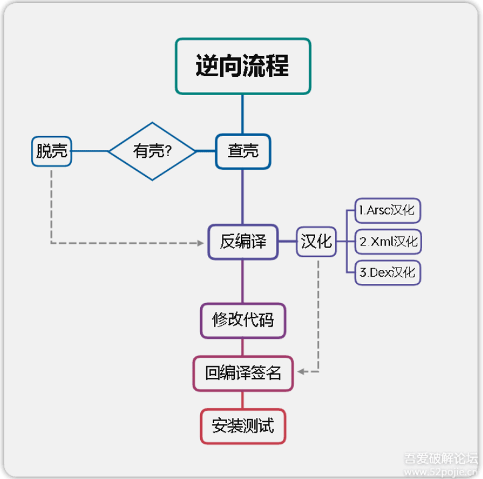

**下面以一个例子来入门测试**

**(1)首先下载ApkTool**

> APKTool 是一个开源的、跨平台的反编译、回编译 Android 应用程序的工具。它能够将 APK 文件解压并还原成 Android 应用程序的资源文件和 Smali 代码，还能将修改后的资源文件和 Smali 代码重新打包成 APK 文件。APKTool 是 Android 应用程序开发和逆向开发的重要工具之一，它能够帮助开发者对 APK 文件进行修改、分析和定制，也能够帮助安全研究人员和黑客对应用程序进行逆向工程和漏洞分析。
>
> > https://github.com/iBotPeaches/Apktool

**(2)apk反编译**

apktool的使用格式

```shell
apktool d [-s] -f <apkPath> -o <folderPath>
```

> - `-o`来指定反编译的输出目录 
> - `d`(也可以使用decode)进行反编译
> - `-f` 如果反编译的目标目录存在，将会被强制清空 
>
> > 更多参考——https://www.jianshu.com/p/9add52acbd05

下载完 jar 后，找一个想要反编译的 apk，然后输入以下命令即可

```shell
java -jar xxx/apktool-2.7.0.jar d xxx/test.apk -o xxx/test 
```

> 这句命令的意思是，将 test.apk 进行反编译，然后输出到 test 目录下，这个文件夹不能够存在，如果要overwrite，应该在`d`后面加上`-f`参数

执行上面命令之后会发现报错

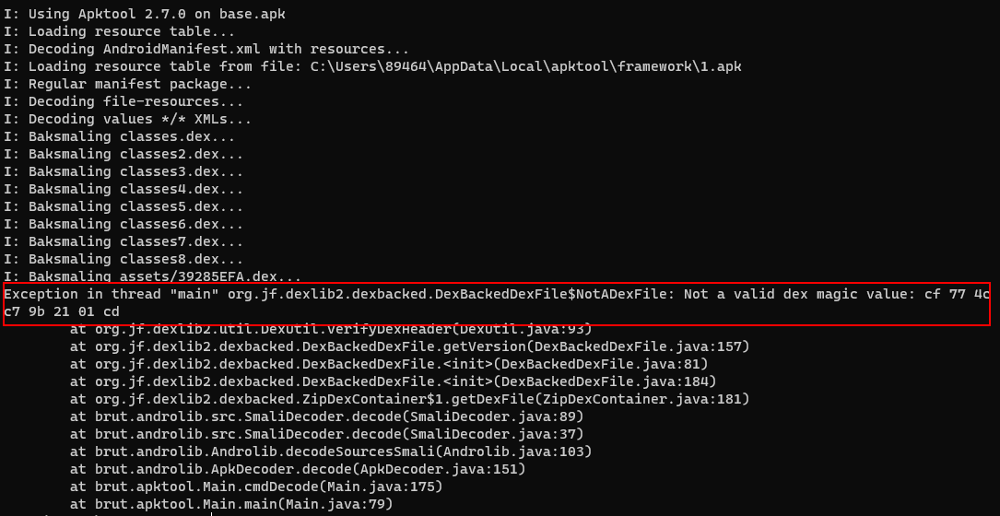

查阅资料发现是因为apk里有加密过后的dex文件，比如有些apk的assets目录下有加密后的Dex文件，添加`–only-main-classes`参数即可 

```shell
java -jar .\apktool_2.7.0.jar d -f D:\KEVIN\base.apk -o D:\KEVIN\reverseFile -only-main-classes
```

## 安卓项目结构

之后可以看到反编译后的文件夹

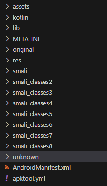

> | 文件            | 解释                                                         |
> | --------------- | ------------------------------------------------------------ |
> | `original` 目录 | 保存了原始的 AndroidManifest.xml 和签名信息                  |
> | `smali` 目录    | 应用程序的 Smali 代码目录，包含了应用程序的所有 Smali 代码文件（Smali 就是字节码） |
> | `lib `目录      | 应用程序的库目录，包含了应用程序需要使用的库文件，例如 so 文件等。 |
> | `apktool.yml`   | 是 APKTool 工具使用的配置文件，用于指定反编译和打包 APK 文件时的各种参数和选项。 |
> | `META-INF`目录  | 主要是和签名相关的目录。                                     |

**(2)重新打包（回编译）**

通过`b(也可以使用build)`进行打包

```shell
java -jar xxx/apktool-2.7.0.jar b xxx/test -o xxx/test2.apk
```

打包生成的apk文件还不可以手机运行，还需要签名，两款签名工具

> - `jarsigner`：是 JDK 自带的工具，**用于给 Java 程序的 jar 包进行数字签名**。该工具可以对 jar 包进行签名、验证签名、查看签名信息等操作。
>
> - `apksigner`：是 Android SDK 自带的工具，**用于给 Android 应用程序进行数字签名**。该工具可以对 APK 文件进行签名、验证签名、查看签名信息等操作。
>
>    
>
>   这两者不同之处在于:
>
>   - `jarsigner` 只能进行 `v1` 签名，
>   -  `apksigner` 可以进行 `v1 + v2 + v3` 签名

**使用APKSigner**

```
打包的jar在下载的as的sdk目录下面
***\SDK\build-tools\30.0.3\lib\apksigner.jar
```

```shell
java -jar sdk/build-tools/33.0.0/lib/apksigner.jar sign --ks "密钥库文件路径" --ks-pass pass:"密钥库密码" --ks-key-alias "密钥别名" --key-pass pass:"密钥别名密码" --out 签名后输出的文件.apk 需要被签名的文件.apk
```

> `sign`：使用 `apksigner` 工具进行数字签名操作
>
> `--ks`：指定签名证书的 keystore 文件路径
>
> `--ks-pass pass`：指定签名证书的 keystore 密码
>
> `--ks-key-alias`：指定签名证书的别名
>
> `--key-pass pass`：指定签名证书的别名密码
>
> `--out`：指定签名后的 APK 文件名

如果想要指定`apksigner`签名方案，按照如下

```shell
java -jar sdk/build-tools/33.0.0/lib/apksigner.jar sign --v1-signing-enabled true --v2-signing-enabled true --v3-signing-enabled true --ks "密钥库文件路径" --ks-pass pass:"密钥库密码" --ks-key-alias "密钥别名" --key-pass pass:"密钥别名密码" --out 签名后输出的文件.apk 需要被签名的文件.apk
```

进行签名验证

```shell
java -jar sdk/build-tools/33.0.0/lib/apksigner.jar sign verify -verbose -print-certs 需要验证签名的文件.apk
```

# 二.52

## 1.环境搭配

> 参考—— https://www.52pojie.cn//forum.php?mod=viewthread&tid=1695141&highlight=%B0%B2%D7%BF%C4%E6%CF%F2

### (1)模拟器

下载的是`雷电模拟器9.0版本`

### (2)Magisk

Magisk 是一套用于定制 Android 的开源软件，支持高于 Android 5.0 的设备。

> 以下是一些功能亮点：
>
> - **MagiskSU**：为应用程序提供 root 访问权限
> - **Magisk 模块**：通过安装模块修改只读分区
> - **MagiskHide**：从根检测 / 系统完整性检查中隐藏 Magisk(Shamiko)
> - **MagiskBoot** : 最完整的安卓启动镜像解包和重新打包工具


#### 在模拟器上安装

> 参考—— https://www.52pojie.cn/thread-1583586-1-1.html

- **首先下载Magisk debug版本**

- **开启模拟器的root权限**

  > 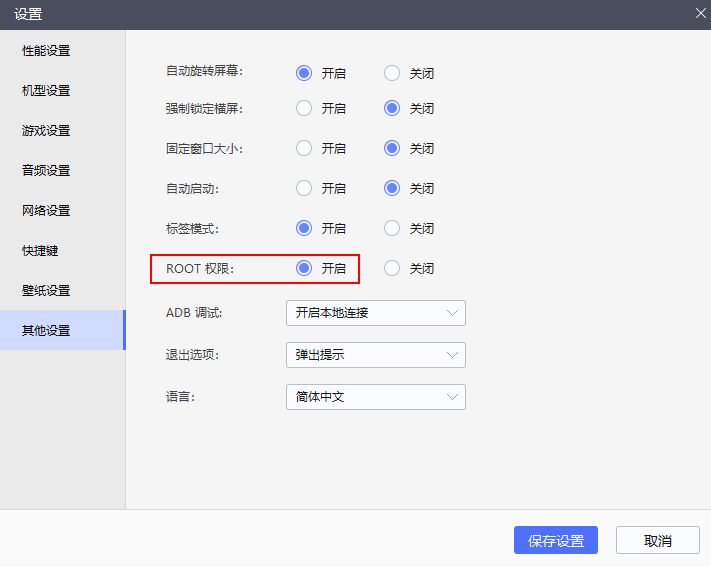

- **将Magisk安装包拖入模拟器，直接可以安装**

  > 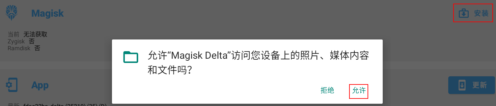
  >
  > 点击允许之后就可以关闭Magisk
  >
  > 再次打开，并且重复上面步骤，并选择安装方式为`安装至系统分区`
  >
  > 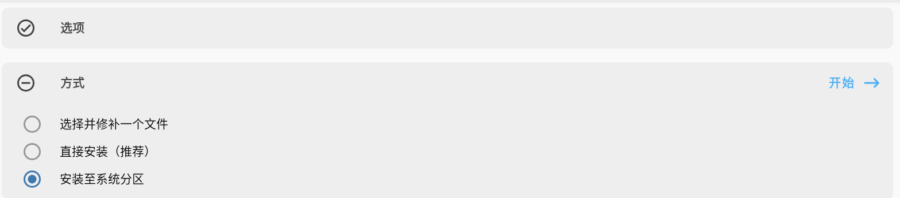
  >
  > 出现安装失败是因为磁盘读写类型要改为可读写
  >
  > 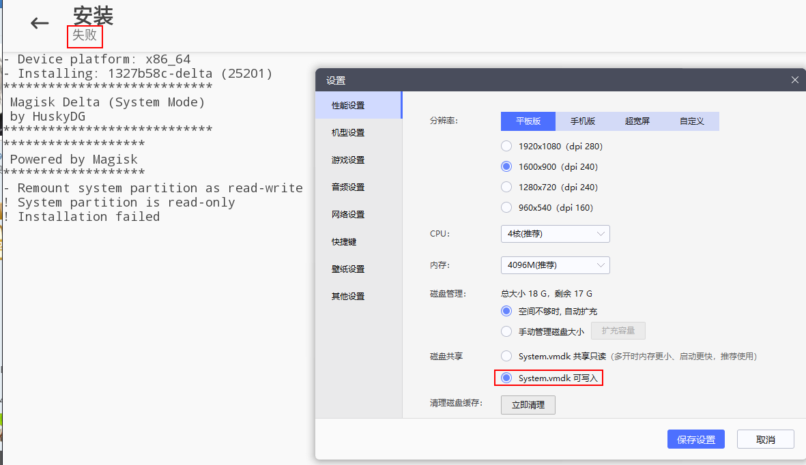
  >
  > 之后就可以安装成功，并直接重启模拟器

  - **重启打开magisk，然后开启`Zygisk`**

  > 

  - **之后下载Hook框架模块**

    > >  https://github.com/LSPosed/LSPosed/releases/download/v1.8.6/LSPosed-v1.8.6-6712-zygisk-release.zip 
    >
    > 将下载好的模块移动到模拟器的共享文件夹里面
    >
    > 
    >
    > 然后在Magisk——模块——从本地安装进行安装，之后重启即可

## 2.APK结构

`APK`相当于压缩文件，将其后缀改为`zip`可解压

| 文件                 | 解释                                                         |
| -------------------- | ------------------------------------------------------------ |
| `lib `目录           | 应用程序的库目录，包含了应用程序需要使用的库文件，例如 so 文件等。 |
| `apktool.yml`        | 是 APKTool 工具使用的配置文件，用于指定反编译和打包 APK 文件时的各种参数和选项。 |
| `META-INF`目录       | 是 APKTool 工具使用的配置文件，用于指定反编译和打包 APK 文件时的各种参数和选项。 |
| `classes.dex`文件    | classes.dex是java源码编译后生成的java字节码文件，APK运行的主要逻辑 |
| `resources.arsc`文件 | resources.arsc是编译后的二进制资源文件，它是一个映射表，映射着资源和id，通过R文件中的id就可以找到对应的资源 |


### 双开

 **简单来说，就是手机同时运行两个或多个相同的应用** 

| 原理                   | 解释                                                         |
| :--------------------- | :----------------------------------------------------------- |
| **修改包名**           | 让手机系统认为这是2个APP，这样的话就能生成2个数据存储路径，此时的多开就等于你打开了两个互不干扰的APP |
| **修改Framework**      | 对于有系统修改权限的厂商，可以修改Framework来实现双开的目的，例如：小米自带多开 |
| **通过虚拟化技术实现** | 虚拟Framework层、虚拟文件系统、模拟Android对组件的管理、虚拟应用进程管理 等一整套虚拟技术，将APK复制一份到虚拟空间中运行，例如：平行空间 |
| **以插件机制运行**     | 利用反射替换，动态代理{过}{滤}，hook了系统的大部分与system—server进程通讯的函数，以此作为“欺上瞒下”的目的，欺骗系统“以为”只有一个apk在运行，瞒过插件让其“认为”自己已经安装。例如：VirtualApp |


**以课件提供的APK为例**

> ①将`MT`管理器，`NP`管理器和要双开的软件安装到模拟器
>
> ②使用`MT`管理器对安装包进行提取
>
> > 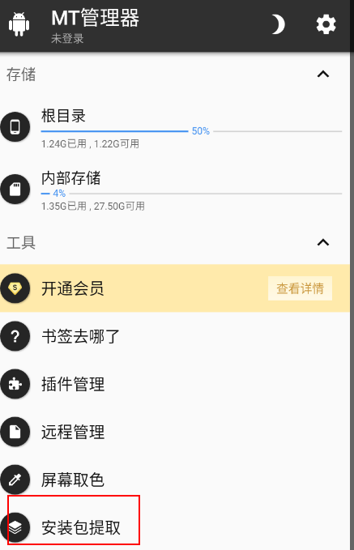
> >
> > 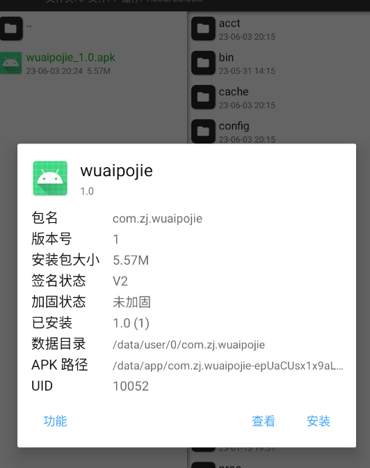
>
> ③提取完之后定位到提取的目录，可以通过`功能->apk共存`修改包名，这样可以实现双开目的
>
> > 
> >
> > 但是发现这是付费功能，所以使用`NP`管理器，同意提取之后进行共存
> >
> > > 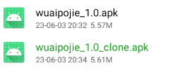
> > >
> > > 生成了一个克隆包，进行安装，就可以实现双开了
> > >
> > > 
>
> **Tips：如果开发者将APK进行了签名校验，那么修改包名后再打开就会出现闪退等问题**


### 汉化

以下面这个小例子分别介绍三种类型文件汉化

- `xml`
- `arsc`
- `dex`


> **①英文汉化**
>
> > 可以通过`MT`进行手动汉化，对于刚才已经提取的apk，进行查看
> >
> > 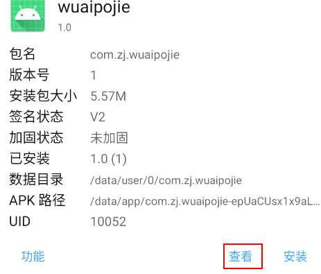
> >
> > 然后利用`MT`的搜索功能，搜索要汉化的关键字
> >
> > 
> >
> > 
> >
> > 然后搜索到是`Jf.xml`里面存在，我们找到这个文件并且反编译。成功定位到要汉化的位置，然后我们修改并且保存更新。
> >
> > 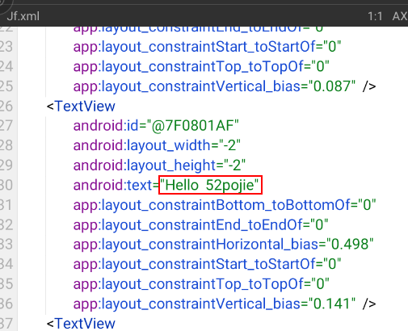
> >
> > 之后重新安装`apk`，发现已经成功汉化英文
> >
> > 
>
> **②其他语言汉化**
>
> 可以看到界面中还有俄语等其他语言，我们可以通过`开发者助手`定位当前页面的资源，然后对文本进行复制
>
> > 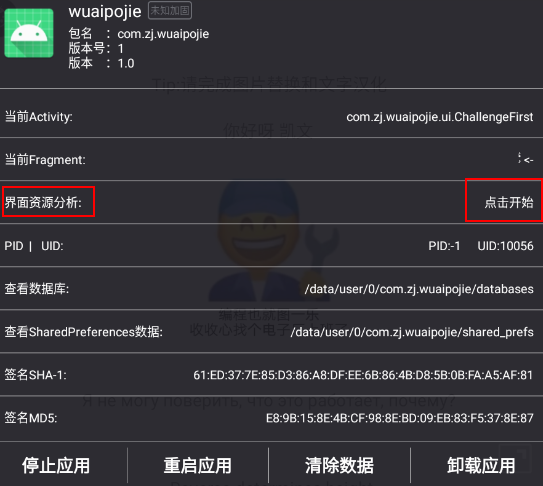
> >
> > 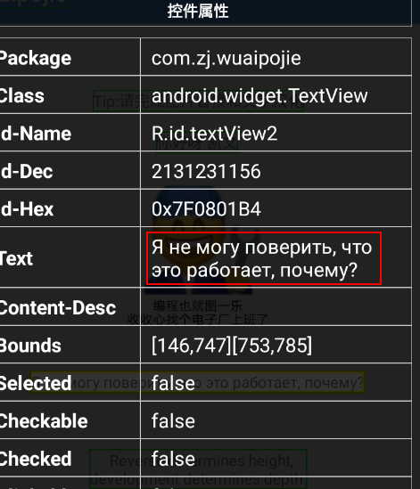
> >
> > 复制然后搜索定位到`resources.arsc`，通过`翻译模式`定位到俄语的位置
> >
> > 
> >
> > 进行替换即可
> >
> > 
>
> **当然，`MT`也带有自动翻译功能，但是需要付费**
>
> 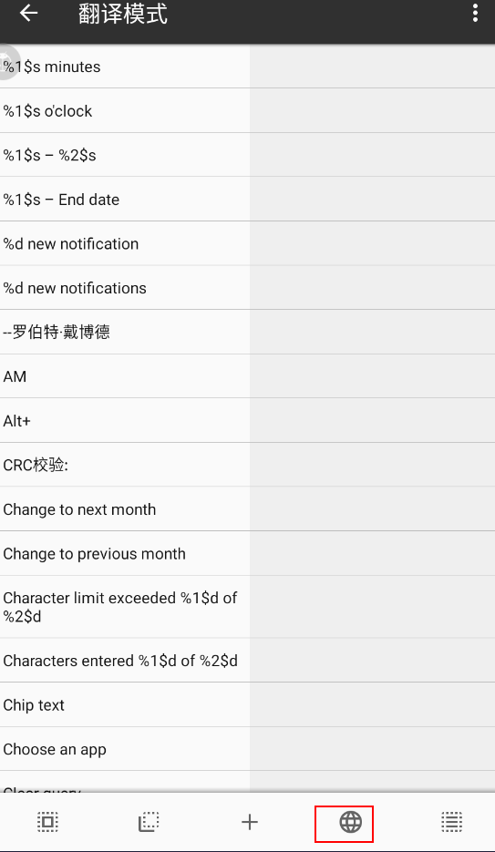
>
> **当然，在翻译时候可以选择翻译插件，插件在左侧抽屉栏的插件管理里(付费功能)**
>
> **③代码字符串汉化**
>
> 最后一行话进行搜索，发现是在`classes.dex`目录里面，然后点击选择`dex编辑器++ -> 搜索 -> 搜索内容字符串`，最终找到包含该字符串的文件
>
> 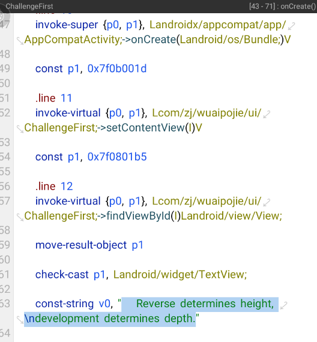
>
> 对其进行修改
>
> 


### 修改包名和图标

在`np管理器->点击apk->功能->通用编辑`进行包名和图标修改

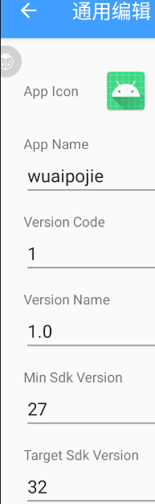


## 3.Dalvik

**Dalvik是Google专门为Android设计的一个虚拟机**，Dalvik有专属的文件执行格式dex(Dalvik executable) 

Dalvik虚拟机只能执行dex文件，因此必须先将Java代码编译成dex文件才能在Dalvik虚拟机上运行

### (1)Smali

> 参考：
>
> [深入Smali文件](https://www.52pojie.cn/thread-396966-1-1.html) 

smali是Dalvik字节码的一种汇编语言，它使用了类似于汇编语言的语法和格式来**描述Dalvik字节码**。smali文件可以使用baksmali工具反编译dex文件得到。也就是说：**smali是Dalvik的寄存器语言，smali代码是dex反编译而来的**

smali是Dalvik的寄存器语言，smali代码是dex反编译而来的 

关键字

| 名称        | 注释                       |
| :---------- | :------------------------- |
| .class      | 类名                       |
| .super      | 父类名，继承的上级类名名称 |
| .source     | 源名                       |
| .field      | 变量                       |
| .method     | 方法名                     |
| .register   | 寄存器                     |
| .end method | 方法名的结束               |
| public      | 公有                       |
| protected   | 半公开，只有同一家人才能用 |
| private     | 私有，只能自己使用         |
| .parameter  | 方法参数                   |
| .prologue   | 方法开始                   |
| .line xxx   | 位于第xxx行                |

> ```JAVA
> .class public Lcom/aaaaa;
> .super Lcom/bbbbb;
> .source "ccccc.java"
> ```
>
> - 这是一个由`ccccc.java`编译得到的smali文件（第3行)
> - 它是`com.aaaaa`这个package下的一个类（第1行)
> - 继承自`com.bbbbb`这个类（第2行)

数据类型对应

| smali类型    | java类型                          | 注释                 |
| :----------- | :-------------------------------- | :------------------- |
| V            | void                              | 无返回值             |
| Z            | boolean                           | 布尔值类型，返回0或1 |
| B            | byte                              | 字节类型，返回字节   |
| S            | short                             | 短整数类型，返回数字 |
| C            | char                              | 字符类型，返回字符   |
| I            | int                               | 整数类型，返回数字   |
| J            | long （64位 需要2个寄存器存储）   | 长整数类型，返回数字 |
| F            | float                             | 单浮点类型，返回数字 |
| D            | double （64位 需要2个寄存器存储） | 双浮点类型，返回数字 |
| string       | String                            | 文本类型，返回字符串 |
| Lxxx/xxx/xxx | object                            | 对象类型，返回对象   |

常用指令

| 关键字       | 注释                                                   |
| :----------- | :----------------------------------------------------- |
| const        | 重写整数属性，真假属性内容，只能是数字类型             |
| const-string | 重写字符串内容                                         |
| const-wide   | 重写长整数类型，多用于修改到期时间。                   |
| return       | 返回指令                                               |
| if-eq        | 全称equal(a=b)，比较寄存器ab内容，相同则跳             |
| if-ne        | 全称not equal(a!=b)，ab内容不相同则跳                  |
| if-eqz       | 全称equal zero(a=0)，z即是0的标记，a等于0则跳          |
| if-nez       | 全称not equal zero(a!=0)，a不等于0则跳                 |
| if-ge        | 全称greater equal(a>=b)，a大于或等于则跳               |
| if-le        | 全称little equal(a<=b)，a小于或等于则跳                |
| goto         | 强制跳到指定位置                                       |
| switch       | 分支跳转，一般会有多个分支线，并根据指令跳转到适当位置 |
| iget         | 获取寄存器数据                                         |


### (2)课程案例

①将要反编译apk拖入jadx-gui进行反编译


②将课件中的`核心破解`安装在模拟器，实现重新安装已经安装过的demo.apk文件

> 核心破解安装成功后要启用模块功能，然后重启
>
> 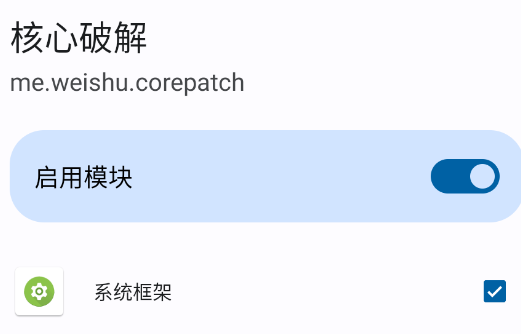
>
> 因为前面安装过`demo.apk`，所以再次安装，签名校验不会通过，因此核心破解就是帮助绕过签名校验

③打开软件，选择关卡后发现，一键三连需要大会员


④在jadx-gui搜索关键字`大会员`，成功定位到这个函数

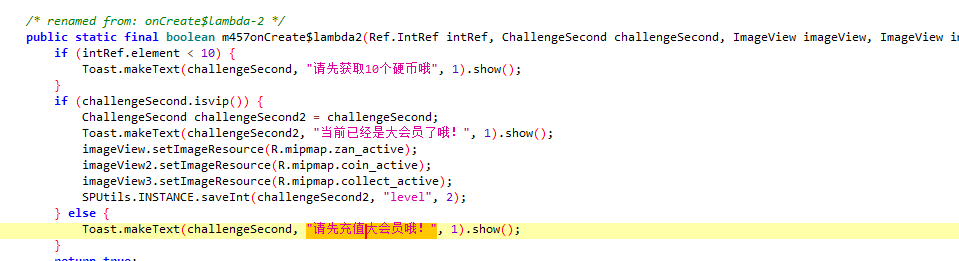

之后切换`smali`代码模式

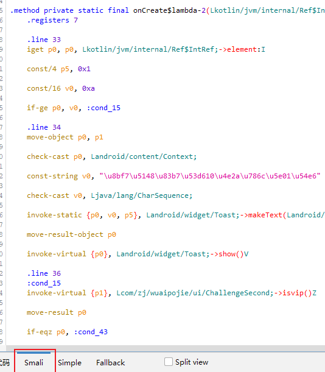

> ```java
> //一个私有、静态、不可变的方法   方法名
> .method private static final onCreate$lambda-2(Lkotlin/jvm/internal/Ref$IntRef;Lcom/zj/wuaipojie/ui/ChallengeSecond;Landroid/widget/ImageView;Landroid/widget/ImageView;Landroid/widget/ImageView;Landroid/view/View;)Z //(这里面是方法的参数)这里是方法返回值类型，表示布尔值类型，返回假或真
>     .registers 7  //寄存器数量
> 
>     .line 33  //代码所在的行数
>     iget p0, p0, Lkotlin/jvm/internal/Ref$IntRef;->element:I  //读取p0(第一个参数，参考寄存器知识)中element的值赋值给p0
> 
>     const/4 p5, 0x1  //p5赋值1
> 
>     const/16 v0, 0xa //v0赋值10，在16进制里a表示10
> 
>     //修改的第一个点
>     if-ge p0, v0, :cond_15  //判断p0的值是否大于或等于v0的值(即p0的值是否大于或等于10)，如果大于或等于则跳转到:cond_15
> 
>     .line 34  //以下是常见的Toast弹窗代码
>     check-cast p1, Landroid/content/Context; //检查Context对象引用
> 
>     const-string p0, "请先获取10个硬币哦" //弹窗文本信息，把""里的字符串数据赋值给p0
> 
>     check-cast p0, Ljava/lang/CharSequence; //检查CharSequence对象引用
> 
>     invoke-static {p1, p0, p5}, Landroid/widget/Toast;->makeText(Landroid/content/Context;Ljava/lang/CharSequence;I)Landroid/widget/Toast; 
>     //将弹窗文本、显示时间等信息传给p1
> 
>     move-result-object p0  //结果传递给p0
> 
>     invoke-virtual {p0}, Landroid/widget/Toast;->show()V  //当看到这个Toast;->show你就应该反应过来这里是弹窗代码
> 
>     goto :goto_31  //跳转到:goto_31
> 
>     :cond_15 //跳转的一个地址，如果跳到:cond_15，则从该行开始执行代码
> 
>     invoke-virtual {p1}, Lcom/zj/wuaipojie/ui/ChallengeSecond;->isvip()Z  //判断isvip方法的返回值是否为真(即结果是否为1)
> 
>     move-result p0  //结果赋值给p0
>     
>     //要修改的第二个点
>     if-eqz p0, :cond_43 //如果结果为0则跳转cond_43地址
> 
>     const p0, 0x7f0d0018  //在arsc中的id索引，这个值可以进行查询
> 
>     .line 37
>     invoke-virtual {p2, p0}, Landroid/widget/ImageView;->setImageResource(I)V //设置图片资源
> 
>     const p0, 0x7f0d0008
> 
>     .line 38
>     invoke-virtual {p3, p0}, Landroid/widget/ImageView;->setImageResource(I)V
> 
>     const p0, 0x7f0d000a
> 
>     .line 39
>     invoke-virtual {p4, p0}, Landroid/widget/ImageView;->setImageResource(I)V
> 
>     .line 40
>     sget-object p0, Lcom/zj/wuaipojie/util/SPUtils;->INSTANCE:Lcom/zj/wuaipojie/util/SPUtils; 
> 
>     check-cast p1, Landroid/content/Context;
> 
>     const/4 p2, 0x2 //p2赋值2
> 
>     const-string p3, "level" //sp的索引
> 
>     invoke-virtual {p0, p1, p3, p2}, Lcom/zj/wuaipojie/util/SPUtils;->saveInt(Landroid/content/Context;Ljava/lang/String;I)V //写入数据
> 
>     goto :goto_50 //跳转地址
> 
>     :cond_43
> 
>     check-cast p1, Landroid/content/Context;
> 
>     const-string p0, "\u8bf7\u5148\u5145\u503c\u5927\u4f1a\u5458\u54e6\uff01" //请先充值大会员哦！
> 
>     check-cast p0, Ljava/lang/CharSequence;
> 
>     invoke-static {p1, p0, p5}, Landroid/widget/Toast;->makeText(Landroid/content/Context;Ljava/lang/CharSequence;I)Landroid/widget/Toast;
> 
>     move-result-object p0
> 
>     invoke-virtual {p0}, Landroid/widget/Toast;->show()V
> 
>     :goto_50
>     return p5  //返回p5的值
> .end method //方法结束
> 
> //判断是否是大会员的方法
> .method public final isvip()Z
>     .registers 2
> 
>     const/4 v0, 0x0 //v0赋值0
> 
>     return v0 //返回v0的值
> 
> .end method
> 
> ```
>
> 通过对比smali语法对这段smali代码进行说明，发现需要修改校验大会员的代码

⑤在MT管理器进行修改


之后保存并且重新安装，可以看到修改成功


⑥也可以利用开发者助手快速定位资源id

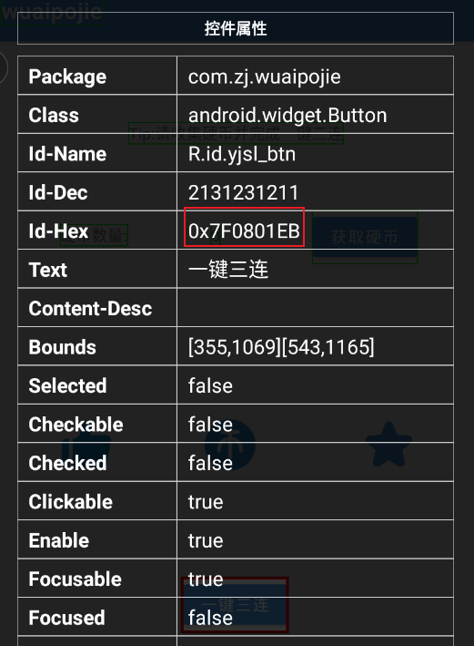

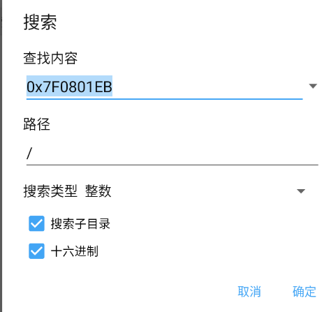


## 4.去广告，弹窗

### 课程案例

#### (1)去广告

**修改activity弹窗时间**

①打开案例demo，发现有广告，利用`MT管理器`的activity追踪，查看广告的activity是什么：


> 发现`AdActivity`
>
> 
>
> 找到这个activity
>
> 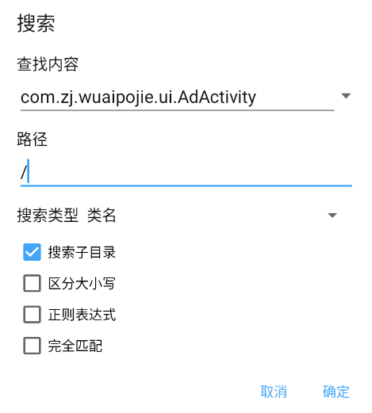
>
> 可以看到有加载广告的时间，改为0
>
> 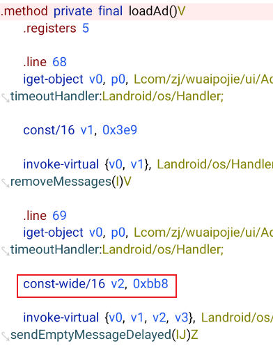
>
> 

**修改Menifest文件主启动类**

> 通过修改menifest的main launcher activity，直接打开应用跳转到要加载的页面
>
> > **tips：这样做可能导致应用崩溃**

**修改跳转代码**

在进入广告页之前，肯定是从父页面跳转过来，所以找到跳转代码修改过滤即可。

> ①长按复制`AdActivity`的类名，然后找到父代码调用它的地方
>
> 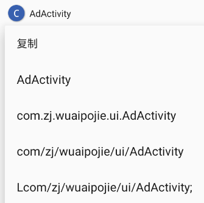
>
> ②定位到`challengeAdapter`
>
> 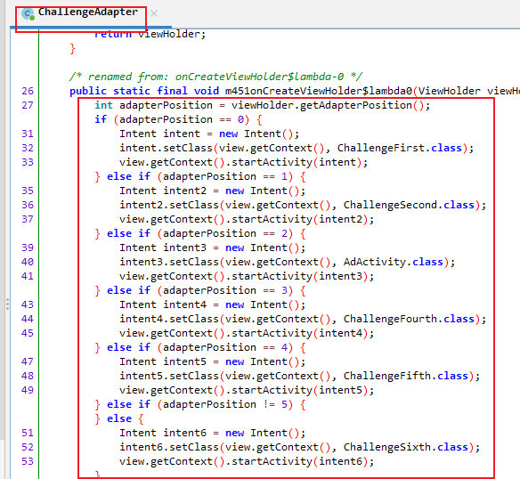
>
> ③只需要修改smali代码为目标actvity即可
>
> 

#### (2)去弹窗

> 1.修改xml中的versionCode
> 2.Hook弹窗(推荐算法助手开启弹窗定位)
> 3.修改dex弹窗代码
> 4.抓包修改响应体(也可以路由器拦截) 

进入应用，提示更新，并且控制了返回键，消失不了

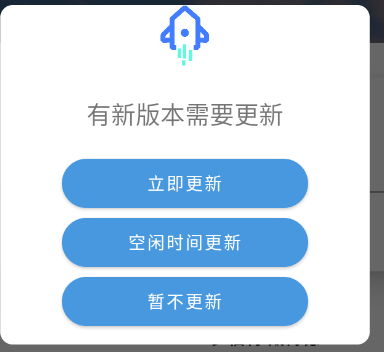

> **修改versionCode**
>
> 可能会生效，看应用，这里修改`Menifest.xml`的versionCode之后生效
>
> 

> **Hook弹窗**
>
> 使用课件提供的`算法助手`，然后开启`弹窗定位`的功能，然后右上角运行
>
> 
>
> 然后通过返回键可以取消弹窗
>
> 

> **修改dex弹窗代码**
>
> 定位到弹窗代码，然后注释掉展示弹窗的代码
>
> ①首先查看日志，定位弹窗
>
> 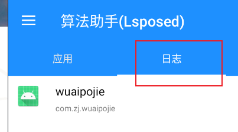
>
> 
>
> 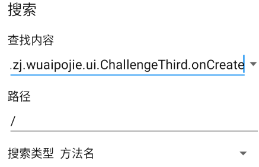
>
> 原生dialog最终会调用show方法显示弹窗，因此定位到show，注释掉即可
>
> 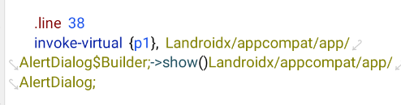

> **抓包修改响应体**
>
> 定位到弹窗图片的布局文件，然后修改xml文件
>
> ①安装`开发助手`，然后通过布局查看(和开发者助手类似)
>
> 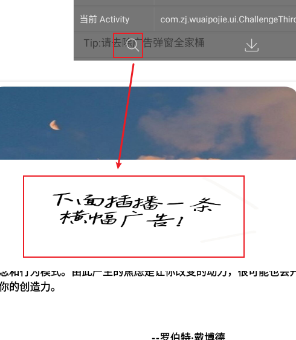
>
> 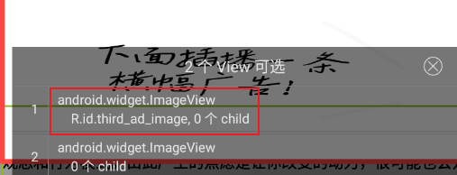
>
> 复制id
>
> 
>
> 然后在`MT`搜索image控件所在位置
>
> 
>
> 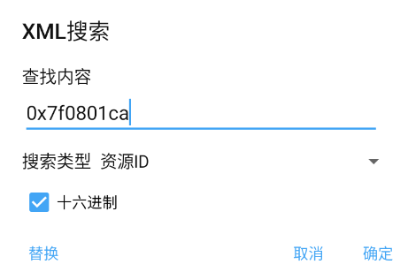
>
> 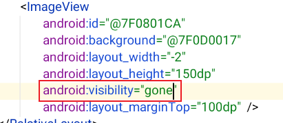
>
> 最后成功去除

## 5.动态调试

动态调试是指自带的调试器跟踪自己软件的运行，可以在调试的过程中知道参数或者局部变量的值以及履清代码运行的先后顺序。多用于爆破注册码 

> **什么是adb：**
>
> Android 调试桥 (`adb`) 是一种功能多样的命令行工具，可让您与设备进行通信。`adb` 命令可用于执行各种设备操作，例如安装和调试应用。`adb` 提供对 Unix shell（可用来在设备上运行各种命令）的访问权限。 
>
> > 参考—— [Android 调试桥 (adb) ](https://developer.android.google.cn/studio/command-line/adb?hl=zh-cn) 

### 动态调试步骤

> **开启调试权限**
>
> >  方法一:在AndroidManifest.xml里添加可调试权限 
> >
> > ```xml
> > android:debuggable="true"
> > ```
> >
> >  方法二：XappDebug模块hook对应的app 
> >
> >  方法三：Magisk命令(重启失效) 
> >
> > ```
> > 1.  adb shell #adb进入命令行模式
> > 
> > 2.  su #切换至超级用户
> > 
> > 3.  magisk resetprop ro.debuggable 1
> > 
> > 4.  stop;start; #一定要通过该方式重启
> > ```
> >
> >  方法四:刷入MagiskHide Props Config模块(永久有效，但可能会无效) 

> **端口转发以及开启adb权限**
>
>  点击七次`版本号`开启开发者模式，并开启adb调试权限 

> **jeb逆向apk并且打断点调试**
>
> 首先打开教程demo，发现需要输入验证码
>
> 
>
> 搜索红色方框的关键字，定位到逻辑代码
>
> 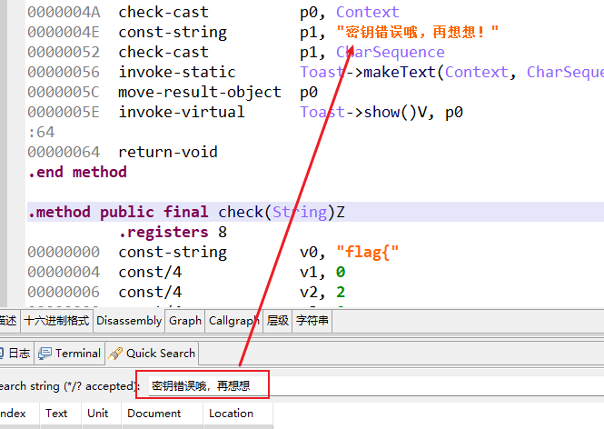
>
> 右键解析发现，用户输入验证码之后，会进行格式解析，并且最终进行Base64编码
>
> ```java
> public final boolean check(String s) {
>         int v = 0;
>         Integer integer0 = null;
>         if(!StringsKt.startsWith$default(s, "flag{", false, 2, null)) {
>             return false;
>         }
> 
>         if(!StringsKt.endsWith$default(s, "}", false, 2, null)) {
>             return false;
>         }
> 
>         String s1 = s.substring(5, s.length() - 1);
>         Intrinsics.checkNotNullExpressionValue(s1, "this as java.lang.String…ing(startIndex, endIndex)");
>         String s2 = SPUtils.INSTANCE.getString(((Context)this), "id", "");
>         if(s2 != null) {
>             integer0 = (int)s2.length();
>         }
> 
>         int v1 = 1000;
>         Intrinsics.checkNotNull(integer0);
>         int v2 = (int)integer0;
>         if(v2 >= 0) {
>             while(true) {
>                 v1 += -7;
>                 if(v == v2) {
>                     break;
>                 }
> 
>                 ++v;
>             }
>         }
> 
>         byte[] arr_b = Encode.encode(s2 + v1).getBytes(Charsets.UTF_8);
>         Intrinsics.checkNotNullExpressionValue(arr_b, "this as java.lang.String).getBytes(charset)");
>         return Intrinsics.areEqual(s1, Base64Utils.INSTANCE.encodeToString(arr_b));
>     }
> ```
>
> 因此，在Base64编码这一步打上断点
>
> 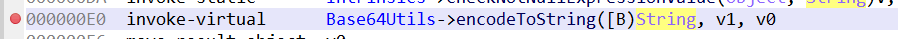

> **启动debug**
>
> ```shell
> adb shell am start -D -n com.zj.wuaipojie/.ui.MainActivity
> ```
>
> 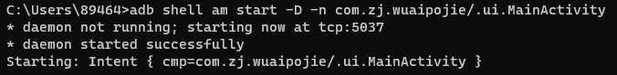
>
> 然后再jeb里选择调试按钮进行attach
>
> 


### 插桩

Log插桩指的是反编译APK文件时，在对应的smali文件里，添加相应的smali代码，将程序中的关键信息，以log日志的形式进行输出 

> 还是上面的例子，要获取密钥。
>
> 首先安装LSPosed（这个是在安装了一些逆向软件之后进行hook的时候开启hook权限）
>
> 
>
> 然后安装XAppDebug
>
> 将要插桩的dex文件放入到我们要插桩的app中
>
> > **先将dex文件放入模拟器(共享文件目录)**
> >
> > 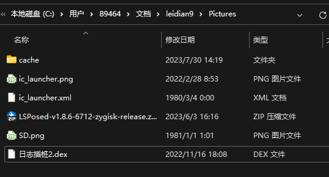
> >
> > 然后复制到要插桩的apk下面
> >
> > 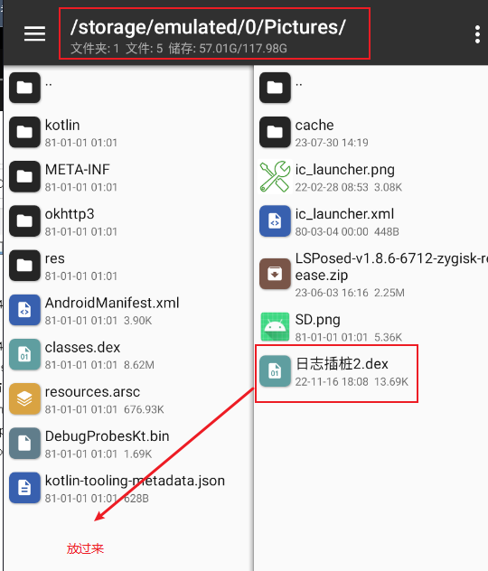
> >
> > 重命名
> >
> > 
> >
> > 然后定位到check的位置，进行插桩
> >
> > 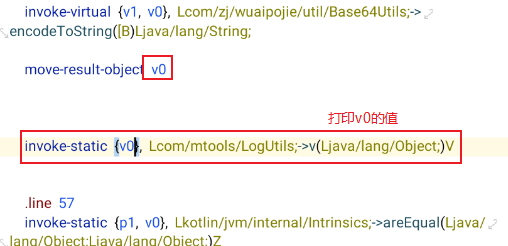
> >
> > 在开发者助手中打开日志截获
> >
> > 
> >
> > 成功查看到
> >
> > 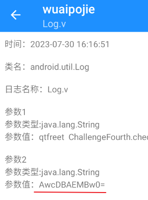
> >
> > 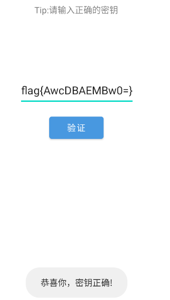
> > 
> >


## 6.签名校验对抗/PM代理/IO重定向

### (1)签名校验对抗

> 参考：
>
>  [Android apk四代签名：APK v1、APK v2、APK v3、APK v4](https://juejin.cn/post/7068079232290652197) 

**V1 V2 V3 V4签名**

> **V1:**
>
> 基于签名的 Jar 包的方案 , 有如下两个缺陷 :
>
> ①有篡改的风险：`META-INF` 目录用来存放签名，此目录本身是不计入签名校验过程的，可以随意在这个目录中添加文件，比如一些快速批量打包方案就选择在这个目录中添加渠道文件。
>
> ②apk 校验速度慢：V1签名机制**程序遍历Apk包中的所有文件(entry)**，对非文件夹非签名文件的文件，逐个用SHA1(安全哈希算法)生成摘要信息，再用Base64进行编码。如果你改变了apk包中的文件，那么在apk安装校验时，改变后的文件摘要信息与MANIFEST.MF的检验信息不同，于是程序就不能成功安装。由于校验过程中需要对 apk 中所有文件进行解压和摘要计算（ SHA-256 ），在APK 资源很多、性能较差的机器上签名校验会花费较长时间，导致安装速度慢。
>
> > V1 签名的机制主要就在 `META-INF `目录下的三个文件，`MANIFEST.MF`，`ANDROID.SF`，`ANDROID.RSA`，他们都是 V1 签名的产物。 
> >
> > -  **MANIFEST.MF：**
> >
> >   > MANIFEST.MF中是`apk中每个文件名称和摘要SHA1（或者 SHA256）`，如果是目录则只有名称 
> >   >
> >   > 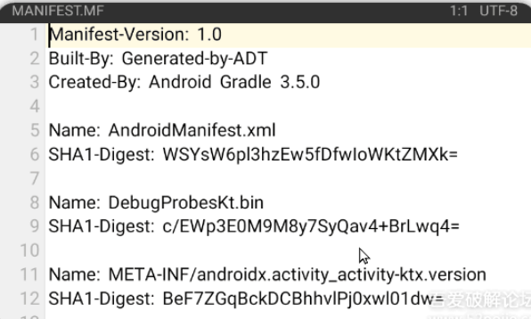
> >
> > - **CERT.SF：**
> >
> >   > 这是**对MANIFEST.MF的摘要 **。包括三个部分：
> >   >
> >   > - `SHA1-Digest-Manifest-Main-Attributes`：对 MANIFEST.MF 头部的块做 SHA1（或者SHA256）后再用 Base64 编码
> >   > - `SHA1-Digest-Manifest`：对整个 MANIFEST.MF 文件做 SHA1（或者 SHA256）后再用 Base64 编码
> >   > - `SHA1-Digest`：对 MANIFEST.MF 的各个条目做 SHA1（或者 SHA256）后再用 Base64 编码
> >   >
> >   > 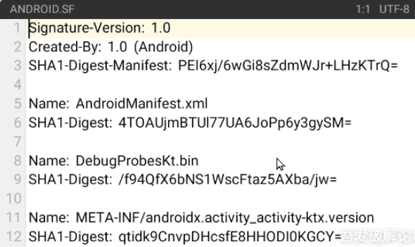
> >
> > - **CERT.RSA：**
> >
> >   >  将`ANDROID.SF`通过私钥签名，然后将签名以及包含公钥信息的数字证书一同写入ANDROID.RSA中保存 

> **V2(Android 7引入):**
>
> ```
> APK v1的缺点就是META-INF目录下的文件并不在校验范围内，所以之前多渠道打包等都是通过在这个目录下添加文件来实现的。 
> ```
>
> 对整个 apk 进行签名（**通过二进制流运算出哈希值**）。v2 签名会在 apk 块中新增一个签名块，里面中`存储了签名、签名算法、摘要等`。一个签名块还可以包含多个 id 和 value，apk 的签名信息会存放在 ID 为 `0x7109871a` 的键值对里。
>
> > 通俗点说就是**`签名信息不再以文件的形式存储，而是将其转成二进制数据直接写在apk文件中`**，这样就避免了APK v1的META-INF目录的问题。
>
> > 在 Android 7.0 及更高版本中，可以根据 APK 签名方案 v2+ 或 JAR 签名（v1 方案）验证 APK。更低版本的平台会忽略 v2 签名，仅验证 v1 签名。

> **V3(Android 9引入):**
>
> 在 v2 的签名块里面添加了一个 ID 为 `0xf05368c0` 的新块（证书块），在这里支持添加多个签名证书（可以看成单链表），由此来做证书替换和升级。 
>
>  Android 9 支持 APK 密钥轮替，这使应用能够在 APK 更新过程中更改其签名密钥。简单来说APK v3就是为了Andorid9的APK 密钥轮替功能而出现的，就是在v2的基础上增加两个数据块来存储APK 密钥轮替所需要的一些信息，所以可以看成是v2的升级。具体结构见官网说明即可。 
>

> **V4(Android 11引入):**
>
> Android 11 通过 APK 签名方案 v4 支持与流式传输兼容的签名方案。v4 签名基于根据 APK 的所有字节计算得出的 Merkle 哈希树。它完全遵循 fs-verity 哈希树的结构（例如，对salt进行零填充，以及对最后一个分块进行零填充。）Android 11 将签名存储在单独的 .apk.idsig 文件中。v4 签名需要 v2 或 v3 签名作为补充。
>
>  APK v4同样是为了新功能而出现的，这个新功能就是ADB 增量 APK 安装 
>
> > **ADB 增量 APK 安装:**
> >
> > 在设备上安装大型（2GB 以上）APK 可能需要很长的时间，即使应用只是稍作更改也是如此。ADB（Android 调试桥）增量 APK 安装可以安装足够的 APK 以启动应用，同时在后台流式传输剩余数据，从而加速这一过程。如果设备支持该功能，并且您安装了最新的 SDK 平台工具，adb install 将自动使用此功能。如果不支持，系统会自动使用默认安装方法。

> **android apk升级为什么签名不会改变**
>
> 对apk签名其实是对所有源文件单独计算摘要, 然后用私钥加密摘要信息再得到一个加密串, 我们称之为APK的签名. 你对源文件的修改都会导致签名的变化. 这个是为了验证apk没有被篡改.
>
> 然鹅, app的升级和重新安装, 检测的并不是这个apk签名, 而是你的包名+私钥的摘要信息, 签名的keystore文件没有变, 私钥的摘要信息也就不会变了.
>
> > 参考： [android apk 升级为什么签名不会改变？](https://www.zhihu.com/question/266891554) 


#### ①判断签名校验

> 参考：
>
>  [签名校验破解过程_apk签名验效不通知怎么解决](https://blog.csdn.net/JiaoMaGe/article/details/103028219) 

不做任何修改，直接签名安装，应用闪退则说明大概率有签名校验（签名校验一般是开发者自己定义）

> 一般来说签名校验不通过会导致应用闪退，但是也会出现其他情况，看应用的开发者情况而定
>
> ```java
> //android api里面一些管理进程的代码
> kill/killProcess-----kill/KillProcess()可以杀死当前应用活动的进程，这一操作将会把所有该进程内的资源（包括线程全部清理掉）.当然，由于ActivityManager时刻监听着进程，一旦发现进程被非正常Kill，它将会试图去重启这个进程。这就是为什么，有时候当我们试图这样去结束掉应用时，发现它又自动重新启动的原因.
> 
> system.exit-----杀死了整个进程，这时候活动所占的资源也会被释放。
> 
> finish----------仅仅针对Activity，当调用finish()时，只是将活动推向后台，并没有立即释放内存，活动的资源并没有被清理
> ```

**普通签名校验代码**

```java
private boolean SignCheck() {
    String trueSignMD5 = "d0add9987c7c84aeb7198c3ff26ca152";
    String nowSignMD5 = "";
    try {
        // 得到签名的MD5,系统将应用的签名信息封装在 PackageInfo 中，调用 PackageManager 的 getPackageInfo(String packageName, int flags) 即可获取指定包名的签名信息
        PackageInfo packageInfo = getPackageManager().getPackageInfo(getPackageName(),PackageManager.GET_SIGNATURES);
        Signature[] signs = packageInfo.signatures;
        String signBase64 = Base64Util.encodeToString(signs[0].toByteArray());
        nowSignMD5 = MD5Utils.MD5(signBase64);
    } catch (PackageManager.NameNotFoundException e) {
        e.printStackTrace();
    }
    return trueSignMD5.equals(nowSignMD5);
}
```


#### ②签名校验类型

> **Java层校验**
>
>  可以在应用启动的时候获取应用的签名值，然后和正规的签名值作比对，如果不符合就直接退出程序即可 
>
> 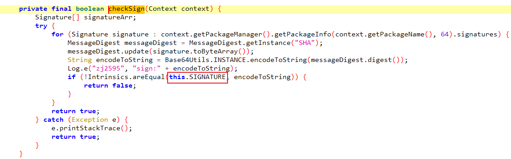
>
> 
>
> 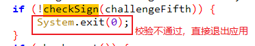
>
> 
>
> **NDK层校验**
>
> NDK的签名校验，就是把关键的信息放入so文件中，然后在so文件中获取到相应的APP签名信息，然后在so文件中进行比较。 
>
> **服务器验证**
>
> 会把相应获取到的签名信息，直接上传到服务器，然后在服务器端进行一个签名的校验，或者请求服务器，服务器返回一个数据，与本地获取到的签名信息进行比较。 

#### ③签名校验对抗

方法一:核心破解插件，不签名安装应用
方法二:一键过签名工具，例如MT、NP、ARMPro、CNFIX、Modex的去除签名校验功能
方法三:具体分析签名校验逻辑(手撕签名校验)
方法四:io重定向--VA&SVC：ptrace+seccomp 

> **以课堂测试demo为例**
>
> 重新将应用签名打开会闪退，证明存在签名校验
>
> 使用算法助手监听闪退
>
> 
>
> 找到拦截日志
>
> 
>
> 找到签名校验的类
>
> 
>
> 通过MT管理器定位到该方法，找到了杀死进程的代码，注释掉即可
>
> 


### (2)PM代理

#### PMS

> 参考：
>
>  [Android PMS HOOK ](https://www.jianshu.com/p/C559852c4878) 

> PackageManagerService（简称PMS），是Android系统核心服务之一，处理包管理相关的工作，常见的比如安装、卸载应用等。 
>
> **使用PMS获取包签名信息**
>
>  许多时候我们会使用到PMS，来获取apk的签名值。一般获取方式如下: 
>
> ```java
> private void getSignature() {
>        try {
>            PackageInfo packageInfo = getPackageManager().getPackageInfo(getPackageName(), PackageManager.GET_SIGNATURES);
>            Log.i(SHARK, "len:"+packageInfo.signatures.length);//输出签名字符串数组
>            if (packageInfo.signatures != null) {
>                Log.i(SHARK, "sig:"+packageInfo.signatures[0].toCharsString());//打印第一个签名
>            }
>        } catch (Exception e) {
>        }
> }
> ```
>

### (3)I/O重定向

> **什么是IO重定向？**
>
> > 例：在读A文件的时候指向B文件
>
> **IO重定向可以干嘛？**
>
> > 1，可以让文件只读，不可写
> >
> > 2，禁止访问文件
> >
> > 3，路径替换
>
> 具体应用：
>
> - 过签名检测(读取原包)
> - 风控对抗(例:一个文件记录App启动的次数)
> - 过Root检测，Xposed检测(文件不可取)
>
> > **I/O重定向就是hook了open和openat几个函数**
> >
> > ```
> > 参考——
> > https://mp.weixin.qq.com/s?__biz=Mzg2NzUzNzk1Mw==&mid=2247490088&idx=1&sn=c1140781bb9c19d2ff8f3a27023309e1&chksm=cebb5f66f9ccd670d87549eb227537a70994f13265928cd9f32abbf487a6bccf087fcb1c82d6#rd
> > ```


#### 例：

> 拿课堂的例子来测试
>
> `教程demo`中存在`crc校验`和`hash校验`：
>
> 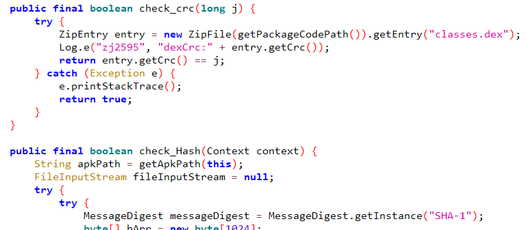
>
> ```
> crc校验：校验classes.dex是否修改，因此修改之后crc的值会变
> hash校验：校验整个apk，只要apk的内容被修改，那么hash值就会改变
> ```
>
> 这个时候就需要用到`重定向`，通过保存原包，每次时候重定向到原包，这样绕过校验，步骤如下：
>
> 首先定位到校验的方法，在***校验方法之前***放入重定向代码，这样校验的时候能够重定向到原包
>
> ```assembly
> sget-object p10, Lcom/zj/wuaipojie/util/ContextUtils;->INSTANCE:Lcom/zj/wuaipojie/util/ContextUtils;  
> 
> invoke-virtual {p10}, Lcom/zj/wuaipojie/util/ContextUtils;->getContext()Landroid/content/Context;  
> 
> move-result-object p10  
> 
> invoke-static {p10}, Lcom/zj/wuaipojie/util/SecurityUtil;->hook(Landroid/content/Context;)V
> ```
>
> 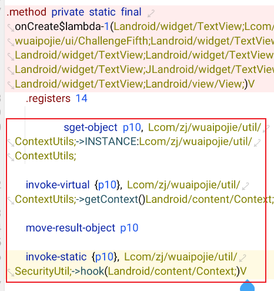
>
> 之后在修改的apk的`数据目录`下建一个files文件夹，然后放入未修改的原包，并重命名
>
> 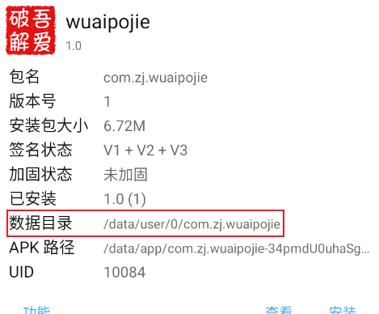
>
> 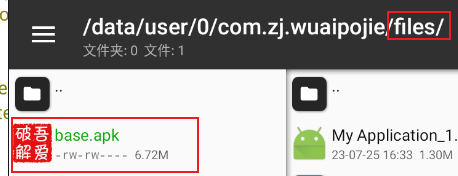
>
> 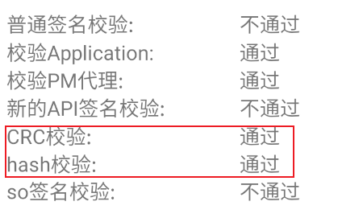
>
> > **重定向hook源码**
> >
> > ```c++
> > using namespace std;  
> > string packname;  
> > string origpath;  
> > string fakepath;  
> > 
> > int (*orig_open)(const char *pathname, int flags, ...);  
> > int (*orig_openat)(int,const char *pathname, int flags, ...);  
> > FILE *(*orig_fopen)(const char *filename, const char *mode);  
> > static long (*orig_syscall)(long number, ...);  
> > int (*orig__NR_openat)(int,const char *pathname, int flags, ...);  
> > 
> > void* (*orig_dlopen_CI)(const char *filename, int flag);  
> > void* (*orig_dlopen_CIV)(const char *filename, int flag, const void *extinfo);  
> > void* (*orig_dlopen_CIVV)(const char *name, int flags, const void *extinfo, void *caller_addr);  
> > 
> > static inline bool needs_mode(int flags) {  
> >     return ((flags & O_CREAT) == O_CREAT) || ((flags & O_TMPFILE) == O_TMPFILE);  
> > }  
> > bool startsWith(string str, string sub){  
> >     return str.find(sub)==0;  
> > }  
> > 
> > bool endsWith(string s,string sub){  
> >     return s.rfind(sub)==(s.length()-sub.length());  
> > }  
> > bool isOrigAPK(string  path){  
> > 
> >     if(path==origpath){  
> >         return true;  
> >     }  
> >     return false;  
> > }  
> > //该函数的功能是在打开一个文件时进行拦截，并在满足特定条件时将文件路径替换为另一个路径  
> > 
> > //fake_open 函数有三个参数：  
> > //pathname：一个字符串，表示要打开的文件的路径。  
> > //flags：一个整数，表示打开文件的方式，例如只读、只写、读写等。  
> > //mode（可选参数）：一个整数，表示打开文件时应用的权限模式。  
> > int fake_open(const char *pathname, int flags, ...) {  
> >     mode_t mode = 0;  
> >     if (needs_mode(flags)) {  
> >         va_list args;  
> >         va_start(args, flags);  
> >         mode = static_cast<mode_t>(va_arg(args, int));  
> >         va_end(args);  
> >     }  
> >     //LOGI("open,  path: %s, flags: %d, mode: %d",pathname, flags ,mode);  
> >     string cpp_path= pathname;  
> >     if(isOrigAPK(cpp_path)){  
> >         LOGI("libc_open, redirect: %s, --->: %s",pathname, fakepath.data());  
> >         return orig_open("/data/user/0/com.zj.wuaipojie/files/base.apk", flags, mode);  
> >     }  
> >     return  orig_open(pathname, flags, mode);  
> > 
> > }  
> > 
> > //该函数的功能是在打开一个文件时进行拦截，并在满足特定条件时将文件路径替换为另一个路径  
> > 
> > //fake_openat 函数有四个参数：  
> > //fd：一个整数，表示要打开的文件的文件描述符。  
> > //pathname：一个字符串，表示要打开的文件的路径。  
> > //flags：一个整数，表示打开文件的方式，例如只读、只写、读写等。  
> > //mode（可选参数）：一个整数，表示打开文件时应用的权限模式。  
> > //openat 函数的作用类似于 open 函数，但是它使用文件描述符来指定文件路径，而不是使用文件路径本身。这样，就可以在打开文件时使用相对路径，而不必提供完整的文件路径。  
> > //例如，如果要打开相对于当前目录的文件，可以使用 openat 函数，而不是 open 函数，因为 open 函数只能使用绝对路径。  
> > //  
> > int fake_openat(int fd, const char *pathname, int flags, ...) {  
> >     mode_t mode = 0;  
> >     if (needs_mode(flags)) {  
> >         va_list args;  
> >         va_start(args, flags);  
> >         mode = static_cast<mode_t>(va_arg(args, int));  
> >         va_end(args);  
> >     }  
> >     LOGI("openat, fd: %d, path: %s, flags: %d, mode: %d",fd ,pathname, flags ,mode);  
> >     string cpp_path= pathname;  
> >     if(isOrigAPK(cpp_path)){  
> >         LOGI("libc_openat, redirect: %s, --->: %s",pathname, fakepath.data());  
> >         return  orig_openat(fd,fakepath.data(), flags, mode);  
> >     }  
> >     return orig_openat(fd,pathname, flags, mode);  
> > 
> > }  
> > FILE *fake_fopen(const char *filename, const char *mode) {  
> > 
> >     string cpp_path= filename;  
> >     if(isOrigAPK(cpp_path)){  
> >         return  orig_fopen(fakepath.data(), mode);  
> >     }  
> >     return orig_fopen(filename, mode);  
> > }  
> > //该函数的功能是在执行系统调用时进行拦截，并在满足特定条件时修改系统调用的参数。  
> > //syscall 函数是一个系统调用，是程序访问内核功能的方法之一。使用 syscall 函数可以调用大量的系统调用，它们用于实现操作系统的各种功能，例如打开文件、创建进程、分配内存等。  
> > //  
> > static long fake_syscall(long number, ...) {  
> >     void *arg[7];  
> >     va_list list;  
> > 
> >     va_start(list, number);  
> >     for (int i = 0; i < 7; ++i) {  
> >         arg[i] = va_arg(list, void *);  
> >     }  
> >     va_end(list);  
> >     if (number == __NR_openat){  
> >         const char *cpp_path = static_cast<const char *>(arg[1]);  
> >         LOGI("syscall __NR_openat, fd: %d, path: %s, flags: %d, mode: %d",arg[0] ,arg[1], arg[2], arg[3]);  
> >         if (isOrigAPK(cpp_path)){  
> >             LOGI("syscall __NR_openat, redirect: %s, --->: %s",arg[1], fakepath.data());  
> >             return orig_syscall(number,arg[0], fakepath.data() ,arg[2],arg[3]);  
> >         }  
> >     }  
> >     return orig_syscall(number, arg[0], arg[1], arg[2], arg[3], arg[4], arg[5], arg[6]);  
> > 
> > }  
> > 
> > //函数的功能是获取当前应用的包名、APK 文件路径以及库文件路径，并将这些信息保存在全局变量中  
> > //函数调用 GetObjectClass 和 GetMethodID 函数来获取 context 对象的类型以及 getPackageName 方法的 ID。然后，函数调用 CallObjectMethod 函数来调用 getPackageName 方法，获取当前应用的包名。最后，函数使用 GetStringUTFChars 函数将包名转换为 C 字符串，并将包名保存在 packname 全局变量中  
> > //接着，函数使用 fakepath 全局变量保存了 /data/user/0/<packname>/files/base.apk 这样的路径，其中 <packname> 是当前应用的包名。  
> > //然后，函数再次调用 GetObjectClass 和 GetMethodID 函数来获取 context 对象的类型以及 getApplicationInfo 方法的 ID。然后，函数调用 CallObjectMethod 函数来调用 getApplicationInfo 方法，获取当前应用的 ApplicationInfo 对象。  
> > //它先调用 GetObjectClass 函数获取 ApplicationInfo 对象的类型，然后调用 GetFieldID 函数获取 sourceDir 字段的 ID。接着，函数使用 GetObjectField 函数获取 sourceDir 字段的值，并使用 GetStringUTFChars 函数将其转换为 C 字符串。最后，函数将 C 字符串保存在 origpath 全局变量中，表示当前应用的 APK 文件路径。  
> > //最后，函数使用 GetFieldID 和 GetObjectField 函数获取 nativeLibraryDir 字段的值，并使用 GetStringUTFChars 函数将其转换为 C 字符串。函数最后调用 LOGI 函数打印库文件路径，但是并没有将其保存在全局变量中。  
> > 
> > extern "C" JNIEXPORT void JNICALL  
> > Java_com_zj_wuaipojie_util_SecurityUtil_hook(JNIEnv *env, jclass clazz, jobject context) {  
> >     jclass conext_class = env->GetObjectClass(context);  
> >     jmethodID methodId_pack = env->GetMethodID(conext_class, "getPackageName",  
> >                                                "()Ljava/lang/String;");  
> >     auto packname_js = reinterpret_cast<jstring>(env->CallObjectMethod(context, methodId_pack));  
> >     const char *pn = env->GetStringUTFChars(packname_js, 0);  
> >     packname = string(pn);  
> > 
> >     env->ReleaseStringUTFChars(packname_js, pn);  
> >     //LOGI("packname: %s", packname.data());  
> >     fakepath= "/data/user/0/"+ packname +"/files/base.apk";  
> > 
> >     jclass conext_class2 = env->GetObjectClass(context);  
> >     jmethodID methodId_pack2 = env->GetMethodID(conext_class2,"getApplicationInfo","()Landroid/content/pm/ApplicationInfo;");  
> >     jobject application_info = env->CallObjectMethod(context,methodId_pack2);  
> >     jclass pm_clazz = env->GetObjectClass(application_info);  
> > 
> >     jfieldID package_info_id = env->GetFieldID(pm_clazz,"sourceDir","Ljava/lang/String;");  
> >     auto sourceDir_js = reinterpret_cast<jstring>(env->GetObjectField(application_info,package_info_id));  
> >     const char *sourceDir = env->GetStringUTFChars(sourceDir_js, 0);  
> >     origpath = string(sourceDir);  
> >     LOGI("sourceDir: %s", sourceDir);  
> > 
> >     jfieldID package_info_id2 = env->GetFieldID(pm_clazz,"nativeLibraryDir","Ljava/lang/String;");  
> >     auto nativeLibraryDir_js = reinterpret_cast<jstring>(env->GetObjectField(application_info,package_info_id2));  
> >     const char *nativeLibraryDir = env->GetStringUTFChars(nativeLibraryDir_js, 0);  
> >     LOGI("nativeLibraryDir: %s", nativeLibraryDir);  
> >     //LOGI("%s", "Start Hook");  
> > 
> >     //启动hook  
> >     void *handle = dlopen("libc.so",RTLD_NOW);  
> >     auto pagesize = sysconf(_SC_PAGE_SIZE);  
> >     auto addr = ((uintptr_t)dlsym(handle,"open") & (-pagesize));  
> >     auto addr2 = ((uintptr_t)dlsym(handle,"openat") & (-pagesize));  
> >     auto addr3 = ((uintptr_t)fopen) & (-pagesize);  
> >     auto addr4 = ((uintptr_t)syscall) & (-pagesize);  
> > 
> >     //解除部分机型open被保护  
> >     mprotect((void*)addr, pagesize, PROT_READ | PROT_WRITE | PROT_EXEC);  
> >     mprotect((void*)addr2, pagesize, PROT_READ | PROT_WRITE | PROT_EXEC);  
> >     mprotect((void*)addr3, pagesize, PROT_READ | PROT_WRITE | PROT_EXEC);  
> >     mprotect((void*)addr4, pagesize, PROT_READ | PROT_WRITE | PROT_EXEC);  
> > 
> >     DobbyHook((void *)dlsym(handle,"open"), (void *)fake_open, (void **)&orig_open);  
> >     DobbyHook((void *)dlsym(handle,"openat"), (void *)fake_openat, (void **)&orig_openat);  
> >     DobbyHook((void *)fopen, (void *)fake_fopen, (void**)&orig_fopen);  
> >     DobbyHook((void *)syscall, (void *)fake_syscall, (void **)&orig_syscall);  
> > }
> > 
> > ```
> >
> > 

> **更多签名校验教程：**
>
>  [芽衣的帖子 - 吾爱破解](https://www.52pojie.cn/home.php?mod=space&uid=874154&do=thread&view=me&from=space) 


## 7.Xposed-hook

> **参考：**
>
> [《安卓逆向这档事》Xposed快速上手(上)模块编](https://www.52pojie.cn/thread-1740944-1-1.html) 

Xposed是一款可以在不修改APK的情况下影响程序运行的框架，基于它可以制作出许多功能强大的模块，且在功能不冲突的情况下同时运作。在这个框架下，我们可以编写并加载自己编写的插件APP，实现对目标apk的注入拦截等。 

### (1)原理

> 用自己实现的**app_process**替换掉了系统原本提供的**app_process**，加载一个额外的jar包，入口从原来的： **com.android.internal.osZygoteInit.main()被替换成了： de.robv.android.xposed.XposedBridge.main()**，
> 创建的Zygote进程就变成Hook的Zygote进程了，从而完成对zygote进程及其创建的Dalvik/ART虚拟机的劫持(zytoge注入)
>
> 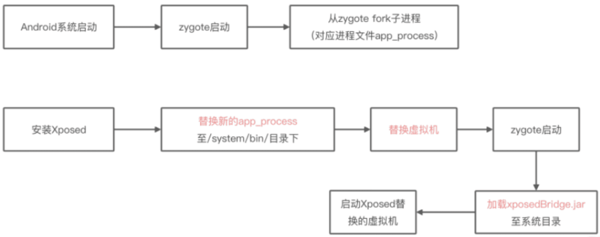

### (2)应用

> - 修改app布局，例如去广告或者按钮
>
> - 劫持数据，修改参数值，返回值，主动调用等等。例如防撤回，步数修改，一键新机
>
>   > **自动化操作：微信抢红包**
>   >
>   > 
>
> > 更多应用参考参考连接网页里面的链接

### (3)Xposed环境配置

#### 前置

使用课堂提供的`ubuntu`虚拟机镜像

> 里面内置：
>
> - `Frida`开发环境
> - 动态分析及开发工具：AS
> - 动态分析工具：ddms
> - 静态分析工具：jadx1.4.4
> - 动静态分析工具：jeb
> - 动态分析工具：集成HyperPwn
> - 静态分析工具：010 editor
> - 抓包工具：Charles
> - 抓包工具：WireShark
> - 动态分析工具:unidbg

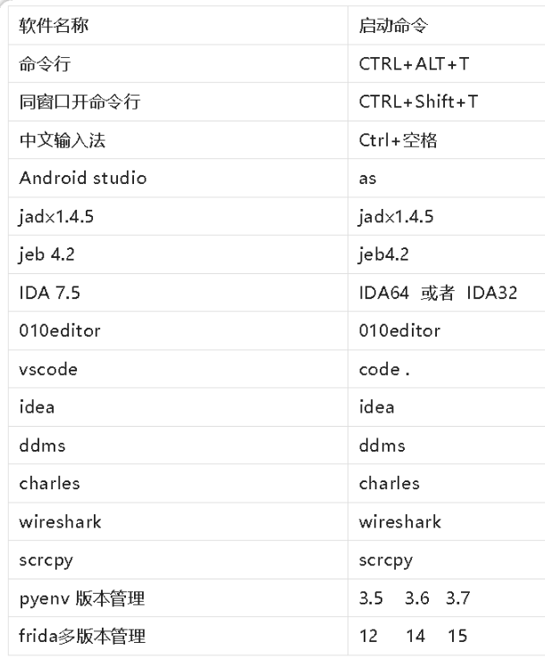

------

> 打开虚拟机过程中出现以下问题：
>
> 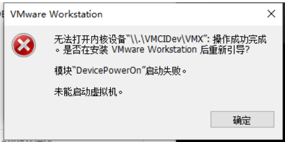
>
> 解决办法： [无法打开内核设备“\.\VMCIDev\VMX”: 操作成功完成。是否在安装 VMware Workstation 后重新引导? 模块“DevicePowerOn”启动失败。 ](https://blog.csdn.net/qq_43674360/article/details/120911532) 

> **vm pwd：toor**

-------

在终端启动AS(实际不使用Ubuntu下的AS，占内存)

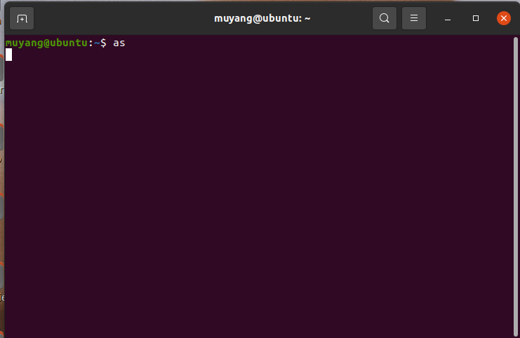

创建`No Activity`

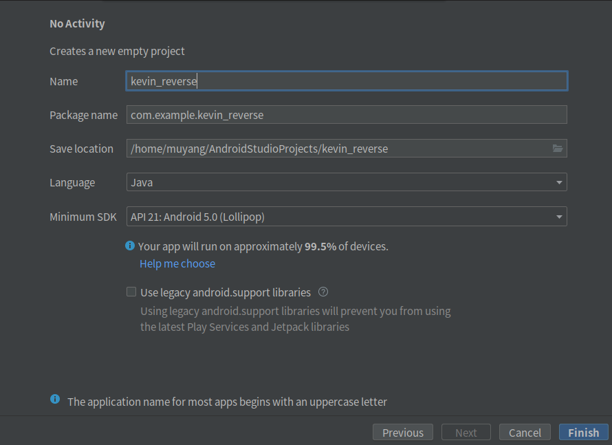


**将Xposed.jar放到`libs`目录下，引入外部jar包，然后`add to the library`，并设置为compileOnly**


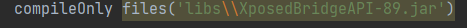


**在Manifest.xml文件添加关于Xposed模块的元数据配置**

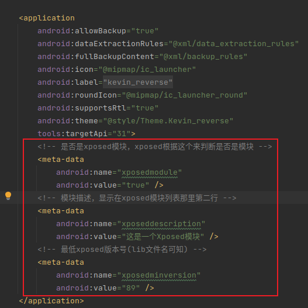

```xml
<!-- 是否是xposed模块，xposed根据这个来判断是否是模块 -->
<meta-data
    android:name="xposedmodule"
    android:value="true" />
<!-- 模块描述，显示在xposed模块列表那里第二行 -->
<meta-data
    android:name="xposeddescription"
    android:value="这是一个Xposed模块" />
<!-- 最低xposed版本号(lib文件名可知) -->
<meta-data
    android:name="xposedminversion"
    android:value="89" />
```


之后建立一个`assets folder`用来声明`Xposed`的入口文件


然后声明`hook`入口类的类名地址


--------------------

#### Hook方法

首先在创建的`Hook`类中实现`IXposedHookLoadPackage`，然后再重写hook函数

将教程demo安装在模拟器上面，然后查看打印台的日志信息，可以看到有个方法打印了一个日志，接下来hook这个普通方法

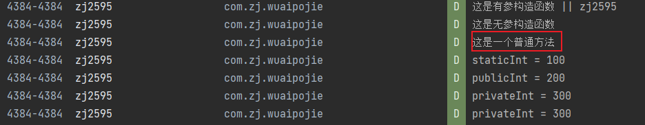

通过`jdx`可以逆向软件可以看到，该方法的名称，因此要hook的就是这个`a()`

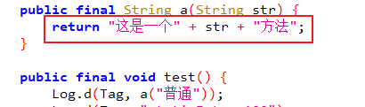

hook类实现` IXposedHookLoadPackage `

```java
public class XposedHook implements IXposedHookLoadPackage {
    /**
     * 进行hook的入口方法
     * @param loadPackageParam
     * @throws Throwable
     */
    @Override
    public void handleLoadPackage(XC_LoadPackage.LoadPackageParam loadPackageParam) throws Throwable {

    }
}
```

在jdx中，右击要hook的方法，有个生成`Xposed`代码选项，直接生成hook代码

```java
XposedHelpers.findAndHookMethod("com.zj.wuaipojie.Demo", loadPackageParam.classLoader, "a",String.class, new XC_MethodHook() {
    //修改参数
    @Override
    protected void beforeHookedMethod(MethodHookParam param) throws Throwable {
        super.beforeHookedMethod(param);
        Log.d("kevinHook",param.args[0].toString());//打印一下要hook的函数的参数
    }
    //修改返回值
    @Override
    protected void afterHookedMethod(XC_MethodHook.MethodHookParam param) throws Throwable {
        super.afterHookedMethod(param);
    }
});
```

之后运行，但是运行前要改一下`run configuration`，否则没有`MainActivity`会报错

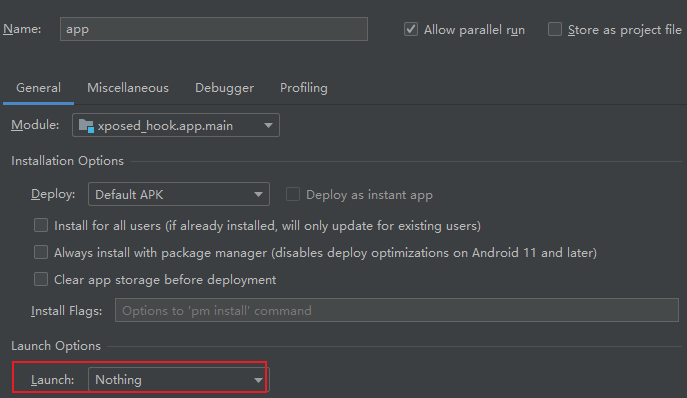

>  之后运行程序，然后去日志查看打印信息，我这里没有hook成功，不知道为什么
>
>  网上说是因为要hook的代码还没有执行，所有导致hook不到
>
>  >  [[求助\]xposed部分函数hook不到了](https://bbs.kanxue.com/thread-215527.htm) 

**另一种加载类的方法**

> 因为安卓加载apk会用`classLoader`加载所有的类，所以可以去classloader里面找到这个类
>
> ```java
> Class class_a = loadPackageParam.classLoader.loadClass("com.zj.wuaipojie.Demo");
> XposedBridge.hookAllMethods(class_a, "a", new XC_MethodHook() {
>     @Override
>     protected void beforeHookedMethod(MethodHookParam param) throws Throwable {
>         super.beforeHookedMethod(param);
>         Log.d("kevin","还不行？");
>     }
> });
> ```

#### Hook替换函数

> ```java
> Class a = classLoader.loadClass("类名")
> XposedBridge.hookAllMethods(a,"方法名",new XC_MethodReplacement() {  
>     @Override  
>     protected Object replaceHookedMethod(MethodHookParam methodHookParam) throws Throwable { 
>         return "";  
>     }  
> });
> ```

#### Hook加固通杀

> ```java
> XposedHelpers.findAndHookMethod(Application.class, "attach", Context.class, new XC_MethodHook() {  
>     @Override  
>     protected void afterHookedMethod(MethodHookParam param) throws Throwable {  
>         Context context = (Context) param.args[0];  
>         ClassLoader classLoader = context.getClassLoader();
>         //hook逻辑在这里面写  
>     }  
> });
> ```

------------

### (4)Xposed常用API

> 参考：
>
>  [xposed快速上手(下)快速hook ](https://www.52pojie.cn/thread-1748081-1-1.html) 

----

#### hook变量

静态变量与实例变量：

> **静态变量**
>
> ```java
> final Class clazz = XposedHelpers.findClass("类名", classLoader);  
> XposedHelpers.setStaticIntField(clazz, "变量名", 999);
> ```
>
> **实列变量**
>
> ```java
> final Class clazz = XposedHelpers.findClass("类名", classLoader);  
> XposedBridge.hookAllConstructors(clazz, new XC_MethodHook() {  
>      @Override
>     protected void afterHookedMethod(MethodHookParam param) throws Throwable {  
>         super.afterHookedMethod(param);  
>         //param.thisObject获取当前所属的对象
>         Object ob = param.thisObject;  
>         XposedHelpers.setIntField(ob,"变量名",9999);  
>     }  
> });
> 
> ```

-----------

#### hook构造函数

> **无参构造函数**
>
> ```java
> XposedHelpers.findAndHookConstructor("com.zj.wuaipojie.Demo", classLoader, new XC_MethodHook() {
>     @Override
>     protected void beforeHookedMethod(MethodHookParam param) throws Throwable {
>         super.beforeHookedMethod(param);
>     }
>     @Override
>     protected void afterHookedMethod(MethodHookParam param) throws Throwable {
>         super.afterHookedMethod(param);
>     }
> });
> ```
>
> **有参构造函数**
>
> ```java
> XposedHelpers.findAndHookConstructor("com.zj.wuaipojie.Demo", classLoader, String.class, new XC_MethodHook() {
>     @Override
>     protected void beforeHookedMethod(MethodHookParam param) throws Throwable {
>         super.beforeHookedMethod(param);
>     }
>     @Override
>     protected void afterHookedMethod(MethodHookParam param) throws Throwable {
>         super.afterHookedMethod(param);
>     }
> });
> 
> ```

-------

#### hook multiDex

实际应用中的dex文件不止一个，当方法数达到一定数量就会创建新的dex

```java
XposedHelpers.findAndHookMethod(Application.class, "attach", Context.class, new XC_MethodHook() {  
    @Override  
    protected void afterHookedMethod(MethodHookParam param) throws Throwable {  
        ClassLoader cl= ((Context)param.args[0]).getClassLoader();  
        Class<?> hookclass=null;  
        try {  
            hookclass=cl.loadClass("类名");  
        }catch (Exception e){  
            Log.e("zj2595","未找到类",e);  
            return;        
        }  
        XposedHelpers.findAndHookMethod(hookclass, "方法名", new XC_MethodHook() {  
            @Override  
            protected void afterHookedMethod(MethodHookParam param) throws Throwable {  
            }        
        });  
    }  
});
```

---------

#### hook方法

> **静态方法**
>
> ```java
> Class clazz = XposedHelpers.findClass("类名",lpparam.classLoader);
> XposedHelpers.callStaticMethod(clazz,"方法名",参数(非必须));
> ```
>
> **实列方法**
>
> ```java
> Class clazz = XposedHelpers.findClass("类名",lpparam.classLoader);
> XposedHelpers.callMethod(clazz.newInstance(),"方法名",参数(非必须));
> ```

--------

#### hook内部类

```java
//通过$表示连接内部类
XposedHelpers.findAndHookMethod("com.zj.wuaipojie.Demo$InnerClass", lpparam.classLoader, "innerFunc",String.class,  new XC_MethodHook() {  
    @Override  
    protected void beforeHookedMethod(MethodHookParam param) throws Throwable {  
        super.beforeHookedMethod(param);  
    }  
});
```

-----------

#### 反射 

```java
Class clazz = XposedHelpers.findClass("com.zj.wuaipojie.Demo", lpparam.classLoader);
XposedHelpers.findAndHookMethod("com.zj.wuaipojie.Demo$InnerClass", lpparam.classLoader, "innerFunc",String.class,  new XC_MethodHook() {  
    @Override  
    protected void beforeHookedMethod(MethodHookParam param) throws Throwable {  
        super.beforeHookedMethod(param);  
        //第一步找到类
        //找到方法，如果是私有方法就要setAccessible设置访问权限
        //invoke主动调用或者set修改值(变量)
        Class democlass = Class.forName("com.zj.wuaipojie.Demo",false,lpparam.classLoader);  
        Method demomethod = democlass.getDeclaredMethod("refl");  
        demomethod.setAccessible(true);  
        demomethod.invoke(clazz.newInstance());  
    }  
});

```

--------

#### 遍历所有类下面所有方法

```java
XposedHelpers.findAndHookMethod(ClassLoader.class, "loadClass", String.class, new XC_MethodHook() {  
    @Override  
    protected void afterHookedMethod(MethodHookParam param) throws Throwable {  
        super.afterHookedMethod(param);  
        Class clazz = (Class) param.getResult();  
        String clazzName = clazz.getName();  
        //排除非包名的类  
        if(clazzName.contains("com.zj.wuaipojie")){  
            Method[] mds = clazz.getDeclaredMethods();  
            for(int i =0;i<mds.length;i++){  
                final Method md = mds[i];  
                int mod = mds[i].getModifiers();  
                //去除抽象、native、接口方法  
                if(!Modifier.isAbstract(mod)  
                    && !Modifier.isNative(mod)  
                    &&!Modifier.isAbstract(mod)){  
                    XposedBridge.hookMethod(mds[i], new XC_MethodHook() {  
                        @Override  
                        protected void beforeHookedMethod(MethodHookParam param) throws Throwable {  
                            super.beforeHookedMethod(param);  
                            Log.d("zj2595",md.toString());  
                        }  
                    });  
                }  

           }  
        }  

    }  
});
```

----

#### hook sdk的一些方法

> **hook字符串修改**
>
> ```java
> /*字符串赋值定位*/
> XposedHelpers.findAndHookMethod("android.widget.TextView", lpparam.classLoader, "setText", CharSequence.class, new XC_MethodHook() {  //首先hookTextView类，
>     @Override  
>     protected void beforeHookedMethod(MethodHookParam param) throws Throwable {  
>         super.beforeHookedMethod(param);  
>         Log.d("zj2595",param.args[0].toString());  //hook ‘setText’方法，找到我们想要定位的字符串的位置
>                 if(param.args[0].equals("已过期")){  
>                     printStackTrace();  
>                 }
>     }  
> });
> 
> //打印堆栈信息
> private static void printStackTrace() {  
>     Throwable ex = new Throwable();  
>     StackTraceElement[] stackElements = ex.getStackTrace();  
>     for (int i = 0; i < stackElements.length; i++) {  
>         StackTraceElement element = stackElements[i];  
>         Log.d("zj2595","at " + element.getClassName() + "." + element.getMethodName() + "(" + element.getFileName() + ":" + element.getLineNumber() + ")");  
>     }  
> }
> ```

> **hook点击事件监听**
>
> ```java
> Class clazz = XposedHelpers.findClass("android.view.View", lpparam.classLoader);
> XposedBridge.hookAllMethods(clazz, "performClick", new XC_MethodHook() {  
>     @Override  
>     protected void afterHookedMethod(MethodHookParam param) throws Throwable {  
>         super.afterHookedMethod(param);  
>         Object listenerInfoObject = XposedHelpers.getObjectField(param.thisObject, "mListenerInfo");  
>         Object mOnClickListenerObject = XposedHelpers.getObjectField(listenerInfoObject, "mOnClickListener");  
>         String callbackType = mOnClickListenerObject.getClass().getName();  
>         Log.d("zj2595",callbackType);  
>     }  
> });
> ```

**上面两种hook方式可以通过算法助手实现监听**

> **改写布局**
>
> ```java
> XposedHelpers.findAndHookMethod("com.zj.wuaipojie.ui.ChallengeSixth", lpparam.classLoader,  
>         "onCreate", Bundle.class, new XC_MethodHook() {  
>     @Override  
>     protected void afterHookedMethod(MethodHookParam param) throws Throwable {  
>         super.afterHookedMethod(param);  
>         View img = (View)XposedHelpers.callMethod(param.thisObject,  
>                 "findViewById", 0x7f0800de);  
>         img.setVisibility(View.GONE);  
> 
>     }  
> });
> ```
>
> 


### (5)Xposed模块LSPatch

> 参考：
>
>  [【模块框架】LSPatch - 免Root模块框架小白向安装使用指南](https://zhuanlan.zhihu.com/p/530887552) 

以教程demo为例，首先打包我们之前写的Xposed模块为release，然后安装在模拟器。

安装LSPatch，打开然后添加要修补的(要hook的)apk


选择`便携模式`并且嵌入模块，也就是我们打包的，之后点击修补。修补完成去MT管理器重新安装


## 8.so逆向

> **参考：**
>
> [52-so逆向](https://www.52pojie.cn/thread-1787667-1-1.html)
>
> [ida逆向so](https://www.cnblogs.com/whycxb/p/9143896.html)

> **ELF文件**
>
> ELF（Executable and Linkable Format）是一种可执行和可链接的文件格式，是linux底下二进制文件，可以理解为windows下的`PE文件`，在Android中可以比作`SO`，方便函数的移植，在常用于保护Android软件，增加逆向难度。 


如果项目是ndk开发，那么apk文件里面有打包的so包


将`v7a`目录下的so包拖进ida解析(v7a使用32位的ida解析)

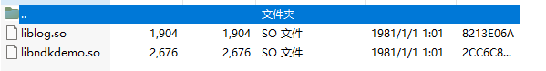

 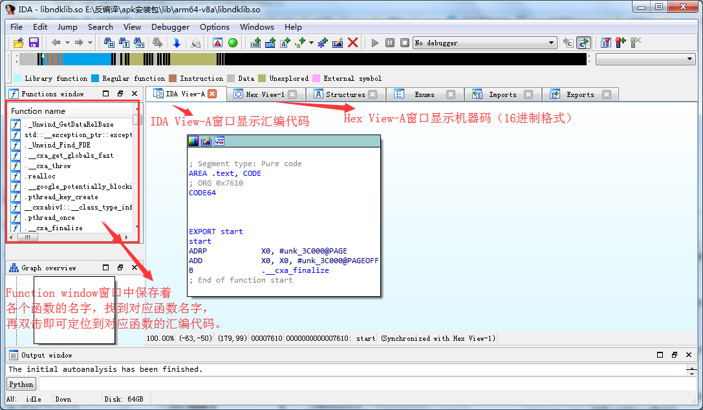 

将汇编代码反编译为伪c代码，然后按`Y`键就可以修改代码

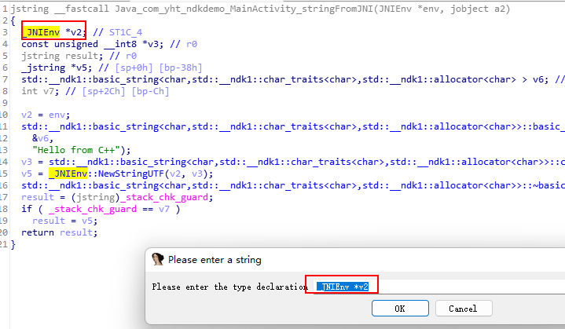


### 修改二进制文件内容：

> 参考：
>
> https://www.cnblogs.com/xiaoweigege/p/15000347.html

> - **使用keypatch**
>
>   > 
>
> - **修改十六进制**
>
>   > 鼠标移到想要修改的代码行
>   >
>   > 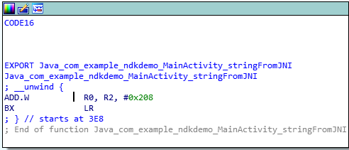
>   >
>   > 然后去十六进制窗口查看对应的hex
>   >
>   > 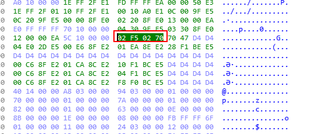
>   >
>   > 之后去[Arm2Hex](https://armconverter.com/)网站转换是否正确
>   >
>   > 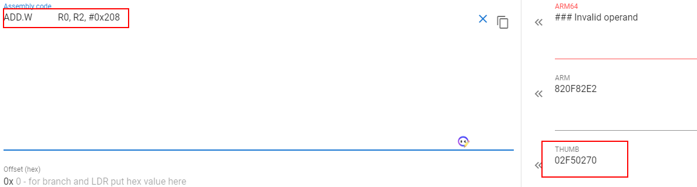
>   >
>   > 通过在网站修改汇编代码，得到新的hex
>   >
>   > 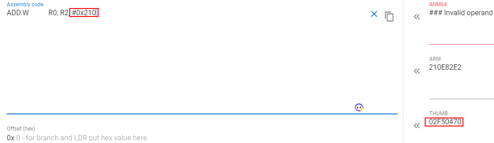
>   >
>   > **返回ida修改，并且apply**
>   
>   使用任一方式修改完之后，将`so`文件替换没修改的so，然后回编译并签名，安装
>   
>   > 参考：https://www.cnblogs.com/xiaoweigege/p/15000347.html
>   
>   **注意：模拟器是windows，所以要修改x86目录下的so；真机修改arm目录下的so**

### IDA动态调试

首先看看`Andoird NDK .so`的加载流程

  

| 函数名                                             | 描述                                                         |
| :------------------------------------------------- | :----------------------------------------------------------- |
| `android_dlopen_ext()` 、`dlopen()`、`do_dlopen()` | 这三个函数主要用于加载库文件。`android_dlopen_ext` 是系统的一个函数，用于在运行时动态加载共享库。与标准的 `dlopen()` 函数相比，`android_dlopen_ext` 提供了更多的参数选项和扩展功能，例如支持命名空间、符号版本等特性。 |
| `find_library()`                                   | `find_library()` 函数用于查找库，基本的用途是给定一个库的名字，然后查找并返回这个库的路径。 |
| `call_constructors()`                              | `call_constructors()` 是用于调用动态加载库中的构造函数的函数。 |
| `init`                                             | 库的构造函数，用于初始化库中的静态变量或执行其他需要在库被加载时完成的任务。如果没有定义`init`函数，系统将不会执行任何动作。需要注意的是，`init`函数不应该有任何参数，并且也没有返回值。 |
| `init_array`                                       | `init_array`是ELF（Executable and Linkable Format，可执行和可链接格式）二进制格式中的一个特殊段（section），这个段包含了一些函数的指针，这些函数将在`main()`函数执行前被调用，用于初始化静态局部变量和全局变量。 |
| `jni_onload`                                       | 这是Android JNI(Java Native Interface)中的一个函数。当一个native库被系统加载时，该函数会被自动调用。`JNI_OnLoad`可以做一些初始化工作，例如注册你的native方法或者初始化一些数据结构。如果你的native库没有定义这个函数，那么JNI会使用默认的行为。`JNI_OnLoad`的返回值应该是需要的JNI版本，一般返回`JNI_VERSION_1_6`。 |

> 下断点的时机：
>
> 下断点时机：
> 应用级别的：java_com_XXX；
> 外壳级别的：JNI_Onload，.init，.init_array(反调试);
> 系统级别的：fopen，fget，dvmdexfileopen(脱壳)； 


**(1)先将android_server64环境放到手机上(测试用的是模拟器)**

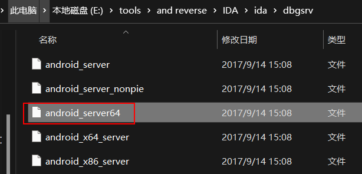

> ```shell
> adb push E:\tools\and reverse\IDA\ida\dbgsrv\android_server64 /data/local/tmp
> ```


# 三.Tools 

## 1.Apktool


## 2.Magisk

Magisk 是一套用于定制 Android 的开源软件，支持高于 Android 5.0 的设备。

以下是一些功能亮点：

- **MagiskSU**：为应用程序提供 root 访问权限
- **Magisk 模块**：通过安装模块修改只读分区
- **MagiskHide**：从根检测 / 系统完整性检查中隐藏 Magisk(Shamiko)
- **MagiskBoot** : 最完整的安卓启动镜像解包和重新打包工具


## 3.MT管理器

 MT管理器是一款强大的文件管理工具和APK逆向修改神器。 

> 主要功能有：
>
> - 文件复制、移动、创建软链接、重命名、删除、创建文件(夹)，文件批量操作。获取 Root 权限后可访问系统目录，挂载文件系统为读写，修改文件权限和所有者。
> - 像 WinRAR 那样打开 ZIP 格式文件，可以对 ZIP 内的文件进行删除、重命名、移动，添加/替换外部文件到 ZIP 中，无需解压后再重新打包，同时支持单独解压 ZIP 内的部分文件。
> - 自带强大的文本编辑器，可以流畅编辑大文本文件，支持设置是否显示行号、开关自动换行、双指缩放字体大小、自动识别编码、代码语法高亮、自动缩进、正则搜索替换。
> - 拥有图片查看、音乐播放、字体预览、执行脚本、文本对比等功能，在侧拉栏中可方便地查看存储设备、FTP连接、书签、后台、工具等。
> - APK 编辑功能，主要有 DEX 编辑，ARSC 编辑，XML 编辑，APK 签名、APK 优化、APK 共存、去除签名校验、RES 资源混淆、RES 反资源混淆、翻译模式等。


### 平替免费版——NP管理器

## 4.jadx-gui

反编译apk软件


## 5.Lsposed

>  [使用什么是LSPosed？为什么需要LSPosed？如何使用？](https://www.zhihu.com/question/442531709) 

## 6.XappDebug


## 7.Jeb

> 安装注册—— [JEB动态调试Smali-真机/模拟器](https://www.52pojie.cn/thread-1598242-1-1.html) 

Jeb是一款针对Android应用程序和本机机器代码的反汇编和反编译软件。它将Dalvik字节码反编译为Java源代码，将x86、ARM、MIPS、RISC-V机器代码反编译为C源代码。程序集和源输出是交互式的并且可以重构。用户还可以编写自己的脚本和插件来扩展JEB功能。 

## 8.Xposed

>  [Lsposed 技术原理探讨 && 基本安装使用](https://www.52pojie.cn/forum.php?mod=viewthread&tid=1694093&highlight=Lsposed) 
>
>  [Xposed Hook技巧，代理abstract](https://bbs.kanxue.com/thread-260484.htm) 

### (1)LSPatch

### (2)singlehook

### (3)jshook


## 9.IDA

IDA Pro（Interactive Disassembler Professional）是一款功能强大的交互式反汇编和调试工具，广泛应用于软件逆向工程、漏洞分析和二进制代码分析。它支持多种处理器架构和可执行文件格式，包括但不限于x86、ARM、MIPS、PowerPC等。通过使用IDA Pro，可以对程序进行静态分析、动态调试和代码修改等操作。 