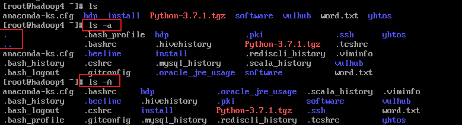
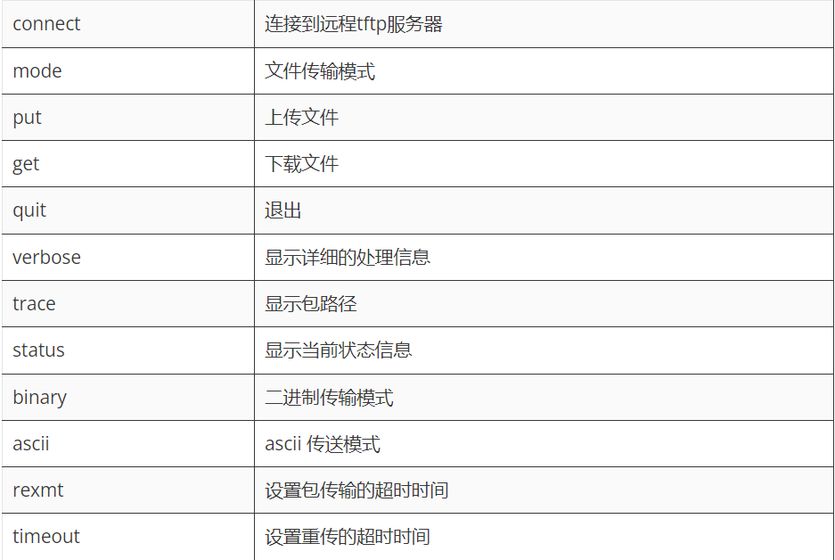

# Linux

> 本文主要参考——https://www.linuxcool.com/
>
> 练习网站——https://overthewire.org/wargames/bandit/bandit1.html

## 一、重要系统文件

### 1./etc/passwd  & /etc/shadow

> ###  / etc / shadow
>
> 文件以加密格式存储用户帐户的实际密码，以及与用户密码有关的其他属性，即，它存储安全的用户帐户信息。所有字段由冒号（:)符号分隔
>
> ### / etc / passwd
>
> 文件存储了登录期间必需的基本信息，即用户帐户信息。/etc / passwd文件是一个文本文件，它包含了系统的帐户列表，给每个帐户，如用户ID，组ID，主目录，外壳等一些有用的信息
>
> 每行用户信息都以 "：" 作为分隔符，划分为 7 个字段，每个字段所表示的含义如下：
>
> ```
> 用户名：密码：UID（用户ID）：GID（组ID）：描述性信息：主目录：默认Shell
> ```
>
> ```shell
> [root@localhost ~]# vi /etc/passwd
> #查看一下文件内容
> root:x:0:0:root:/root:/bin/bash
> bin:x:1:1:bin:/bin:/sbin/nologin
> daemon:x:2:2:daemon:/sbin:/sbin/nologin
> adm:x:3:4:adm:/var/adm:/sbin/nologin
> ...省略部分输出...
> ```
>
> > 参考——http://c.biancheng.net/view/839.html
>
> 


## 二、命令

> 参考——https://www.linuxcool.com/

### 1.wget

`wget` 是一个可以从网络上下载文件的免费实用程序,支持 HTTP、HTTPS及FTP协议下载文件

```shell
语法格式
wget [options] [url]
```


- 下载文件

  > 下载指定链接的文件。默认情况下，下载的文件将保存到当前工作目录中的同名文件中。
  >
  > ```shell
  > wget https://download.redis.io/releases/redis-6.0.8.tar.gz
  > ```
  >
  > **-o选项以其他名称保存下载的文件**
  >
  > ```shell
  > wget -O redis.tar.gz https://download.redis.io/releases/redis-6.0.8.tar.gz
  > ```
  >
  > **使用 -P 选项将文件下载到指定目录**
  >
  > ```shell
  > wget -P /usr/software https://download.redis.io/releases/redis-6.0.8.tar.gz
  > ```
  >
  > 

- 断点续传

  > **使用 -c 选项断点续传**
  >
  > 当我们下载一个大文件时，如果中途网络断开导致没有下载完成，我们就可以使用命令的-c选项恢复下载，让下载从断点续传，无需从头下载。
  >
  > ```shell
  > wget -c https://download.redis.io/releases/redis-6.0.8.tar.gz
  > ```

- 后台下载

  > **使用 -b 选项在后台下载**
  >
  > ```shell
  > wget -b https://download.redis.io/releases/redis-6.0.8.tar.gz
  > ```
  >
  > 默认情况下，下载过程日志重定向到当前目录中的wget-log文件中，要查看下载状态，可以使用tail -f wget-log查看。

- 下载一系列文件

  > **使用 -i 选项下载多个文件**
  >
  > 如果先要一次下载多个文件，首先***需要创建一个文本文件，并将所有的url添加到该文件中，每个url都必须是单独的一行***。
  >
  > ```shell
  > wget -i download_list.txt
  > ```

- 镜像整个站点

- 限制下载速度

  > 默认情况下，wget命令会以全速下载，这时就要限制下载速度，可以使用--limit-rate选项。例如，以下命令将下载速度限制为1m/s：
  >
  > ```shell
  > wget --limit-rate=1m https://download.redis.io/releases/redis-6.0.8.tar.gz
  > ```

- 模拟浏览器下载

  > ### 使用 -U 选项设定模拟下载
  >
  > 如果远程服务器阻止wget下载资源，我们可以通过-U选项模拟浏览器进行下载，例如下面模拟谷歌浏览器下载。
  >
  > ```shell
  > wget -U 'Mozilla/5.0 (Windows NT 10.0; Win64; x64) AppleWebKit/537.36 (KHTML, like Gecko) Chrome/81.0.4044.43 Safari/537.36' https://download.redis.io/releases/redis-6.0.8.tar.gz
  > ```

> 参考——https://baijiahao.baidu.com/s?id=1715589159640466321&wfr=spider&for=pc


### 文件管理

#### 1.ls

来自于英文单词list的缩写，其功能是列举出指定目录下的文件名称及其属性。

**语法格式：ls [参数] [文件]**

| -a      | 显示所有文件及目录 (包括以“.”开头的隐藏文件)     |
| ------- | ------------------------------------------------ |
| **-l**  | **使用长格式列出文件及目录的详细信息**           |
| -r      | 将文件以相反次序显示(默认依英文字母次序)         |
| -t      | 根据最后的修改时间排序                           |
| -A      | 同 -a ，但不列出 “.” (当前目录) 及 “..” (父目录) |
| -S      | 根据文件大小排序                                 |
| **-R**  | **递归列出所有子目录**                           |
| -d      | 查看目录的信息，而不是里面子文件的信息           |
| -i      | 输出文件的inode节点信息                          |
| -m      | 水平列出文件，以逗号间隔                         |
| -X      | 按文件扩展名排序                                 |
| --color | 输出信息中带有着色效果                           |

> -a 和 -A区别
>
> 

**搭配通配符**

```shell
[root@linuxcool ~]# ls /dev/sd*
/dev/sda  /dev/sda1  /dev/sda2
```


#### 2.cp

cp命令来自于英文单词copy的缩写，用于将一个或多个文件或目录复制到指定位置，亦常用于文件的备份工作。**-r参数用于递归操作**，复制目录时若忘记加则会直接报错，而**-f参数则用于当目标文件已存在时会直接覆盖不再询问**，这两个参数尤为常用。

**语法格式：cp [参数] 源文件 目标文件**

| -f   | 若目标文件已存在，则会直接覆盖原文件                         |
| ---- | ------------------------------------------------------------ |
| -i   | 若目标文件已存在，则会询问是否覆盖                           |
| -p   | 保留源文件或目录的所有属性                                   |
| -r   | 递归复制文件和目录                                           |
| -d   | 当复制符号连接时，把目标文件或目录也建立为符号连接，并指向与源文件或目录连接的原始文件或目录 |
| -l   | 对源文件建立硬连接，而非复制文件                             |
| -s   | 对源文件建立符号连接，而非复制文件                           |
| -b   | 覆盖已存在的文件目标前将目标文件备份                         |
| -v   | 详细显示cp命令执行的操作过程                                 |
| -a   | 等价于“pdr”选项                                              |


复制某个文件时，保留其原始权限及用户归属信息：

```shell
[root@linuxcool ~]# cp -a kickstart.cfg ks.cfg
```


#### 3.mkdir

来自于英文词组“make directories”的缩写，目录不存在，但具有嵌套的依赖关系，例如a/b/c/d/e/f，要想一次性创建则需要加入-p参数，进行递归操作。

**语法格式 : mkdir [参数] 目录**

**常用参数：**

| -p   | 递归创建多级目录             |
| ---- | ---------------------------- |
| -m   | 建立目录的同时设置目录的权限 |
| -z   | 设置安全上下文               |
| -v   | 显示目录的创建过程           |


在当前工作目录中，创建一个目录文件并设置700权限，不让除所有主以外任何人读、写、执行它：

```shell
[root@linuxcool ~]# mkdir -m 700 dir2
```

在当前工作目录中，一次性创建多个目录文件：

```shell
[root@linuxcool ~]# mkdir dir3 dir4 dir5
```

在系统根目录中，一次性创建多个有嵌套关系的目录文件：

```shell
[root@linuxcool ~]# mkdir -p /dir1/dir2/dir3/dir4/dir5
```


#### 4.mv

用于对文件进行剪切和重命名

**语法格式：mv [参数] 源文件 目标文件**

| -i   | 若存在同名文件，则向用户询问是否覆盖                         |
| ---- | ------------------------------------------------------------ |
| -f   | 覆盖已有文件时，不进行任何提示                               |
| -b   | 当文件存在时，覆盖前为其创建一个备份                         |
| -u   | 当源文件比目标文件新，或者目标文件不存在时，才执行移动此操作 |


将某个文件移动到/etc目录中，保留文件原始名称：

```shell
[root@linuxcool ~]# mv ks.cfg /etc
```

将某个目录移动到/etc目录中，并定义新的目录名称：

```shell
[root@linuxcool ~]# mv Documents /etc/docs
```

#### 5.pwd

(print working directory)

- -L : 显示逻辑路径

#### 6.wc

> https://www.runoob.com/linux/linux-comm-wc.html

### 文档编辑

#### 1.cat

（concatenate），cat命令**适合查看内容较少的、纯文本的文件**。对于内容较多的文件，使用cat命令查看后会在屏幕上快速滚屏，用户往往看不清所显示的具体内容，只好按Ctrl+c键中断命令的执行，所以对于大文件，干脆用more命令

| -n        | 显示行数（空行也编号）                  |
| --------- | --------------------------------------- |
| -s        | 显示行数（多个空行算一个编号）          |
| -b        | 显示行数（空行不编号）                  |
| -E        | 每行结束处显示$符号                     |
| -T        | 将TAB字符显示为 ^I符号                  |
| -v        | 使用 ^ 和 M- 引用，除了 LFD 和 TAB 之外 |
| -e        | 等价于”-vE”组合                         |
| -t        | 等价于”-vT”组合                         |
| -A        | 等价于 -vET组合                         |
| --help    | 显示帮助信息                            |
| --version | 显示版本信息                            |


搭配空设备文件和输出重定向操作符，将某个文件内容清空：

```shell
[root@linuxcool ~]# cat /dev/null > anaconda-ks.cfg 
[root@linuxcool ~]# cat anaconda-ks.cfg 
[root@linuxcool ~]# 
```

持续写入文件内容，直到碰到EOF符后才会结束并保存：

```shell
[root@linuxcool ~]# cat > anaconda-ks.cfg << EOF
> Hello,World
> Linux!~
> EOF
[root@linuxcool ~]# cat anaconda-ks.cfg 
Hello,World
Linux!~
```


#### 2.echo

echo是用于在终端设备上输出指定字符串或变量提取后值的命令，能够给用户一些简单的提醒信息，也可以将输出的指定字符串内容同管道符一起传递给后续命令作为标准输入信息再来进行二次处理，又或者同输出重定向符一起操作，将信息直接写入到文件中。

如需提取变量值，需在变量名称前加入$符号做提取，变量名称一般均为大写形式。

| -n      | 不输出结尾的换行符               |
| ------- | -------------------------------- |
| -e “\a” | 发出警告音                       |
| -e “\b” | 删除前面的一个字符               |
| -e “\c” | 结尾不加换行符                   |
| -e “\f” | 换行，光标扔停留在原来的坐标位置 |
| -e “\n” | 换行，光标移至行首               |
| -e “\r” | 光标移至行首，但不换行           |
| -E      | 禁止反斜杠转移，与-e参数功能相反 |


输出某个变量值内容：

```shell
[root@linuxcool ~]# echo $PATH
/usr/local/bin:/usr/local/sbin:/usr/bin:/usr/sbin:/root/bin
```

搭配转义符一起使用，输出纯字符串内容：

```shell
[root@linuxcool ~]# echo \$PATH
$PATH
```

搭配输出重定向符一起使用，将字符串内容直接写入文件中：

```shell
[root@linuxcool ~]# echo "Hello World" > Document
```

> ```
> >> 是追加
> >  是覆盖
> ```
>
> 

输出带有换行符的内容：

```shell
[root@linuxcool ~]# echo -e "First\nSecond\nThird"
First
Second
Third
```

指定删除字符串中某些字符，随后将内容输出：

```shell
[root@linuxcool ~]# echo -e "123\b456" 
12456
```


#### 3.rm

其功能是用于删除文件或目录，一次可以删除多个文件，或递归删除目录及其内的所有子文件。

| -f   | 强制删除（不二次询问）   |
| ---- | ------------------------ |
| -i   | 删除前会询问用户是否操作 |
| -r/R | 递归删除                 |
| -v   | 显示指令的详细执行过程   |


#### 4.tail

tail命令的功能是用于查看文件尾部内容，例如默认会在终端界面上显示出指定文件的末尾十行，如果指定了多个文件，则会在显示的每个文件内容前面加上文件名来加以区分。

> 高阶玩法的-f参数作用是持续显示文件的尾部最新内容，类似于机场候机厅的大屏幕，总会把最新的消息展示给用户，对阅读日志文件尤为适合，而不需要手动刷新。

| -c             | 输出文件尾部的N（N为整数）个*字节*内容                       |
| -------------- | ------------------------------------------------------------ |
| -f             | 持续显示文件最新追加的内容                                   |
| -F             | 与选项“-follow=name”和“--retry”连用时功能相同                |
| -n             | 输出文件的尾部N（N位数字）*行*内容                           |
| --retry        | 即是在tail命令启动时，文件不可访问或者文件稍后变得不可访问，都始终尝试打开文件。 |
| --pid=<进程号> | 与“-f”选项连用，当指定的进程号的进程终止后，自动退出tail命令 |

指定显示某个文件尾部的后5行内容：

```shell
[root@linuxcool ~]# tail -n 5 initial-setup-ks.cfg 
%anaconda
pwpolicy root --minlen=6 --minquality=1 --notstrict --nochanges --notempty
pwpolicy user --minlen=6 --minquality=1 --notstrict --nochanges --emptyok
pwpolicy luks --minlen=6 --minquality=1 --notstrict --nochanges --notempty
%end
```

指定显示某个文件尾部的后30个字节：

```shell
[root@linuxcool ~]# tail -c 30 initial-setup-ks.cfg 
t --nochanges --notempty
%end
```


#### 5.grep

(global search regular expression and print out the line)

用于全面搜索的正则表达式，并将结果输出。

与之容易混淆的是egrep命令和fgrep命令。如果把grep命令当作是标准搜索命令，那么egrep则是扩展搜索命令，等价于“grep -E”命令，支持扩展的正则表达式。而fgrep则是快速搜索命令，等价于“grep -F”命令，不支持正则表达式，直接按照字符串内容进行匹配。


| -i   | 忽略大小写                                                 |
| ---- | ---------------------------------------------------------- |
| -c   | 只输出匹配行的数量                                         |
| -l   | 只列出符合匹配的文件名，不列出具体的匹配行                 |
| -n   | 列出所有的匹配行，显示行号                                 |
| -h   | 查询多文件时不显示文件名                                   |
| -s   | 不显示不存在、没有匹配文本的错误信息                       |
| -v   | 显示不包含匹配文本的所有行                                 |
| -w   | 匹配整词                                                   |
| -x   | 匹配整行                                                   |
| -r   | 递归搜索                                                   |
| -q   | 禁止输出任何结果，已退出状态表示搜索是否成功               |
| -b   | 打印匹配行距文件头部的偏移量，以字节为单位                 |
| -o   | 与-b结合使用，打印匹配的词据文件头部的偏移量，以字节为单位 |
| -F   | 匹配固定字符串的内容                                       |
| -E   | 支持扩展的正则表达式                                       |


搜索某个文件中，包含某个关键词的内容：

```shell
[root@linuxcool ~]# grep root /etc/passwd
root:x:0:0:root:/root:/bin/bash
operator:x:11:0:operator:/root:/sbin/nologin

#多个文件
[root@linuxcool ~]# grep linuxprobe /etc/passwd /etc/shadow
/etc/passwd:linuxprobe:x:1000:1000:linuxprobe:/home/linuxprobe:/bin/bash
/etc/shadow:linuxprobe:$6$9Av/41hCM17T2PrT$hoggWJ3J/j6IqEOSp62elhdOYPLhQ1qDho7hANcm5fQkPCQdib8KCWGdvxbRvDmqyOarKpWGxd8NAmp3j2Ln00::0:99999:7:::

#搜索多个文件中，包含某个关键词的内容，不显示文件名称：
[root@linuxcool ~]# grep -h linuxprobe /etc/passwd /etc/shadow
linuxprobe:x:1000:1000:linuxprobe:/home/linuxprobe:/bin/bash
linuxprobe:$6$9Av/41hCM17T2PrT$hoggWJ3J/j6IqEOSp62elhdOYPLhQ1qDho7hANcm5fQkPCQdib8KCWGdvxbRvDmqyOarKpWGxd8NAmp3j2Ln00::0:99999:7:::
```

搜索某个文件中，以某个关键词开头的内容：

```shell
[root@linuxcool ~]# grep ^root /etc/passwd
root:x:0:0:root:/root:/bin/bash
```


输出在某个文件中，包含某个关键词行的数量：

```sh
[root@linuxcool ~]# grep -c root /etc/passwd /etc/shadow
/etc/passwd:2  #有两行出现过root
/etc/shadow:1
```


搜索某个文件中，包含某个关键词位置的行号及内容：

```sh
[root@linuxcool ~]# grep -n network anaconda-ks.cfg 
17:network  --bootproto=static --device=ens160 --ip=192.168.10.10 --netmask=255.255.255.0 --onboot=off --ipv6=auto --activate
18:network  --hostname=linuxcool.com
```

搜索当前工作目录中，包含某个关键词内容的文件，未找到则提示：

```sh
[root@linuxcool ~]# grep -l root *
anaconda-ks.cfg
grep: Desktop: Is a directory
grep: Documents: Is a directory
grep: Downloads: Is a directory
initial-setup-ks.cfg
grep: Music: Is a directory
grep: Pictures: Is a directory
grep: Public: Is a directory
grep: Templates: Is a directory
grep: Videos: Is a directory
```


搜索当前工作目录中，包含某个关键词内容的文件，未找到不提示：

```sh
[root@linuxcool ~]# grep -sl root *
anaconda-ks.cfg
initial-setup-ks.cfg
```

递归搜索，不仅搜索指定目录，还搜索其内子目录内是否有关键词文件：

```sh
[root@linuxcool ~]# grep -srl root /etc
/etc/fstab
/etc/X11/xinit/Xclients
/etc/X11/xinit/xinitrc
/etc/libreport/events.d/collect_dnf.conf
/etc/libreport/events.d/bugzilla_anaconda_event.conf
/etc/libreport/forbidden_words.conf
………………省略部分输出信息………………
```


搜索某个文件中，精准匹配到某个关键词的内容（搜索词应与整行内容完全一样才会显示，有别于一般搜索）：

```sh
[root@linuxcool ~]# grep -x cd anaconda-ks.cfg 
[root@linuxcool ~]# grep -x cdrom anaconda-ks.cfg 
cdrom
```


判断某个文件中，是否包含某个关键词，通过返回状态值输出结果（0为包含，1为不包含），方便在Shell脚本中判断和调用：

```sh
[root@linuxcool ~]# grep -q linuxprobe anaconda-ks.cfg 
[root@linuxcool ~]# echo $? #要通过echo来判断
0
[root@linuxcool ~]# grep -q linuxcool anaconda-ks.cfg 
[root@linuxcool ~]# echo $?
1
```


#### 6.more

> 参考——https://blog.csdn.net/lanlangaogao/article/details/125527283

more是一页一页的显示文件内容，方便使用者逐页阅读。cat命令是整个文件的内容从上到下显示在屏幕上。more最基本的指令就是按空白键(space)就往下一页显示，按 b 键就会往回(back)一页显示，而且还有搜寻字串的功能 。more命令从前向后读取文件，因此在启动时就加载整个文件。

```shell
more [-dlfpcsu ] [-num ] [+/ pattern] [+ linenum] [file ... ]
```


**命令参数**

`+n `从笫n行开始显示
`-n `定义一次显示的大小为n行
`+/pattern `在每个档案显示前搜寻该字串(pattern)，然后从该字串前两行之后开始显示
`-c `从顶部清屏，然后显示
`-d `提示“Press space to continue，’q’ to quit(按空格键继续，按q键退出)”，禁用响铃功能
`-l `忽略Ctrl+l(换页)字符
`-p` 通过清除窗口而不是滚屏来对文件进行换页，与-c选项相似
`-s `把连续的多个空行显示为一行
`-u` 把文件内容中的下画线去掉

**常用键盘操作**

- Enter 向下n行，可定义。默认为1行
- Ctrl+F 向下滚动一屏
- 空格键 向下滚动一屏
- Ctrl+B 返回上一屏
- = 输出当前行的行号
- ：f 输出文件名和当前行的行号
- V 调用vi编辑器
- ! 命令, 调用Shell，并执行命令
- q 退出more

### 系统管理

#### 1.find

功能是根据给定的路径和条件查找相关文件或目录，可以使用的参数很多，并且支持正则表达式，结合管道符后能够实现更加复杂的功能


**语法格式：find [路径] [参数]**

| -name             | 匹配名称                                                     |
| ----------------- | ------------------------------------------------------------ |
| -perm             | 匹配权限（mode为完全匹配，-mode为包含即可）                  |
| -user             | 匹配所有**者**所属的文件                                     |
| -group            | 匹配所有**组**所属的文件                                     |
| -mtime -n +n      | 匹配修改内容的时间（-n指n天以内，+n指n天以前）               |
| -atime -n +n      | 匹配访问文件的时间（-n指n天以内，+n指n天以前）               |
| -ctime -n +n      | 匹配修改文件权限的时间（-n指n天以内，+n指n天以前）           |
| -nouser           | 匹配无所有者的文件                                           |
| -nogroup          | 匹配无所有组的文件                                           |
| -newer f1 !f2     | 匹配比文件f1新但比f2旧的文件                                 |
| -type b/d/c/p/l/f | 匹配文件类型（后面的字幕字母依次表示块设备、目录、字符设备、管道、链接文件、文本文件） |
| -size             | 匹配文件的大小（+50KB为查找超过50KB的文件，而-50KB为查找小于50KB的文件） |
| -prune            | 忽略某个目录                                                 |
| -exec …… {}\;     | 后面可跟用于进一步处理搜索结果的命令                         |


全盘搜索系统中所有以.conf结尾的文件：

```shell
[root@linuxcool ~]# find / -name *.conf
/run/tmpfiles.d/kmod.conf
/etc/resolv.conf
/etc/dnf/dnf.conf
/etc/dnf/plugins/copr.conf
………………省略部分输出信息………………
```

在/etc目录中搜索所有大于1M大小的文件：

```shell
[root@linuxcool ~]# find /etc -size +1M
/etc/selinux/targeted/policy/policy.31
/etc/udev/hwdb.bin
```

在/home目录中搜索所有属于指定用户的文件：

```shell
[root@linuxcool ~]# find /home -user linuxprobe
```

在/var/log目录下搜索所有指定后缀的文件，后缀不需要大小写。

```shell
[root@linuxcool ~]# find /var/log -iname "*.log"
```


在/var/log目录下搜索所有后缀不是.log的文件：

```shell
[root@linuxcool ~]# find /var/log ! -name "*.log"
```

搜索当前工作目录中的所有近7天被修改过的文件：

```shell
[root@linuxcool ~]# find . -mtime -7
```

全盘搜索系统中所有类型为目录，且权限为1777的目录文件：

```shell
[root@linuxcool ~]# find / -type d -perm 1777
```

全盘搜索系统中所有类型为普通文件，且可以执行的文件信息：

```shell
[root@linuxcool ~]# find / -type f -perm /a=x 
```

全盘搜索系统中所有后缀为.mp4的文件，并删除所有查找到的文件：

```shell
[root@linuxcool ~]# find / -name "*.mp4" -exec rm -rf {} \;
```


#### 2.rpm

rpm命令来自于英文词组”RedHat Package Manager“的缩写，中文译为红帽软件包管理器，其功能是用于在Linux系统下对软件包进行安装、卸载、查询、验证、升级等工作。

**语法格式：rpm [参数] 软件包**

**常用参数：**

| -a     | 查询所有的软件包                                 |
| ------ | ------------------------------------------------ |
| -b或-t | 设置包装套件的完成阶段，并指定套件档的文件名称； |
| -c     | 只列出组态配置文件，本参数需配合”-l”参数使用     |
| -d     | 只列出文本文件，本参数需配合”-l”参数使用         |
| -e     | 卸载软件包                                       |
| -f     | 查询文件或命令属于哪个软件包                     |
| -h     | 安装软件包时列出标记                             |
| -i     | 安装软件包                                       |
| -l     | 显示软件包的文件列表(路径)                       |
| -p     | 查询指定的rpm软件包                              |
| -q     | 查询软件包                                       |
| -R     | 显示软件包的依赖关系                             |
| -s     | 显示文件状态，本参数需配合”-l”参数使用           |
| -U     | 升级软件包                                       |
| -v     | 显示命令执行过程                                 |
| -vv    | 详细显示指令执行过程                             |

> **rpm命令和yum命令**：都可以用来安装软件
>
> 但与yum命令最大的区别为yum命令在安装软件时如果碰到了依赖性的问题，
>
> yum会去主动尝试解决依赖性，如果解决不了才会反馈给用户。
>
> 而rpm命令一旦遇到了依赖性的问题不会去解决依赖性，而是直接反馈给用户，让用户自行解决
>
> rpm 只能安装已经下载到本地机器上的rpm 包，yum在线下载并安装rpm包,能更新系统。
>
> ​    rpm适用于所有环境，而yum要搭建本地yum源才可以使用！
>
> ​    yum是上层管理工具，rpm是底层管理工具。

正常安装软件包：

```shell
[root@linuxcool ~]# rpm -ivh cockpit-185-2.el8.x86_64.rpm  #安装软件并且列出过程

Verifying...                          ################################# [100%]
Preparing...                          ################################# [100%]
	package cockpit-185-2.el8.x86_64 is already installed
```

显示系统已安装过的全部RPM软件包：

```shell
[root@linuxcool ~]# rpm -qa
```


查询某个软件的安装路径：

```shell
[root@linuxcool ~]# rpm -ql cockpit
```


卸载某个通过RPM软件包安装的服务：

```shell
[root@linuxcool ~]# rpm -evh cockpit
Preparing...                          ################################# [100%]
Cleaning up / removing...
   1:cockpit-185-2.el8                ################################# [100%]
```


升级某个软件包：

```shell
[root@linuxcool ~]# rpm -Uvh cockpit-185-2.el8.x86_64.rpm 
Verifying...                          ################################# [100%]
Preparing...                          ################################# [100%]
Updating / installing...
   1:cockpit-185-2.el8                ################################# [100%]
```


#### 3.startx

startx命令来自于英文词组”start X-windows“的缩写，其功能是用于启动X-Windows系统。X-Windows System也被称为X或X11，中文译为X窗口系统，主要工作就是以图形方式显示软件窗口的系统，现在的GNOME和KDE桌面环境都是以X窗口系统为基础构建成的。

| — -depth <数字> | 指定颜色深度                       |
| --------------- | ---------------------------------- |
| -m              | 当未找到启动脚本时，启动窗口管理器 |
| -r              | 当未找到启动脚本时，装入资源文件   |
| -w              | 强制启动                           |
| -x              | 使用startup脚本启动X-windows会话   |


指定以16位颜色深度启动X窗口系统：

```shell
[root@linuxcool ~]# startx -- -depth 16
X.Org X Server 1.20.3
X Protocol Version 11, Revision 0
Build Operating System:  4.14.0-49.el7a.noaead.x86_64 
Current Operating System: Linux linuxcool.com 4.18.0-80.el8.x86_64 #1 SMP Wed Mar 13 12:02:46 UTC 2019 x86_64
………………省略部分输出信息………………
```

强制启动X窗口系统：

```shell
[root@linuxcool ~]# startx -w
X.Org X Server 1.20.3
X Protocol Version 11, Revision 0
Build Operating System:  4.14.0-49.el7a.noaead.x86_64 
Current Operating System: Linux linuxcool.com 4.18.0-80.el8.x86_64 #1 SMP Wed Mar 13 12:02:46 UTC 2019 x86_64
………………省略部分输出信息………………
```


#### 4.ps

process status“的缩写，其功能是用于显示当前系统的进程状态。经常会与kill命令搭配使用来中断和删除不必要的服务进程，避免服务器的资源浪费。

| a                   | 显示现行终端机下的所有程序，包括其他用户的程序               |
| ------------------- | ------------------------------------------------------------ |
| -A                  | 显示所有程序                                                 |
| c                   | 显示每个程序真正的指令名称，而不包含路径                     |
| -C <指令名称>       | 指定执行指令的名称，并列出该指令的程序的状况                 |
| -d                  | 显示所有程序，但不包括阶段作业管理员的程序                   |
| e                   | 列出程序时，显示每个程序所使用的环境变量                     |
| -f                  | 显示UID,PPIP,C与STIME栏位                                    |
| f                   | 用ASCII字符显示树状结构，表达程序间的相互关系                |
| g                   | 显示现行终端机下的所有程序，包括所属组的程序                 |
| -G <群组识别码>     | 列出属于该群组的程序的状况                                   |
| h                   | 不显示标题列                                                 |
| -H                  | 显示树状结构，表示程序间的相互关系                           |
| -j                  | 采用工作控制的格式显示程序状况                               |
| -l                  | 采用详细的格式来显示程序状况                                 |
| L                   | 列出栏位的相关信息                                           |
| -m                  | 显示所有的执行绪                                             |
| n                   | 以数字来表示USER和WCHAN栏位                                  |
| -N                  | 显示所有的程序，除了执行ps指令终端机下的程序之外             |
| -p <程序识别码>     | 指定程序识别码，并列出该程序的状况                           |
| r                   | 只列出现行终端机正在执行中的程序                             |
| -s <阶段作业>       | 列出隶属该阶段作业的程序的状况                               |
| s                   | 采用程序信号的格式显示程序状况                               |
| S                   | 列出程序时，包括已中断的子程序资料                           |
| -t <终端机编号>     | 列出属于该终端机的程序的状况                                 |
| -T                  | 显示现行终端机下的所有程序                                   |
| u                   | 以用户为主的格式来显示程序状况                               |
| -U <用户识别码>     | 列出属于该用户的程序的状况                                   |
| U <用户名称>        | 列出属于该用户的程序的状况                                   |
| v                   | 采用虚拟内存的格式显示程序状况                               |
| -V或V               | 显示版本信息                                                 |
| -w或w               | 采用宽阔的格式来显示程序状况                                 |
| x                   | 显示所有程序，不以终端机来区分                               |
| X                   | 采用旧式的Linux i386登陆格式显示程序状况                     |
| -y                  | 配合选项”-l”使用时，不显示F(flag)栏位，并以RSS栏位取代ADDR栏位 |
| --cols <每列字符数> | 设置每列的最大字符数                                         |
| --headers           | 重复显示标题列                                               |
| --help              | 在线帮助                                                     |
| --info              | 显示排错信息                                                 |
| --lines <显示列数>  | 设置显示画面的列数                                           |


显示系统中全部的进程信息，含详细信息：

```
[root@linuxcool ~]# ps aux 
USER        PID %CPU %MEM    VSZ   RSS TTY      STAT START   TIME COMMAND
root          2  0.0  0.0      0     0 ?        S    20:05   0:00 [kthreadd]
root          3  0.0  0.0      0     0 ?        I<   20:05   0:00 [rcu_gp]
root          4  0.0  0.0      0     0 ?        I<   20:05   0:00 [rcu_par_gp]
………………省略部分输出信息………………
```


将当前系统运行状态中指定用户的进程信息过滤出来：

```
[root@linuxcool ~]# ps -u root
   PID TTY          TIME CMD
     1 ?        00:00:01 systemd
     2 ?        00:00:00 kthreadd
     3 ?        00:00:00 rcu_gp
     4 ?        00:00:00 rcu_par_gp
………………省略部分输出信息………………
```

#### 5.kill


#### 6.uname

uname命令来自于英文词组”Unix name“的缩写，其功能是用于查看系统主机名、内核及硬件架构等信息。如果不加任何参数，默认仅显示系统内核名称，相当于-s参数。

| -a   | 显示系统所有相关信息 |
| ---- | -------------------- |
| -m   | 显示计算机硬件架构   |
| -n   | 显示主机名称         |
| -r   | 显示内核发行版本号   |
| -s   | 显示内核名称         |
| -v   | 显示内核版本         |
| -p   | 显示主机处理器类型   |
| -o   | 显示操作系统名称     |
| -i   | 显示硬件平台         |


显示系统内核名称：

```
[root@linuxcool ~]# uname
Linux
```

显示系统所有相关信息（含内核名称、主机名、版本号及硬件架构）：

```
[root@linuxcool ~]# uname -a
Linux linuxcool.com 4.18.0-80.el8.x86_64 #1 SMP Wed Mar 13 12:02:46 UTC 2019 x86_64 x86_64 x86_64 GNU/Linux
```

显示系统内核版本号：

```
[root@linuxcool ~]# uname -r 
4.18.0-80.el8.x86_64
```

现在系统硬件架构：

```
[root@linuxcool ~]# uname -i
x86_64
```


### 磁盘管理

#### 1.df命令

#### 2.fdisk命令

#### 3.lsblk命令

#### 4.vgextend命令

#### 5.hdparm命令


### 文件传输

#### 1.tftp-上传及下载文件

”Trivial File Transfer Protocol“的缩写，中文译为`简单文件传输协议`，其功能是基于TFTP协议进行的文件传输工作。用户可以通过文字模式将文件上传至远程服务器，亦可以从服务器下载文件到本地主机。

> TFTP基于69/udp协议，不同于FTP文件传输协议，属于轻量级的传输服务，不具备显示文件列表、断点续传等功能。

```shell
tftp [参数] 主机
```



> 参考——https://blog.csdn.net/qq_32348883/article/details/125818877

#### 2.curl

CommandLine URL。其功能是用于在Shell终端界面中基于URL规则进行的文件传输工作。curl是一款综合的传输工具，可以上传也可以下载，支持HTTP、HTTPS、FTP等三十余种常见协议


**获取指定网站源代码**

```shell
curl https://www.linuxcool.com
```

**下载指定文件服务器中的文件（用户名：linuxcool，密码：redhat）：**

```shell
curl -u linuxprobe:redhat ftp://www.linuxcool.com/LinuxProbe.pdf
```


#### 3.fsck

fsck命令来自于英文词组“filesystem check”的缩写，其功能是用于检查与修复文件系统。若系统有过突然断电或磁盘异常的情况，建议使用fsck命令对文件系统进行检查与修复，以防数据丢失。

```
语法格式：fsck [参数] 文件系统
```


#### 4.lprm

#### 5.ftpwho

#### 6.rsync


### 网络通讯

#### 1.ssh

ssh命令的功能是用于安全的远程连接服务器主机系统，作为openssh套件中的客户端连接工具，ssh命令可以让我们轻松的基于ssh加密协议进行远程主机访问，从而实现对远程服务器的管理工作。


**远程访问服务器主机地址**

```shell
ssh 192.168.10.10
The authenticity of host '192.168.10.10 (192.168.10.10)' can't be established. ECDSA key fingerprint is SHA256:ZEjdfRjQV8pVVfu0TSYvDP5UvOHuuogMQSDUgLPG3Kc. Are you sure you want to continue connecting (yes/no)? yes Warning: Permanently added '192.168.10.10' (ECDSA) to the list of known hosts. root@192.168.10.10's password: 此处输入远程服务器管理员密码 Activate the web console with: systemctl enable --now cockpit.socket Last login: Tue Dec 14 08:49:08 2022
原文链接：https://www.linuxcool.com/ssh
```

**使用指定的用户身份登录远程服务器主机系统：**

```shell
ssh -l linuxprobe 192.168.10.10
```

**登录远程服务器主机系统后执行一条命令：**

```shell
ssh 192.168.10.10 "free -m" 
```


#### 2.netstat

network statistics，用于显示各种网络相关信息，例如网络连接状态、路由表信息、接口状态、NAT、多播成员等等。


**显示系统网络状态中的所有连接信息：**

```shell
netstat -a 
```

**显示系统网络状态中的UDP连接信息**

```shell
netstat -nu
```

**显示系统网络状态中的UDP连接端口号使用信息：**

```shell
netstat -apu
```

**找到某个服务所对应的连接信息：**

```shell
netstat -ap | grep ssh
```


### 用户管理

> 参考——https://blog.csdn.net/weixin_42638731/article/details/128561536

#### 用户

##### 1.useradd 添加用户

- `useradd`：添加用户
- `passwd [用户名]`：设置/修改该用户的密码

> ```shell
> useradd 设置选项 用户名 -D 查看缺省参数 # Linux中，useradd和adduser命令功能一样，设置选项格式都一样。
> ```
>
> - u：UID
> - g：所属用户组GID
> - G：指定用户所属多个组
> - d：宿主目录
> - s：命令解释器Shell
> - c：描述信息，有空格需要用” “保护起来
> - e：指定用户失效时间
>
> **例子：**
>
> ```shell
> [root@centos01 directory]# useradd -u 6666 -g ych -G ych02,root -d /test -s /bin/bash -c "project zhangsan" -e 2050-12-30 jack
> useradd：警告：此主目录已经存在。
> 不从 skel 目录里向其中复制任何文件。
> 
> [root@centos01 directory]# passwd jack
> 更改用户 jack 的密码 。
> 新的 密码：
> 重新输入新的 密码：
> passwd：所有的身份验证令牌已经成功更新。
> ```


##### 2.userdel 删除用户

> ```shell
> userdel -r 用户名
> #-r：删除用户目录
> #缺点：只能删除用户在配置文件中的信息和宿主目录，其他目录下该用户创建的文件没有被删除
> ```

##### 3.usermod 修改用户信息

> **两种添加用户到组的方法：**
>
> - usermod -G 组名 用户名
> - gpasswd -a 用户名 组名
>
> ```shell
> #将用户mary添加到softgroup用户组中
> usermod -G softgroup mary 
> ```

> **两种锁定用户的方法：**
>
> - usermod -L 用户名
> - passwd -l 用户名
>
> ```shell
> #锁定、禁用用户
> usermod -L mary
> ```
>
> 锁定用户的原理：在/etc/shadow文件中，对用户的加密密码前加”!"使密码不可用。

> **两种解锁用户的方法：**
>
> - usermod -U 用户名
> - passwd -u 用户名
>
> ```shell
> #解锁、启用用户
> usermod -U mary
> ```

**其他用户管理命令**


> **关于su **
>
> 如果我指定的用户目录不在`/home`目录下，那么su切换用户会进入到`bash4.1`，所以最好是将用户目录放到/home下面

##### 4.chage

`注意是chage，不是change`，更改用户密码过期信息


#### 用户组

##### 1.添加用户组

`groupadd`

> ```shell
> #创建用户组webadmin，其GID为888
> groupadd -g 888 webadmin  
> ```

##### 2.删除用户组

`groupdel`

> ```shell
> [root@centos01 ~]# groupdel softadm
> groupdel：不能移除用户“mary”的主组
>  
> #修改mary的组ID为其他组的组ID
> [root@centos01 ~]# vim /etc/passwd
>  
> [root@centos01 ~]# groupdel softadm
> ```

##### 3.修改用户组

`groupmod`

> ```shell
> #将组名webadmin修改为apache
> groupmod -n apache webadmin
>  
> #修改webadmin组ID为886
> groupmod -g 886 webadmin
> ```

**gpasswd设置组密码及管理组内成员**

> - -a：添加用户到用户组
> - -d：从用户组中删除用户
> - -A：设置用户组管理员，当一个普通用户成为组管理员之后就可以对这个组的成员和权限进行操作
> - -r：删除用户组密码
> - -R：禁止用户切换为该组
>
> ```shell
> #添加用户到用户组
> gpasswd -a mary webadmin
> #从用户组中删除用户
> gpasswd -d mary webadmin
> #设置为用户组管理员
> gpasswd -A mary webadmin
> #设置用户组密码
> gpasswd webadmin
> #删除用户组密码
> gpasswd -r webadmin
> #禁止用户切换到该组
> gapsswd -R webadmin
> ```
>
> > 设置用户组的好处：
> >
> > 当用户想要享受该组的权限时候，知道改组密码就可以切换到改组
> >
> > ```shell
> > [ych@centos01 ~]$ grep webadmin /etc/group
> > webadmin:x:888:jack,mary
> > #切换到用户组
> > [ych@centos01 ~]$ newgrp webadmin
> > 密码：
> > #查看当前用户属于哪些用户组
> > [ych@centos01 ~]$ id
> > uid=1000(ych) gid=888(webadmin) 组=888(webadmin),1000(ych) 环境=unconfined_u:unconfined_r:unconfined_t:s0-s0:c0.c1023
> > [ych@centos01 ~]$ groups
> > webadmin ych
> > ```

##### 4.其他用户组管理命令


#### 用户授权

> 例：**授权用户jack和mary对目录/test/software(root创建)有写权限**
>
> - 方法一：要想某个用户对目录有w权限，只需要成为该目录的所有者；但是目录的所有者只有一个人，故对多个用户无法实现
> - 方法二：设置目录其他人w权限，但是这样所有人都有w权限，而不是仅部分人有
> - 方法三：**将需要有w权限的用户添加到组，然后将该组设为目录的所属组，给所属组w权限——最优方法**
>
> ```shell
> #方法三代码
> #root用户创建目录 /test/software，并查看目录权限
> [root@centos01 test]# mkdir -v /test/software
> mkdir: 已创建目录 "/test/software"
> [root@centos01 test]# ls -ld /test/software/
> drwxr-xr-x. 2 root root 6 12月 29 13:59 /test/software/
>  
> #切换到用户mary，在该目录下创建文件——失败！
> [root@centos01 test]# su - mary
> 上一次登录：三 12月 28 16:27:28 CST 2022pts/1 上
> /usr/bin/id: cannot find name for group ID 1004
> [mary@centos01 ~]$ touch /test/software/file01
> touch: 无法创建"/test/software/file01": 权限不够
>  
> #切换到root用户解决问题
> [mary@centos01 ~]$ su - root
> 密码：
> 上一次登录：四 12月 29 09:07:03 CST 2022pts/1 上
>  
> #首先新建一个组 softadm
> [root@centos01 ~]# groupadd -g 1004 softadm
>  
> #然后，将用户jack和mary 添加到该组
> [root@centos01 ~]# usermod -G softadm jack
> [root@centos01 ~]# gpasswd -a mary softadm
> 正在将用户“mary”加入到“softadm”组中
>  
> #查看softadm组中是否有刚添加的两位用户
> [root@centos01 ~]# grep softadm /etc/group
> softadm:x:1004:jack,mary
>  
> #接着，修改目录所属组
> [root@centos01 ~]# chgrp -Rv softadm /test/software/
> changed group of "/test/software/" from root to softadm
> [root@centos01 ~]# ls -ld /test/software/
> drwxr-xr-x. 2 root softadm 6 12月 29 13:59 /test/software/
>  
> #再然后，修改目录所属组权限
> [root@centos01 ~]# chmod g+w /test/software/
> [root@centos01 ~]# ls -ld /test/software/
> drwxrwxr-x. 2 root softadm 6 12月 29 13:59 /test/software/
>  
> #最后，切换到用户mary，验证是否有目录w权限
> [root@centos01 ~]# su - mary
> 上一次登录：四 12月 29 14:00:08 CST 2022pts/1 上
> [mary@centos01 ~]$ touch /test/software/file01
> [mary@centos01 ~]$ ls /test/software/
> file01
> ```

##### 1.限制用户使用su

>  查看/bin/su，发现它有SetUID权限，也就是普通用户也可以使用su 切换到root，就会有机会尝试破解root密码，为了限制普通用户权限，只保留个别用户可以使用su - root，其他用户不可使用。方法如下： 
>
> - 创建用户组：groupadd sugroup
> - 修改/bin/su权限为其他人无权限：chmod 4550 /bin/su
> - 将sugroup设为/bin/su的所属组：chgrp sugroup /bin/su
> - 查看/bin/su属性：ls -l /bin/su
> - 设定之后，只有sugroup组中的用户可以使用su切换到root
> - 添加指定用户到sugroup中：usermod -G sugroup student01 或 gpasswd -a student01 sugroup
>
>
> 

##### 2.对普通用户授权sudo

 sudo表示“superuser do"，sudo可以让普通用户以root的身份执行一些命令。 

> 用sudo代替su：
>
> - 在执行sudo命令时，临时成为root
> - 不会泄露root口令
> - 仅向用户提供有限的命令使用权限
>
> 配置文件：/etc/sudoers，编辑配置文件命令visudo
>
> 普通用户使用命令sudo

## 三、其他

### 1.符号链接、硬链接

Linux中包括两种链接：硬链接(Hard Link)和软链接(Soft Link),软链接又称为符号链接（Symbolic link）。　　符号链接是对一个文件的间接指针。硬链接直接指向文件的i节点。


### 2.正则


### 3.几个操作符号

- **&**  表示任务在后台执行，如要在后台运行redis-server,则有 redis-server &
- **&&** 表示前一条命令执行成功时，才执行后一条命令 ，如 echo '1‘ && echo '2'   
- **|** 表示管道，上一条命令的输出，作为下一条命令参数，如 echo 'yes' | wc -l
- **||** 表示上一条命令执行失败后，才执行下一条命令，如 cat nofile || echo "fail"


### 4.权限

在使用linux时候发现，最开始安装会创建用户kevin，kevin权限仅限于在家目录：/home/kevin，在家目录以外需要sudo或者切换root才有权限


### 5.yum 、apt

[区别](https://blog.51cto.com/u_494981/1383655)