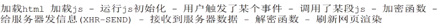
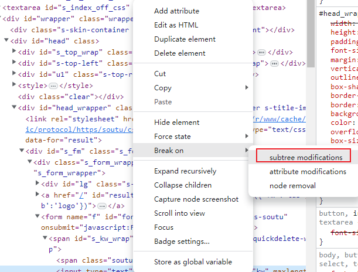
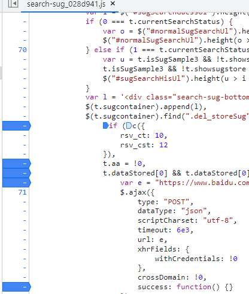

## 一、断点调试

JS执行的一般流程：

### 1.DOM

对DOM树的元素进行断点，**只有DOM元素样式或属性发生改变才会debug**，

> DOM元素断点特点：
>
> - 定位比较准确
> - 在JS执行步骤较前面部分，因此距离加密函数较远，无法根据栈快速定位

### 2.DOM事件

### 3.XHR断点

**在向服务器发包时候进行断点**

> 执行时间比较靠后，可以根据栈快速定位